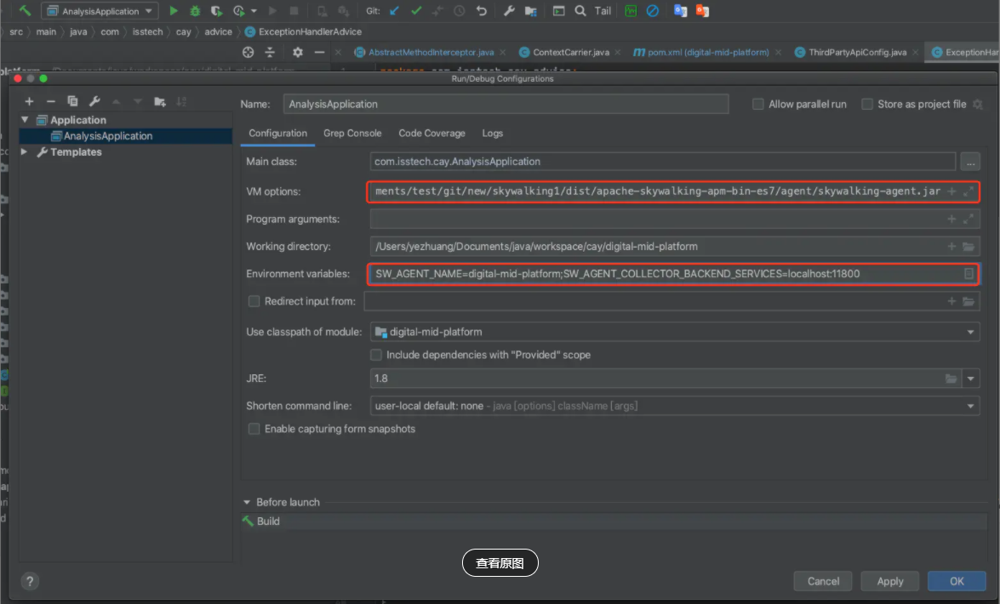
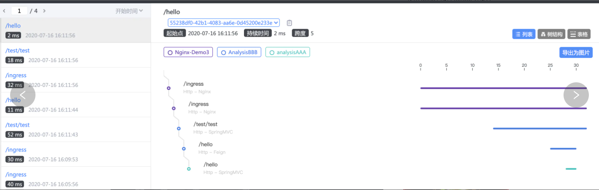
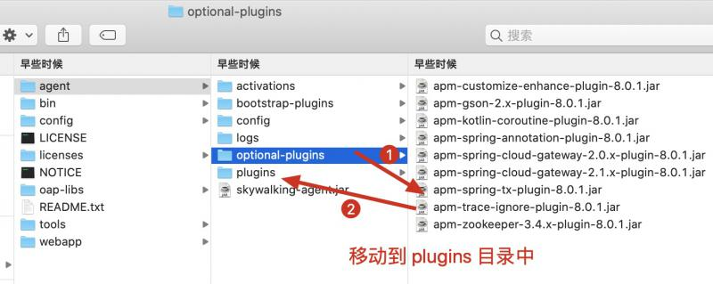

## 环境搭建

官方下载地址： https://archive.apache.org/dist/skywalking/8.0.1/apache-skywalking-apm-es7-8.0.1.tar.gz 


### docker-compose 搭建

```yaml
version: '3.3'
services:
  elasticsearch:
    image: elasticsearch:7.8.0
    container_name: elasticsearch
    restart: always
    ports:
      - 9200:9200
    environment:
      discovery.type: single-node
      TZ: Asia/Shanghai
      ES_JAVA_OPTS: "-Xms1g -Xmx2g -XX:+UseG1GC -XX:MetaspaceSize=256m  -XX:MaxMetaspaceSize=512M  -XX:+UseTLAB -XX:+ScavengeBeforeFullGC "

#    volumes:
#      - ./elasticsearch/data:/usr/share/elasticsearch/data
#      - ./elasticsearch/logs:/usr/share/elasticsearch/logs


    #volumes:
    #   - ./elasticsearch/logs:/usr/share/elasticsearch/logs
    #   - ./elasticsearch/data:/usr/share/elasticsearch/data
    #   - ./elasticsearch/config/elasticsearch.yml:/usr/share/elasticsearch/config/elasticsearch.yml
    ulimits:
      memlock:
        soft: -1
        hard: -1
  oap:
    image: apache/skywalking-oap-server:8.0.1-es7
    container_name: oap
    depends_on:
      - elasticsearch
    links:
      - elasticsearch
    restart: always
    ports:
      - 11800:11800
      - 12800:12800
    environment:
      SW_STORAGE: elasticsearch7  # 指定ES版本
      SW_STORAGE_ES_CLUSTER_NODES: elasticsearch:9200
      TZ: Asia/Shanghai
    # volumes:
    #  - ./config/alarm-settings.yml:/skywalking/config/alarm-settings.yml
  ui:
    image: apache/skywalking-ui:8.0.1
    container_name: ui
    depends_on:
      - oap
    links:
      - oap
    restart: always
    ports:
      - 8080:8080
    environment:
      SW_OAP_ADDRESS: oap:12800
      TZ: Asia/Shanghai
```


### java 程序接入

 1、探针目录结构，主要关注agent下的文件

- config 配置文件存放位置
- optional-plugins 选装插件，如果使用将jar文件移动到plugins下 

2、idea 配置探针



设置 VM options：-javaagent:/${Path}/apache-skywalking-apm-bin-es7/agent/skywalking-agent.jar

设置环境变量 

- SW_AGENT_NAME：项目名称
- SW_AGENT_COLLECTOR_BACKEND_SERVICES：ip:port（oap服务地址）

3、 jar配置探针 

java -jar -javaagent:/${Path}/apache-skywalking-apm-bin-es7/agent/skywalking-agent.jar  -DSW_AGENT_NAME=项目名称 demo.jar


4、验证




### skywalking 目录解释

基于apache-skywalking-apm-bin-es7

├── LICENSE
├── NOTICE
├── README.txt
├── agent
					├── activations
					├── bootstrap-plugins
					├── config   -- agent 的配置文件，比如我们上一步使用 -Dskywalking.agent.service_name配置的这些
					├── logs
					├── optional-plugins     可选插件      （将optional-plugins目录的jar包放到 plugins 目录下即可启动这些插件）
					  ├── plugins                     启用的插件
					 └── skywalking-agent.jar  我们自己的服务需要使用 -javaagent 指定到这个jar的位置
├── bin          oap/ui 的启动脚本
├── config    配置文件
├── licenses
├── oap-libs
├── tools
└── webapp   ui界面


### 使用options-plugin

1、忽略某些url不被追踪
第一步将 apm-trace-ignore-plugin-8.0.1.jar 从optional-plugins 移动到 plugins 目录中

  

2、配置忽略url
方法一： 在 agent/config 目录下创建 apm-trace-ignore-plugin.config文件

```
trace.ignore_path=${SW_AGENT_TRACE_IGNORE_PATH:需要忽略的url}
eg：trace.ignore_path=${SW_AGENT_TRACE_IGNORE_PATH:/xxx/**}
```

方法二： 直接使用环境变量
-Dskywalking.trace.ignore_path=需要忽略的url路径

注意：
1、忽略路径是支持 ant 风格的。
2、忽略多个url使用英文的逗号分隔。


