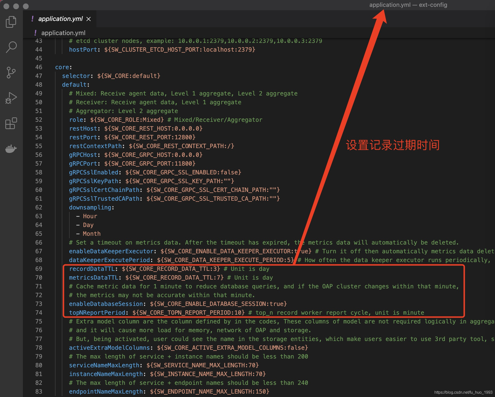

## skywalking 参数

### agent 参数

> 覆盖优先级
>
>  探针配置 > 系统配置 >系统环境变量 > 配置文件中的值 

agent.config 说明

agent.instance_name: 实例名称

 agent.service_name=${SW_AGENT_NAME:Your_ApplicationName} ： 服务名称

### ops-server 启动参数

配置记录过期时间

  

kubernetes进阶实战（第二版）

 云原生服务网格Istio：原理、实践、架构与源码解析 

harbar权威指南

 Prometheus监控技术与实践

 Prometheus云原生监控：运维与开发实战

 Kubernetes生产化实践之路

 架构修炼之道：亿级网关、平台开放、分布式、微服务、容错等核心技术修炼实践

 Spring Cloud Alibaba微服务原理与实战

