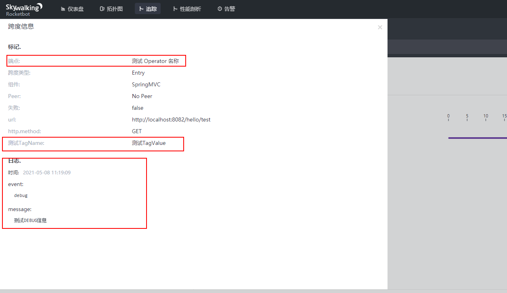
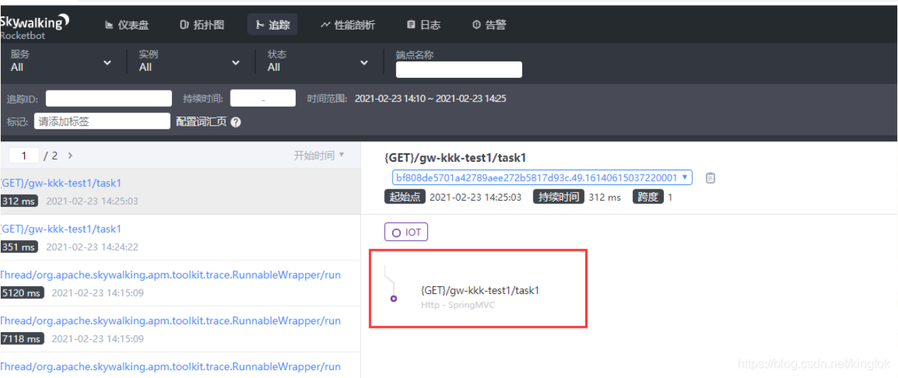
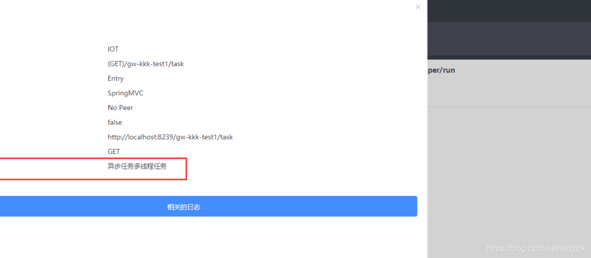
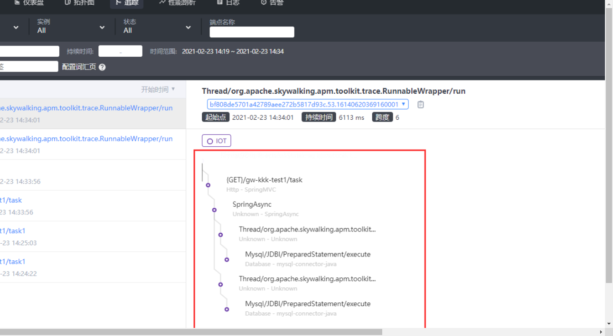

## skywalking 工具包

### 安装

maven 依赖的版本 与 skywalking 的版本一致即可，我们这里使用的是8.0.1

```xml
   <dependency>
            <groupId>org.apache.skywalking</groupId>
            <artifactId>apm-toolkit-trace</artifactId>
            <version>8.0.1</version>
   </dependency>
```


### 介绍

Skywalking 默认为我们提供了以下几个工具类

- ActiveSpan
- Trace （Annotation）
- Tags（Annotation）
- Tag （Annottaion）
- TraceContext


### ActiveSpan

ActiveSpan  主要为提供基本的日志打印，以及增加tag信息，设置operationName，举个例子

```java
 @GetMapping("/test")
    public String test(){
        ActiveSpan.debug("测试DEBUG信息");
        ActiveSpan.setOperationName("测试 Operator 名称");
        ActiveSpan.tag("测试TagName","测试TagValue");
        return ActiveSpan.traceId();
    }
```

我们通过代码设置了operationName，以及Tag 标签之后，在skywalking的拓扑图中可以查看到具体的设置信息如下：




其中 setOprationName 就是这是的端点名称，tag 则是增加标签，而日志 则是我们调用ActiveSpan 打印的日志信息

如果我们直接使用注解 Trace 来这是operationName 是等价于ActiveSpan.setOperationName("") 的，而 Tag 注解也是等价于 ActiveSpan.tag() 方法的


#### ActiveSpan 方法介绍

- ActiveSpan.error() 将当前范围标记为错误状态。
- ActiveSpan.error(String errorMsg) 通过消息将当前范围标记为错误状态。
- ActiveSpan.error(Throwable throwable) 使用Throwable将当前范围标记为错误状态。
- ActiveSpan.debug(String debugMsg) 在当前范围中添加调试级别日志消息。
- ActiveSpan.info(String infoMsg) 在当前范围内添加信息级别日志消息。
- ActiveSpan.setOperationName(String operationName) 自定义操作名称。
  


### 异步多线程

#### 问题

首先,Skywalking是一款基于java代理的监控系统,但是在监控多线程跨线程的时候却会意外失联,这就让我们没办法去追踪调用链路问题

类似于下图

```java
@GetMapping("/task1")
    public CommonReturnType task1() throws Exception {

        for (int i = 0; i < 5; i++) {
            new Thread(()->{
                log.info("1");
            });
        }
        return CommonReturnType.creat(1);
    }
```




#### 解决方法

当然,只是为了演示简单,就没有写异步多线程,SkyWalking默认情况下只会采集同一线程的调用链路，如果应用里面采用了多线程，同时希望追踪链路能将多个线程的链路关联起来。则需要使用插件apm-toolkit-trace,下面通过一个小Demo来进行演示

**1、添加依赖**

```xml
<dependency>
      <groupId>org.apache.skywalking</groupId>
      <artifactId>apm-toolkit-trace</artifactId>
      <version>8.4.0</version>
   </dependency>
```


**2、开启异步多线程**

```java
@SpringBootApplication
@EnableAsync
public class IotMain8239 {
    public static void main( String[] args )
    {
        SpringApplication.run(IotMain8239.class,args);
    }
}
```


**3、测试类方法**

```java
import com.fehead.Iot.mapper.GwKkkTest1Mapper;
import lombok.extern.slf4j.Slf4j;
import org.apache.skywalking.apm.toolkit.trace.ActiveSpan;
import org.apache.skywalking.apm.toolkit.trace.RunnableWrapper;
import org.apache.skywalking.apm.toolkit.trace.TraceContext;
import org.apache.skywalking.apm.toolkit.trace.TraceCrossThread;
import org.springframework.beans.factory.annotation.Autowired;
import org.springframework.scheduling.annotation.Async;
import org.springframework.stereotype.Component;

import java.util.Optional;
import java.util.concurrent.ExecutorService;
import java.util.concurrent.Executors;

@Component
@Slf4j
public class HelloTask {

    @Autowired
    GwKkkTest1Mapper gwKkkTest1Mapper;

    ExecutorService executorService = Executors.newCachedThreadPool();

    @Async
    public void asynchelloWorld(){
        try {
            Thread.sleep(5000);

            //插入数据库用户
            GwKkkTest1 gwKkkTest1 = new GwKkkTest1(40000, "s", "s", "s");

            executorService.submit(RunnableWrapper.of(()->{
                gwKkkTest1Mapper.insert(gwKkkTest1);
                try {
                    Thread.sleep(5000);
                } catch (InterruptedException e) {
                    e.printStackTrace();
                }
                Optional<String> value = TraceContext.getCorrelation("key");  //拿到同一链路的指定key
                log.info("down : insert1 + " +value.get());
            }) );
            executorService.submit(RunnableWrapper.of(()->{
                gwKkkTest1Mapper.insert(gwKkkTest1);
                try {
                    Thread.sleep(7000);
                } catch (InterruptedException e) {
                    e.printStackTrace();
                }
                Optional<String> value = TraceContext.getCorrelation("jia"); //拿到同一链路的指定key
                log.info("down : insert2 + " +value.get());
            }) );

            log.info("down : HelloTask");

//            ActiveSpan.tag("intask", "王凯艺"); 打标记k，v
        }catch (Exception e){
            e.printStackTrace();
        }
    }


}
```


**4、Controller层处理**

```java
@Autowired
    HelloTask helloTask;

    @GetMapping("/task")
    public CommonReturnType task() throws Exception {
        ActiveSpan.tag("type", "异步任务多线程任务");
        log.info("come in : /task");
        TraceContext.putCorrelation("key", "kaikai");
        TraceContext.putCorrelation("jia", "jiajia");
        helloTask.asynchelloWorld();
        return CommonReturnType.creat(1);
    }
```

- 我们可以通过 ActiveSpan.tag(“type”, “异步任务多线程任务”) 去追踪里面添加相应的标签**指定K-V**
- 在跟踪方法的上下文中添加自定义标签ActiveSpan.tag(“key”, “val”)。




**5、查看结果**

再来查看控制台发现已经打印出异步多线程的路线了,并且追踪ID相同 

 


#### 分析

1、我们可以通过添加 RunnableWrapper.of()来指定跟踪线程

```java
executorService.submit(RunnableWrapper.of(()->{
                gwKkkTest1Mapper.insert(gwKkkTest1);
                try {
                    Thread.sleep(5000);
                } catch (InterruptedException e) {
                    e.printStackTrace();
                }
                Optional<String> value = TraceContext.getCorrelation("key");  //拿到同一链路的指定key
                log.info("down : insert1 + " +value.get());
            }) );
```


2、也可以添加其他多线程方法

```java
CallableWrapper.of()
CompletableFuture.supplyAsync(() ->{});
```


3、也可以添加指定实现多线程的类上注解 @TraceCrossThread

```java
@TraceCrossThread
public static class MyTask<String> implements Callable<String> {}
```


### 指定跟踪上下文的 K-V 

类似于ThreadLocal

使用TraceContext.putCorrelation()API将自定义数据放在跟踪上下文中。

```java
Optional<String> previous = TraceContext.putCorrelation("customKey", "customValue");
```

当值是null或为空时，CorrelationContext将删除该项目。

```java
Optional<String> value = TraceContext.getCorrelation("customKey");
```

使用TraceContext.getCorrelation()API获取自定义数据。
