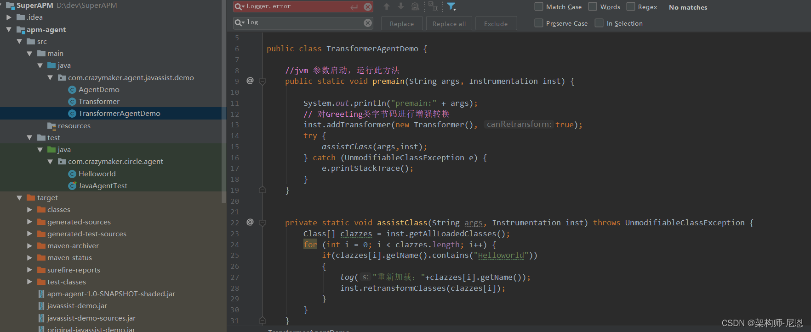

# ByteBuddy

## Java字节码增强支持

### 什么是Instrumentation？

java Instrumentation指的是可以用独立于应用程序之外的代理（agent）程序来监测和协助运行在[JVM](https://so.csdn.net/so/search?q=JVM&spm=1001.2101.3001.7020)上的应用程序。这种监测和协助包括但不限于获取JVM运行时状态，替换和修改类定义等。 Java SE5中使用JVM TI替代了JVM PI和JVM DI。提供一套代理机制，支持独立于JVM应用程序之外的程序以代理的方式连接和访问JVM。java.lang.instrument是在JVM TI的基础上提供的Java版本的实现。 Instrumentation提供的主要功能是修改jvm中类的行为。 Java SE6中由两种应用Instrumentation的方式，premain（命令行）和agentmain（运行时）


### 简介

JVM从1.5版本开始提供 [JVM Tool Interface](https://docs.oracle.com/javase/8/docs/platform/jvmti/jvmti.html#whatIs) ，这是JVM对外的、用于Java应用监控和调试的一系列工具接口，是JVM平台调试架构的重要组成部分。

```
The Java™ Platform Debugger Architecture is structured as follows:
           Components                          Debugger Interfaces

                /    |--------------|
               /     |     VM       |
 debuggee ----(      |--------------|  <------- JVM TI - Java VM Tool Interface（Jvm服务端调试接口）
               \     |   back-end   |
                \    |--------------|
                /           |
 comm channel -(            |  <--------------- JDWP - Java Debug Wire Protocol （Java调试通信协议）
                \           |
                     |--------------|
                     | front-end    |
                     |--------------|  <------- JDI - Java Debug Interface （客户端调试接口和调试应用）
                     |      UI      |
                     |--------------|

```

JVM启动支持加载agent代理，而agent代理本身就是一个JVM TI的客户端，其通过监听事件的方式获取Java应用运行状态，调用JVM TI提供的接口对应用进行控制。

我们可以看下Java agent代理的两个入口函数定义，

```java
// 用于JVM刚启动时调用，其执行时应用类文件还未加载到JVM
public static void premain(String agentArgs, Instrumentation inst);

// 用于JVM启动后，在运行时刻加载
public static void agentmain(String agentArgs, Instrumentation inst);
```

这两个入口函数定义分别对应于JVM TI专门提供了执行 [字节码增强（bytecode instrumentation）](https://docs.oracle.com/javase/6/docs/platform/jvmti/jvmti.html#bci) 的两个接口。

- 加载时刻增强（**JVM 启动时加载**），类字节码文件在JVM加载的时候进行增强，。
- 动态增强（**JVM 运行时加载**），已经被JVM加载的class字节码文件，当被修改或更新时进行增强，从JDK 1.6开始支持。

我们无需对上面JVM TI提供的两个接口规范了解太多，Java Agent和 [Java Instrument类包](https://docs.oracle.com/javase/8/docs/api/java/lang/instrument/package-summary.html) 封装好了字节码增强的上述接口通信。

上面我们已经说到了， 有两处地方可以进行 Java Agent 的加载，分别是 `目标JVM启动时加载` 和 `目标JVM运行时加载`，这两种不同的加载模式使用不同的入口函数：

1、**JVM 启动时加载**

入口函数如下所示：

```java
 // 函数1
public static void premain(String agentArgs, Instrumentation inst);
// 函数2
public static void premain(String agentArgs);
```

JVM 首先寻找`函数1`，如果没有发现函数1，则会寻找函数2

2、**JVM 运行时加载**

入口函数如下所示：

```java
// 函数1
public static void agentmain(String agentArgs, Instrumentation inst);
// 函数2
public static void agentmain(String agentArgs);
```

与上述一致，JVM 首先寻找`函数1`，如果没有发现函数1，则会寻找函数2

这两组方法的第一个参数 `agentArgs` 是随同 “-javaagent” 一起传入的程序参数，如果这个字符串代表了多个参数，就需要自己解析这参数，`inst` 是 Instrumentation 类型的对象，是 JVM 自己传入的，我们可以那这个参数进行参数的增强操作。

**演示AgentDemo**

```java
package com.crazymaker.agent.javassist.demo;
import java.lang.instrument.Instrumentation;

public class AgentDemo {
    /**
     * JVM 首先尝试在代理类上调用以下方法
     * 该方法在main方法之前运行，
     * 与main方法运行在同一个JVM中
     */
    public static void premain(String agentArgs, Instrumentation inst) {
        System.out.println("=========premain方法执行 1========");
        System.out.println("agentArgs:="+agentArgs);

    }
 
    /**
     * 候选的、兜底 方法：
     * 如果不存在 premain(String agentArgs, Instrumentation inst)
     * 则会执行 premain(String agentArgs)
     *
     */
    public static void premain(String agentArgs) {
        System.out.println("=========premain 方法执行 2========");
        System.out.println("agentArgs:="+agentArgs);
    }

}
```


### 使用方法

#### 声明Agent

当定义完这两组方法后，要使之生效还需要手动声明，声明方式有两种：

**1、使用 MANIFEST.MF 文件**

我们需要创建`resources/META-INF.MANIFEST.MF` 文件，当 jar包打包时将文件一并打包，文件内容如下：

```
Manifest-Version: 1.0
Can-Redefine-Classes: true   # true表示能重定义此代理所需的类，默认值为 false（可选）
Can-Retransform-Classes: true    # true 表示能重转换此代理所需的类，默认值为 false （可选）
Premain-Class:  com.crazymaker.agent.javassist.demo.AgentDemo   #premain方法所在类的位置
```

**2、如果是maven项目，在pom.xml加入**

```xml
        <profile>
            <id>java-agent-demo</id>
            <properties>
                <hello>world</hello>
            </properties>
            <activation>
                <activeByDefault>false</activeByDefault>
            </activation>
            <build>
                <finalName>java-agent-demo</finalName>
                <plugins>
                    <plugin>
                        <artifactId>maven-shade-plugin</artifactId>
                        <executions>
                            <execution>
                                <phase>package</phase>
                                <goals>
                                    <goal>shade</goal>
                                </goals>
                                <configuration>
                                    <shadedArtifactAttached>false</shadedArtifactAttached>
                                    <createDependencyReducedPom>true</createDependencyReducedPom>
                                    <createSourcesJar>true</createSourcesJar>
                                    <shadeSourcesContent>true</shadeSourcesContent>
                                    <transformers>
                                        <transformer
                                                implementation="org.apache.maven.plugins.shade.resource.ManifestResourceTransformer">
                                            <manifestEntries>
                                                <Premain-Class>com.crazymaker.agent.javassist.demo.AgentDemo
                                                </Premain-Class>
                                                <Can-Redefine-Classes>true</Can-Redefine-Classes>
                                                <Can-Retransform-Classes>true</Can-Retransform-Classes>
                                            </manifestEntries>
                                        </transformer>
                                    </transformers>
                                    <artifactSet>
                                        <excludes>
                                            <exclude>*:gson</exclude>
                                            <exclude>io.netty:*</exclude>
                                            <exclude>io.opencensus:*</exclude>
                                            <exclude>com.google.*:*</exclude>
                                            <exclude>com.google.guava:guava</exclude>
                                            <exclude>org.checkerframework:checker-compat-qual</exclude>
                                            <exclude>org.codehaus.mojo:animal-sniffer-annotations</exclude>
                                            <exclude>io.perfmark:*</exclude>
                                            <exclude>org.slf4j:*</exclude>
                                        </excludes>

                                        <!-- 将javassist包打包到Agent中 -->

                                        <includes>
                                            <include>javassist:javassist:jar:</include>
                                        </includes>
                                    </artifactSet>
                                    <filters>
                                        <filter>
                                            <artifact>net.bytebuddy:byte-buddy</artifact>
                                            <excludes>
                                                <exclude>META-INF/versions/9/module-info.class</exclude>
                                            </excludes>
                                        </filter>
                                    </filters>
                                </configuration>
                            </execution>
                        </executions>
                    </plugin>
                </plugins>
            </build>
        </profile>
```


#### Agent的简单使用

**1、JVM 启动时加载**

我们直接在 JVM 启动参数中加入 -javaagent 参数并指定 jar 文件的位置

```
# 指定agent程序并运行该类
java -javaagent:-javaagent:D:\dev\SuperAPM\apm-agent\target\javassist-demo.jar  TargetJvm
```

**2、JVM 运行时加载**

要实现动态调试，我们就不能将目标JVM停机后再重新启动，这不符合我们的初衷，因此我们可以使用 JDK 的 Attach Api 来实现运行时挂载 Agent。

Attach Api 是 SUN 公司提供的一套扩展 API，用来向目标 JVM 附着（attach）在目标程序上，有了它我们可以很方便地监控一个 JVM。

Attach Api 对应的代码位于 `com.sun.tools.attach`包下，提供的功能也非常简单：

- 列出当前所有的 JVM 实例描述
- Attach 到其中一个 JVM 上，建立通信管道
- 让目标JVM加载Agent

该包下有一个类 `VirtualMachine`，它提供了两个重要的方法：

- `VirtualMachine attach(String var0)`

传递一个进程号，返回目标 JVM 进程的 vm 对象，该方法是 JVM进程之间指令传递的桥梁，底层是通过 socket 进行通信

- `void loadAgent(String var1)`

该方法允许我们将 agent 对应的 jar 文件地址作为参数传递给目标 JVM，目标 JVM 收到该命令后会加载这个 Agent

有了 Attach Api ，我们就可以创建一个java进程，用它attach到对应的jvm，并加载agent。


### ClassFileTranformer

我们需要了解的是，上述入口函数传入的第二个参数Instrumentation实例，即Java Instrument类 [java.lang.instrument.Instrumentation](https://docs.oracle.com/javase/8/docs/api/java/lang/instrument/Instrumentation.html) ，查看其类定义，可以看到其提供的核心方法只有一个addTransformer，用于添加多个ClassFileTransformer，

```java
// 说明：添加ClassFileTransformer
// 第一个参数：transformer，类转换器
// 第二个参数：canRetransform，经过transformer转换过的类是否允许再次转换
void Instrumentation.addTransformer(ClassFileTransformer transformer, boolean canRetransform)
```

而 [ClassFileTransformer](https://docs.oracle.com/javase/8/docs/api/java/lang/instrument/ClassFileTransformer.html) 则提供了tranform()方法，用于对加载的类进行增强重定义，返回新的类字节码流。

需要特别注意的是，若不进行任何增强，当前方法返回null即可，若需要增强转换，则需要先拷贝一份classfileBuffer，在拷贝上进行增强转换，然后返回拷贝。

```java
// 说明：对类字节码进行增强，返回新的类字节码定义
// 第一个参数：loader，类加载器
// 第二个参数：className，内部定义的类全路径
// 第三个参数：classBeingRedefined，待重定义/转换的类
// 第四个参数：protectionDomain，保护域
// 第五个参数：classfileBuffer，待重定义/转换的类字节码（不要直接在这个classfileBuffer对象上修改，需拷贝后进行）
// 注：若不进行任何增强，当前方法返回null即可，若需要增强转换，则需要先拷贝一份classfileBuffer，在拷贝上进行增强转换，然后返回拷贝。
byte[] ClassFileTransformer.transform(ClassLoader loader, String className, Class classBeingRedefined, ProtectionDomain protectionDomain, byte classfileBuffer)
```


#### 测试案例

**TransformerAgentDemo**




**Java 代码：**

```java
package com.crazymaker.circle.agent;

public class Helloworld {
    public void sayHello()  {

        System.out.println("hello  world from 疯狂创客圈");  // Hello World!
    }
}
```


**执行结果：**

```
Transformer:org/junit/runner/notification/RunNotifier$3   transforming skip, not the target class.
Transformer:org/junit/runners/model/FrameworkMethod$1   transforming skip, not the target class.
Disconnected from the target VM, address: '127.0.0.1:64236', transport: 'socket'
com/crazymaker/circle/agent/Helloworld:class transformed = %s
begin of sayhello()
hello  world from 疯狂创客圈
end of sayhello()
hi transformerAgentDemo
Transformer:org/junit/runner/notification/RunNotifier$7   transforming skip, not the target class.
Transformer:org/junit/runner/notification/RunNotifier$2   transforming skip, not the target class.
Transformer:java/lang/Shutdown   transforming skip, not the target class.
Transformer:java/lang/Shutdown$Lock   transforming skip, not the target class.
```


### Instrumentation接口

上面的例子，使用 Java Instrumentation 来完成动态类修改的功能，并且在 Instrumentation 接口中我们可以通过 `addTransformer()` 方法来增加一个类转换器，

类转换器由类 ClassFileTransformer 接口实现。

该接口中有一个唯一的方法 `transform()` 用于实现类的转换，也就是我们可以增强类处理的地方！

当类被加载的时候就会调用 `transform()`方法，实现对类加载的事件进行拦截并返回转换后新的字节码，通过 `redefineClasses()`或`retransformClasses()`都可以触发类的重新加载事件。

**首先我们先了解一下 Instrumentation这个接口，其中有几个方法：**

- `addTransformer(ClassFileTransformer transformer, boolean canRetransform)`

  自定义一个字节码转换器 **Transformer** ，之后所有的目标类加载都会被 Transformer 拦截, 通过自定义实现的 **ClassFileTransformer** 接口，重写该接口的唯一方法 `transform()` 方法，返回值是转换后的类字节码文件

- `retransformClasses(Class<?>... classes)`

  对 JVM 已经加载的类重新触发类加载，使用上面自定义的转换器进行处理。该方法可以修改方法体，常量池和属性值，但不能新增、删除、重命名属性或方法，也不能修改方法的签名

- `redefineClasses(ClassDefinition... definitions)`

  此方法用于替换类的定义，而不引用现有类文件字节。针对的是已经加载的类。

- `getObjectSize(Object objectToSize)`

  获取一个对象的大小

- `appendToBootstrapClassLoaderSearch(JarFile jarfile)`

  将一个 jar 文件添加到 bootstrap classload 的 classPath 中
  
- `getAllLoadedClasses()`

  获取当前被 JVM 加载的所有类对象

- #### `boolean isModifiableClass(Class<?> theClass);`

  判断参数指定的类是否可以被修改。JDK1.6开始。

- #### Class[] getInitiatedClasses(ClassLoader loader)

  返回当前JVM已经初始化的类。

- #### boolean isRedefineClassesSupported()

  判断当前JVM的配置是否支持类的重新定义。开启该配置需要在 Agent的清单文件中添加`Can-Redefine-Classes:true` 配置。

- #### boolean isNativeMethodPrefixSupported()

  当前JVM配置是否支持设置本地方法前缀。开启该配置需要在Agent的清单文件中添加`Can-Set-Native-Method-Prefix:true`配置

> **redefineClasses 和 retransformClasses 补充说明**
>
> 区别如下：
>
> redefineClasses 是自己提供字节码文件替换掉已存在的 class 文件
> retransformClasses 是在已存在的字节码文件上修改后再进行替换

  

### BootClassPath / SystemClassPath 的动态增补

**Java SE 6 新特性：BootClassPath / SystemClassPath 的动态增补**

我们知道，通过设置系统参数或者通过虚拟机启动参数，我们可以设置一个虚拟机运行时的 boot class 加载路径（-Xbootclasspath）和 system class（-cp）加载路径。当然，我们在运行之后无法替换它。然而，我们也许有时候要需要把某些 jar 加载到 bootclasspath 之中，而我们无法应用上述两个方法；或者我们需要在虚拟机启动之后来加载某些 jar 进入 bootclasspath。在 Java SE 6 之中，我们可以做到这一点了。

实现这几点很简单，首先，我们依然需要确认虚拟机已经支持这个功能，然后在 premain/agantmain 之中加上需要的 classpath。我们可以在我们的 Transformer 里使用 appendToBootstrapClassLoaderSearch/appendToSystemClassLoaderSearch 来完成这个任务。

同时我们可以注意到，在 agent 的 manifest 里加入 Boot-Class-Path 其实一样可以在动态地载入 agent 的同时加入自己的 boot class 路径，当然，在 Java code 中它可以更加动态方便和智能地完成 —— 我们可以很方便地加入判断和选择成分。

在这里我们也需要注意几点。首先，我们加入到 classpath 的 jar 文件中不应当带有任何和系统的 instrumentation 有关的系统同名类，不然，一切都陷入不可预料之中 —— 这不是一个工程师想要得到的结果，不是吗？

其次，我们要注意到虚拟机的 ClassLoader 的工作方式，它会记载解析结果。比如，我们曾经要求读入某个类 someclass，但是失败了，ClassLoader 会记得这一点。即使我们在后面动态地加入了某一个 jar，含有这个类，ClassLoader 依然会认为我们无法解析这个类，与上次出错的相同的错误会被报告。

再次我们知道在 Java 语言中有一个系统参数“java.class.path”，这个 property 里面记录了我们当前的 classpath，但是，我们使用这两个函数，虽然真正地改变了实际的 classpath，却不会对这个 property 本身产生任何影响。

在公开的 JavaDoc 中我们可以发现一个很有意思的事情，Sun 的设计师们告诉我们，这个功能事实上依赖于 ClassLoader 的 appendtoClassPathForInstrumentation 方法 —— 这是一个非公开的函数，因此我们不建议直接（使用反射等方式）使用它，事实上，instrument 包里的这两个函数已经可以很好的解决我们的问题了。

从以上的介绍我们可以得出结论，在 Java SE 6 里面，instrumentation 包新增的功能 —— 虚拟机启动后的动态 instrument、本地代码（native code）instrumentation，以及动态添加 classpath 等等，使得 Java 具有了更强的动态控制、解释能力，从而让 Java 语言变得更加灵活多变


### Agent Jar中 manifest的属性

Premain-Class: 当在VM启动时，在命令行中指定代理jar时，必须在manifest中设置Premain-Class属性，值为代理类全类名，并且该代理类必须提供premain方法。否则JVM会异常终止。

Agent-Class: 当在VM启动之后，动态添加代理jar包时，代理jar包中manifest必须设置Agent-Class属性，值为代理类全类名，并且该代理类必须提供agentmain方法，否则无法启动该代理。

Boot-Class-Path: Bootstrap class loader加载类时的搜索路径，可选。

Can-Redefine-Classes: true/false；标示代理类是否能够重定义类。可选。

Can-Retransform-Classes: true/false；标示代理类是否能够转换类定义。可选。

Can-Set-Native-Prefix::true/false；标示代理类是否需要本地方法前缀，可选。

> 注意： 当一个代理jar包中的manifest文件中既有Premain-Class又有Agent-Class时，如果以命令行方式在VM启动前指定代理jar，则使用Premain-Class；反之如果在VM启动后，动态添加代理jar，则使用Agent-Class


## Java字节码增强工具对比

| 对比      | ASM                          | Javassist                            | JDK Proxy                      | Cglib                                                        | ByteBuddy                     |
| :-------- | :--------------------------- | ------------------------------------ | :----------------------------- | :----------------------------------------------------------- | :---------------------------- |
| 起源时间  | 2002                         | 1999                                 | 2000                           | 2011                                                         | 2014                          |
| 包大小    | 130KB （版本9.3）            | 788KB （版本3.28.0-GA）              |                                |                                                              | 3.7MB （版本1.10.19）         |
| 增强方式  | 字节码指令                   | 字节码指令和源码（注：源码文本）     | 源码                           | 源码                                                         | 源码                          |
| 源码编译  | NA                           | 不支持                               | 支持                           | 支持                                                         | 支持                          |
| agent支持 | 支持                         | 支持                                 | 不支持，依赖框架               | 不支持，依赖框架                                             | 支持                          |
| 性能      | 高                           | 中                                   | 低                             | 中                                                           | 中                            |
| 维护状态  | 是                           | 是                                   | 停止升级                       | [停止维护](https://github.com/cglib/cglib)                   | 活跃                          |
| 优点      | 超高性能，应用场景广泛       | 同时支持字节码指令和源码两种增强方式 | JDK原生类库支持                |                                                              | 零侵入，提供良好的API扩展编程 |
| 缺点      | 字节码指令对应用开发者不友好 |                                      | 场景非常局限，只适用于Java接口 | 已经不再维护，对于新版JDK17+支持不好，官网建议切换到ByteBuddy |                               |
| 应用场景  | 小，高性能，广泛用于语言级别 |                                      |                                | 广泛用于框架场景                                             | 广泛用于Trace场景             |

综合了上述的字节码增强工具对比，比较了开发便利性和需求目标，ByteBuddy更适合Trace跟踪技术。


## 简介

Byte Buddy是一个字节码生成和操作库，用于在Java应用程序运行时创建和修改Java类，而无需编译器的帮助。除了Java类库附带的代码生成实用程序外，Byte Buddy还允许创建任意类，并且不限于实现用于创建运行时代理的接口。

此外，Byte Buddy提供了一种方便的API，可以使用Java代理或在构建过程中手动更改类。无需理解字节码指令，即可使用简单的 API 就能很容易操作字节码，控制类和方法。

除了这些简单的介绍外，还可以通过官网：[https://bytebuddy.net](https://bytebuddy.net/#/)，去了解更多关于 Byte Buddy 的内容。


## 入门使用

### 开发环境

1. JDK 1.8.0
2. byte-buddy 1.10.19
3. byte-buddy-agent 1.10.19

使用bytebuddy只需要简单的引入其maven依赖即可

```xml
      <dependency>
            <groupId>net.bytebuddy</groupId>
            <artifactId>byte-buddy</artifactId>
            <version>1.10.19</version>
        </dependency>
```


### 官网经典例子

在我们看官网文档中，从它的介绍了就已经提供了一个非常简单的例子，用于输出 HelloWorld，

我们在这展示并讲解下。

**HelloWorld案例代码：**

```x86asm
String helloWorld = new ByteBuddy()
            .subclass(Object.class)
            .method(named("toString"))
            .intercept(FixedValue.value("Hello World!"))
            .make()
            .load(getClass().getClassLoader())
            .getLoaded()
            .newInstance()
            .toString();    

System.out.println(helloWorld);  // Hello World!
```

他的运行结果就是一行，Hello World!，

整个代码块核心功能:

- step 1: 通过 method(named("toString"))，找到 *toString* 方法，
- step 2:再通过拦截 intercept，设定此方法的返回值。FixedValue.value("Hello World!")。

到这里其实一个基本的方法就通过 Byte-buddy ，改造完成。

- step 3:接下来的这一段主要是用于加载生成后的 Class
- stetp4: newInstance().toString(); 的作用 是： 执行以及调用方法 toString()。

也就是最终我们输出了想要的结果。


### 方法介绍

各个调用是干啥的：

- **subclass(Object.class)** ：创建一个Object的子类
- **name("ExampleClass") :** 新建的类名叫做“ExampleClass” ,暂时没有用到
- **method()** ：要拦截“ExampleClass”中的方法
- **ElementMatchers.named("toString")** ：拦截条件，拦截toString()这个方法, 没有条件，表示所有的方法
- **intercept()** ：指定了拦截到的方法要修改成什么样子，是不是和 Spring AOP有点像了
- **make()** ：创建上面生成的这个类型
- **load()** ：加载这个生成的类
- **newInstance()** ：Java 反射的API，创建实例


## Agent 入口

### 通过ByteBuddy来增强


### 通过Transfermer


## Matchers

Matcher 用于匹配类是否符合拦截的标准，比如方法Matcher、C总是投入


## 演示

### Field 


### Constructor


### Method


## 方法委托

### MethodDelagtion


### Advice


## 注解

