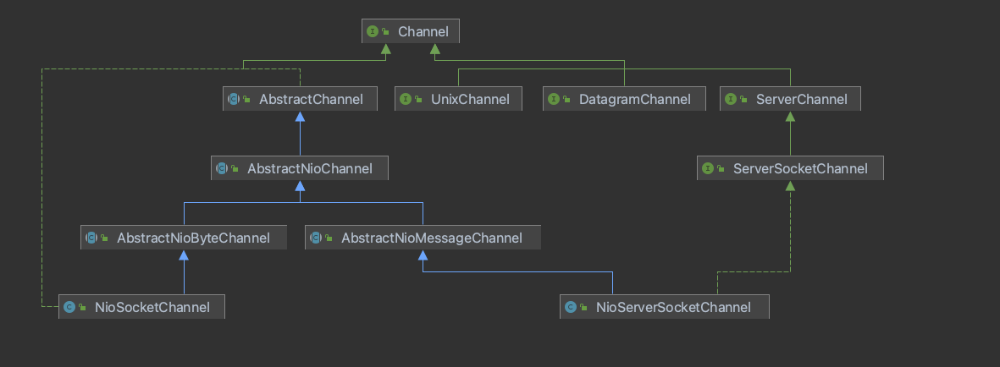

## Channel

Channel 是NIO的一个基本构造，一个Channel就代表一个通道，例如一个硬件设备、文件、网络等等。

Netty 中的Channel大致分为两类，分别是ServerChannel 与 ClientChannel，ServerChannel代表的是服务器端监听的Channel通道，而ClientChannel 代表 是客户端连接Server端时的通道

### Channel 接口

基本的 I/O 操作（bind()、connect()、read()和 write()）依赖于底层网络传输所提 供的原语。在基于 Java 的网络编程中，其基本的构造是 class Socket。Netty 的 Channel 接口所提供的 API，大大地降低了直接使用 Socket 类的复杂性。此外，Channel 也是拥有许多 预定义的、专门化实现的广泛类层次结构的根，下面是一个简短的部分清单： 

比较详细的版本如下：


比较简洁的版本如下：



我们从上面看到Channel 主要分为 三大种类，其中包括ServerChannel、SocketChannel 与 DatagramChannel，其中Netty还支持UnixChannel的实现，比如针对Epoll的支持


### 针对NIO的实现版本

针对NIO 实现的类图如下：


我们从上图可以看到Channel针对Nio的实现也是主要分为两种，分别为 NioSocketChannel 与NioServerSocketChannel，他们分别继承雨不同的父类，每一个父类都绑定了一个Unsafe 实现，用于进行实际的底层操作，比如绑定端口，注册事件、处理数据等等，其中AbstractChannel 主要负责绑定parent，创建unsafe对象，以及创建对应的pipeline对象，而 AbstractNioChannel 用于注册对应的事件信息，并且将对应的Channel设置为非阻塞状态


### AbstractChannel

AbstractChannel 重要属性以及构造方法如下：

```java
//channel 对应的父channel，如果是SocketChannel 对应的parent 则是ServerSocketChannel
private final Channel parent;
private final ChannelId id;

//作用于Channel，比较从Channel读取数据、写入数据、绑定端口等等
private final Unsafe unsafe;

//每一个Channel都对应一个ChannelPipeline用于传播入站、入站事件
private final DefaultChannelPipeline pipeline;

//没有一个channel都会绑定一个eventLoop，后续channel中的所有操作都会交与绑定的eventLoop执行
private volatile EventLoop eventLoop;
  
  protected AbstractChannel(Channel parent) {
        this.parent = parent;
        id = newId();
        unsafe = newUnsafe();
        pipeline = newChannelPipeline();
    }

```

这里比较重要的一点是，Channel绑定的eventLoop是在将channel注册到selector时进行关联的，代码位于AbstractChannel#AbstractUnsafe内部实现类的register方法：


### AbstractNioChannel

重要属性以及构造器如下：

```
  protected final int readInterestOp;
  volatile SelectionKey selectionKey;
  
  protected AbstractNioChannel(Channel parent, SelectableChannel ch, int readInterestOp) {
        super(parent);
        this.ch = ch;
        this.readInterestOp = readInterestOp;
        try {
            ch.configureBlocking(false);
        } catch (IOException e) {
            try {
                ch.close();
            } catch (IOException e2) {
                logger.warn(
                            "Failed to close a partially initialized socket.", e2);
            }

            throw new ChannelException("Failed to enter non-blocking mode.", e);
        }
    }
```


### AbstractNioMessageChannel


### AbstractNioByteChannel

