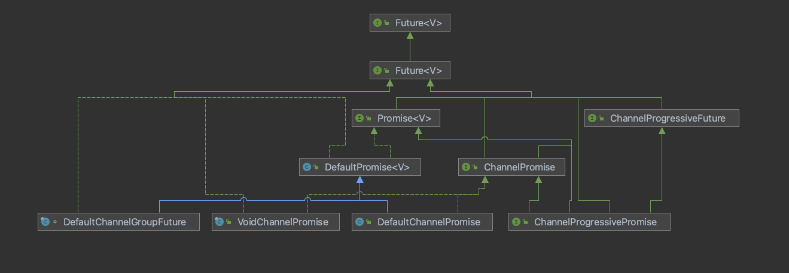

# Promise

Promise 是 Netty 对于Future的一种扩展实现，原生Future 实现默认为FutureTask，并且底层并不支持监听器，所以Netty 在原生Future的基础上添加了很多其他功能，类图如下：




从上面可以看到Netty定义了自己的Future，并且在jdk基础上新增了很多方法，其中比较典型的就是：listener 实现以及 sync 机制。并且在上图中也可以看出针对于Netty自身的Channel也做了扩展，比如ChannelFuture 是主要用于对Channel操作，比如绑定、连接等等。


## Future

Netty 在 JDK原来的Future 基础上增添了比计较丰富的功能比如添加监听器、等待Future执行完成等等，具体可以参考源码类：`io.netty.util.concurrent.Future`, 这里就不在详细介绍了


## Promise

Promise 在Future的基础上增添了一下功能，比如将当前future设置为不可退出状态，设置成功的Value、设置失败的Exception等等

```
/**
 * Marks this future as a success and notifies all
 * listeners.
 *
 * If it is success or failed already it will throw an {@link IllegalStateException}.
 */
Promise<V> setSuccess(V result);

/**
 * Marks this future as a success and notifies all
 * listeners.
 *
 * @return {@code true} if and only if successfully marked this future as
 *         a success. Otherwise {@code false} because this future is
 *         already marked as either a success or a failure.
 */
boolean trySuccess(V result);

/**
 * Marks this future as a failure and notifies all
 * listeners.
 *
 * If it is success or failed already it will throw an {@link IllegalStateException}.
 */
Promise<V> setFailure(Throwable cause);

/**
 * Marks this future as a failure and notifies all
 * listeners.
 *
 * @return {@code true} if and only if successfully marked this future as
 *         a failure. Otherwise {@code false} because this future is
 *         already marked as either a success or a failure.
 */
boolean tryFailure(Throwable cause);

/**
 * Make this future impossible to cancel.
 *
 * @return {@code true} if and only if successfully marked this future as uncancellable or it is already done
 *         without being cancelled.  {@code false} if this future has been cancelled already.
 */
boolean setUncancellable();
```


## ChannelFuture

ChannelFuture 在 Future的基础上增添了用于支持channel的方法

```java
/**
  * Returns a channel where the I/O operation associated with this
  * future takes place.
  */ 
//用于返回对应的Channel
Channel channel();
```


## ChannelPromise

ChannelPromise 在原来Promise 以及ChannelFuture 的基础上增添了一个新的方法

```java
//Returns a new ChannelPromise if isVoid() returns true otherwise itself.
//如果 当前的ChannelPromise 为 无返回值类型比如VoidChannelPromise，那么返回一个新的ChannelPromise，否则返回itseflt
ChannelPromise unvoid();
```


## DefaultPromise

我们从上面的图可以发现，DefaultPromise 是整个Promise 实现或者是Future实现的核心，几乎所有的其他中的类的Promise实现都要依赖于DefaultPromise，所以我们以DefaultPromise为入口来去了解Netty对于扩展Future的底层实现。


### 重要属性

DefaultPromise 几个比较重要的属性如下：

```java
//通过atomic包下的FiledUpdate来对result进行操作
private static final AtomicReferenceFieldUpdater<DefaultPromise, Object> RESULT_UPDATER =
            AtomicReferenceFieldUpdater.newUpdater(DefaultPromise.class, Object.class, "result");

 //调用Future.cancel方法时，会将result替换为当前的 CANCELLATION_CAUSE_HOLDER 对象，用于判断当前的future是否已经退出
 private static final CauseHolder CANCELLATION_CAUSE_HOLDER = new CauseHolder(
            StacklessCancellationException.newInstance(DefaultPromise.class, "cancel(...)"));

//如果调用trySuccess方法传入的value为NULL，则将result替换为SUCCESS对象
private static final Object SUCCESS = new Object();

//将当前的Future设置为不可退出状态，如果future已经cancel，那么将忽略这个状态
private static final Object UNCANCELLABLE = new Object();

//用于保存结果
private volatile Object result;

//用于执行对应的回调监听器
private final EventExecutor executor;
    
/**
     * One or more listeners. Can be a {@link GenericFutureListener} or a {@link DefaultFutureListeners}.
     * If {@code null}, it means either 1) no listeners were added yet or 2) all listeners were notified.
     *
     * Threading - synchronized(this). We must support adding listeners when there is no EventExecutor.
*/
//用于保存对应的监听器，可能为单个的GenericFutureListener或者是 集合类型的DefaultFutureListeners
private Object listeners;
    
/**
     * Threading - synchronized(this). We are required to hold the monitor to use Java's underlying wait()/notifyAll().
*/

//当外部线程调用await或者是sync或者是get方法时，就会调用wait()进入阻塞状态，那么waiters就会自增，当成执行完毕时，需要判断waiters >0 ，如果 waiters > 0 则执行notifyAll唤醒所有阻塞线程
private short waiters;

   
/**
     * Threading - synchronized(this). We must prevent concurrent notification and FIFO listener notification if the
     * executor changes.
 */
//当其他线程调用trySucess方法或者tryFail方法时，会回调所有监听器，为了避免在多线程情况下出现多线程同时触发回调，那么就会在回调监听器的同时将notifyingListeners状态设置为true
private boolean notifyingListeners;
```


### 重要方法

DefaultPromise 比较重要的方法主要有以下几个：

- setSuccess(V value) 将成功后的值赋值给result对象
- trySucess(V value) 尝试将value 赋值给result对象
- addListener() 添加 listener
- notifyListeners() 唤醒所有的监听器
- checkNotifyWaiters () 检查是否有等待的线程，如果有就调用notifyAll进行释放

我们主要针对`setSucess0`方法、`setFail0()` 方法 以及 `notifyListener0`方法进行解析

#### setValue0 

我们可以看到不管是setSuccess 还是 setFailre 方法都是通过调用setValue0方法来设置result返回值的，只不过区别在于setFailure 设置的是异常信息

```java
private boolean setSuccess0(V result) {
   return setValue0(result == null ? SUCCESS : result);
}

private boolean setFailure0(Throwable cause) {
   return setValue0(new CauseHolder(checkNotNull(cause, "cause")));
}
```


我们从下面两个方法可以看到只有当result值为null或者是UNCANCELLABLE才会被赋值，并且如果future 已经执行过cancel方法，那么result的值就会被赋值为CANCELLATION_CAUSE_HOLDER，这个时候就会忽略掉所有给予result的赋值，并且当前的future为cancel状态

```java
private boolean setValue0(Object objResult) {
        if (RESULT_UPDATER.compareAndSet(this, null, objResult) ||
            RESULT_UPDATER.compareAndSet(this, UNCANCELLABLE, objResult)) {
            if (checkNotifyWaiters()) {
                notifyListeners();
            }
            return true;
        }
        return false;
}


//如果将future标志位不可退出，那么在执行当前方法时由于result已经被赋值，就会忽略cancel操作
public boolean cancel(boolean mayInterruptIfRunning) {
        if (RESULT_UPDATER.compareAndSet(this, null, CANCELLATION_CAUSE_HOLDER)) {
            if (checkNotifyWaiters()) {
                notifyListeners();
            }
            return true;
        }
        return false;
}
```


#### notifyListenersNow

当调用 setSuccess 或者setFailure 或者是 cancel 方法时，就表示当前Future已经结束，那么久会回调所有的监听器

```java
private void notifyListenersNow() {
        Object listeners;
  
        synchronized (this) {
            // Only proceed if there are listeners to notify and we are not already notifying listeners.
           // 如果listener已经在被回调，那么久忽略该操作直接返回
            if (notifyingListeners || this.listeners == null) {
                return;
            }
          
            // 将notifyingListeners设置为true，表示回调listener已经开始
            notifyingListeners = true;
            listeners = this.listeners;
          
            //将listener清空
            this.listeners = null;
        }
        for (;;) {
            if (listeners instanceof DefaultFutureListeners) {
                notifyListeners0((DefaultFutureListeners) listeners);
            } else {
                notifyListener0(this, (GenericFutureListener<?>) listeners);
            }
            synchronized (this) {
                //当回调操作完成时将notifyingListeners设置为false，标识可回调
                if (this.listeners == null) {
                    // Nothing can throw from within this method, so setting notifyingListeners back to false does not
                    // need to be in a finally block.
                    notifyingListeners = false;
                    return;
                }
              
                //并发操作，增加性能
                listeners = this.listeners;
                this.listeners = null;
            }
        }
```


## DefaultChannelPromise

DefaultChannelPromise 是在DefaultPromise 的基础上添加了支持channel的Promise实现，基本所有的实现都是依赖于DefaultPromise实现，不同的是在创建DefaultChannelPromise 时会传入对应的Channel对象, 如下：

```java
 public DefaultChannelPromise(Channel channel, EventExecutor executor) {
        super(executor);
        this.channel = checkNotNull(channel, "channel");
    }
```


包括在执行checkDeadLock方法时，也会判断当前Channel 是否已经绑定到对应的Selector

```
 @Override
    protected void checkDeadLock() {
        if (channel().isRegistered()) {
            super.checkDeadLock();
        }
    }
```

