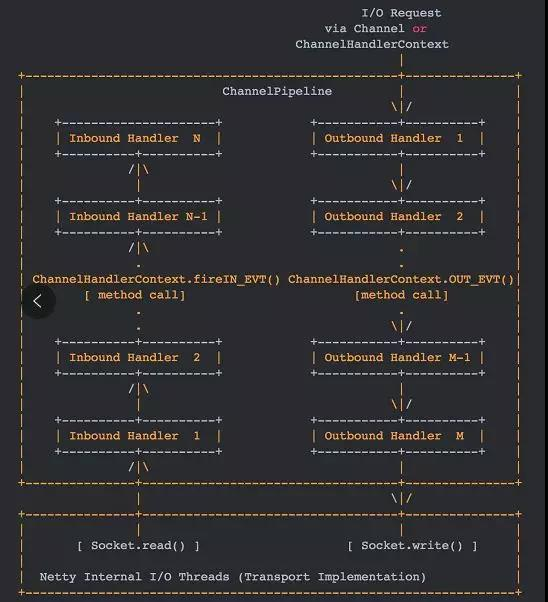
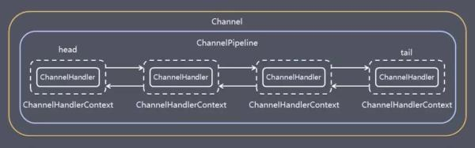

## Netty 基础

### Netty 基本组件

#### Bootstrap、ServerBootstrap

Bootstrap 意思是引导，一个 Netty 应用通常由一个 Bootstrap 开始，主要作用是配置整个 Netty 程序，串联各个组件，Netty 中 Bootstrap 类是客户端程序的启动引导类，ServerBootstrap 是服务端启动引导类。


#### Future、ChannelFuture

正如前面介绍，在 Netty 中所有的 IO 操作都是异步的，不能立刻得知消息是否被正确处理。

但是可以过一会等它执行完成或者直接注册一个监听，具体的实现就是通过 Future 和 ChannelFutures，他们可以注册一个监听，当操作执行成功或失败时监听会自动触发注册的监听事件。


#### Channel

Netty 网络通信的组件，能够用于执行网络 I/O 操作。Channel 为用户提供： 

当前网络连接的通道的状态（例如是否打开？是否已连接？） 

网络连接的配置参数 （例如接收缓冲区大小） 

提供异步的网络 I/O 操作(如建立连接，读写，绑定端口)，异步调用意味着任何 I/O 调用都将立即返回，并且不保证在调用结束时所请求的 I/O 操作已完成。 

调用立即返回一个 ChannelFuture 实例，通过注册监听器到 ChannelFuture 上，可以 I/O 操作成功、失败或取消时回调通知调用方。 

 支持关联 I/O 操作与对应的处理程序。 

**常见的 channel 类型**

不同协议、不同的阻塞类型的连接都有不同的 Channel 类型与之对应。

下面是一些常用的 Channel 类型：

NioSocketChannel，异步的客户端 TCP Socket 连接。

NioServerSocketChannel，异步的服务器端 TCP Socket 连接。

NioDatagramChannel，异步的 UDP 连接。

NioSctpChannel，异步的客户端 Sctp 连接。

NioSctpServerChannel，异步的 Sctp 服务器端连接，这些通道涵盖了 UDP 和 TCP 网络 IO 以及文件 IO。


#### Selector

Netty 基于 Selector 对象实现 I/O 多路复用，通过 Selector 一个线程可以监听多个连接的 Channel 事件。

当向一个 Selector 中注册 Channel 后，Selector 内部的机制就可以自动不断地查询(Select) 这些注册的 Channel 是否有已就绪的 I/O 事件（例如可读，可写，网络连接完成等），这样程序就可以很简单地使用一个线程高效地管理多个 Channel 。


#### NioEventLoop

NioEventLoop 中维护了一个线程和任务队列，支持异步提交执行任务，线程启动时会调用 NioEventLoop 的 run 方法，执行 I/O 任务和非 I/O 任务：

I/O 任务，即 selectionKey 中 ready 的事件，如 accept、connect、read、write 等，由 processSelectedKeys 方法触发。

非 IO 任务，添加到 taskQueue 中的任务，如 register0、bind0 等任务，由 runAllTasks 方法触发。

两种任务的执行时间比由变量 ioRatio 控制，默认为 50，则表示允许非 IO 任务执行的时间与 IO 任务的执行时间相等。


#### NioEventLoopGroup

 NioEventLoopGroup，主要管理 eventLoop 的生命周期，可以理解为一个线程池，内部维护了一组线程，每个线程(NioEventLoop)负责处理多个 Channel 上的事件，而一个 Channel 只对应于一个线程。 


#### ChannelHandler

ChannelHandler 是一个接口，处理 I/O 事件或拦截 I/O 操作，并将其转发到其 ChannelPipeline(业务处理链)中的下一个处理程序。

ChannelHandler 本身并没有提供很多方法，因为这个接口有许多的方法需要实现，方便使用期间，可以继承它的子类：

ChannelInboundHandler 用于处理入站 I/O 事件。

ChannelOutboundHandler 用于处理出站 I/O 操作。

或者使用以下适配器类：

ChannelInboundHandlerAdapter 用于处理入站 I/O 事件。

ChannelOutboundHandlerAdapter 用于处理出站 I/O 操作。

ChannelDuplexHandler 用于处理入站和出站事件。


#### ChannelHandlerContext

 保存 Channel 相关的所有上下文信息，同时关联一个 ChannelHandler 对象。 


#### ChannelPipeline

保存 ChannelHandler 的 List，用于处理或拦截 Channel 的入站事件和出站操作。

ChannelPipeline 实现了一种高级形式的拦截过滤器模式，使用户可以完全控制事件的处理方式，以及 Channel 中各个的 ChannelHandler 如何相互交互。

下图引用 Netty 的 Javadoc 4.1 中 ChannelPipeline 的说明，描述了 ChannelPipeline 中 ChannelHandler 通常如何处理 I/O 事件。

I/O 事件由 ChannelInboundHandler 或 ChannelOutboundHandler 处理，并通过调用 ChannelHandlerContext 中定义的事件传播方法。

例如: ChannelHandlerContext.fireChannelRead（Object）和 ChannelOutboundInvoker.write（Object）转发到其最近的处理程序。 

  

入站事件由自下而上方向的入站处理程序处理，如图左侧所示。入站 Handler 处理程序通常处理由图底部的 I/O 线程生成的入站数据。

通常通过实际输入操作（例如 SocketChannel.read（ByteBuffer））从远程读取入站数据。

出站事件由上下方向处理，如图右侧所示。出站 Handler 处理程序通常会生成或转换出站传输，例如 write 请求。

I/O 线程通常执行实际的输出操作，例如 SocketChannel.write（ByteBuffer）。

在 Netty 中每个 Channel 都有且仅有一个 ChannelPipeline 与之对应，它们的组成关系如下：

  

一个 Channel 包含了一个 ChannelPipeline，而 ChannelPipeline 中又维护了一个由 ChannelHandlerContext 组成的双向链表，并且每个 ChannelHandlerContext 中又关联着一个 ChannelHandler。

入站事件和出站事件在一个双向链表中，入站事件会从链表 head 往后传递到最后一个入站的 handler，出站事件会从链表 tail 往前传递到最前一个出站的 handler，两种类型的 handler 互不干扰。


### Netty 工作原理架构

 初始化并启动 Netty 服务端过程如下： 

```java
public static void main(String[] args) { 
 // 创建mainReactor 
 NioEventLoopGroup boosGroup = new NioEventLoopGroup(); 
 // 创建工作线程组 
 NioEventLoopGroup workerGroup = new NioEventLoopGroup(); 
 
 final ServerBootstrap serverBootstrap = new ServerBootstrap(); 
 serverBootstrap 
 // 组装NioEventLoopGroup 
 .group(boosGroup, workerGroup) 
 // 设置channel类型为NIO类型 
 .channel(NioServerSocketChannel.class) 
 // 设置连接配置参数 
 .option(ChannelOption.SO_BACKLOG, 1024) 
 .childOption(ChannelOption.SO_KEEPALIVE, true) 
 .childOption(ChannelOption.TCP_NODELAY, true) 
 // 配置入站、出站事件handler 
 .childHandler(new ChannelInitializer<NioSocketChannel>() { 
 @Override 
 protected void initChannel(NioSocketChannel ch) { 
 // 配置入站、出站事件channel 
 ch.pipeline().addLast(...); 
 ch.pipeline().addLast(...); 
 } 
 }); 
 
 // 绑定端口 
 int port = 8080; 
 serverBootstrap.bind(port).addListener(future -> { 
 if (future.isSuccess()) { 
 System.out.println(new Date() + ": 端口[" + port + "]绑定成功!"); 
 } else { 
 System.err.println("端口[" + port + "]绑定失败!"); 
 } 
 }); 
} 
```


**过程如下：**

初始化创建 2 个 NioEventLoopGroup，其中 boosGroup 用于 Accetpt 连接建立事件并分发请求，workerGroup 用于处理 I/O 读写事件和业务逻辑。

基于 ServerBootstrap(服务端启动引导类)，配置 EventLoopGroup、Channel 类型，连接参数、配置入站、出站事件 handler。

绑定端口，开始工作。

结合上面介绍的 Netty Reactor 模型，介绍服务端 Netty 的工作架构图：

  

Server 端包含 1 个 Boss NioEventLoopGroup 和 1 个 Worker NioEventLoopGroup。

NioEventLoopGroup 相当于 1 个事件循环组，这个组里包含多个事件循环 NioEventLoop，每个 NioEventLoop 包含 1 个 Selector 和 1 个事件循环线程。

- Boss

  每个 Boss NioEventLoop 循环执行的任务包含 3 步：

  轮询 Accept 事件。

  处理 Accept I/O 事件，与 Client 建立连接，生成 NioSocketChannel，并将 NioSocketChannel 注册到某个 Worker NioEventLoop 的 Selector 上。

  处理任务队列中的任务，runAllTasks。任务队列中的任务包括用户调用 eventloop.execute 或 schedule 执行的任务，或者其他线程提交到该 eventloop 的任务。

- Worker

  每个 Worker NioEventLoop 循环执行的任务包含 3 步：

  轮询 Read、Write 事件。

  处理 I/O 事件，即 Read、Write 事件，在 NioSocketChannel 可读、可写事件发生时进行处理。

  处理任务队列中的任务，runAllTasks。


### 任务队列的 Task 典型使用场景

 其中任务队列中的 Task 有 3 种典型使用场景。 

**1、用户程序自定义的普通任务**

```java
ctx.channel().eventLoop().execute(new Runnable() { 
 	@Override 
 	public void run() { 
 		//... 
 	} 
}); 
```


**2、非当前Reactor线程调用Channel的各种方法**

 例如在推送系统的业务线程里面，根据用户的标识，找到对应的 Channel 引用，然后调用 Write 类方法向该用户推送消息，就会进入到这种场景。最终的 Write 会提交到任务队列中后被异步消费。 


**3、用户自定义定时任务**

```java
ctx.channel().eventLoop().schedule(new Runnable() { 
 @Override 
 public void run() { 
 
 } 
}, 60, TimeUnit.SECONDS); 
```


#### Netty的主要组件

```
EventLoopGroup
	bossGroup(从客户端接受连接)
	workerGroup（使用接受到的连接做一些业务）


NioEventLoopGroup

ServerBootstarp 服务端启动类

ChannelInitializer

SimpleChannelInboundHandler<T>
```


### Handler

```
HttpServerCodec 

pipeline.addLast(new LengthFieldBasedFrameDecoder(Integer.MAX_VALUE,0,4,0,4))
                .addLast(new LengthFieldPrepender(4))
                .addLast(new StringDecoder())
                .addLast(new StringEncoder());

LoggingHandler 日志组件

IdleStateHandler 心跳检测组件
```


### ChannelnboundHandler

```
 /**
     *
     * @param ctx 添加handler
     * @throws Exception
     */
    @Override
    public void handlerAdded(ChannelHandlerContext ctx) throws Exception {
        super.handlerAdded(ctx);
    }

    //channel为活动状态
    @Override
    public void channelActive(ChannelHandlerContext ctx) throws Exception {
        super.channelActive(ctx);
    }

    //channel注册
    @Override
    public void channelRegistered(ChannelHandlerContext ctx) throws Exception {
        super.channelRegistered(ctx);
    }

    //channel为不活动状态
    @Override
    public void channelInactive(ChannelHandlerContext ctx) throws Exception {
        super.channelInactive(ctx);
    }

    //channel卸载
    @Override
    public void channelUnregistered(ChannelHandlerContext ctx) throws Exception {
        super.channelUnregistered(ctx);
    }
    
    channelRemove
```


### Netty长连接

```
心跳机制


```


### websocket

```
 @Override
    protected void initChannel(Channel ch) throws Exception {
        ch.pipeline()
                .addLast(new HttpServerCodec())
                .addLast(new ChunkedWriteHandler())
                .addLast(new HttpObjectAggregator(8192))
                .addLast();
    }

HttpObjectAggregator 将http所有的数据聚合到一起
WebSocketFrame 定义协议规范
```


#### Netty的 执行流程

