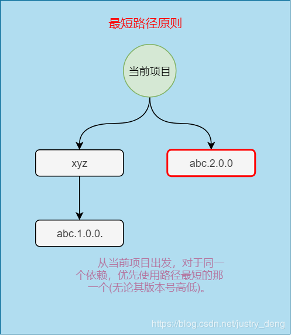
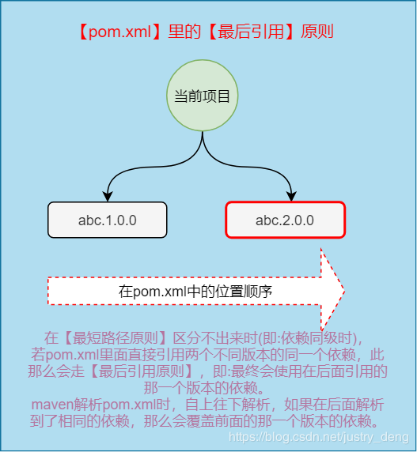
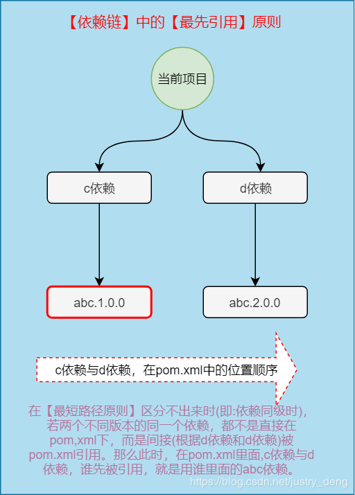
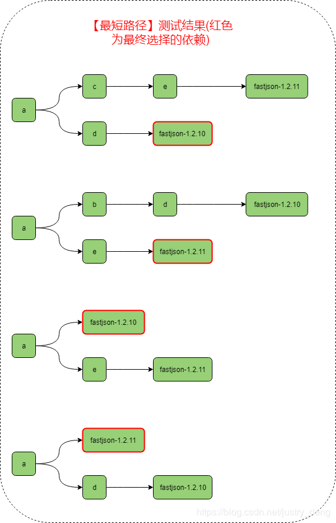
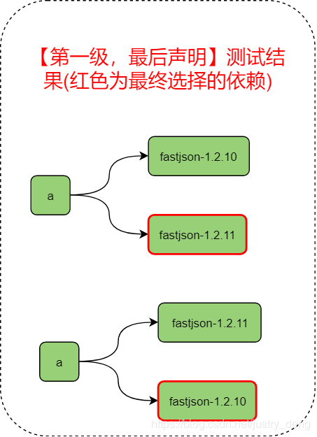
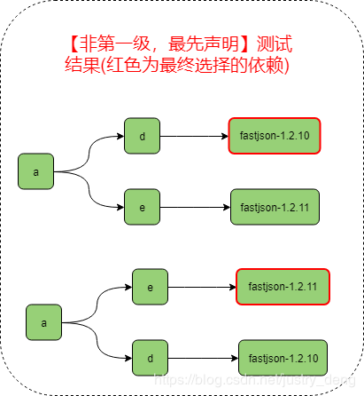
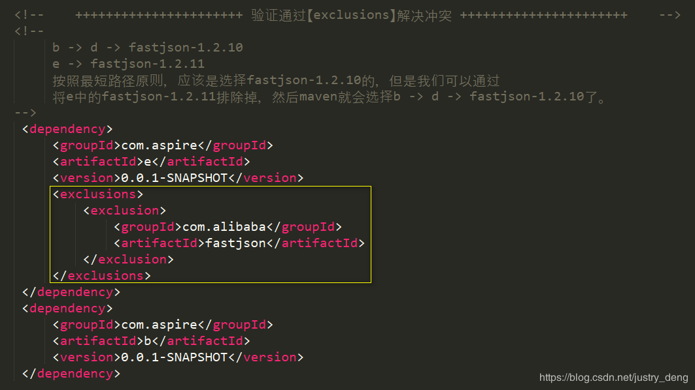
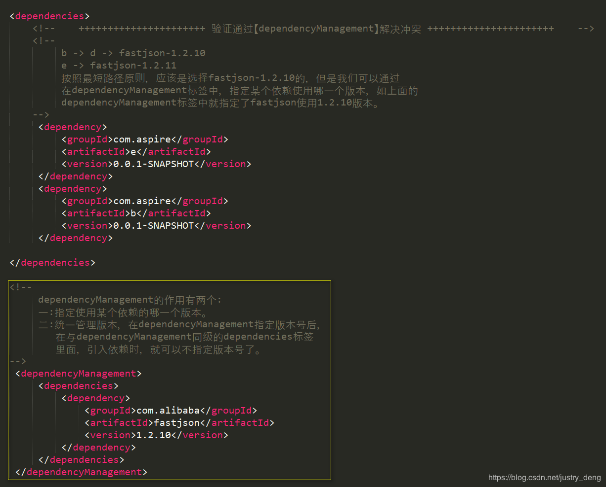

## Maven 配置

### 约定优于配置

 创建的maven空项目已经包含了一定的目录结构，需要开发者遵循这种目录约定，这是使用maven简洁配置需要付出的代价。 

| 目录                                   | 说明                    |
| -------------------------------------- | ----------------------- |
| {project.basedir}                      | 存放pom文件和项目子模块 |
| {project.basedir}/src/main/java        | 源码目录                |
| {project.basedir}/src/main/resources   | 资源目录                |
| {project.basedir}/src/test/java        | 测试源码目录            |
| {project.basedir}/src/test/resources   | 测试资源目录            |
| ${project.basedir}/target              | 包输出目录              |
| ${project.basedir}/target/classes      | 编译输出目录            |
| ${project.basedir}/target/test-classes | 测试编译输出目录        |


### pom文件

1. 说明
   POM（Project Object Model，项目对象模型）定义了项目的基本信息，用于描述项目如何构建、声明项目依赖。
2. 简单配置
   - `?xml`: xml头信息，定义xml文档的版本和编码方式。
   - `project`: 所有pom.xml的根元素，声明了pom相关的命名空间和xsd元素。
   - `modelVersion`: 指定当前pom模型的版本，对于maven2/3，只能是4.0.0。
   - `groupId`: 定义当前maven项目隶属的实际项目。
   - `artifactId`: 定义实际项目中的一个maven模块/项目。
   - `version`: 定义maven项目当前所处的版本
   - `groupId\artifactId\version`: 定义了一个项目基本的坐标。
3. 其他配置
   - 项目依赖
   - 插件
   - 执行目标
   - 项目构建profile


### maven 坐标

**定义**

​		Maven定义了一组规则：世界上任何一个构件都可以使用Maven坐标唯一标识。
​		Maven坐标元素包括`groupId`, `artifactId`, `version`, `packaging`, `classifier`。 

**坐标元素**

- `groupId`: 定义当前maven项目隶属的实际项目。
- `artifactId`: 定义实际项目中的一个maven模块/项目。
- `version`: 定义maven项目当前所处的版本。
- `packaging`: 定义maven项目的打包方式。打包方式与生成构件的文件扩展名对应，默认为`jar`， 常用的打包方式有`jar`， `war`， `pom`。
- `classifier`: 帮助定义构建输出的附属构件。附属构件与主构件对应。如demo1-1.0-SNAPSHOT-`sources`.jar这个构件，包含了主构件的源代码。不能直接定义项目的classifier，因为附属构件不是项目直接默认生成的，而是通过附加插件帮助生成的。

**项目构件的文件名**

- 一般规则为： `artifactId-version[-classifier].packaging`


### maven 依赖

maven 依赖pom文件如下：

```xml
<project>
    <dependencies>
        <!-- 添加依赖 -->
        <dependency>
            <groupId></groupId>
            <artifactId></artifactId>
            <version></version>
            <type></type>
            <scope></scope>
            <optional></optional>
            <exclusions>
                <exclusion></exclusion>
                <exclusion></exclusion>
            </exclusions>
        </dependency>
    </dependencies>
</project>

dependencies元素包含多个dependency，每个dependency代表项目依赖的一个构件信息。
dependency元素中的 groupId， artifactId，version定义了一个构件的基本坐标。
type被依赖构件的类型，对应于被依赖构件的packaging。默认为jar, 表示被依赖的构件是一个jar包。
scope表示依赖的范围，见依赖范围。
optional表示依赖是否可选，参考可选依赖。
exclusions用来排除传递依赖。
```


**依赖范围**

 依赖范围就是用来控制依赖与三种classpath(编译classpath，运行classpath，测试classpath【编译测试代码、运行测试代码】)的关系。 

-  `compile`: 编译依赖范围。如果未指定，默认使用该依赖范围。**对于编译、测试、运行3种classpath都有效**。比如spring-web。 
-  `test`: 测试依赖范围。只对测试classpath有效，**在编译主代码、运行项目时无法使用此依赖**。比如JUnit。 

-  `provided`: 已提供依赖范围。**对于编译、测试classpath有效，但在运行时无效**。比如servlet-api，在运行项目的时候容器已经提供了。 
-  `runtime`: 运行时依赖范围。**对于测试、运行classpath有效，但在编译主代码时无效**。比如jdbc驱动实现，运行的时候才需要具体的jdbc驱动实现。 
-  `system`: 系统依赖范围。该依赖与三种classpath的关系，和provided依赖范围完全一致。但是，使用system范围的依赖时必须通过systemPath元素显示指定依赖文件的路径。建议谨慎使用。 

```xml
<dependency>
    <groupId>com.john</groupId>
    <artifactId>rt</artifactId>
    <version>1.8</version>
    <scope>system</scope>
    <systemPath>${java.home}/lib/rt.jar</systemPath>
</dependency>
```

-  `import`: 导入依赖范围。在maven依赖和dependencyManagement时候用到。 


** **依赖范围与classpath的关系** **

| 依赖范围 （scope） | 对于编译classpath有效 | 对于测试classpath有效 | 对于运行classpath有效 | 举例         |
| ------------------ | --------------------- | --------------------- | --------------------- | ------------ |
| compile            | Y                     | Y                     | Y                     | spring-web   |
| test               | --                    | Y                     | --                    | JUnit        |
| provided           | Y                     | Y                     | --                    | servlet-api  |
| runtime            | --                    | Y                     | Y                     | JDBC驱动实现 |
| system             | Y                     | Y                     | --                    | 本地的jar包  |


 **scope与运行classpath**
scope如果对于运行范围有效，是指依赖的jar包会被打包到项目的运行包中，最后运行的时候会被添加到classpath中运行。
如果scope对于运行项目无效，那么项目打包的时候，这些依赖不会被打包到运行包中。 


### 传递性依赖

1、说明

- 在项目中引入groupId:junit, artifactId:junit, version:4.12, scope:test的依赖，查看项目依赖，发现项目依赖junit，而junit又依赖org.hamcrest:hamcrest-core:1.3，该依赖也被自动加进来，这个叫做依赖的传递。
- `假设`A依赖于B，B依赖于C，我们说A对于B是`第一直接依赖`，B对于C是`第二直接依赖`，而A对于C是`传递性依赖`。
- 第一直接依赖的范围和第二直接依赖的范围决定了传递依赖的范围。

2、依赖范围对传递性依赖的影响

| 第一直接依赖`\`第二直接依赖 | compile  | test | provided | runtime  |
| --------------------------- | -------- | ---- | -------- | -------- |
| compile                     | compile  | --   | --       | runtime  |
| test                        | test     | --   | --       | test     |
| provided                    | provided | --   | provided | provided |
| runtime                     | runtime  | --   | --       | runtime  |


### 依赖调解

1. 第一原则：路径近者优先。
   
   - `A->B->C->Y(1.0)，A->D->Y(2.0)`，Y的2.0版本距离A更近一些，所以maven会选择2.0
   
2. 第二原则：第一声明者优先。
   
   - `A->B->Y(1.0)，A->D->Y(2.0)`，Y的1.0版先声明，所以maven会选择1.0版本。
   
3. 级别

   以pom.xml为基准，pom中引用的依赖视为第一级， 那么依赖中各自引用的依赖视为第二级...第三级... 

    

**POM引用依赖原则：**

 从pom.xml出发，到抵达该依赖时经过的“级”的个数来作为路径长短的标准。

1、最短路径（不同级别引用）原则：

 若两个版本不同的同一依赖，在不同的级别中，那么优先使用路径最短的那一个，如： 

  


2、同级(第一级遵循最后、其它级遵循最先)引用原则：

 同级别的引用，分两种：

    - 两个不同版本的同一依赖，所在的级别是第一级；
    - 两个不同版本的同一依赖，所在的级别不是第一级。 

① 在第一级，谁后声明，使用谁

  


②  不在第一级，谁先声明，使用谁

  


3、maven 测试依赖关系验证

测试项目结构及测试原理说明：


        fastjson-1.2.10版本与fastjson-1.2.11版本差别较大，如果是1.2.11版的话，可以在代码中直接new FastJsonConfig()；而如果是1.2.10版的话，直接在代码中new FastJsonConfig()的话，是会报错的。在这个的基础上，我们可以通过在a模块儿中直接或间接(通过引入其他模块儿来)引入fastjson的依赖，来判断maven最终引用的是哪一个版本的依赖，进而测试上面的结论。

测试最短路径：

  


测试(第一级)最后引用：

  

测试(非第一级)最先引用：


  

### 可选依赖

```
   A->B, scope:compile
    B->X, scope:compile，optional:true
    B->Y, scope:compile，optional:true
```

- X、Y是可选依赖，依赖不会由B传至A。X、Y不会对A造成影响。
- 理想情况下，不应该使用可选依赖。


### maven 解决依赖冲突

第一种：使用【exclusions】排除不需要的依赖。

  

第二种：使用【dependencyManagement】指定使用哪一个版本的依赖。

  


注：dependencyManagement的作用有两个：一是指定使用某个依赖的哪一个版本。二是统一管理版本，在dependencyManagement指定版本号后，在与dependencyManagement同级的dependencies标签里面，引入依赖时，就可以不指定版本号了。