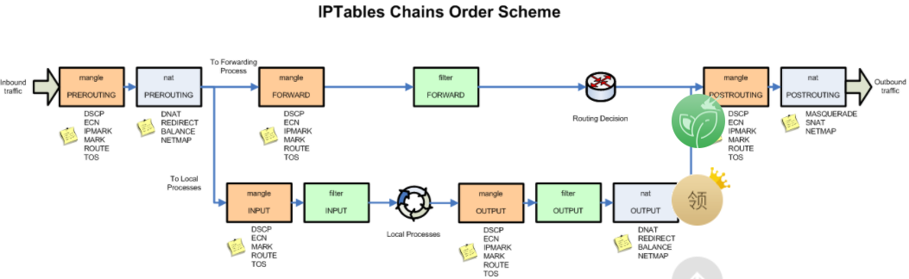
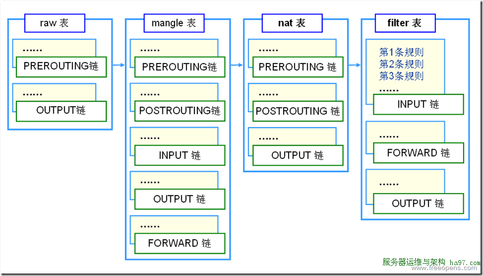

# Iptables\ netfilter

## 简介

 **`netfilter`**：在Linux内核中的一个软件框架，用于管理网络数据包。不仅具有网络地址转换（`NAT`）的功能，也具备数据包内容修改、以及数据包过滤等防火墙功能。利用运作于用户空间的应用软件，如iptable等，来控制Netfilter，系统管理者可以管理通过Linux操作系统的各种网络数据包 

 **`iptables`**：一个运行在用户空间的应用软件，通过控制Linux内核`netfilter`模块，来管理网络数据包的流动与转送。在大部分的Linux系统上面，iptables是使用`/usr/sbin/iptables`来操作，文件则放置在手册页`Man`底下，可以通过` man iptables`(Centos 7中还需要使用`man iptables-extensions` ) 指令获取。通常iptables都需要内核层级的模块来配合运作，iptables是主要在内核层级里面iptables API运作功能的模块。因相关动作上的需要，iptables的操作需要用到超级用户的权限。 

## 四表五链

### 四表

#### 1、RAW

> #### **功能**：关闭在nat表启用的连接追踪机制 
>
> 包含的链：PREROUTING、OUTPUT
>
> #### **caution：**此表一般不用，不建议在此表中添加规则

#### 2、mangle

功能：主要用来管理mangle包，可以使用mangle匹配来该表报的TOS等特性。

以下是managle表中仅有的几种操作：

- TOS
- TTL
- MARK

包含的链：`PREROUING`、`INPUT`、`OUTPUT`、`FORWARD`、`PREROUTING`

#### 3、nat

功能：此表仅用于NAT（网络地址转换）,也就是转换包的源或者目标地址。

- DNAT
- SNAT
- MASQUERADE

包含的链：

- PREROUING
- INPUT
- OUTPUT
- FORWARD
- PREROUTING

> 注意：INPUT链在nat表中目前只在Centos 7上有

**DNAT：**操作主要用在当你有一个合法的IP地址，要把对防火墙的访问重定向到其他的服务器上面（比如DMZ），主要用于改变目标地址。

**SNAT：**该变包的原地址，这在极大程度上就可以隐藏内网或者DMZ，也可以是内网用户连接到互联网，通过一个IP地址。

**MASQUERADE：**其作用和SNAT的作用完全一样，只是计算机的符合稍微多一点，其主要作用 是使用在外网IP为动态IP时，比如PPP、PPPOE等拨号获得的地址，MASQUERADE可以探测外网地址，并转发。

#### 4、filter

**功能：**用来过滤数据包，可以根据控制语句对数据包进行一系列动作，例如ACCEPT、DROP等，几乎所有的target都可以在这使用。 

**包含的链**：

- INPUT
- OUTPUT
- FORWARD

 

### 五链

- **REROUTING**：路由前访问控制，一般做外访内控制
- **INPUT**：进入的包
- **FORWARD**：转发
- **OUTPUT**：出去的包
- **POSTROUTING**：路由后

## 防火墙过滤规则

  

**报文流向**：表优先级为RAW-->MANGLE-->NAT-->FILTER

- **流入本机**：PREROUTING--> INPUT --> 用户空间进程
- **流出本机**：用户空间进程 --> OUTPUT --> POSTROUTING
- **转发**：PREROUTING --> FORWARD --> POSTROUTING

  

具体链接：https://www.voidking.com/dev-linux-snat/

https://www.ylkb.net/2017/intro-iptables.html

http://www.ha97.com/4082.html