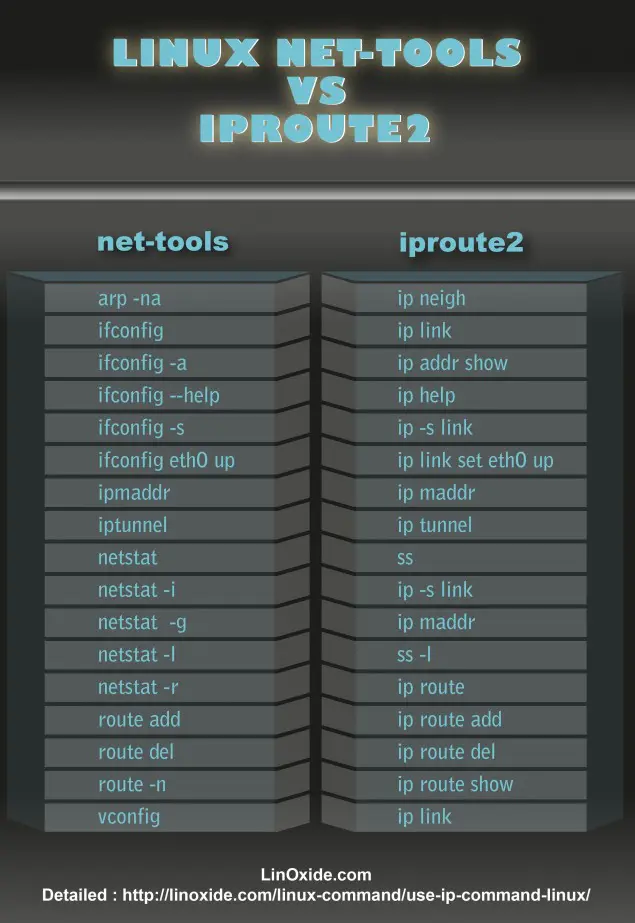

## IP命令

Linux的ip命令和ifconfig类似，但前者功能更强大，并旨在取代后者。使用ip命令，只需一个命令，你就能很轻松地执行一些网络管理任务。ifconfig是net-tools中已被废弃使用的一个命令，许多年前就已经没有维护了。Linux系统提供iproute2工具用于替代一些常用的net-tools命令，iproute2套件里提供了许多增强功能的命令，ip命令即是其中之一。

  


### 格式
```sh
ip [options] object [command [arguments]]
```

 

### 主要参数

**OPTIONS**是修改ip行为或改变其输出的选项。所有的选项都是以-字符开头，分为长、短两种形式。如link、addr、route、rule、tunnel 。

**object**是要管理者获取信息的对象。如网络接口类型eth0。

**command**设置针对指定对象执行的操作，它和对象的类型有关。一般情况下，ip支持对象的增加(add)、删除(delete)和展示(show或list)。有些对象不支持这些操作，或者有其它的一些命令。对于所有的对象，用户可以使用help命令获得帮助。这个命令会列出这个对象支持的命令和参数的语法。如果没有指定对象的操作命令，ip会使用默认的命令。一般情况下，默认命令是list，如果对象不能列出，就会执行help命令。

**arguments**是命令的一些参数，它们倚赖于对象和命令。ip支持两种类型的参数：flag和parameter。flag由一个关键词组成；parameter由一个关键词加一个数值组成。为了方便，每个命令都有一个可以忽略的默认参数。例如，参数dev是ip link命令的默认参数，因此ip link ls eth0等于ip link ls dev eth0。命令的默认参数将使用default标出。


### Object

 OBJECT 为常用对象，值可以是以下几种： 

```
OBJECT={ link | addr | addrlabel | route | rule | neigh | ntable | tunnel | maddr | mroute | mrule | monitor | xfrm | token }
```

常用对象的取值含义如下：

- link：网络设备
- address：设备上的协议（IP或IPv6）地址
- addrlabel：协议地址选择的标签配置
- route：路由表条目
- rule：路由策略数据库中的规则


### Options

 OPTIONS 为常用选项，值可以是以下几种 

```
OPTIONS={ -V[ersion] | -s[tatistics] | -d[etails] | -r[esolve] | -h[uman-readable] | -iec | -f[amily] { inet | inet6 | ipx | dnet | link } | -o[neline] | -t[imestamp] | -b[atch] [filename] | -rc[vbuf] [size] }
```

常用选项的取值含义如下：

- -V：显示命令的版本信息；
- -s：输出更详细的信息；
- -f：强制使用指定的协议族；
- -4：指定使用的网络层协议是IPv4协议；
- -6：指定使用的网络层协议是IPv6协议；
- -0：输出信息每条记录输出一行，即使内容较多也不换行显示；
- -r：显示主机时，不使用IP地址，而使用主机的域名。


### IP address

ip address 主要是设置网卡的地址信息，包括广播地址，子网掩码等等

#### 格式

```sh
#添加删除网络地址
ip address { add | del } IFADDR dev STRING

ip address { show | flush } [ dev STRING ] [ scope SCOPE-ID ] [ to PREFIX ] [ FLAG-LIST ] [ label PATTERN ]

# 设置网络地址时，可以设置广播地址、
(常用) IFADDR := PREFIX | ADDR peer PREFIX [ broadcast ADDR ] [ anycast ADDR ] [ label STRING ] [ scope SCOPE-ID ]

SCOPE-ID := [ host | link | global | NUMBER ]

FLAG-LIST := [ FLAG-LIST ] FLAG

FLAG := [ permanent | dynamic | secondary | primary | tentative |deprecated | dadfailed | temporary ]
```

- dev STRING：指定要进行操作的网络设备名称
- IFADDR：协议地址，地址的格式由使用的协议所决定，比如在ipv4协议中，地址的格式为用小数点分隔的四个十进制数，后面可以用/连接子网掩码的位数，比如192.168.1.100/24。
- peer address：使用点对点连接时对端的协议地址。
- broadcast address：协议广播地址，可以简写成brd，此外可以简单的在后面加上“+”表示广播地址由协议地址主机位全置1组成，“-”则表示主机位全置0。
- label：装置的别名，为了和linux 2.0中的别名相兼容，该标志由该网络设备名称开头，后面用“：”接上地址名称，比如eth0:3等等。
- scope：地址作用范围，可能的值有：
  - global：**允许来自所有来源的连接，加IP时，默认值**
  - site：仅支持 IPv6 ，仅允许本主机的连接
  - link：仅允许本装置自我连接
  - host：仅允许本主机内部的连接


#### 示例

1、显示当前机器的所有网卡地址信息

```sh
[root@apollo ~]# ip addr show 
1: lo: <LOOPBACK,UP,LOWER_UP> mtu 65536 qdisc noqueue state UNKNOWN group default qlen 1000
    link/loopback 00:00:00:00:00:00 brd 00:00:00:00:00:00
    inet 127.0.0.1/8 scope host lo
       valid_lft forever preferred_lft forever
    inet6 ::1/128 scope host 
       valid_lft forever preferred_lft forever
2: ens192: <BROADCAST,MULTICAST,UP,LOWER_UP> mtu 1500 qdisc mq state UP group default qlen 1000
    link/ether 00:0c:29:47:b5:46 brd ff:ff:ff:ff:ff:ff
    inet 192.168.1.161/24 brd 192.168.1.255 scope global noprefixroute dynamic ens192
       valid_lft 37447sec preferred_lft 37447sec
    inet6 fe80::1518:42e2:16a2:50f3/64 scope link noprefixroute 
       valid_lft forever preferred_lft forever
3: docker0: <BROADCAST,MULTICAST,UP,LOWER_UP> mtu 1500 qdisc noqueue state UP group default 
    link/ether 02:42:6c:f8:25:79 brd ff:ff:ff:ff:ff:ff
    inet 172.17.0.1/16 brd 172.17.255.255 scope global docker0
       valid_lft forever preferred_lft forever
    inet6 fe80::42:6cff:fef8:2579/64 scope link 
       valid_lft forever preferred_lft forever
23: vethb838f0d@if22: <BROADCAST,MULTICAST,UP,LOWER_UP> mtu 1500 qdisc noqueue master docker0 state UP group default 
    link/ether 26:dc:fb:d3:6e:e6 brd ff:ff:ff:ff:ff:ff link-netnsid 0
    inet6 fe80::24dc:fbff:fed3:6ee6/64 scope link 
       valid_lft forever preferred_lft forever
.....
```


2、显示当前 dynamic IP 的可用时间

这里先介绍几个名词

- secondary：为输出的数据包选择默认源地址时，内核不使用这个地址。如果一个设备已经有了一个地址，又给它设置了同一网段的不同地址，第二个地址就成为从(secondary)地址。例如：eth0已经有一个地址192.168.1.108/24 ，如果又给它一个地址192.168.1.3/24，192.168.1.3/24 的就会被内核标记为从地址。
- dynamic：这个地址是通过无状态的自动配置建立的(stateless autoconfiguration)。如果地址仍然有效，在输出中，还包括两个时间信息。preferred_lft 期满后，地址就会变成deprecated状态；valiid_lft期满后，地址将失效。
- deprecated：这个地址是不允许的，也就是说，地址虽然有效，但是不能使用它建立新的连接。

```sh
[root@xmxyk ~]#ip -4 -o addr show eth0
2: eth0    inet 144.34.167.181/19 brd 144.34.191.255 scope global dynamic eth0\       valid_lft 130078sec preferred_lft 130078sec
```

preferred_lft 期满后，地址就会变成deprecated状态；valiid_lft期满后，地址将失效。


## 扩展

### 广播

所谓广播地址就是针对某位的子网掩码做广播，比如当前IP 地址是：10.1.1.3，那么广播地址就为：10.1.1.255，说明当前IP 只接受10.1.1.0/24 之内的广播包


### 网关

网关就相当于咱们理解的路由，所有的流量都从网关进入和出去


### 子网掩码

所谓子网掩码，则与当前IP的子网掩码位数有关，比如：

- 10.1.0.0/16，那么子网掩码为：255.255.0.0
- 10.1.1.0/24, 那么子网掩码为：255.255.255.0

