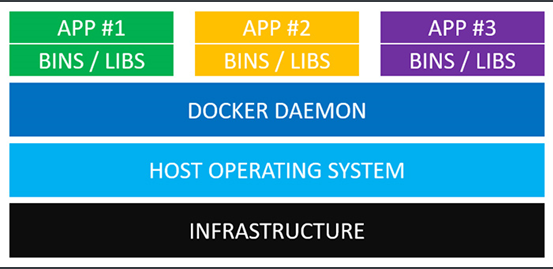
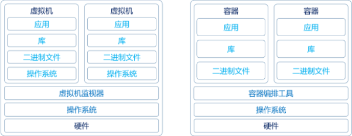
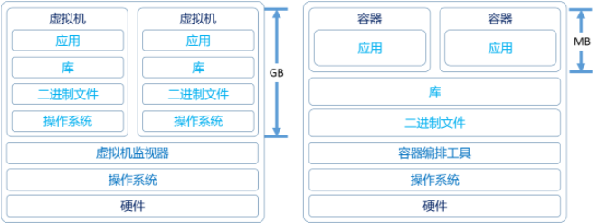
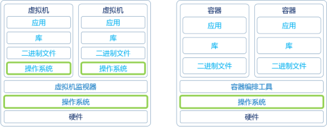

## 虚拟机与容器的区别

### 什么是容器

在了解什么是容器之前我们先了解什么叫容器化，所谓 **容器化**就是指应用程序级别的[虚拟化](https://www.alibabacloud.com/zh/knowledge/what-is-virtualization)，允许单个内核上有多个独立的用户空间实例。这些实例称为容器。  **容器**提供了将应用程序的代码、运行时、系统工具、系统库和配置打包到一个**实例**中的标准方法。容器共享一个**内核**（操作系统）， 容器以一种标准的方式，提供了轻量级打包和部署应用程序的方法。

### 容器与 虚拟机的区别

#### 虚拟机

 虚拟机，是一种硬件虚拟技术，它可以让我们完全虚拟化硬件或计算机资源。通过 Hypervisor我们可以虚拟化一个操作系统运行需要的各种硬件，比如cpu、内存、网络、I/O设备 等等，由于虚拟出来的操作系统作为完全不同的计算机运行，所以在正常运行条件下不会影响主机系统或其他虚拟机，因此虚拟机具备极大的隔离性和安全性，但是，虚拟化整个计算机需要 VM 使用大量的资源。此外，由于虚拟机在单独的访客操作系统上运行，因此虚拟机的配置和启动时间可能相当慢。同时，因为虚拟机作为一个独立的机器运行，就需要运维人员为虚拟上安装的系统进行打补丁、安装软件等等。虚拟机结构图如下：

 								 

- 基础设施(Infrastructure)。；例如个人电脑，服务器，或者是云主机。
- 主操作系统(Host Operating System)。例如：MacOS，Windows或者某个Linux发行版。
- 虚拟机管理系统(Hypervisor)。利用Hypervisor，可以在主操作系统之上运行多个不同的从操作系统。Hypervisor支持MacOS的HyperKit，支持Windows的Hyper-V以及支持Linux的KVM等多种类型操作系统。
- 虚拟机操作系统(Guest Operating System)。假设我们需要运行3个相互隔离的应用，则需要使用Hypervisor启动3个Guest OS，也就是3个虚拟机。这些虚拟机都非常大，可能由700MB，也可能比700M大，这就意味着它们将占用2.1GB的磁盘空间。而且 这些Guest OS 本身就要占用很多CPU 和内存资源。
- 各种依赖。每一个从操作系统都需要安装许多依赖。比如安装PostgreSQL数据库的话，则需要安装libpq-dev；如果使用Ruby的话，应该需要安装gems；如果使用其他编程语言，比如Python或者Node.js，都会需要安装对应的依赖库。
- 应用。安装依赖之后，就可以在各个从操作系统分别运行应用了，这样各个应用就是相互隔离的

#### 容器

容器与虚拟机对比起来，就显得很轻量了，他们共享宿主机的内核，只需要在宿主机上安装一个 容器引擎（比如container engine，也就是我们所说的docker engine） 就可以在宿主机上运行各种容器了，这些容器可以达到与虚拟机同样的目的与隔离效果。我们先来介绍下容器的运行结构，如下图：

​									 

- 基础设施(Infrastructure) 与上图（虚拟机图）是一致的。
- 主操作系统(Host Operating System)。所有支持Container engine的操作系统，例如 MacOS和Windows，linux 等等现在都支持。
- Docker Daemon (就是所谓的Container engine)。Docker守护进程取代了Hypervisor，它是运行在操作系统之上的后台进程，负责管理Docker容器。
- 各种依赖。对于Docker，应用的所有依赖都打包在Docker镜像中，Docker容器是基于Docker镜像创建的。
- 应用。应用的源代码与它的依赖都打包在Docker镜像中，不同的应用需要不同的Docker镜像。不同的应用运行在不同的Docker容器中，它们是相互隔离的。因为每一个容器都是一个进程，这些进程就会觉得自己是各自 PID Namespace 里的第 1 号进程，只能看到各自 Mount Namespace 里挂载的目录和文件，只能访问到各自 Network Namespace 里的网络设备，就仿佛运行在一个个“容器”里面，与世隔绝

#### 具体对比

我们将通过下面两个图进行对比，会得出以下结论

[虚拟机](https://www.alibabacloud.com/zh/knowledge/what-is-virtualization)是基于硬体的多个客户操作系统，由[虚拟机监视器](https://www.alibabacloud.com/zh/knowledge/what-is-hypervisor)实现。 [容器](https://www.alibabacloud.com/zh/knowledge/what-is-containerization)是应用程序级构造，并模拟共享单个内核的多个虚拟环境。 通过下面两张图对比，得出以下结论：

**系统性能**

- 虚拟机

  对于使用虚拟机的传统[虚拟化](https://www.alibabacloud.com/zh/knowledge/what-is-virtualization)，每个虚拟机都有自己的完整操作系统，因此在运行内置于虚拟机的应用程序时，内存使用量可能会高于必要值，虚拟机可能会开始耗尽主机所需的资源。

- 容器

  与传统的容器化应用程序不同，共享操作系统环境（内核），因此它们比完整虚拟机使用更少的资源，并减轻主机内存的压力

**容器 “重量”**

- 虚拟机

   传统虚拟机可占用大量磁盘空间：除了虚拟机托管的任何应用程序外，它们还包含完整的操作系统和相关工具。 

- 容器

   容器相对较轻：它们仅包含使容器化应用程序运行所需的库和工具，因此它们比虚拟机更紧凑，并且启动速度更快。 

**维护和更新**

- 虚拟机

   在更新或修补操作系统时，必须逐个更新传统计算机：必须单独修补每个客户操作系统。 

- 容器

   对于容器，只需更新容器主机（托管容器的机器）的操作系统。这显著简化了维护。 

​	

**根据以上总结对比如下：（这里对比使用容器工具是docker）**

1、docker启动快速属于秒级别，虚拟机通常需要几分钟去启动。

2、docker需要的资源更少，docker在操作系统级别进行虚拟化，docker容器和内核交互，几乎没有性能损耗，性能优于通过Hypervisor层与内核层的虚拟化。而虚拟机可能占用主机的大量系统资源，虚拟机的大小为数GB。在虚拟服务器上运行单个应用程序意味着还要运行`Guest OS`以及`Guest OS`运行所需的所有硬件的虚拟副本。这样很快就增加了很多`RAM`和`CPU`资源消耗。 

3、docker更轻量，docker的架构可以共用一个内核与共享应用程序库，所占内存极小。同样的硬件环境，Docker运行的镜像数远多于虚拟机数量。对系统的利用率非常高

4、与虚拟机相比，docker隔离性更弱，docker属于进程之间的隔离，虚拟机可实现系统级别隔离；

5、安全性： docker的安全性也更弱。Docker的租户root和宿主机root等同，一旦容器内的用户从普通用户权限提升为root权限，它就直接具备了宿主机的root权限，进而可进行无限制的操作。虚拟机租户root权限和宿主机的root虚拟机权限是分离的，并且虚拟机利用如Intel的VT-d和VT-x的ring-1硬件隔离技术，这种隔离技术可以防止虚拟机突破和彼此交互，而容器至今还没有任何形式的硬件隔离，这使得容器容易受到攻击。

6、高可用和可恢复性：我们通过kubernetes这种容器编排工具可以实现当某个服务挂掉之后可以自动重新拉起，不需要我们人工介入，当服务所在的容器压力增加时，比如并发、cpu、内存达到一个阈值时，kubernetes可以自动为服务创建更多的容器进行压力分摊，当服务压力降低之后会自动回收这些容器，将这些资源用于其他压力过高的服务。

7、快速创建、删除：虚拟化创建是分钟级别的，Docker容器创建是秒级别的，Docker的快速迭代性，决定了无论是开发、测试、部署都可以节约大量时间。

8、交付、部署：虚拟机可以通过镜像实现环境交付的一致性，但镜像分发无法体系化；Docker在Dockerfile中记录了容器构建过程，可在集群中实现快速分发和快速部署，也就是所谓的一次构建 ，"随处" 部署

### 容器的实现原理

容器是一个不依赖于操作系统，运行应用程序的环境。它通过Linux的`Namespaces`和`Cgroups`技术对应用程序进程进行隔离和限制的，`Namespace`的作用是**隔离**，它让应用进程只能看到该`Namespace`内的世界；而`Cgroups` 的作用是**限制**分配给进程的宿主机资源。但对于宿主机来说，这些被“隔离”了的进程跟其他进程并没有太大区别。

容器只是运行在宿主机上的一种特殊的进程，多个容器之间使用的还是同一个宿主机的操作系统内核。

虽然不够强大，不足以被视为完全安全沙箱，但这种隔离确实具有优势。由于主机和每个容器将软件保存在单独的文件系统中，因此更容易避免依赖性和库冲突。网络环境可以分离，因此容器内的应用程序可以绑定到其本机端口，而无需担心主机系统中或其他容器中的软件会产生冲突。然后，管理员可以根据需要选择如何将容器的网络映射到主机网络中

### 容器化之后的好  处

1、极其轻量：容器与虚拟机对比起来 容器体积更小，它只打包了必要的 `Bin\Lib` 占用的资源更少，容器使用主机系统的内核并在该操作系统中作为分区进程运行，而不是虚拟化所有硬件资源并在该环境中运行完全独立的操作系统

2、 秒级部署：根据镜像的不同，容器的部署大概在毫秒与秒之间（比虚拟机强很多）；

3、 易于移植：一次构建，随处部署；

4、弹性伸缩：Kubernetes、Swam、Mesos这类开源、方便、好使的容器管理平台有着非常强大的弹性管理能力。因为与我们使用传统的vcenter管理软件对比，Kubernetes 提供了强大的伸缩能力、监控、日志采集 等等，而这些容器编排工具又是基于容器来进行编排的。 

5、  容器占用的大小比虚拟机小很多，甚至可以小到10MB，可以轻松限制容器的内存和CPU使用率。与部署应用需要部署整个操作系统的虚拟机相比，容器非常轻巧且启动迅速。这样让我们可以快速扩展容器并添加相同的容器。 

6、容器镜像是分层存储的，节省空间，比如一个java镜像可能分为三层、分为是 rootfs层、环境层、运行层，当我们二次下载该镜像的其他版本时间，我们下载的只是第三层，再次存储的也是第三层，也就是对于镜像来说是共享底层存储的。

### 容器的缺点

1、容器仍无法提供与虚拟机相同的安全性和稳定性。由于它们共享主机的内核，因此不能像虚拟机一样完全隔离。

2、容器是进程级的隔离，一个容器可以通过影响宿主机内核的稳定性来影响其他容器。（当引入kubernetes 之后，这个问题也就不再是问题了）

3、一旦容器执行了任务，它就会关闭并删除其中的所有数据。如果希望数据保留下来，则必须使用"数据卷"进行保存，这需要在主机上进行手动配置