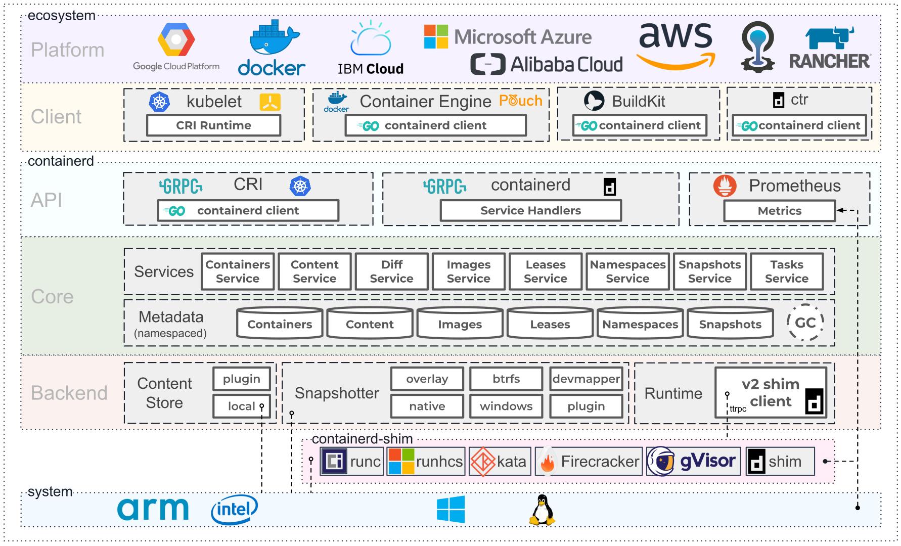

## OCI 标准

在了解 OCI 标准之前，我们先回顾下docker 的历史发展

发展链接：https://www.jianshu.com/p/4c9ff1619e96

 Open Container Initiative，也就是常说的OCI，是由多家公司共同成立的项目，并由linux基金会进行管理，致力于container runtime的标准的制定和runc的开发等工作。

所谓Container runtime，主要负责的是容器的生命周期的管理。OCI 的runtime spec标准中对于容器的状态描述，以及对于容器的创建、删除、查看等操作进行了定义。

runc，是对于OCI标准的一个参考实现，是一个可以用于创建和运行容器的CLI (command-line interface)工具。runc直接与容器所依赖的cgroup/linux kernel 等进行交互，负责为容器配置cgroup/namespace等启动容器所需的环境，创建启动容器的相关进程。

为了兼容oci标准，docker也做了架构调整。将容器运行时相关的程序从docker daemon剥离出来，形成了containerd。Containerd向docker提供运行容器的API，以及镜像的存储，拉取等等 ，二者通过grpc进行交互。containerd最后会通过runc来实际运行容器。

docker拆分之后架构图如下：

  

而后容器就慢慢演变成如下图：

 

- ecosystem 代表支持容器技术的公司以及 与 容器运行时交互的客户端产品

- container ：代表容器运行时的整个大环境，包括提供与client 段交互的grpc server段， 容器的生命周期管理、镜像的存储、符合oci 运行时规范的底层实现，容器的监控等等

- system 代表支持容器技术的 操作系统与芯片

总结：OCI规范可以看做是Container Runtime的一个标准

### OCI 规范

OCI 规范提供了两种标准，主要包含以下内容：

**容器运行时标准 （runtime spec）**

a). creating：使用 create 命令创建容器，这个过程称为创建中 b). created：容器创建出来，但是还没有运行，表示镜像和配置没有错误，容器能够运行在当前平台 c). running：容器的运行状态，里面的进程处于 up 状态，正在执行用户设定的任务 d). stopped：容器运行完成，或者运行出错，或者 stop 命令之后，容器处于暂停状态。这个状态，容器还有很多信息保存在平台中，并没有完全被删除

**容器镜像标准（image spec）**

a). 文件系统：以 layer 保存的文件系统，每个 layer 保存了和上层之间变化的部分，layer 应该保存哪些文件，怎么表示增加、修改和删除的文件等; b). config 文件：保存了文件系统的层级信息（每个层级的 hash 值，以及历史信息），以及容器运行时需要的一些信息（比如环境变量、工作目录、命令参数、mount 列表），指定了镜像在某个特定平台和系统的配置。比较接近我们使用 docker inspect <image_id> 看到的内容; c). manifest 文件：镜像的 config 文件索引，有哪些 layer，额外的 annotation 信息，manifest 文件中保存了很多和当前平台有关的信息; d). index 文件：可选的文件，指向不同平台的 manifest 文件，这个文件能保证一个镜像可以跨平台使用，每个平台拥有不同的 manifest 文件，使用 index 作为索引。

### 符合OCI 容器运行时标准的实现

何谓容器运行时，容器运行时就是根据 rootfs （为容器进程提供隔离后执行环境的文件系统）直接与容器所依赖的cgroup/namespace等进行交互 ，为容器创建一个单独的与宿主机隔离的运行环境，并且负责容器的生命周期管理。

#### runC

是对于OCI标准的一个参考实现，是一个可以用于创建和运行容器的CLI(command-line interface)工具。runc直接与容器所依赖的cgroup/linux kernel等进行交互，负责为容器配置cgroup/namespace等启动容器所需的环境，创建启动容器的相关进程。runC基本上就是一个命令行小工具，它可以不用通过Docker引擎，直接就可以创建容器。这是一个独立的二进制文件，使用OCI容器就可以运行它。

runC 的缺点是 由它创建的容器是和宿主机共享同一个内核的，当容器所在的进程影响到宿主机导致宿主机出现问题时，那么其他的容器进程或者宿主机进程也都会收到影响，包括容器内进程的权限提升等等，不过后续 我们使用k8s 来编排这些容器时，根据 k8s 提供的 Pod 以及 PodSecurityPolicy 可以限制这些，并且解决这些问题。

runC的优点：runC 很轻量，由于创建的容器和宿主机共享同一个内核，所以相对来说占用的资源很少。

runC 细节解读：https://segmentfault.com/a/1190000016366810

#### Kata

 Kata Container 是两个现有的开源项目合并：Intel Clear Containers和Hyper runV。 并且它的实现也遵循了 OCI 关于容器运行时的标准规范。

kata-container 介于 VM 与 容器之间，而与VM相比，它比VM轻量化许多，启动速度更好，开销更低。

kata的安全体现：kata用的是VM的硬件虚拟化支持，硬件隔离。**没有共享kernel**，不依赖于内核的namespace这种软件层面的隔离。

kata的 容器体现：kata的容器体现在兼容性上，支持OCI以及CRI接口，和容器一样操作。 性能上：启动速度达到百毫秒级，接近容器。 开销上：内存开销小，类似容器 

**原理**

kata 实际上是通过创建轻量级虚拟机实现容器之间的资源隔离，再在虚拟机中运行容器运行时，这样就使容器在专用内核中运行，提供网络，I / O和内存的隔离，并可以通过虚拟化VT扩展利用硬件强制隔离。提供安全性的同时，其仍然由很高的性能。

kata 包含的主要组件有两部分： - container runtime： 负责为每个 container 或 pod 创建QEMU*/KVM虚拟机，支持 [OCI 运行时规范](https://link.zhihu.com/?target=https%3A//github.com/opencontainers/runtime-spec)，可以以插件形式嵌入到 Docker 中作为底层的容器运行时；也**支持 K8s 的 CRI 接口**，可以与 CRI-O 和 containerd 集成 - agent ：在宿主机中用于管理容器和在这些容器中运行的进程。

我们先看一下 kata 与 普通容器运行时（这里以runc 为普通容器运行时的参考实现进行对比）的对比图：

​																								

​	            

​	

我们从上图，由runc 创建的容器 是与宿主机共享同一套内核，而 kata 创建的容器每个都有自己的内核。这就在一定程度上保证了容器与容器之间，容器与宿主机直接的彻底隔离，也保证了容器在一个单独的沙箱环境，不会影响到宿主机本身的运行。

kata的两个优点：

-  强隔离性：因为完全是用与KVM一样的技术原理，不会由于内核隔离性的缺陷而产生问题。 
-  安全性：KVM靠硬件CPU的VT-x指令集实现全虚拟化，安全性比纯软件的实现更高，因此更加适合公有云的场景 

kata的缺点：

-  性能，KVM全虚拟化的设计架构决定了在同等硬件条件下，磁盘I/O与网络性能不如RunC直接操作硬件的方案 

kata 扩展：https://zhuanlan.zhihu.com/p/109256949

kata 安装：https://zhuanlan.zhihu.com/p/105230155

#### gVisor 进程级虚拟化

gVisor 是由google 开发并且开源 的基于 OCI 实现的容器运行时实现， gVisor本质上是一个用户态的内核，可以类比成“容器界的JVM”。它通过动态翻译用户态的系统调用，自己来处理应用的系统调用请求，只会调用宿主机比较简单的指令 

​																		gVisor 与 kata 对比图

如上图右侧所示，它是一个用go语言重写的运行在用户态的操作系统内核，这个内核的名称叫做sentry，它并不依赖于虚拟化和虚拟机技术，它是借助一个它们内部叫做Platform 的能力，把应用所有的期望对操作系统的操作都转交给sentry来执行，sentry做处理之后会把其中的一部分交给操作系统来帮助它完成，大部门则自己来完成

gVisor 是一个纯粹面向应用的隔离层，从一开始就不是一个完全等同于虚拟机的东西，它就是用来拦截容器内部对宿主机的操作请求,作为一个隔离层，gVisor 主要作用是当容器内程序需要访问宿主机资源时，首先调用gVisor ，gVisor 通过自身去实现这些操作，如果一些操作gVisor 本身无法实现，则需要通过宿主机来实现，这样的话所有的操作请求都会代理给gVisor来操作，那么就可以规避掉大量的不安全以及影响宿主机的操作。

gVisor的优点在于它的安全和轻量，500ms就可以拉起一个新的容器。性能会比Kata Containers好一个数量级。同时，如果能实现完全的系统调用syscall，隔离性或安全性也会比现有的内核更好，很适合Serverless、短时任务等场景。它的缺点是目前还不成熟，对应用的兼容性会是一大考验，用在生产环境上还有一定的风险。如图3-47所示为gVisor与全虚拟化的架构对比。

总的来说，KataContainers和gVisor代表了未来容器技术演进的两个方向，两者都追求更强的容器隔离性和安全性，但采用了截然不同的设计思路。

gVisor github地址：https://github.com/google/gvisor

#### runV

github ：https://github.com/hyperhq/runv/

### 扩展

runc 容器运行时，启动一个容器之后就会退出，是一个命令工具集

containerd 是工业级的容器运行时，包括镜像的拉取，上传等等管理，容器的 启动、停止等等

crt 是对containerd 客户端命令 通过grpc 进行通信

cricrt 是 k8s 封装的根据 cri 规范 来操作containerd 的 命令工具

container-shim 是 当 oci 规范形成之后，为了兼容底层的各种 容器运行时 所以拆出来的

container-> container-shim->(runc、kata)

当 runc 或者 kata 启动容器后都会退出，由container-shim 作为其父进程运行，并且收集 容器进程的信息汇报给 containerd-shim

OCI 具体规范参考：https://www.jianshu.com/p/87b4876fbf65