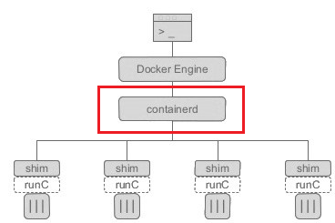

## Conatienrd

containerd是容器虚拟化技术，从docker中剥离出来，形成开放容器接口（OCI）标准的一部分。

 

docker对容器的管理和操作基本都是通过containerd完成的。**Containerd 是一个工业级标准的容器运行时，它强调简单性、健壮性和可移植性。Containerd 可以在宿主机中管理完整的容器生命周期：容器镜像的传输和存储、容器的执行和管理、存储和网络等。**详细点说，Containerd 负责干下面这些事情：

- 管理容器的生命周期(从创建容器到销毁容器)

- 拉取/推送容器镜像

- 存储管理(管理镜像及容器数据的存储)

- 调用 runC 运行容器(与 runC 等容器运行时交互)

- 管理容器网络接口及网络

注意：**Containerd 被设计成嵌入到一个更大的系统中，而不是直接由开发人员或终端用户使用。**

我们可以从下面几点来理解为什么需要独立的 containerd：

- 继续从整体 docker 引擎中分离出的项目(开源项目的思路)

- 可以被 Kubernets CRI 等项目使用(通用化)

- 为广泛的行业合作打下基础(就像 runC 一样)

**docker安装后containerd默认已安装，containerd包含如下命令组件：**

- containerd：高性能容器运行时。

- ctr：containerd的命令行客户端。

- runc：运行容器的命令行工具。

**docker、containerd、docker-shim、runC关系：**

docker：docker本身而言，包括了docker client和dockerd，dockerd实属是对容器相关操作的api的最上层封装，直接面向操作用户。

containerd：dockerd实际真实调用的还是containerd的api接口（rpc方式实现），containerd是dockerd和runC之间的一个中间交流组件。

container-shim：一个真实运行容器的载体，每启动一个容器都会起一个新的docker-shim的进程。它通过指定三个参数：容器ID、boundle目录（containerd对应某个容器生成目录）、运行时二进制（默认是runC）来调用runC的api创建一个容器。

runC：一个命令行工具端，根据OCI的标准来创建和运行容器。


## containerd应用

docker镜像和containerd镜像通用，但组织方式和存放目录不同，导致docker与ctr命令不通用，各自管理自己的镜像和容器。

此外k8s还有客户端命令crictl，用法与docker基本相同，可crictl -h查看用法。

containerd的默认配置文件为/etc/containerd/config.toml，可通过命令：

```
containerd config default
```

输出默认配置，可参考文档https://github.com/containerd/containerd/blob/master/docs/ops.md

```
root = "/var/lib/containerd"
state = "/run/containerd"
oom_score = 0
……
```

root键值用于存储containerd持久化数据。

state键值用于存储containerd临时性数据，设备重启后数据丢失。

**显示containerd镜像**

```
sudo ctr images ls
```

**拉取hello-world镜像**

```
sudo ctr images pull docker.io/library/hello-world:latest
```

注：必须全路径，从dockerhub上下载默认hello-world镜像。

**运行容器**

```
sudo ctr run docker.io/library/hello-world:latestmy_hello-world
sudo ctr run -t docker.io/library/busybox:latestmybusybox_demosh
```


### Containerd 用法

Container命令ctr,crictl的用法
containerd 相比于docker , 多了namespace概念, 每个image和container 都会在各自的namespace下可见, 目前k8s会使用k8s.io 作为命名空间

查看ctr image可用操作
ctr image list, ctr i list , ctr i ls

镜像标记tag
ctr -n k8s.io i tag registry.cn-hangzhou.aliyuncs.com/google_containers/pause:3.2 k8s.gcr.io/pause:3.2
注意: 若新镜像reference 已存在, 需要先删除新reference, 或者如下方式强制替换
ctr -n k8s.io i tag --force registry.cn-hangzhou.aliyuncs.com/google_containers/pause:3.2 k8s.gcr.io/pause:3.2

删除镜像
ctr -n k8s.io i rm k8s.gcr.io/pause:3.2

拉取镜像
ctr -n k8s.io i pull -k k8s.gcr.io/pause:3.2

推送镜像
ctr -n k8s.io i push -k k8s.gcr.io/pause:3.2

导出镜像
ctr -n k8s.io i export pause.tar k8s.gcr.io/pause:3.2

导入镜像
ctr -n k8s.io i import pause.tar

不支持 build,commit 镜像

查看容器相关操作
ctr c

运行容器
签名:ctr run [command options] [flags] Image|RootFS ID [COMMAND] [ARG…]
例子:
ctr -n k8s.io run --null-io --net-host -d
–env PASSWORD=$drone_password
–mount type=bind,src=/etc,dst=/host-etc,options=rbind:rw
–mount type=bind,src=/root/.kube,dst=/root/.kube,options=rbind:rw
$image sysreport bash /sysreport/run.sh

–null-io: 将容器内标准输出重定向到/dev/null
–net-host: 主机网络
-d: 当task执行后就进行下一步shell命令,如没有选项,则会等待用户输入,并定向到容器内
容器日志
注意: 容器默认使用fifo创建日志文件, 如果不读取日志文件,会因为fifo容量导致业务运行阻塞
如要创建日志文件,建议如下方式创建:
ctr -n k8s.io run --log-uri file:///var/log/xx.log …

停止容器, 需要先停止容器内的task, 再删除容器
ctr -n k8s.io tasks kill -a -s 9 {id}
ctr -n k8s.io c rm {id}

2 crictl用法
crictl 工具 是为k8s使用containerd而制作的, 其他非k8s的创建的 crictl是无法看到和调试的, 也就是说用ctr run 运行的容器无法使用crictl 看到
crictl 使用命名空间 k8s.io.

cri plugin区别对待pod和container

ps: 列出在k8s.io 命名空间下的业务容器
pods: 列出在k8s.io 命名空间下的sandbox容器,在k8s里,通常是pause容器
logs: 打印业务容器日志
create: 创建容器,这里需要先创建sandbox, 获取sandbox容器的id后,再用此id创建业务容器
inspect: 列出业务容器状态
inspectp: 列出sandbox容器状态

3 ctr和docker命令比较


