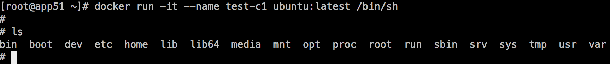

# **Docker镜像存储-overlayfs**

##  一、概述

　　Docker中的镜像采用分层构建设计，每个层可以称之为“layer”，这些layer被存放在了/var/lib/docker/<storage-driver>/目录下，这里的storage-driver可以有很多种如:AUFS、OverlayFS、VFS、Brtfs等。可以通过docker info命令查看存储驱动，（笔者系统是centos7.4）：


通常ubuntu类的系统默认采用的是AUFS，centos7.1+系列采用的是OverlayFS。而本文将介绍以OverlayFS作为存储驱动的镜像存储原理以及存储结构。

## 二、OverlayFS

### 介绍

　　OverlayFS是一种堆叠文件系统，它依赖并建立在其它的文件系统之上（例如ext4fs和xfs等等），并不直接参与磁盘空间结构的划分，仅仅将原来底层文件系统中不同的目录进行“合并”，然后向用户呈现，这也就是联合挂载技术，对比于AUFS，OverlayFS速度更快，实现更简单。 而Linux 内核为Docker提供的OverlayFS驱动有两种：overlay和overlay2。而overlay2是相对于overlay的一种改进，在inode利用率方面比overlay更有效。但是overlay有环境需求：docker版本17.06.02+，宿主机文件系统需要是ext4或xfs格式。

### 联合挂载

　　 overlayfs通过三个目录：lower目录、upper目录、以及work目录实现，其中lower目录可以是多个，work目录为工作基础目录，挂载后内容会被清空，且在使用过程中其内容用户不可见，最后联合挂载完成给用户呈现的统一视图称为为merged目录。以下使用mount将演示其如何工作的。

 使用mount命令挂载overlayfs语法如下：

```
mount -t overlay overlay -o lowerdir=lower1:lower2:lower3,upperdir=upper,workdir=work merged_dir
```

创建三个目录A、B、C,以及worker目录：


然后使用mount联合挂载到/tmp/test 下：


然后我们再去查看/tmp/test目录，你会发现目录A、B、C被合并到了一起,并且相同文件名的文件会进行“覆盖”，这里覆盖并不是真正的覆盖，而是当合并时候目录中两个文件名称都相同时，merged层目录会显示离它最近层的文件：


同时我们还可以通过mount命令查看其挂载的选项：


以上这样的方式也就是联合挂载技术。

### Docker中的overlay驱动

　　介绍了overlay驱动原理以后再来看Docker中的overlay存储驱动，以下是来自docker官网关于overlay的工作原理图：


在上述图中可以看到三个层结构，即：lowerdir、uperdir、merged，其中lowerdir是只读的image layer，其实就是rootfs，对比我们上述演示的目录A和B，我们知道image layer可以分很多层，所以对应的lowerdir是可以有多个目录。而upperdir则是在lowerdir之上的一层，这层是读写层，在启动一个容器时候会进行创建，所有的对容器数据更改都发生在这里层，对比示例中的C。最后merged目录是容器的挂载点，也就是给用户暴露的统一视角，对比示例中的/tmp/test。而这些目录层都保存在了/var/lib/docker/overlay2/或者/var/lib/docker/overlay/(如果使用overlay)。

### 演示

启动一个容器



查看其overlay挂载点,可以发现其挂载的merged目录、lowerdir、upperdir以及workdir：


overlay2的lowerdir可以有多个，并且是软连接方式挂载，后续我们会进行说明。 


### 如何工作

当容器中发生数据修改时候overlayfs存储驱动又是如何进行工作的？以下将阐述其读写过程：

读：

- 如果文件在容器层（upperdir），直接读取文件；
- 如果文件不在容器层（upperdir），则从镜像层（lowerdir）读取；

修改：

- 首次写入： 如果在upperdir中不存在，overlay和overlay2执行copy_up操作，把文件从lowdir拷贝到upperdir，由于overlayfs是文件级别的（即使文件只有很少的一点修改，也会产生的copy_up的行为），后续对同一文件的在此写入操作将对已经复制到容器的文件的副本进行操作。这也就是常常说的写时复制（copy-on-write）
- 删除文件和目录： 当文件在容器被删除时，在容器层（upperdir）创建whiteout文件，镜像层(lowerdir)的文件是不会被删除的，因为他们是只读的，但without文件会阻止他们显示，当目录在容器内被删除时，在容器层（upperdir）一个不透明的目录，这个和上面whiteout原理一样，阻止用户继续访问，即便镜像层仍然存在。 


注意事项

1. copy_up操作只发生在文件首次写入，以后都是只修改副本,
2. overlayfs只适用两层目录，,相比于比AUFS，查找搜索都更快。
3. 容器层的文件删除只是一个“障眼法”，是靠whiteout文件将其遮挡,image层并没有删除，这也就是为什么使用docker commit 提交保存的镜像会越来越大，无论在容器层怎么删除数据，image层都不会改变。 

## 三、overlay2镜像存储结构

从仓库pull一个ubuntu镜像，结果显示总共拉取了4层镜像如下：


此时4层被存储在了/var/lib/docker/overlay2/目录下：


这里面多了一个l目录包含了所有层的软连接，短链接使用短名称，避免mount时候参数达到页面大小限制（演示中mount命令查看时候的短目录）：


处于底层的镜像目录包含了一个diff和一个link文件，diff目录存放了当前层的镜像内容，而link文件则是与之对应的短名称：


在这之上的镜像还多了work目录和lower文件，lower文件用于记录父层的短名称，work目录用于联合挂载指定的工作目录。而这些目录和镜像的关系是怎么组织在的一起呢？答案是通过元数据关联。元数据分为image元数据和layer元数据。 

### image元数据

　　镜像元数据存储在了/var/lib/docker/image/<storage_driver>/imagedb/content/sha256/目录下，名称是以镜像ID命名的文件，镜像ID可通过docker images查看，这些文件以json的形式保存了该镜像的rootfs信息、镜像创建时间、构建历史信息、所用容器、包括启动的Entrypoint和CMD等等。例如ubuntu镜像的id为47b19964fb50:


查看其对应的元数据(使用vim :%!python -m json.tool格式化成json) 截取了其rootfs的构成：


上面的 diff_id 对应的的是一个镜像层，其排列也是有顺序的，从上到下依次表示镜像层的最低层到最顶层：


diff_id如何关联进行层？具体说来，docker 利用 rootfs 中的每个diff_id 和历史信息计算出与之对应的内容寻址的索引(chainID) ，而chaiID则关联了layer层，进而关联到每一个镜像层的镜像文件。

### layer元数据


　　layer 对应镜像层的概念，在 docker 1.10 版本以前，镜像通过一个 graph 结构管理，每一个镜像层都拥有元数据，记录了该层的构建信息以及父镜像层 ID，而最上面的镜像层会多记录一些信息作为整个镜像的元数据。graph 则根据镜像 ID(即最上层的镜像层 ID) 和每个镜像层记录的父镜像层 ID 维护了一个树状的镜像层结构。

　　在 docker 1.10 版本后，镜像元数据管理巨大的改变之一就是简化了镜像层的元数据，镜像层只包含一个具体的镜像层文件包。用户在 docker 宿主机上下载了某个镜像层之后，docker 会在宿主机上基于镜像层文件包和 image 元数据构建本地的 layer 元数据，包括 diff、parent、size 等。而当 docker 将在宿主机上产生的新的镜像层上传到 registry 时，与新镜像层相关的宿主机上的元数据也不会与镜像层一块打包上传。

　　Docker 中定义了 Layer 和 RWLayer 两种接口，分别用来定义只读层和可读写层的一些操作，又定义了 roLayer 和 mountedLayer，分别实现了上述两种接口。其中，roLayer 用于描述不可改变的镜像层，mountedLayer 用于描述可读写的容器层。具体来说，roLayer 存储的内容主要有索引该镜像层的 chainID、该镜像层的校验码 diffID、父镜像层 parent、storage_driver 存储当前镜像层文件的 cacheID、该镜像层的 size 等内容。这些元数据被保存在 /var/lib/docker/image/<storage_driver>/layerdb/sha256/<chainID>/ 文件夹下。如下： 


每个chainID目录下会存在三个文件cache-id、diff、zize：

cache-id文件：

docker随机生成的uuid，内容是保存镜像层的目录索引，也就是/var/lib/docker/overlay2/中的目录，这就是为什么通过chainID能找到对应的layer目录。以chainID为d801a12f6af7beff367268f99607376584d8b2da656dcd8656973b7ad9779ab4 对应的目录为 130ea10d6f0ebfafc8ca260992c8d0bef63a1b5ca3a7d51a5cd1b1031d23efd5,也就保存在/var/lib/docker/overlay2/130ea10d6f0ebfafc8ca260992c8d0bef63a1b5ca3a7d51a5cd1b1031d23efd5


 

diff文件：

保存了镜像元数据中的diff_id（与元数据中的diff_ids中的uuid对应）


size文件：

保存了镜像层的大小


在 layer 的所有属性中，diffID 采用 SHA256 算法，基于镜像层文件包的内容计算得到。而 chainID 是基于内容存储的索引，它是根据当前层与所有祖先镜像层 diffID 计算出来的，具体算如下：

- 如果该镜像层是最底层(没有父镜像层)，该层的 diffID 便是 chainID。
- 该镜像层的 chainID 计算公式为 chainID(n)=SHA256(chain(n-1) diffID(n))，也就是根据父镜像层的 chainID 加上一个空格和当前层的 diffID，再计算 SHA256 校验码。 


mountedLayer 信息存储的可读init层以及容器挂载点信息包括：容器 init 层ID（init-id）、联合挂载使用的ID（mount-id）以及容器层的父层镜像的 chainID(parent)。相关文件位于/var/lib/docker/image/<storage_driver>/layerdb/mounts/<container_id>/ 目录下。

如下启动一个id为3c96960b3127的容器: 

 查看其对应的mountedLayer三个文件：


可以看到initID是在mountID后加了一个-init，同时initID就是存储在/var/lib/docker/overlay2/的目录名称：


查看mountID还可以直接通过mount命令查看对应挂载的mountID，对应着/var/lib/docker/overlay2/目录，这也是overlayfs呈现的merged目录:


在容器中创建了一文件：


此时到宿主的merged目录就能看到对应的文件：


### 关于init层

　　init层是以一个uuid+-init结尾表示，夹在只读层和读写层之间，作用是专门存放/etc/hosts、/etc/resolv.conf等信息，需要这一层的原因是当容器启动时候，这些本该属于image层的文件或目录，比如hostname，用户需要修改，但是image层又不允许修改，所以启动时候通过单独挂载一层init层，通过修改init层中的文件达到修改这些文件目的。而这些修改往往只读当前容器生效，而在docker commit提交为镜像时候，并不会将init层提交。该层文件存放的目录为/var/lib/docker/overlay2/<init_id>/diff 

### 小结 


通过以上的内容介绍，一个容器完整的层应由三个部分组成，如下图：

1. 镜像层：也称为rootfs，提供容器启动的文件系统 
2. init层： 用于修改容器中一些文件如/etc/hostname、/etc/resolv.conf等
3. 容器层：使用联合挂载统一给用户提供的可读写目录。 

****

## 四、总结

　　本文介绍了以overlayfs作为存储驱动的的镜像存储原理其中每层的镜像数据保存在/var/lib/docker/overlay2/<uuid>/diff目录下，init层数据保存了在 /var/lib/docker/overlay2/<init-id>/diff目录下，最后统一视图（容器层）数据在 /var/lib/docker/overlay2/<mount_id>/diff目录下，docker通过image元数据和layer元数据利用内容寻址（chainID）将这些目录组织起来构成容器所运行的文件系统。