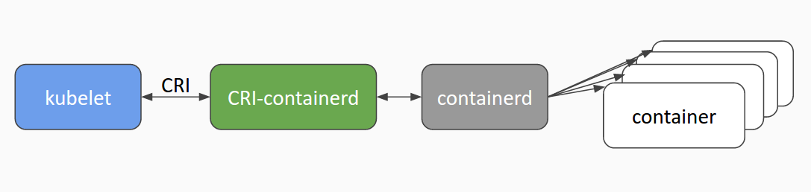
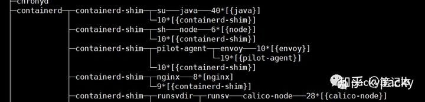
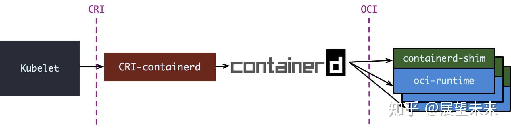
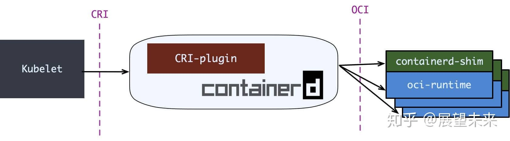
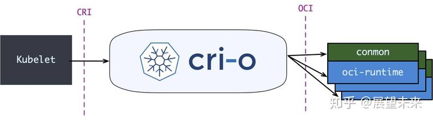

## 容器运行时

### 何为容器运行时

容器运行时顾名思义就是要掌控容器运行的整个生命周期，以 docker 为例，其作为一个整体的系统，主要提供的功能如下：

- 制定容器镜像格式
- 构建容器镜像 `docker build`
- 管理容器镜像 `docker images`
- 管理容器实例 `docker ps`
- 运行容器 `docker run`
- 实现容器镜像共享 `docker pull/push`

然而这些功能均可由小的组件单独实现，且没有相互依赖。而后 Docker 公司与 CoreOS 和 Google 共同创建了 OCI (Open Container Initial)，并提供了两种规范：

- 运行时规范([https://github.com/opencontainers/runtime-spec](https://link.zhihu.com/?target=https%3A//github.com/opencontainers/runtime-spec))
  描述如何运行`filesystem bundle`
- 镜像规范([https://github.com/opencontainers/image-spec](https://link.zhihu.com/?target=https%3A//github.com/opencontainers/image-spec))
  制定镜像格式、操作等

> filesystem bundle(文件系统束): 定义了一种将容器编码为文件系统束的格式，即以某种方式组织的一组文件，并包含所有符合要求的运行时对其执行所有标准操作的必要数据和元数据，即config.json 与 根文件系统。

而后，Docker、Google等开源了用于运行容器的工具和库 runc，作为 OCI 的一种实现参考。在此之后，各种运行时工具和库也慢慢出现，例如 rkt、containerd、cri-o 等，然而这些工具所拥有的功能却不尽相同，有的只有运行容器(runc、lxc)，而有的除此之外也可以对镜像进行管理(containerd、cri-o)。目前较为流行的说法是将容器运行时分成了 low-level 和 high-level 两类。

low-level: 指的是仅关注运行容器的容器运行时，调用操作系统，使用 namespace 和 cgroup 实现资源隔离和限制。high-level: 指包含了更多上层功能，例如 grpc调用，镜像存储管理等。

不同工具的关系如下图：


### low-level runtime

low-level runtime 关注如何与操作系统交互，创建并运行容器。目前常见的 low-level runtime有：

- lmctfy -- 是Google的一个项目，它是Borg使用的容器运行时
- runc -- 目前使用最广泛的容器运行时。它最初是作为Docker的一部分开发的，后来被提取出来作为一个单独的工具和库。其实现了 OCI 规范，包含config.json文件和容器的根文件系统。
- rkt -- CoreOS开发的Docker/runc的一个流行替代方案，提供了其他 low-level runtimes (如runc)所提供的所有特性。

容器在 linux 中使用 namesapce 实现资源隔离，使用 cgroup 实现资源限制，这部分在[k8s基础--容器篇](https://link.zhihu.com/?target=https%3A//packyzbq.coding.me/k8s-learning-1.html)中对原理详细介绍，此处不做赘述。这里我们详细介绍下如何创建一个简单的 runtime。

我们以 busybox 镜像作为运行时的一个根文件系统，首先创建一个临时目录并将 busybox 中的所有文件解压缩到目录中

```text
CID=$(docker create busybox)
ROOTFS=$(mktemp -d)
docker export $CID | tar -xf - -C $ROOTFS
```

限制我们需要创建 cgroup 对内存和cpu进行限制

```text
UUID=$(uuidgen)
cgcreate -g cpu,memory:$UUID
# 内存限制设置为 100MB
cgset -r memory.limit_in_bytes=100000000 $UUID
# cpu 限制设置为 512m
cgset -r cpu.shares=512 $UUID
```

上面 `cpu.shares` 是相对于同时运行的其他进程的CPU。单独运行的容器可以使用整个CPU，但是如果其他容器正在运行，它们会按照比例分配cpu资源。除此以外，还可以对cpu内核数量的使用进行限制：

```text
# 设置检查CPU使用情况的频率，单位是微秒
cgset -r cpu.cfs_period_us=1000000 $UUID
# 设置任务在一个时间段内在一个核心上运行的时间量，单位是微秒
cgset -r cpu.cfs_quota_us=2000000 $UUID
```

然后我们使用 `unshare` 命令在 cgroug 中执行命令，它可以实现 namespace 的隔离。

```text
cgexec -g cpu,memory:$UUID \
>     unshare -uinpUrf --mount-proc \
>     sh -c "/bin/hostname $UUID && chroot $ROOTFS /bin/sh"
/ echo "Hello from in a container"
Hello from in a container
```

最后，在执行结束后，通过下面的指令清理环境

```text
cgdelete -r -g cpu,memory:$UUID
rm -r $ROOTFS
```

> 这一部分的实践，主要参考自文章 [https://www.ianlewis.org/en/container-runtimes-part-2-anatomy-low-level-contai](https://link.zhihu.com/?target=https%3A//www.ianlewis.org/en/container-runtimes-part-2-anatomy-low-level-contai)


### high-level runtime

High-level runtimes相较于low-level runtimes位于堆栈的上层。low-level runtimes负责实际运行容器，而High-level runtimes负责传输和管理容器镜像，解压镜像，并传递给low-level runtimes来运行容器。目前主流的 high-level runtime 有：

- docker
- containerd
- rkt

这里我们以 containerd 为例具体解析整个架构以及工作原理。


## container

首先说的是**container**容器。随着docker的大热，docker的经典图标，一条鲸鱼拖着若干个集装箱的经典形象已经深入人心。docker中container的翻译是译为容器还是集装箱，中文社区做过一次小小的讨论。[讨论参见http://dockone.io/question/408](http://dockone.io/question/408)。在这次讨论中，笔者的意见是container并不是docker出现了才有的，而在之前，linux container就已经翻译为linux容器并被大家接受。而从含义来看，一开始选定把“容器”作为container的翻译，也应该是准确的。而随着docker出现，container的概念深入人心，而其与原来的linux container中的container，含义应该说是一致的。所以沿用容器的翻译，笔者认为是比较合适的。

那么何为容器。容器本质上是受到资源限制，彼此间相互隔离的若干个linux进程的集合。这是有别于基于模拟的虚拟机的。对于容器和虚拟机的区别的理解，大家可以参考《京东基础架构建设之路》中的阐释，这里不再赘述。一般来说，容器技术主要指代用于资源限制的cgroup，用于隔离的namespace，以及基础的linux kernel等。

## OCI

**Open Container Initiative**，也就是常说的**OCI**，是由多家公司共同成立的项目，并由linux基金会进行管理，致力于container runtime的标准的制定和runc的开发等工作。

所谓**container runtime**，主要负责的是容器的生命周期的管理。oci的runtime spec标准中对于容器的状态描述，以及对于容器的创建、删除、查看等操作进行了定义。

**runc**，是对于OCI标准的一个参考实现，是一个可以用于创建和运行容器的CLI(command-line interface)工具。runc直接与容器所依赖的cgroup/linux kernel等进行交互，负责为容器配置cgroup/namespace等启动容器所需的环境，创建启动容器的相关进程。

为了兼容oci标准，docker也做了架构调整。将容器运行时相关的程序从docker daemon剥离出来，形成了**containerd**。Containerd向docker提供运行容器的API，二者通过grpc进行交互。containerd最后会通过runc来实际运行容器。


## 容器引擎

容器引擎，或者说容器平台，不仅包含对于容器的生命周期的管理，还包括了对于容器生态的管理，比如对于镜像等。现在的docker、rkt以及阿里推出的pouch均可属于此范畴。

docker，笔者认为可以分为两个阶段来理解。在笔者接触docker之初，docker版本为1.2，当时的docker的主要作用是容器的生命周期管理和镜像管理，当时的docker在功能上更趋近于现在的container runtime。而后来，随着docker的发展，docker就不再局限于容器的管理，还囊括了存储(volume)、网络(net)等的管理，因此后来的docker更多的是一个容器及容器生态的管理平台。

## kubernetes与容器

kubernetes在初期版本里，就对多个容器引擎做了兼容，因此可以使用docker、rkt对容器进行管理。以docker为例，kubelet中会启动一个docker manager，通过直接调用docker的api进行容器的创建等操作。

在k8s 1.5版本之后，kubernetes推出了自己的运行时接口api–**CRI**(container runtime interface)。cri接口的推出，隔离了各个容器引擎之间的差异，而通过统一的接口与各个容器引擎之间进行互动。

与oci不同，cri与kubernetes的概念更加贴合，并紧密绑定。cri不仅定义了容器的生命周期的管理，还引入了k8s中pod的概念，并定义了管理pod的生命周期。在kubernetes中，pod是由一组进行了资源限制的，在隔离环境中的容器组成。而这个隔离环境，称之为**PodSandbox**。在cri开始之初，主要是支持docker和rkt两种。其中kubelet是通过cri接口，调用docker-shim，并进一步调用docker api实现的。

如上文所述，docker独立出来了containerd。kubernetes也顺应潮流，孵化了**cri-containerd**项目，用以将containerd接入到cri的标准中。



为了进一步与oci进行兼容，kubernetes还孵化了**cri-o**，成为了架设在cri和oci之间的一座桥梁。通过这种方式，可以方便更多符合oci标准的容器运行时，接入kubernetes进行集成使用。可以预见到，通过cri-o，kubernetes在使用的兼容性和广泛性上将会得到进一步加强。


## containerd-shim

containerd-shim 是 containerd 的一个组件，主要是用于剥离 containerd 守护进程与容器进程。containerd 通过 shim 调用 runc 的包函数来启动容器。当我们执行 `pstree` 命令时，可以看到如下的进程关系：



引入shim，允许runc 在创建和运行容器之后退出，并将 shim 作为容器的父进程，而不是 containerd 作为父进程，这样做的目的是当 containerd 进程挂掉，由于 shim 还正常运行，因此可以保证容器不受影响。此外，shim 也可以收集和报告容器的退出状态，不需要 containerd 来 wait 容器进程。

当我们有需求去替换 runc 运行时工具库时，例如替换为安全容器 kata container 或 Google 研发的 gViser，则需要增加对应的shim([kata-shim](https://link.zhihu.com/?target=https%3A//github.com/kata-containers/shim)等)，以上两者均有自己实现的 shim。

目前已有 shim v1 和 shim v2 两个版本，至于 K8s 如何使用 CRI 与 containerd 和 shim 交互，这部分将在下一篇博文中介绍。


### CRI

kubernetes在初期版本里，就对多个容器引擎做了兼容，因此可以使用docker、rkt对容器进行管理。以docker为例，kubelet中会启动一个docker manager，通过直接调用docker的api进行容器的创建等操作。

kubelet做适配的问题，就是容器项目每次升级更新，kubelet都需要相应的进行配合变更测试，很多api可能这一版能用，下一版就不能用了，由于容器项目一直在高速迭代，k8项目组苦不堪言。痛定思痛后，sig-node项目组在k8s 1.5版本之后，推出了自己的运行时接口api--CRI(container runtime interface)。cri接口的推出，隔离了各个容器引擎之间的差异，而通过统一的接口与各个容器引擎之间进行互动。

与oci不同，cri与kubernetes的概念更加贴合，并紧密绑定。cri不仅定义了容器的生命周期的管理，还引入了k8s中pod的概念，并定义了管理pod的生命周期。在kubernetes中，pod是由一组进行了资源限制的，在隔离环境中的容器组成。而这个隔离环境，称之为PodSandbox。在cri开始之初，主要是支持docker和rkt两种。其中kubelet是通过cri接口，调用docker-shim，并进一步调用docker api实现的。

如上文所述，docker独立出来了containerd。kubernetes也顺应潮流，孵化了cri-containerd项目，用以将containerd接入到cri的标准中。


## **containerd 和 CRI-O**

我们在第一节就看到现在的 runtime 实在是有点复杂了, 而复杂是万恶之源, 于是就有了直接拿 containerd 做 oci-runtime 的方案. 当然, 除了 k8s 之外, containerd 还要接诸如 Swarm 等调度系统, 因此它不会去直接实现 CRI, 这个适配工作当然就要交给一个 shim 了.

containerd 1.0 中, 对 CRI 的适配通过一个单独的进程 `CRI-containerd`来完成:



containerd 1.1 中做的又更漂亮一点, 砍掉了 CRI-containerd 这个进程, 直接把适配逻辑作为插件放进了 containerd 主进程中:



但在 containerd 做这些事情之情, 社区就已经有了一个更为专注的 cri-runtime: CRI-O, 它非常纯粹, 就是兼容 CRI 和 OCI, 做一个 k8s 专用的运行时:



其中 `conmon` 就对应 containerd-shim, 大体意图是一样的.

CRI-O 和 (直接调用)containerd 的方案比起默认的 dockershim 确实简洁很多, 但没啥生产环境的验证案例, 我所知道的仅仅是 containerd 在 GKE 上是 beta 状态. 因此假如你对 docker 没有特殊的政治恨意, 大可不必把 dockershim 这套换掉.