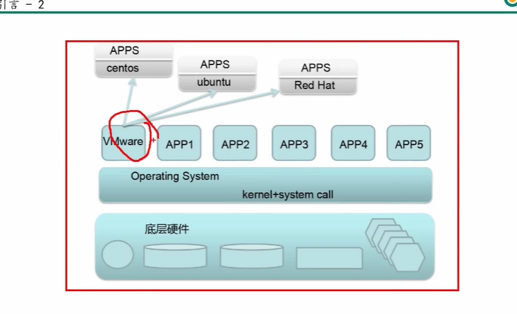
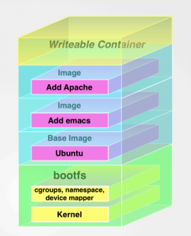
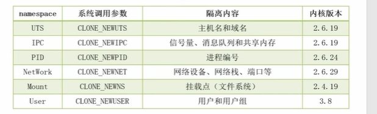

## 虚拟化

当前虚拟化形式

### docker 与传统虚拟化对比

  

### docker 虚拟化基础技术

1、namespace

2、cgroup

3、unionfs

bootfs ：

Linux的bootfs主要有bootloader和kernel，bootloader作用主要是加载kernel，

rootfs：

### overlay 的分层方式

### docker image 的分层方式

### runc

