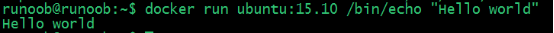
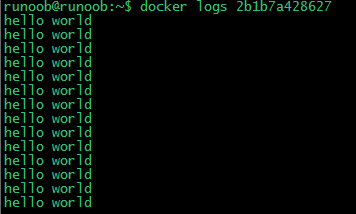
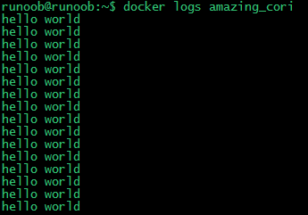
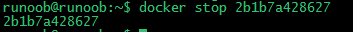

## Docker 常用命令

### docker 提供基础的基础命令如下：

docker 基础命令：

- load ： 从一个tar 包中加载镜像
- export：将一个镜像容器打成一个tar包
- commit ：
- diff: 在启动容器后修改过的目录文件
- info : docker 的基本信息
- logs：查看容器的日志信息
- port：查看容器的端口
- push：将镜像推送到远程镜像仓库
- rm 删除容器
- stats ：查看当前容器的状态，cpu、内存等
- system：查看当前docker 的信息以及占用磁盘信息等
- trust：
- version：docker 当前的版本
- build ：根据dockerfile 构建镜像
- cp：复制容器
- rename 重命名容器
- events：
- images ：查看镜像
- inspect 查看当前容器的信息
- login：登录远程仓库
- mainfest：修改容器构建时的MANIFEST指令
- pause 暂停容器
- ps ：查看启动的容器
- rmi: 删除镜像
- search ：从远程仓库查找镜像
- stop：停止容器
- tag：给镜像设置新的tag标签
- unpause：恢复停止的容器
- volume：管理容器的存储卷
- conatiner：容器相关命令
- exec ：进入到容器内部
- history：查看 image 的分层
- import ：
- kill ： 关闭容器
- logout：登出远程仓库
- network ：查看网络相关信息
- plugin：
- pull：从远程拉取镜像
- restart：重启容器
- run：根据当前镜像 构建（启动）一个容器
  -  --restart = always 容器的自动启动
  - -h x.xx.xx 设置容器的主机名称
  - -- dns xx.xx.xx.xx 设置容器使用的 DNS 服务器
  - -- dns-search DNS 搜索设置
  - --add-host hostname：IP 注入 hostname<> IP 解析
  - --rm 服务停止时自动删除
- top：
- update
- wait： 等待容器关闭
- update：更改cpu 网络io 内存等资源限制

docker swarm 命令：

- secret
- service
- node
- config
- swarm
- stack


### docker 基础入门

#### Hello world

Docker 允许你在容器内运行应用程序， 使用 **docker run** 命令来在容器内运行一个应用程序。

输出Hello world

```
runoob@runoob:~$ docker run ubuntu:15.10 /bin/echo "Hello world"
Hello world
```



各个参数解析：

- **docker:** Docker 的二进制执行文件。
- **run:** 与前面的 docker 组合来运行一个容器。
- **ubuntu:15.10** 指定要运行的镜像，Docker 首先从本地主机上查找镜像是否存在，如果不存在，Docker 就会从镜像仓库 Docker Hub 下载公共镜像。
- **/bin/echo "Hello world":** 在启动的容器里执行的命令


#### 运行交互式的容器

我们通过 docker 的两个参数 -i -t，让 docker 运行的容器实现**"对话"**的能力：

```
runoob@runoob:~$ docker run -i -t ubuntu:15.10 /bin/bash
root@0123ce188bd8:/#
```

各个参数解析：

- **-t:** 在新容器内指定一个伪终端或终端。
- **-i:** 允许你对容器内的标准输入 (STDIN) 进行交互。

注意第二行 **root@0123ce188bd8:/#**，此时我们已进入一个 ubuntu15.10 系统的容器

我们尝试在容器中运行命令 **cat /proc/version**和**ls**分别查看当前系统的版本信息和当前目录下的文件列表

```
root@0123ce188bd8:/#  cat /proc/version
Linux version 4.4.0-151-generic (buildd@lgw01-amd64-043) (gcc version 5.4.0 20160609 (Ubuntu 5.4.0-6ubuntu1~16.04.10) ) #178-Ubuntu SMP Tue Jun 11 08:30:22 UTC 2019
root@0123ce188bd8:/# ls
bin  boot  dev  etc  home  lib  lib64  media  mnt  opt  proc  root  run  sbin  srv  sys  tmp  usr  var
root@0123ce188bd8:/# 
```

我们可以通过运行 exit 命令或者使用 CTRL+D 来退出容器。

```
root@0123ce188bd8:/#  exit
exit
root@runoob:~# 
```

注意第三行中 **root@runoob:~#** 表明我们已经退出了当前的容器，返回到当前的主机中。


#### 启动容器（后台模式）

使用以下命令创建一个以进程方式运行的容器

```
runoob@runoob:~$ docker run -d ubuntu:15.10 /bin/sh -c "while true; do echo hello world; sleep 1; done"
2b1b7a428627c51ab8810d541d759f072b4fc75487eed05812646b8534a2fe63
```

在输出中，我们没有看到期望的 "hello world"，而是一串长字符

**2b1b7a428627c51ab8810d541d759f072b4fc75487eed05812646b8534a2fe63**

这个长字符串叫做容器 ID，对每个容器来说都是唯一的，我们可以通过容器 ID 来查看对应的容器发生了什么。

首先，我们需要确认容器有在运行，可以通过 **docker ps** 来查看：

```
runoob@runoob:~$ docker ps
CONTAINER ID        IMAGE                  COMMAND              ...  
5917eac21c36        ubuntu:15.10           "/bin/sh -c 'while t…"    ...
```

输出详情介绍：

**CONTAINER ID:** 容器 ID。

**IMAGE:** 使用的镜像。

**COMMAND:** 启动容器时运行的命令。

**CREATED:** 容器的创建时间。

**STATUS:** 容器状态。

状态有7种：

- created（已创建）
- restarting（重启中）
- running 或 Up（运行中）
- removing（迁移中）
- paused（暂停）
- exited（停止）
- dead（死亡）

**PORTS:** 容器的端口信息和使用的连接类型（tcp\udp）。

**NAMES:** 自动分配的容器名称。

在宿主主机内使用 **docker logs** 命令，查看容器内的标准输出：

```
runoob@runoob:~$ docker logs 2b1b7a428627
```



```
runoob@runoob:~$ docker logs amazing_cori
```




#### 停止容器

我们使用 **docker stop** 命令来停止容器:



通过 **docker ps** 查看，容器已经停止工作:

```
runoob@runoob:~$ docker ps
```

可以看到容器已经不在了。

也可以用下面的命令来停止:

```
runoob@runoob:~$ docker stop amazing_cori
```


### docker 基础命令

### docker run

-i   交互式操作。 

-t 中断

-d 

```
docker run -it ubuntu /bin/bash

-i: 交互式操作。
-t: 终端。
ubuntu: ubuntu 镜像。
/bin/bash：放在镜像名后的是命令，这里我们希望有个交互式 Shell，因此用的是 /bin/bash。

```


docker stats 

查看镜像

docker pull 拉取镜像


1、运行容器的执行执行命令

docker run container-name /bin/echo "Hello world"

2\


### 镜像命令


### 容器命令

docker ps 

-a 查看所有容器

docker statr 启动容器

docker stop 

docker restart

docker exec

docker attch


### docker 网络命令


### docker 日志命令

