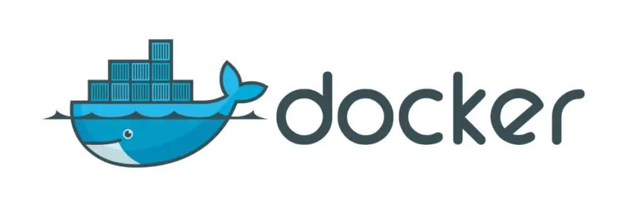
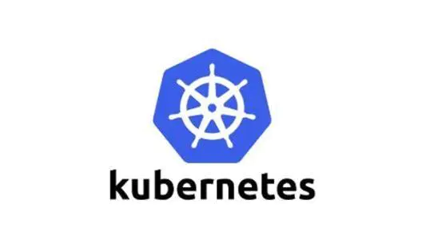

# Docker的历史与发展

# 很久以前

2008年，Solomon Hykes 和他的朋友 Kamel Founadi、Sebastien Pahl 共同创立了一家名为 DotCloud 的公司，目标是利用一种叫做容器的技术来创建他们称作是“大规模的创新工具”：任何人都可以使用的编程工具。

2010年，dotCloud获得了创业孵化器Y Combinator的支持，并开始吸引到一些真正的投资，在接下来的3年中，dotCloud内部孵化了一款名为Docker的产品。

# 2013年

2013 年 3 月 Docker 创始人 Solomon Hykes 在 PyCon 大会上的演讲中首次公开介绍了 Docker 这一产品。在2013 年 PyCon 大会之后，Docker 的创新式镜像格式以及容器运行时迅速成为社区、客户和更广泛行业的实际标准和基石。Docker 的强大之处在于它通过可移植的形式和易于使用的工具在应用程序和基础设施之间创造了独立性。其结果是，Docker将容器技术大众化，并解决了困扰数百万开发人员的“matrix from hell”问题，使容器技术成为主流。

docker-logo.jpg

2013年3月20日，dotCloud发布了 Docker 的首个版本，并将Docker源码进行开源。[https://github.com/docker](https://links.jianshu.com/go?to=https%3A%2F%2Fgithub.com%2Fdocker)/

2013年9月 红帽公司成为Docker的主要合作伙伴，利用Docker来驱动他的OpenShift云业务。随后，谷歌、亚马逊以及DigitalOcean也迅速的在其云服务平台提供了Docker的支持。主流云厂商的加入，加速Docker的发展进度。

随着Docker技术的开源，此项技术能够将Linux容器中的应用代码打包并轻松的在服务器之间迁移，Docker技术瞬时的风靡了全球，2013年底DotCloud Inc则更名为Docker Inc，并全力的主攻到Docker项目开发中。

# 2014年

2014年6月的DockerCon大会上Docker正式发布了Docker 1.0 版本。这也意味着Docker的稳定性和可靠性已经基本满足了生产环境的运行需求。会议上同时发布Docker Image的镜像仓库Docker Hub（[http://hub.docker.com/](https://links.jianshu.com/go?to=http%3A%2F%2Fhub.docker.com%2F)），并指出已经有超过14,000个Docker化的应用存储在他们的publc registry中。

也是同样的2014年6月，基于谷歌内部强大的Borg系统而开发出来的kubernetes横空处世，刷新了人们对容器的理解。

k8s-logo.jpg

2014年8月份，Docker Inc宣布将用于PaaS业务服务的DotCloud软件出售给德国柏林的PaaS服务厂商CloudControl，自此以后，DotCloud正式的和Docker分道扬镳了。

2014年12月举行的DockerConEU大会上，Docker Swarm 和Docker Machine同时面世。Docker Swarm是一个Docker集群管理工具，而Docker Machine是部署Docker主机的命令工具。

2014年12月里，CoreOS宣布开发自家的容器运行环境rkt以及appc容器规范。

# 2015年

容器技术不只Docker，很早之前Google就投资了CoreOS来做竞争的容器--Rocket。那时是三家鼎立：Docker/Rocket/Warden，为了避免惨烈的竞争，大家终于统一意见，决定成立固定的标准来良好发展容器技术。

2015年6月，由Docker、IBM、微软、红帽及Google等厂商所组成的开放容器项目OCP联盟成立，该项目旨在建立软件容器的通用标准。OCP成立于Linux基金会之下，其使命是使用户和公司能够继续创新和开发基于容器的解决方案，并充满信心地保护其先前的开发工作，并且不会造成行业分散。作为该计划的一部分，Docker将捐赠其软件容器格式，运行时以及相关规范的代码。应用容器规范（“ appc”）计划的领导者，包括创始成员CoreOS，也将把他们的技术领导力和支持带到OCP。

2015 年，Docker 发布了 runC工具，runc是根据OCI标准生成的一个cli工具，一个轻量级的跨平台的容器运行时命令行小工具，可以直接利用 libcontainer 运行容器，而无需通过 docker engine。runC 的目标是使标准容器在任何地方都可用。

# 2016年

2016年6月的DockerCon上，Docker宣布了Open Container Initiative的正式成立。OCI意在业界一起合作，开发一个开放的、标准的容器格式和runtime。OCI也属于Linux基金会的协作项目，一直秉承着开放的模式来管理，其roadmap在GitHub上，大家都可以看到并参与进去：[https://github.com/opencontainers/specs/blob/master/ROADMAP.md](https://links.jianshu.com/go?to=https%3A%2F%2Fgithub.com%2Fopencontainers%2Fspecs%2Fblob%2Fmaster%2FROADMAP.md)

oci-logo.png

2016年，OCI标准制定后，Docker 将 containerd 独立拆分，并将其捐赠给了社区。将这个组件分解为一个单独的项目，使得 docker 将容器的管理功能移出 docker 的核心引擎并移入一个单独的守护进程(即 containerd)。

在2016年，人们认识到容器技术本身的价值时在于容器的编排，而此时的Docker项目令人惊讶的放弃了Swarm项目，而是想将容器的编排和集群的管理功能添加到Docker项目当中。而Kubernetes却与Docker不同的是推进民主化架构，使得通过暴露Kubernetes API的方法，让更多的人来不断丰富kubernetes的插件。

# 2017年

从2013年3月开始推出0.1.0版本，到17年2月1.13的版本都采用x.x的形式。从 2017 年第一季度开始，Docker 版本号遵循 YY.MM-xx 格式。

2017 年是容器成为主流技术的一年，这就是为什么 Docker 在 Linux 之外支持众多平台的原因（Docker for Mac，Docker for Windows，Docker for AWS，GCP 等）。

2017 年于 Austin 举办的 DockerCon 上开源Docker项目正式命名为 Moby 项目。由于这次改名，GitHub 上的 docker/docker 库也被转移到了 moby/moby，并且拥有了项目自己的 Logo，如下图所示。

moby-logo.png

于此同时，将Docker本身拆分为Docker-CE免费版和Docker-EE商业版。

Docker-CE目前是docker公司维护的开源项目，是一个基于Moby项目的免费的容器产品。

Docker-EE目前是docker公司维护的闭源项目，是docker公司的商业产品。

至此，容器天下三分。其中Moby由社区维护，Docker-CE由Docker公司维护，Docker-EE是Docker公司闭源的商业产品。

# 2018年

2018年3月 Docker 公司创始人Solomon Hykes 在 Docker 博客上（[https://www.docker.com/blog/au-revoir/](https://links.jianshu.com/go?to=https%3A%2F%2Fwww.docker.com%2Fblog%2Fau-revoir%2F) 或者 [https://blog.csdn.net/dt763C/article/details/79752939](https://links.jianshu.com/go?to=https%3A%2F%2Fblog.csdn.net%2Fdt763C%2Farticle%2Fdetails%2F79752939)）宣布已正式从 Docker 公司离职，不再担任公司的日常运作工作。Solomon Hykes 表示，他未来的身份将是 Docker 的董事会成员、主要股东，以及 Docker 维护者，但不再负责担任公司的日常工作。

# 2019年及未来

2019年容器市场基本趋于稳定，一切都向着优化改进方向发展。Docker公司是底层容器引擎及运行时的。容器的编排进过几轮的激烈竞争，基本是GOOGLE的Kubernetes一家独大。

新的战斗已经由容器和编排的战场，逐渐迁移到应用领域。云原生CNCF将引领新的技术方向，微服务、ServcieMesh、Envoy、ServerLess等正在路上

[https://blog.csdn.net/thollych/article/details/102717701](https://links.jianshu.com/go?to=https%3A%2F%2Fblog.csdn.net%2Fthollych%2Farticle%2Fdetails%2F102717701)

[http://c.biancheng.net/view/3118.html](https://links.jianshu.com/go?to=http%3A%2F%2Fc.biancheng.net%2Fview%2F3118.html)

[https://www.linuxidc.com/Linux/2018-09/153977.htm](https://links.jianshu.com/go?to=https%3A%2F%2Fwww.linuxidc.com%2FLinux%2F2018-09%2F153977.htm)

[https://www.opencontainers.org/news](https://links.jianshu.com/go?to=https%3A%2F%2Fwww.opencontainers.org%2Fnews)