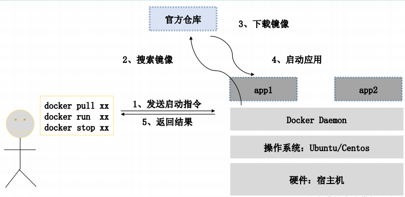
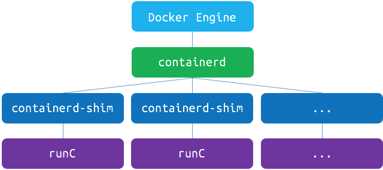

## Docker 基础概念

Docker 中主要有三大概念：镜像（Image），容器（Container），仓库（Repository） 

- **镜像（Image）**
  类似于虚拟机中的镜像，是一个包含有文件系统的面向Docker引擎的只读模板。任何应用程序运行都需要环境，而镜像就是用来提供这种运行环境的。例如一个Ubuntu镜像就是一个包含Ubuntu操作系统环境的模板，同理在该镜像上装上Apache软件，就可以称为Apache镜像。
- **容器（Container）**
  类似于一个轻量级的沙盒，可以将其看作一个极简的Linux系统环境（包括root权限、进程空间、用户空间和网络空间等），以及运行在其中的应用程序。Docker引擎利用容器来运行、隔离各个应用。容器是镜像创建的应用实例，可以创建、启动、停止、删除容器，各个容器之间是是相互隔离的，互不影响。注意：镜像本身是只读的，容器从镜像启动时，Docker在镜像的上层创建一个可写层，镜像本身不变。
- **仓库（Repository）**
  类似于代码仓库，这里是镜像仓库，是Docker用来集中存放镜像文件的地方。注意与注册服务器（Registry）的区别：注册服务器是存放仓库的地方，一般会有多个仓库；而仓库是存放镜像的地方，一般每个仓库存放一类镜像，每个镜像利用tag进行区分，比如Ubuntu仓库存放有多个版本（12.04、14.04等）的Ubuntu镜像。

### Docker 组成

Docker 使用客户端-服务器 (C/S) 架构模式。Docker 客户端会与 Docker 守护进程进行通信。Docker 守护进程会处理复杂繁重的任务，例如建立、运行、发布你的 Docker 容器。Docker 客户端和守护进程可以运行在同一个系统上，当然你也可以使用 Docker 客户端去连接一个远程的 Docker 守护进程。Docker 客户端和守护进程之间通过 socket 或者 RESTful API 进行通信。 如下图：

  

Docker 主要有三部分组成，分别为上面提到的：

- Docker client
- Docker server （也成为docker daemon 守护进程）
- Containered (容器运行时管理) 

下面我们一一对 上面所提到的组件进行介绍

#### Docker Daemon（守护进程）

 Docker 守护进程运行在一台主机上。用户并不直接和守护进程进行交互，而是通过 Docker 客户端间接和其通信 

#### Docker Client (客户端)

 Docker 客户端 主要通过grpc的方式于docker 守护进程进行通信，当然docker 守护进程也提供了 http的方式与 之通信。

- grpc 方式： 比如我们使用的 docker 命令

- tcp方式： 通过在docker 启动的时候添加 -H tcp://0.0.0.0:2375 来监听某个端口

### Containered

当Docker daemon 接收到 关于容器的相关操作时，比如创建容器、删除容器、停止容器、启动容器等等操作，docker daemon 会调用 containered 来执行相关操作。 如下图：

Docker daemon 会通过grpc 的方式来调用Containered 告知 容器需要进行操作，Containered 会通过containerd-shim 来调用runC 执行相关容器操作。（关于runC 与 overlayfs 详见 linux虚拟化）