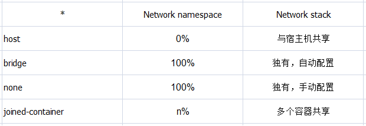

## Docker 网络

### 简介

docker的网络隔离通过network namespace实现，不同的网络模式都与namespace紧密关联。docker的网络转发通过iptables实现 ，如果需要自己手动实践下原理的，直接看**通信原理**即可

安装Docker时，它会自动创建三个网络，bridge（创建容器默认连接到此网络）、 none 、host

- Host	

  容器将不会虚拟出自己的网卡，配置自己的IP等，而是使用宿主机的IP和端口。

- Bridge 

  此模式会为每一个容器分配、设置IP等，并将容器连接到一个docker0虚拟网桥，通过docker0网桥以及Iptables nat表配置与宿主机通信。

- None	

  该模式关闭了容器的网络功能。

- Container （k8s 默认的就是适应这种模式）

  创建的容器不会创建自己的网卡，配置自己的IP，而是和一个指定的容器共享IP、端口范围。


### 网络概念

docker受一个github上的issue启发，引入了容器网络模型（container network model，CNM）[[1\]](https://zhuanlan.zhihu.com/p/82735394#ref_1)，容器网络模型主要包含了3个概念

**network**：网络，可以理解为一个Driver，是一个**第三方网络栈**，包含多种网络模式，下文也会详细描述

- 单主机网络模式（none、host、bridge，joined container）
- 多主机网络模式（overlay、macvlan、flannel）

**sandbox**：沙盒，它定义了容器内的虚拟网卡、DNS和路由表，是network namespace的一种实现，是容器的**内部网络栈**

**endpoint**：端点，用于连接sandbox和network

container network model

> 我们可以类比传统网络模型，将network比作交换机，sandbox比作网卡，endpoint比作接口和网线


另外，docker在创建容器时，先调用控制器创建sandbox对象，再调用容器运行时为容器创建network namespace


### docker的网络模式

这里我们先讨论docker的单主机网络模式，它包括以下4类：

- host
- bridge
- none
- joined-container


2.1 host

docker**不会**为容器创建独有的network namespace；

使用宿主机的默认网络命名空间，共享一个网络栈；

表现为容器内和宿主机的IP一致；

这种模式用于网络性能较高的场景，但安全隔离性相对差一些。


2.2 bridge

桥接模式，有点类型VM-NAT，dockerd进程启动时会创建一个docker0网桥，容器内的数据通过这个网卡设备与宿主机进行数据传输。


docker**会**为容器创建独有的network namespace，也会为这个命名空间配置好虚拟网卡，路由，DNS，IP地址与iptables规则（也就是sandbox的内容）。


2.3 none

none模式可以说是桥接模式的一种特例，docker**会**为容器创建独有的network namespace ，但不会为这个命名空间准备虚拟网卡，IP地址，路由等，需要用户自己配置。

2.4 joined-container

容器共享模式，这种模式是host模式的一种延伸，一组容器共享一个network namespace；

对外表现为他们有共同的IP地址，共享一个网络栈；

kubernetes的pod就是使用的这一模式。


关于跨主机的docker网络通信，包含overlay、macvaln，又包含calico、flannel、weave等方案，不过跨主机的docker网络管理更多的是交给kubernetes或swarm等编排工具去实现了。


### 网络相关命令

docker network  xx

| 子命令     | 说明                                                         |
| ---------- | ------------------------------------------------------------ |
| connect    | 将容器连接到网络。                                           |
| create     | 创建新的 Docker 网络。默认情况下，在 Windows 上会采用 NAT 驱动，在 Linux 上会采用 Bridge 驱动。可以使用 -d 参数指定驱动（网络类型）。 |
| disconnect | 断开容器的网络。                                             |
| inspect    | 提供 Docker 网络的详细配置信息。                             |
| ls         | 用于列出运行在本地 Docker 主机上的全部网络。                 |
| prune      | 删除 Docker 主机上全部未使用的网络。                         |
| rm         | 删除 Docker 主机上指定网络。                                 |


我们可以使用 docker network ls 来查看docker 默认创建的这些网络

```sh
[root@server1 ~]# docker network ls
NETWORK ID          NAME                DRIVER              SCOPE
0147b8d16c64        bridge              bridge              local
2da931af3f0b        host                host                local
63d31338bcd9        none                null                local
```


### 用法

我们在使用docker run创建Docker容器时，可以用 --net 选项指定容器的网络模式，Docker可以有以下4种网络模式：

- host模式：使用 --net=host 指定。
- none模式：使用 --net=none 指定。
- bridge模式：使用 --net=bridge 指定，默认设置。
- container模式：使用 --net=container:NAME_or_ID 指定。




#### 为容器设置默认的网络模式

1、link 方式互联

容器之间相互通讯可以通过docker run中的--link=container_name:alias参数来达到效果。
此种方式可以很方便让容器使用容器名进行通讯，而不需要依赖ip地址，不过link方式仅仅解决了单机容器间的互联，多机的情况下，需要通过别的方式进行连接。

```sh
docker run -itd --name container_name --link another_name imageName
```


2、自定义网络方式
除了使用link方式，还可以使用自定义网桥的方式进行互联。

下面演示了通过自定义网络方式来使容器互联
```sh

[root@VM_0_14_centos ~]# docker network create -d bridge my-net
d90fc3d8515b9402f2aca86767aa81ebb115cb4fcea4c90ed82446326cce7d35
[root@VM_0_14_centos ~]# docker run -it -d --name centos1 --network my-net centos
a43d83dbbde5827aeb3a66bab0e954df3b95a157dc0aea218cb23565af9655ce
[root@VM_0_14_centos ~]# docker run -it -d --name centos2 --network my-net centos
4f59c5ed14e075a1ef05468d9bfd75fe02fd210b3b580c8b0994bb3c0310a80e
[root@VM_0_14_centos ~]# docker exec -it centos1 /bin/bash
[root@a43d83dbbde5 /]# ping centos2
PING centos2 (172.18.0.3) 56(84) bytes of data.
64 bytes from centos2.my-net (172.18.0.3): icmp_seq=1 ttl=64 time=0.112 ms
64 bytes from centos2.my-net (172.18.0.3): icmp_seq=2 ttl=64 time=0.061 ms
64 bytes from centos2.my-net (172.18.0.3): icmp_seq=3 ttl=64 time=0.058 ms
64 bytes from centos2.my-net (172.18.0.3): icmp_seq=4 ttl=64 time=0.056 ms
^C
--- centos2 ping statistics ---
4 packets transmitted, 4 received, 0% packet loss, time 3000ms
rtt min/avg/max/mdev = 0.056/0.071/0.112/0.025 ms

```

上面演示了创建一个bridge类型网络my-net

然后创建了两个容器centos1、centos2都连接到这个容器，然后进入centos1，使用ping centos2成功。


### 查看网络的具体信息

```sh
docker network inspect networkName
```


