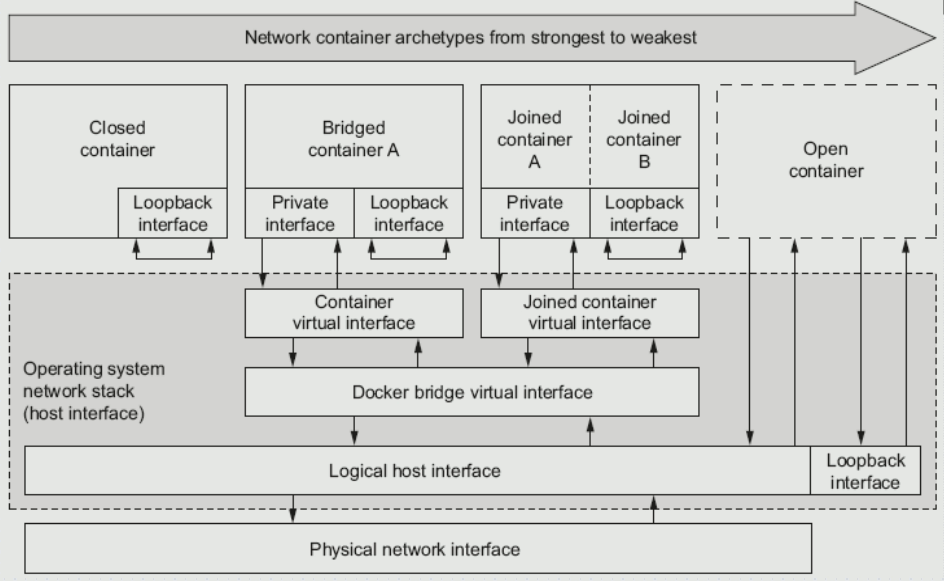
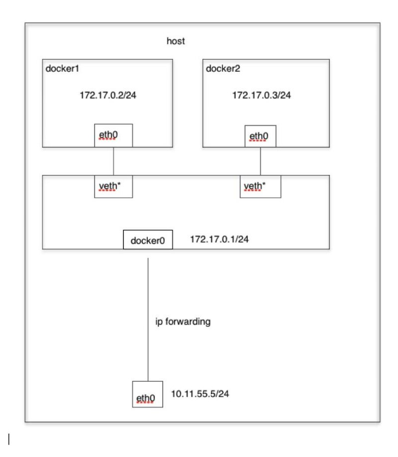
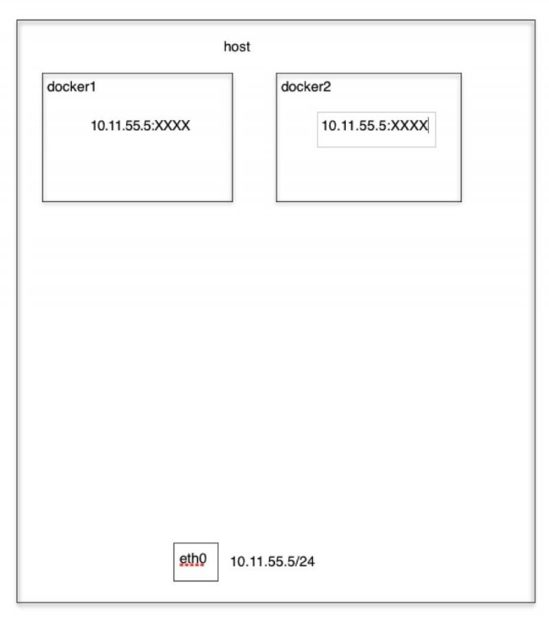
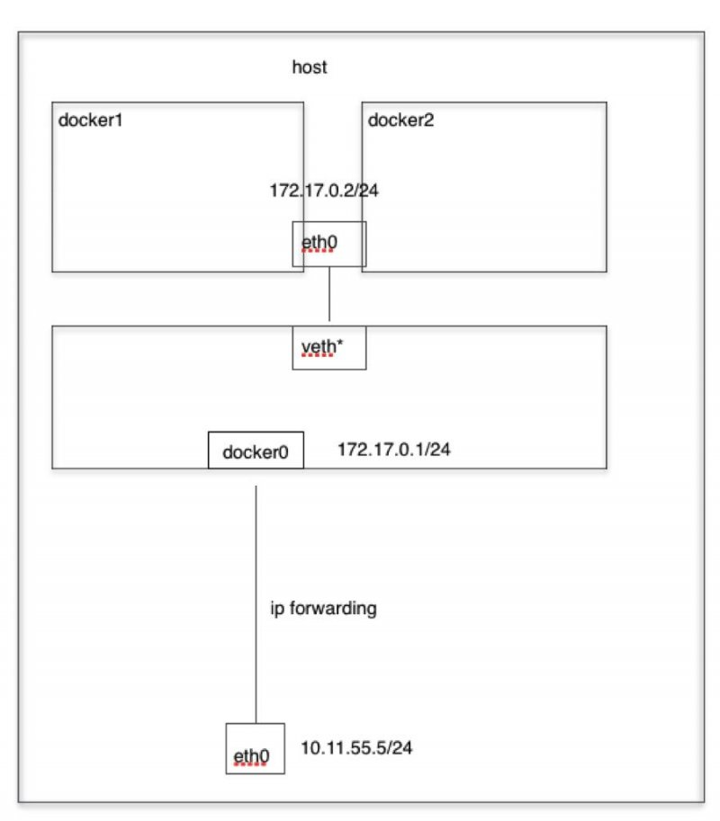
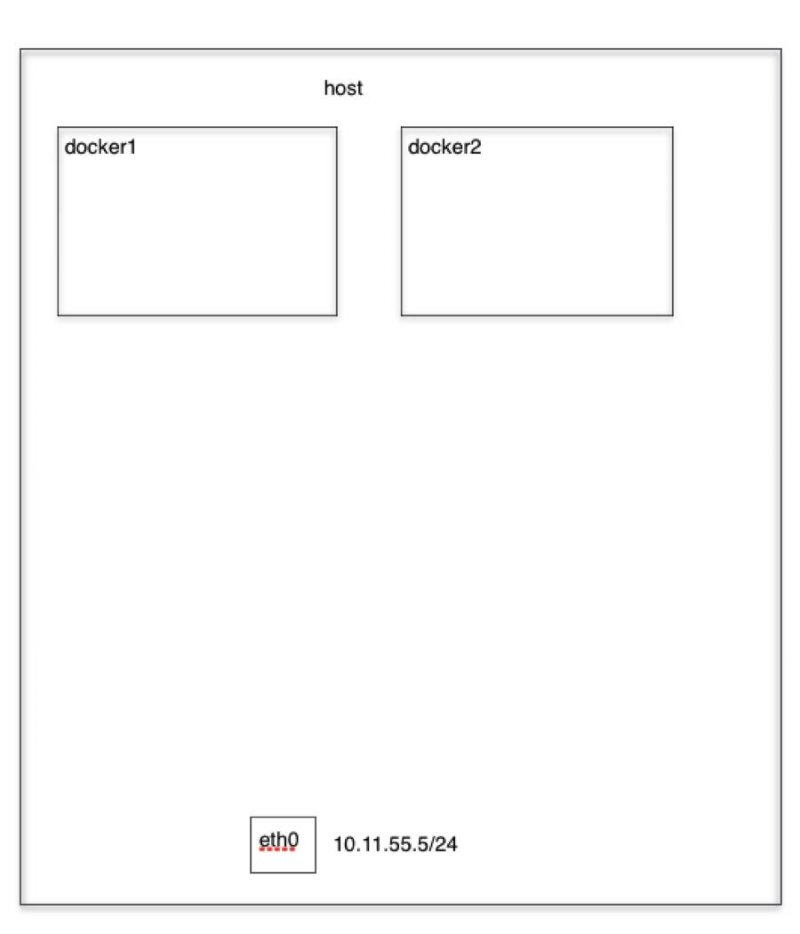

## 1、Docker的四种网络模式



（1）docker四种网络模式如下：

-  Bridge contauner  桥接式网络模式
-  Host(open) container  开放式网络模式
-  Container(join) container  联合挂载式网络模式，是host网络模式的延伸
-  None(Close) container  封闭式网络模式

（2）可以通过docker network命令查看

```
[root@along ~]# docker network ls
NETWORK ID          NAME                DRIVER              SCOPE
f23b4899add1        bridge              bridge              local
65520497f693        host                host                local
a0c5f18e0f04        none                null                local
```

（3）docker run --network 命令可以指定使用网络模式

 

## 2、Bridge 网络模式

#### **2.1 介绍**

　　当Docker进程启动时，会**在主机上创建一个名为docker0的虚拟网桥**，此主机上启动的**Docker容器会连接到这个虚拟网桥上，**所以有默认地址172.17.0.0/16的地址。虚拟网桥的工作方式和物理交换机类似，这样主机上的所有容器就通过交换机连在了一个二层网络中。

　　从**docker0子网中分配一个IP给容器使用**，并设置**docker0的IP地址为容器的默认网关**。在主机上**创建一对虚拟网卡**veth pair设备，Docker将veth pair设备的**一端放在新创建的容器**中，并命名为eth0（容器的网卡），**另一端放在主机中**，以vethxxx这样类似的名字命名，并将这个网络设备加入到docker0网桥中。可以通过brctl show命令查看。

```
[root@along ~]# brctl show
bridge name    bridge id        STP enabled    interfaces
docker0    8000.024241c45d6e    no
```

　　**bridge模式是docker的默认网络模式**，不写--net参数，就是bridge模式。使用docker run -p时，docker实际是在iptables做了DNAT规则，实现端口转发功能。可以使用iptables -t nat -vnL查看。

```
[root@along ~]# iptables -t nat -vnL
Chain POSTROUTING (policy ACCEPT 20 packets, 1238 bytes)
 pkts bytes target     prot opt in     out     source               destination         
    0     0 MASQUERADE  all  --  *      !docker0  172.17.0.0/16        0.0.0.0/0
```

 

#### **2.2** **bridge模式示意图**



#### **2.3 演示**

bridge 网络模式；--network不指定，默认也是bridge模式

```
[root@along ~]# docker run --name b1 -it --network bridge --rm busybox:latest 
/ # ifconfig 
eth0      Link encap:Ethernet  HWaddr 02:42:AC:11:00:02  
          inet addr:172.17.0.2  Bcast:0.0.0.0  Mask:255.255.0.0
          inet6 addr: fe80::42:acff:fe11:2/64 Scope:Link
          UP BROADCAST RUNNING MULTICAST  MTU:1500  Metric:1
          RX packets:12 errors:0 dropped:0 overruns:0 frame:0
          TX packets:6 errors:0 dropped:0 overruns:0 carrier:0
          collisions:0 txqueuelen:0 
          RX bytes:1016 (1016.0 B)  TX bytes:508 (508.0 B)

lo        Link encap:Local Loopback  
          inet addr:127.0.0.1  Mask:255.0.0.0
          inet6 addr: ::1/128 Scope:Host
          UP LOOPBACK RUNNING  MTU:65536  Metric:1
          RX packets:0 errors:0 dropped:0 overruns:0 frame:0
          TX packets:0 errors:0 dropped:0 overruns:0 carrier:0
          collisions:0 txqueuelen:1 
          RX bytes:0 (0.0 B)  TX bytes:0 (0.0 B)
/ # route -n
Kernel IP routing table
Destination     Gateway         Genmask         Flags Metric Ref    Use Iface
0.0.0.0         172.17.0.1      0.0.0.0         UG    0      0        0 eth0
172.17.0.0      0.0.0.0         255.255.0.0     U     0      0        0 eth0
/ # ping 10.11.55.5   正常访问宿主机
PING 10.11.55.5 (10.11.55.5): 56 data bytes
64 bytes from 10.11.55.5: seq=0 ttl=64 time=0.292 ms
/ # exit
```

 

## 3、Host 网络模式

#### **3.1 介绍**

　　如果启动容器的时候使用host模式，那么这个容器将不会获得一个独立的Network Namespace，而是**和宿主机共用一个Network Namespace**。容器将不会虚拟出自己的网卡，配置自己的IP等，而是**使用宿主机的IP和端口**。但是，**容器的其他方面，如文件系统、进程列表等还是和宿主机隔离的**。

 

#### **3.2 Host模式示意图**



#### **3.3 演示**

```
[root@along ~]# docker run --name b2 -it --network host --rm busybox:latest
/ # ifconfig -a   和宿主机一样
docker0   Link encap:Ethernet  HWaddr 02:42:41:C4:5D:6E  
          inet addr:172.17.0.1  Bcast:0.0.0.0  Mask:255.255.0.0
          inet6 addr: fe80::42:41ff:fec4:5d6e/64 Scope:Link
          UP BROADCAST RUNNING MULTICAST  MTU:1500  Metric:1
          RX packets:90 errors:0 dropped:0 overruns:0 frame:0
          TX packets:26 errors:0 dropped:0 overruns:0 carrier:0
          collisions:0 txqueuelen:0 
          RX bytes:5903 (5.7 KiB)  TX bytes:2381 (2.3 KiB)

eth0      Link encap:Ethernet  HWaddr 00:0C:29:AB:D2:DA  
          inet addr:10.11.55.5  Bcast:10.11.55.255  Mask:255.255.255.0
          inet6 addr: fe80::20c:29ff:feab:d2da/64 Scope:Link
          UP BROADCAST RUNNING MULTICAST  MTU:1500  Metric:1
          RX packets:3913 errors:0 dropped:0 overruns:0 frame:0
          TX packets:3327 errors:0 dropped:0 overruns:0 carrier:0
          collisions:0 txqueuelen:1000 
          RX bytes:354314 (346.0 KiB)  TX bytes:919096 (897.5 KiB)

lo        Link encap:Local Loopback  
          inet addr:127.0.0.1  Mask:255.0.0.0
          inet6 addr: ::1/128 Scope:Host
          UP LOOPBACK RUNNING  MTU:65536  Metric:1
          RX packets:0 errors:0 dropped:0 overruns:0 frame:0
          TX packets:0 errors:0 dropped:0 overruns:0 carrier:0
          collisions:0 txqueuelen:1 
          RX bytes:0 (0.0 B)  TX bytes:0 (0.0 B)
```

 

## 4、Container 网络模式

#### **4.1 介绍**

　　这个模式指定**新创建的容器和已经存在的一个容器共享一个 Network Namespace**，而不是和宿主机共享。**新创建的容器不会创建自己的网卡，配置自己的 IP，而是和一个指定的容器共享 IP、端口范围**等。同样，**两个容器除了网络方面，其他的如文件系统、进程列表等还是隔离的**。两个容器的进程可以通过 lo 网卡设备通信。

 

#### **4.2 Container模式示意图**



#### **4.3 演示**

（1）在一个终端，使用bridge网络模式启动容器b1

```
[root@along ~]# docker run --name b1 -it --rm busybox:latest 
/ # ifconfig   b1的ip为172.17.0.2
eth0      Link encap:Ethernet  HWaddr 02:42:AC:11:00:02  
          inet addr:172.17.0.2  Bcast:0.0.0.0  Mask:255.255.0.0
          inet6 addr: fe80::42:acff:fe11:2/64 Scope:Link
          UP BROADCAST RUNNING MULTICAST  MTU:1500  Metric:1
          RX packets:6 errors:0 dropped:0 overruns:0 frame:0
          TX packets:6 errors:0 dropped:0 overruns:0 carrier:0
          collisions:0 txqueuelen:0 
          RX bytes:508 (508.0 B)  TX bytes:508 (508.0 B)

lo        Link encap:Local Loopback  
          inet addr:127.0.0.1  Mask:255.0.0.0
          inet6 addr: ::1/128 Scope:Host
          UP LOOPBACK RUNNING  MTU:65536  Metric:1
          RX packets:0 errors:0 dropped:0 overruns:0 frame:0
          TX packets:0 errors:0 dropped:0 overruns:0 carrier:0
          collisions:0 txqueuelen:1 
          RX bytes:0 (0.0 B)  TX bytes:0 (0.0 B)
/ # echo "hello world b1" > /tmp/index.html
/ # httpd -h /tmp/  在b1上启动httpd服务
/ # netstat -nutl
Active Internet connections (only servers)
Proto Recv-Q Send-Q Local Address           Foreign Address         State       
tcp        0      0 :::80                   :::*                    LISTEN 
```

（2）在另一个终端使用Container 网络模式创建容器b2

```
[root@along ~]# docker run --name b2 -it --network container:b1 --rm busybox:latest
/ # ifconfig -a   b2的ip和b1一样
eth0      Link encap:Ethernet  HWaddr 02:42:AC:11:00:02  
          inet addr:172.17.0.2  Bcast:0.0.0.0  Mask:255.255.0.0
          inet6 addr: fe80::42:acff:fe11:2/64 Scope:Link
          UP BROADCAST RUNNING MULTICAST  MTU:1500  Metric:1
          RX packets:8 errors:0 dropped:0 overruns:0 frame:0
          TX packets:8 errors:0 dropped:0 overruns:0 carrier:0
          collisions:0 txqueuelen:0 
          RX bytes:648 (648.0 B)  TX bytes:648 (648.0 B)

lo        Link encap:Local Loopback  
          inet addr:127.0.0.1  Mask:255.0.0.0
          inet6 addr: ::1/128 Scope:Host
          UP LOOPBACK RUNNING  MTU:65536  Metric:1
          RX packets:0 errors:0 dropped:0 overruns:0 frame:0
          TX packets:0 errors:0 dropped:0 overruns:0 carrier:0
          collisions:0 txqueuelen:1 
          RX bytes:0 (0.0 B)  TX bytes:0 (0.0 B)
/ # wget -O - -q 127.0.0.1   b1启动的httpd服务，在b2上直接访问
hello world b1
/ # ls /tmp/   但是文件系统并不共享，只共享网络
```

 

## 5、None 网络模式

#### **5.1 介绍**

　　使用none模式，Docker容器拥有自己的Network Namespace，但是，**并不为Docker容器进行任何网络配置**。也就是说，这个Docker容器没有网卡、IP、路由等信息，只有lo 网络接口。需要我们自己为Docker容器添加网卡、配置IP等。

　　不参与网络通信，运行于此类容器中的进程仅能访问本地回环接口；仅适用于进程无须网络通信的场景中，例如：备份、进程诊断及各种离线任务等。

 

#### **5.2 Node模式示意图**



#### **5.3 演示**

```
[root@along ~]# docker run --name b1 -it --network none --rm busybox:latest 
/ # ifconfig 
lo        Link encap:Local Loopback  
          inet addr:127.0.0.1  Mask:255.0.0.0
          inet6 addr: ::1/128 Scope:Host
          UP LOOPBACK RUNNING  MTU:65536  Metric:1
          RX packets:0 errors:0 dropped:0 overruns:0 frame:0
          TX packets:0 errors:0 dropped:0 overruns:0 carrier:0
          collisions:0 txqueuelen:1 
          RX bytes:0 (0.0 B)  TX bytes:0 (0.0 B)
/ # route -n
Kernel IP routing table
Destination     Gateway         Genmask         Flags Metric Ref    Use Iface
/ # exit
```