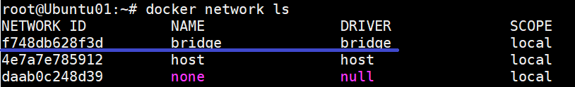
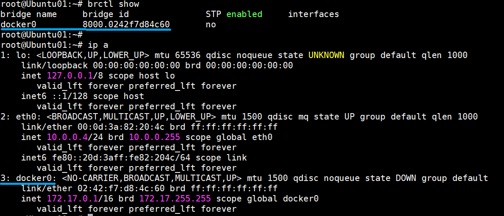
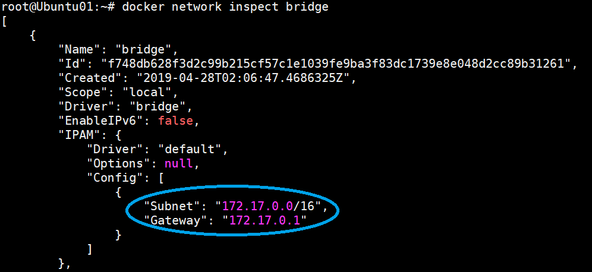
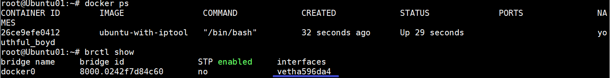
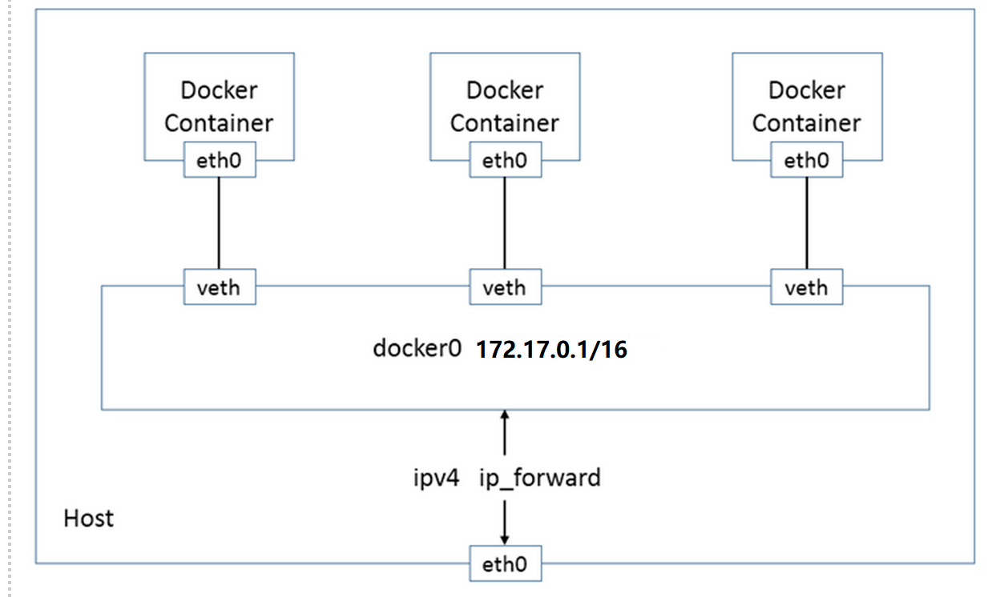
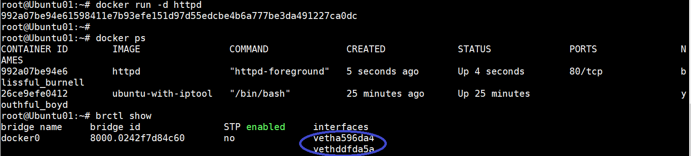
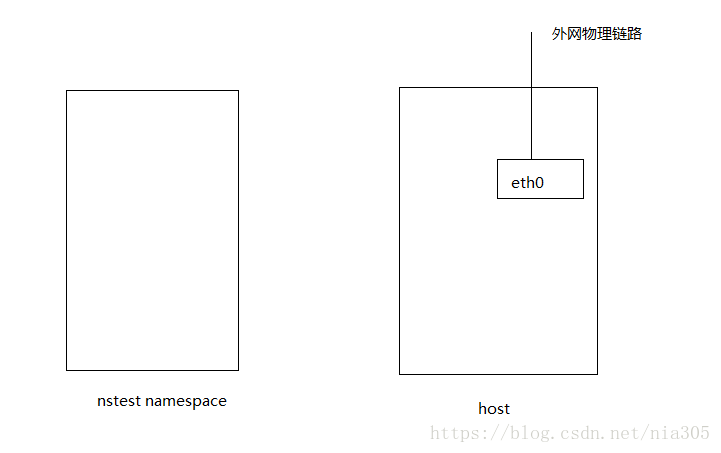
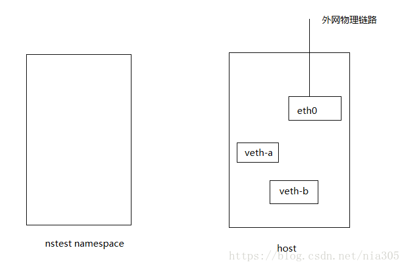
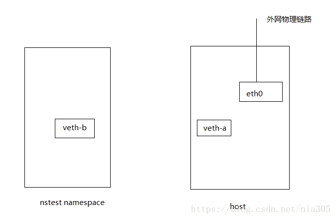

## docker 通信原理

在我们了解docker 通讯原理之前，我们先了解下什么是 Veth 虚拟网卡，docker 就是通过 veth peer 来打通不同网络空间之间的通信


一）基本知识：

Docker 安装时会自动在 host 上创建三个网络：none，host，和bridge；详细说明可参考其它文档。我们可用 docker network ls 命令查看：



基于DRIVER是bridge的网络都会有一个对应的linux bridge被创建：

在默认环境中，一个名为docker0的linux bridge自动被创建好了，其上有一个 docker0 内部接口，IP地址为172.17.0.1/16：



再用docker network inspect指令查看bridge网络：其Gateway就是网卡/接口docker0的IP地址：172.17.0.1。



总结起来：**network的名字是bridge，而对应的linux bridge的名字是docker0。**

 

二）容器创建时IP地址的分配：

Docker 创建一个容器的时候，会执行如下操作：

 • 创建一对虚拟接口/网卡，也就是veth pair，分别放到本地主机和新容器中；
 • 本地主机一端桥接到默认的 docker0 或指定网桥上，并具有一个唯一的名字，如 vetha596da4；
 • 容器一端放到新容器中，并修改名字作为 eth0，这个网卡/接口只在容器的名字空间可见；
 • 从网桥可用地址段中（也就是与该bridge对应的network）获取一个空闲地址分配给容器的 eth0，并配置默认路由到桥接网卡 vetha596da4。
完成这些之后，容器就可以使用 eth0 虚拟网卡来连接其他容器和其他网络。
如果不指定--network，创建的容器默认都会挂到 docker0 上，使用本地主机上 docker0 接口的 IP 作为所有容器的默认网关。



当有多个容器创建后，容器网络拓扑结构如下：



这时就会出现如何识别docker0的虚拟网卡和容器的对应关系，例如，图示中有两个容器和docker0中的两个接口：



 


### Network Namespace

不同的network namespace 里面有着自己的路由表，自己的设备，自己的iptables等规则。不同的network namespace里面是不能看到其他namespace里面的设备的【就相当于两台电脑如果没有线缆之类的物理介质连接，是不能相互通讯的】，我们可以使用下面的命令来创建一个network namespace

### 创建network namespace
```sh
sudo ip netns add nstest
```

现在我们就有了一台“独立的”机器，那么如何让两个不同的namespace之间通讯呢？那就需要下面说的veth pair。

#### veth pair
Linux里面有几种虚拟网络：veth pair 相当于虚拟网卡对，跟IPC里面的管道类似。bridge：相当于虚拟交换机。现在我的环境是这样的：

  


可以看到现在两个namespace还是不通的，我们需要“买”两张网卡来让这两台机器互通：


### 创建veth pair

```sh
sudo ip link add veth-a type veth peer name veth-b
```

这样我们就获得了两块虚拟的网卡：

  


接着我们把veth-b加入到我们新创建的network namespace里面：

### 把veth-b加入到 nstest namespace

```sh
sudo ip link set veth-b netns nstest
```

  

现在还是不能ping通两块虚拟网卡：因为我们没有加上IP ：


### 给两块虚拟网卡加IP,并且启动两块网卡
```sh
sudo ip addr add 10.0.0.2 dev veth-a && sudo ip link set veth-a up
sudo ip netns exec nstest ip addr add 10.0.0.3 dev veth-b && sudo ip netns exec nstest ip link set veth-b up
```


**两块网卡必须要在同一个网段里面**

现在还是不能ping通：因为nstest namespace里面的路由表没有设置。

### 添加路由
```sh
sudo ip netns exec nstest route add -net default gw 10.0.0.2 dev veth-b
sudo route add -host 10.0.0.3 dev veth-a
```


现在两张网卡就能ping通了，并且veth-b也可以ping通eth0

那么现在veth-b如何访问外网呢？那么就需要在host这边做nat转发，需要用到iptables这个工具。


### 开启host的路由转发功能

```sh
cat 1 > /proc/sys/net/ipv4/ip_forward
```


### 让eth0 转发 veth-a的包
```sh
sudo iptables -A FORWARD -t filter –out-interface eth0 –in-interface veth-a
sudo iptables -A FORWARD -t filter –in-interface eth0 –out-interface veth-a
```


### 添加nat转发功能
```sh
sudo iptables -t nat -A POSTROUTING –source 10.0.0.0/24 –out-interface eth0 -j MASQUERADE
```


这一句的意思是：让源目的IP为10.0.0.0/24的包都经过eth0这个接口nat出去，MASQUERADE是伪装的意思，意味着eth0会修改包的源目的IP。

现在就能使用veth-b这块虚拟网卡来访问外网了:

sudo ip netns exec nstest curl www.baidu.com


## 文章链接

