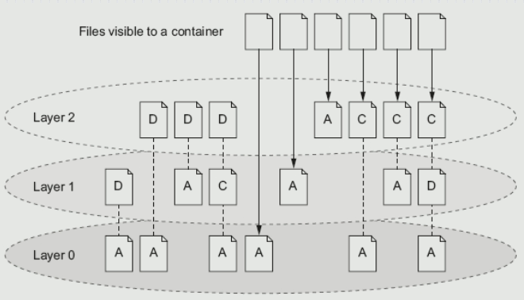
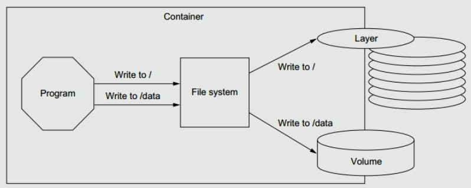
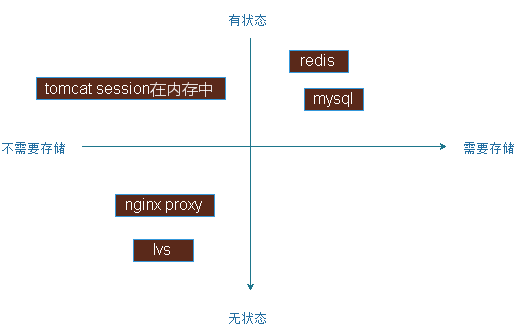
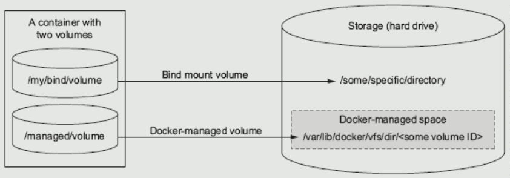
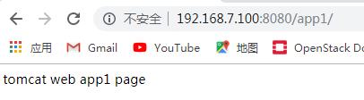
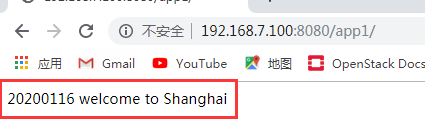
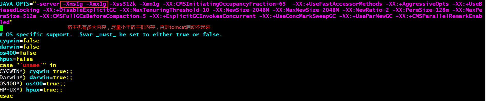
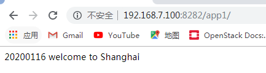
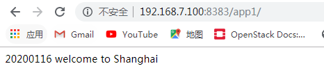
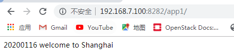

## **1、存储卷介绍**

引用自：https://www.cnblogs.com/along21/p/8116905.html

（1）docker 的 AFUS 分层文件系统

　　docker镜像由**多个只读层叠加而成**，启动容器时，docker会**加载只读镜像层并在镜像栈顶部加一个读写层；**

　　如果运行中的容器修改了现有的一个已经存在的文件，那该文件将会从读写层下面的只读层复制到读写层，该文件版本仍然存在，只是已经被读写层中该文件的副本所隐藏，此即“**写时复制(COW)”机制**。

  

 描述：如果一个文件在最底层是可见的，如果在layer1上标记为删除，最高的层是用户看到的Layer2的层，在layer0上的文件，在layer2上可以删除，但是只是标记删除，用户是不可见的，总之在到达最顶层之前，把它标记来删除，对于最上层的用户是不可见的，当标记一删除，只有用户在最上层建一个同名一样的文件，才是可见的。


-  对于这类的操作，修改删除等，一般效率非常低，如果对一于I/O要求比较高的应用，如redis在实现持化存储时，是在底层存储时的性能要求比较高。
-  假设底层运行一个存储库mysql,mysql本来对于I/O的要求就比较高，如果mysql又是运行在容器中自己的文件系统之上时，也就是容器在停止时，就意味着删除，其实现数据存取时效率比较低，要避免这个限制要使用存储卷来实现。
-  存在的问题：
  -  存储于联合文件系统中，不易于宿主机访问；
  -  容器间数据共享不便
  -  删除容器其数据会丢失


（1）介绍

　　“卷”是容器上的一个或多个“目录”，此类目录**可绕过联合文件系统**，**与宿主机上的某个目录“绑定（关联）”；**

　　类似于挂载一样，宿主机的/data/web目录与容器中的/container/data/web目录绑定关系，然后容器中的进程向这个目录中写数据时，是直接写在宿主机的目录上的，绕过容器文件系统与宿主机的文件系统建立关联关系，使得可以在**宿主机和容器内共享数据库内容**，让容器直接访问宿主机中的内容，也可以宿主机向容器供集内容，**两者是同步的**。

　　mount名称空间本来是隔离的，可以让两个本来是隔离的文件系统，在某个子路径上建立一定程度的绑定关系，从而使得在两个容器之间的文件系统的某个子路径上不再是隔离的，实现一定程度上共享的效果。

　　在宿主机上能够被共享的目录(可以是文件)就被称为volume。

 

（2）存储卷作用

　　优点是容器中进程所生成的数据，都保存在存储卷上，从而脱离容器文件系统自身后，当容器被关闭甚至被删除时，都不用担心数据被丢失，实现数据可以**脱离容器生命周期而持久**，当再次重建容器时，如果可以让它使用到或者关联到同一个存储卷上时，再创建容器，虽然不是之前的容器，但是数据还是那个数据，特别类似于进程的运行逻辑，进程本身不保存任何的数据，数据都在进程之外的文件系统上，或者是专业的存储服务之上，所以进程每次停止，只是保存程序文件，对于容器也是一样；容器就是一个有生命周期的动态对象来使用，容器关闭就是容器删除的时候，但是它底层的镜像文件还是存在的，可以基于镜像再重新启动容器。

　　但是容器有一个问题，一般与进程的启动不太一样，就是容器启动时选项比较多，如果下次再启动时，很容器会忘记它启动时的选项，所以最好有一个文件来保存容器的启动，这就是容器编排工具的作用。一般情况下，是使用命令来启动操作docker,但是可以通过文件来读，也就读文件来启动，读所需要的存储卷等，但是它也只是操作一个容器，这也是需要**专业的容器编排工具**的原因。

　　另一个优势就是容器就可以不置于启动在那台主机之上了，如几台主机后面挂载一个NFS，在各自主机上创建容器，而容器上通过关联到宿主机的某个目录上，而这个目录也是NFS所挂载的目录中，这样容器如果停止或者是删除都可以不限制于只能在原先的宿主机上启动才可以，可以实现全集群范围内调试容器的使用，当再分配存储、计算资源时，就不会再局限于单机之上，可以在集群范围内建立起来，基本各种docker的编排工具都能实现此功能，但是后面严重依赖于共享存储的使用。

 

（3）配合各服务应用状态分析

　　考虑到容器应用是需要持久存储数据的，可能是有状态的，如果考虑使用NFS做反向代理是没必要存储数据的，应用可以分为有状态和无状态，有状态是当前这次连接请求处理一定此前的处理是有关联的，无状态是前后处理是没有关联关系的，大多数有状态应用都是数据持久存储的，如mysql,redis有状态应用，在持久存储，如nginx作为反向代理是无状态应用，tomcat可以是有状态的，但是它有可能不需要持久存储数据，因为它的session都是保存在内存中就可以的，会导致节点宕机而丢失session，如果有必要应该让它持久，这也算是有状态的。

　　**应用状态象限**：是否有状态或无状态，是否需要持久存储，可以定立一个正轴坐标系，第一象限中是那些有状态需要存储的，像mysql,redis等服务，有些有有状态但是无需进行存储的，像tomcat把会话保存在内存中时，无状态也无需要存储的数据，如各种反向代理服务器nginx,lvs请求连接都是当作一个独立的连接来调度，本地也不需要保存数据，第四象限是无状态，但是需要存储数据是比较少见。



　　运维起来比较难的是有状态且需要持久的，**需要大量的运维经验和大量的操作步骤**才能操作起来的，如做一个Mysql主从需要运维知识、经验整合进去才能实现所谓的部署，扩展或缩容，出现问题后修复，必须要了解集群的规模有多大，有多少个主节点，有多少个从节点，主节点上有多少个库，这些都要一清二楚，才能修复故障，这些就强依赖于运维经验，无状态的如nginx一安装就可以了，并不复杂，对于无状态的应用可以迅速的实现复制，在运维上实现自动化是很容易的，对于有状态的现状比较难脱离运维人员来管理，即使是k8s在使用上也暂时没有成熟的工具来实现。

　　**总之**：对于有状态的应用的数据，不使用存储卷，只能放在容器本地，效率比较低，而导致一个很严重问题就是无法迁移使用，而且随着容器生命周期的停止，还不能把它删除，只能等待下次再启动状态才可以，如果删除了数据就可能没了，因为它的可写层是随着容器的生命周期而存在的，所以只要持久存储数据，**存储卷就是必需的**。

　　**docker存储卷难度：**对于docker存储卷运行起来并不太麻烦，如果不自己借助额外的体系来维护，它本身并没有这么强大，因为docker存储卷是使用其所在的宿主机上的本地文件系统目录，也就是宿主机有一块磁盘，这块磁盘并没有共享给其他的docker主要，然后容器所使用的目录，只是关联到宿主机磁盘上的某个目录而已，也就是容器在这宿主机上停止或删除，是可以重新再创建的，但是不能调度到其他的主机上，这也是docker本身没有解决的问题，所以docker存储卷默认就是docker所在主机的本地，但是自己搭建一个共享的NFS来存储docker存储的数据，也可以实现，**但是这个过程强依赖于运维人员的能力**。


-  volume于容器初始化之时会创建，由base image提供的卷中的数据会于此期间完成复制
-  volume的初意是独立于容器的生命周期实现数据持久化，因此删除容器之时既不会删除卷，也不会对哪怕未被引用的卷做垃圾回收操作
-  卷为docker提供了独立于容器的数据管理机制
  -  可以把“镜像”想像成静态文件，例如“程序”，把卷类比为动态内容，例如“数据”，于是，镜像可以重用，而卷可以共享
  -  卷实现了“程序(镜像)"和”数据(卷)“分离，以及”程序(镜像)“和"制作镜像的主机”分离，用记制作镜像时无须考虑镜像运行在容器所在的主机的环境 


Docker有两种类型的卷，每种类型都在容器中存在一个挂载点，但其在宿主机上位置有所不同;

- Bind mount volume（绑定挂载卷）：在**宿主机上**的路径要人工的**指定一个特定的路径**，**在容器中也需要指定一个特定的路径**，**两个已知的路径建立关联关系**
- Docker-managed volume（docker管理卷）： **只需要在容器内指定容器的挂载点**是什么，而被绑定宿主机下的那个目录，是**由容器引擎daemon自行创建一个空的目录**，或者使用一个已经存在的目录，与存储卷建立存储关系，这种方式极大解脱用户在使用卷时的耦合关系，缺陷是用户无法指定那些使用目录，临时存储比较适合;




  Docker的镜像是分层设计的，底层是只读的，通过镜像启动 的容器添加了一层可读写的文件系统，用户写入的数据都保存在这一层当中，如果要将写入的数据永久生效，需要将其提交为一个镜像然后通过这个镜像在启动实例，然后就
会给这个启动的实例添加一层可读写的文件系统， **目前 Docker的数据类型分为两种， 一 是数据卷，二是数据容器** ，数据卷类似于挂载的一块磁盘，数据容器是将数据保存在一个容器上。


（1）数据卷实际上就是宿主机上的目录或者是文件，可以被直接mount 到容器当中使用 。

（2）实际生成 环境中，需要针对不同类型的服务、不同类型的数据存储要求做相应的规划， 最终保证服务的可扩展性、稳定性以及数据的安全性。

（3）为docker run 命令使用-v 选项即可使用volume，其实也就是将宿主机的文件挂载到容器中，**默认挂载为rw的权限。**


1、数据卷是目录或者文件，并且可以在多个容器之间共同使用 。

2、对数据卷更改数据容器里面，会立即更新 。

3、数据卷的数据可以持久保存，即使删除使用使用该容器卷的容器也不 影响 。

4、 在容器里面的写入数据，不会影响到镜像本身


1、 日志输出

2、 静态web页面

3、应用配置文件

4、 多容器间目录或文件共享

 


 1、先查看tomcat容器里边的代码内容

```
[root@centos-7 app1]# docker run -it  -p 8080:8080  tomcat-app1:v1  # 启动tomcat-app1:v1容器
```

2、到运行的tomcat-app1:v1的容器中查看代码内容

```
[root@centos-7 ~]# docker ps  #查看运行的容器
CONTAINER ID IMAGE COMMAND CREATED STATUS PORTS NAMES
21f9df7830a5 tomcat-app1:v1 "/apps/tomcat/bin/ru…" About a minute ago Up About a minute 0.0.0.0:8080->8080/tcp, 8443/tcp nervous_grothendieck

[root@centos-7 ~]# docker exec -it 21f9df7830a5 bash  # 进入正在运行的容器内部
[root@21f9df7830a5 /]# ls
apps  bin  data  dev  etc  home  lib  lib64  lost+found  media	mnt  opt  proc	root  run  sbin  srv  sys  tmp	usr  var
[root@21f9df7830a5 /]# cd /data/tomcat/webapps/
[root@21f9df7830a5 webapps]# cat app1/index.html  #查看容器缺省的代码内容
tomcat web app1 page
```

 3、访问网页也可以看到此时的内容

 

4、在宿主机上先创建一个存放代码的目录

```
[root@centos-7 ~]# cd  /data/tomcat/app1/ 
[root@centos-7 app1]# echo 20200116 welcome to Shanghai > index.html
```

 5、将宿主机的代码数据映射到tomcat访问的数据目录下，并映射端口，此时volume映射的优先级高

```
[root@centos-7 app1]# docker run -it -v /data/tomcat/app1/:/data/tomcat/webapps/app1 -p 8080:8080 tomcat-app1:v1
```

6、查看网页效果，此时就是宿主机的代码覆盖了容器内部的数据代码

  


1、在宿主机修改catalina.sh脚本文件，并存放到指定的目录下

```
[root@centos-7 bin]# mkdir /data/tomcat/bin
[root@centos-7 bin]#cd /data/tomcat/bin  # 在此目录下将脚本文件存放在此
```

创建一个挂载容器log日志的目录

```
[root@centos-7 bin]# mkdir /data/tomcat/logs
```

将目录和catalina.sh脚本分别加上权限

```
# chmod 777 /data/tomcat/logs  # 目录先加上777权限
# chmod +x  /data/tomcat/bin/catalina.sh  # 加上执行权限
```

2、查看catalina.sh配置文件内容，最主要的部分在下面

 

 3、开始挂载此文件到容器中，并设置为只读文件，避免在容器中进行修改此文件，且将容器中的log日志进行挂载，避免容器坏掉而log日志在容器中，导致数据丢失

```
[root@centos-7 logs]# docker run -it -v /data/tomcat/bin/catalina.sh:/apps/tomcat/bin/catalina.sh -v  /data/tomcat/logs/:/apps/tomcat/logs/  -p 8282:8080 tomcat-app1:v1
```

4、此时就可以在宿主机查看容器里边的log日志

```
[root@centos-7 bin]# ll /data/tomcat/logs/
total 16
-rw-rw-r-- 1 2020 2020 7355 Jan 16 18:03 catalina.2020-01-16.log
-rw-rw-r-- 1 2020 2020 7866 Jan 16 18:03 catalina.out
-rw-rw-r-- 1 2020 2020    0 Jan 16 18:03 host-manager.2020-01-16.log
-rw-rw-r-- 1 2020 2020    0 Jan 16 18:03 localhost.2020-01-16.log
-rw-rw-r-- 1 2020 2020    0 Jan 16 18:03 localhost_access_log.2020-01-16.txt
-rw-rw-r-- 1 2020 2020    0 Jan 16 18:03 manager.2020-01-16.log
```

 5、此时catalina.sh的文件已经存放到文件中

```
[root@centos-7 bin]# docker ps
CONTAINER ID        IMAGE               COMMAND                  CREATED             STATUS              PORTS                              NAMES
95d4f7d917bc        tomcat-app1:v1      "/apps/tomcat/bin/ru…"   56 seconds ago      Up 55 seconds       8443/tcp, 0.0.0.0:8282->8080/tcp   wizardly_hypatia
[root@centos-7 bin]# docker exec -it 95d4f7d917bc bash  
[root@95d4f7d917bc /]# cd /apps/tomcat/bin/
[root@95d4f7d917bc bin]# ls
bootstrap.jar	    commons-daemon-native.tar.gz  daemon.sh	 setclasspath.bat  startup.bat		 tool-wrapper.bat
catalina-tasks.xml  commons-daemon.jar		  digest.bat	 setclasspath.sh   startup.sh		 tool-wrapper.sh
catalina.bat	    configtest.bat		  digest.sh	 shutdown.bat	   tomcat-juli.jar	 version.bat
catalina.sh	    configtest.sh		  run_tomcat.sh  shutdown.sh	   tomcat-native.tar.gz  version.sh
[root@95d4f7d917bc bin]# vim catalina.sh
```


### 实现原理：

   数据卷容器最大的功能是可以让数据在多个docker容器之间共享，即可以让B 容器访问A容器的内容，而 容器C也可以访问A容器的内容，即先要创建 一个后台运行的容器作为Server，用于卷提供这个卷可以为其他容器提供数据存储服务其他使用此卷的容器作为client端。


1、创建一个volume-server的容器名，并将宿主机的访问页面index.html、catalina.sh、logs日志都映射到此日志中

```
[root@centos-7 ~]# docker run -it -d --name volume-server  -v /data/tomcat/bin/catalina.sh:/apps/tomcat/bin/catalina.sh:ro -v /data/tomcat/logs:/apps/tomcat/logs  -v /data/tomcat/app1/:/data/tomcat/webapps/app1/    tomcat-app1:v1
230d219e035c3fec1145c32060fed37e1e12154df0d010b34f614740f31ef9bd　 # 添加一个server服务器的容器，并将宿主机的文件映射到此容器中
```

2、创建volume-client客户端的容器

```
[root@centos-7 ~]# docker run -it -d --name volume-client --volumes-from volume-server -p 8282:8080 tomcat-app1:v1
1f40e1b7b4eb9192260557ebef78aec51f239e66f994b2ae42b1c18a9849843b  #此时映射的客户端容器内容都是从colume-server容器来的
```

3、进入colume-client的容器内，也可以看到宿主机的文件内容

```
[root@centos-7 ~]# docker exec -it 1f40e1b7b4eb9192260557ebef78aec51f239e66f994b2ae42b1c18a9849843b bash
[root@1f40e1b7b4eb /]# cat  /data/tomcat/webapps/index.html 
20200116 welcome to Shanghai  # 可以看到是宿主机的index.html文件
[root@1f40e1b7b4eb /]# ls -l  /apps/tomcat/logs/
total 92
-rw-rw-r-- 1 tomcat tomcat 42631 Jan 16 19:21 catalina.2020-01-16.log
-rw-rw-r-- 1 tomcat tomcat 45697 Jan 16 19:21 catalina.out
-rw-rw-r-- 1 tomcat tomcat     0 Jan 16 18:03 host-manager.2020-01-16.log
-rw-rw-r-- 1 tomcat tomcat     0 Jan 16 18:03 localhost.2020-01-16.log
-rw-rw-r-- 1 tomcat tomcat     0 Jan 16 18:03 localhost_access_log.2020-01-16.txt
-rw-rw-r-- 1 tomcat tomcat     0 Jan 16 18:03 manager.2020-01-16.log
```

4、此时访问client客户端的页面，实际也是来自于宿主机的内容

 

5、此时新建一个客户端容器也能访问宿主机的代码网页　

```
[root@centos-7 ~]# docker run -it -d --name volume-client1 --volumes-from volume-server -p 8383:8080 tomcat-app1:v1 # 只需要修改映射端口，客户端的名称即可
ce0e8bd7e33249b8b9ec59e8c7c7678086958b62cac4bb16c43e92577aa0d77f
```

6、进入到volume-client2的容器中，也可以看到宿主机的访问页面

```
[root@centos-7 ~]# docker exec  -it ce0e8bd7e33249b8b9ec59e8c7c7678086958b62cac4bb16c43e92577aa0d77f bash #进入volume-client2容器中

[root@ce0e8bd7e332 /]# cat /data/tomcat/webapps/index.html # 查看此客户端的页面
20200116 welcome to Shanghai
```

此时映射的端口：8383照样也能访问网页

 

7、此时挂载后的client客户端不会受server端容器的宕机而导致不能访问，但是新的容器就不能基于volume-server服务容器进行创建新的客户端。

```
[root@centos-7 ~]# docker ps  # 查看image镜像ID
CONTAINER ID        IMAGE               COMMAND                  CREATED              STATUS              PORTS                              NAMES
b4044ab23dc0        tomcat-app1:v1      "/apps/tomcat/bin/ru…"   38 seconds ago       Up 37 seconds       8443/tcp, 0.0.0.0:8383->8080/tcp   volume-client1
80556d0c9945        tomcat-app1:v1      "/apps/tomcat/bin/ru…"   About a minute ago   Up About a minute   8443/tcp, 0.0.0.0:8282->8080/tcp   volume-client
54dd95b8d95c        tomcat-app1:v1      "/apps/tomcat/bin/ru…"   About a minute ago   Up About a minute   8080/tcp, 8443/tcp                 volume-server
[root@centos-7 ~]# docker rm -f 54dd95b8d95c  #删除server服务端的ID
54dd95b8d95c
```

此时客户端的网页还是可以访问

 


（1）在当前环境下，即使把提供卷的容器Server删除，已经运行的容器 Client依然可以使用挂载的卷，因为容器是通过挂载访问数据的，但是无法创建新的卷容器客户端，但是再把卷容器Server创建后即可正，创建卷容器Client，
此方式可以用于线上数据库 、共享数据目录等环境因为即使数据卷容器被删除了，其他已经运行的容器依然可以挂载使用。

（2）数据卷容器可以作为共享的方式为其他容器提供文件共享，类似于 NFS 共享，可以在生产中启动一个实例挂载本地的目录，然后其他的容器分别挂载此容器的目录，即可保证各容器之间的数据一致性。