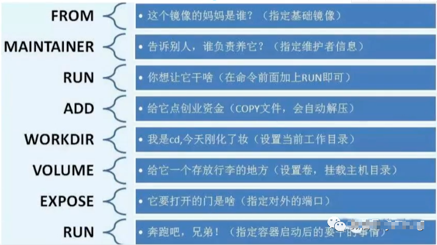

# Dockerfile

转自： https://www.cnblogs.com/along21/p/10243761.html

<br/>


## Dockerfile 简介

从前面的镜像一节已经直到镜像是分层的，而dockerfile的每一条指令都是一层，层数越多镜像的体积就越大，所以我们应该减少镜像层数，把可以合在一行的指令尽量合在一起，dockerfile 的基本组成如下图，



- 「FROM: 基础镜像，一切都从这里开始构建」**
- **「MAINTAINER: 镜像是谁写的，姓名+邮箱」**
- **「RUN: 镜像构建需要运行的命令」**
- **「ADD: 添加一个内容，比如需要添加一个tomcat，则需要传递一个压缩包，便于在容器内构建！」**
- **「WORKDIR: 镜像的工作目录」**
- **「VOLUME: 挂在的目录」**
- **「EXPOSE: 暴露端口」**
- **「CMD: 一个指令，指定这个容器启动的时候要运行的命令」**
- **「ENTRYPOINT: 指定这个容器启动的时候要运行的命令！可以追加命令！」**
- **「ONBUILD: 当构建一个被继承的Dockerfile 这个时候就会运行指令，触发命令！」**
- **「COPY: 类似与ADD，将文件拷贝到镜像中」**
- **「ENV：构建的时候设置环境变量」**

<br/>

## **1、认识Dockerfile**

### **1.1 镜像的生成途径**

镜像生成的途径分为两种，第一种是基于容器制作，第二种是自己编写dockerfile 制作

-  **基于容器制作**
-  **dockerfile，docker build**

 所谓基于容器制作，就是使用docker commit 将容器提交为容器，但是官方并不提倡这样做法，而是提倡第二种做法，自己编写dockerfile，然后使用docker build 生成镜像


### **1.2 Dockerfile 介绍**

　　Docker中有个非常重要的概念叫做——镜像（Image）。Docker 镜像是一个特殊的文件系统，除了提供容器运行时所需的程序、库、资源、配置等文件外，还包含了一些为运行时准备的一些配置参数（如匿名卷、环境变量、用户等）。镜像不包含任何动态数据，其内容在构建之后也不会被改变。

　　镜像的定制实际上就是定制每一层所添加的配置、文件。如果我们可以把每一层修改、安装、构建、操作的命令都写入一个脚本，用这个脚本来构建、定制镜像，那么之前提及的无法重复的问题、镜像构建透明性的问题、体积的问题就都会解决。这个脚本就是 Dockerfile。

　　Dockerfile 是一个文本文件，其内**包含了一条条的指令****(Instruction)**，**每一条指令构建一层，因此每一条指令的内容，就是描述该层应当如何构建**。

 

### **1.3 Dockerfile 指令**

- FROM
- MAINTAINER
- COPY
- ADD
- WORKDIR
- VOLUME
- EXPOSE
- ENV
- RUN
- CMD
- ENTRYPOINT
- HEALTHCHECK
- ONBUILD
- USER
- ARG
- SHELL
- STOPSIGNAL

 

### **1.4 Dockerfile 的使用**

1、Dockerfile 编写的基本结构

Dockerfile 一般分为四部分：基础镜像信息、维护者信息、镜像操作指令和容器启动时执行指令，’#’ 为 Dockerfile 中的注释。

2、一台主机可以有多个Dockerfile

要使用多个Dockerfile 创建镜像，可以在不同目录编写Dockerfile，然后在Dockerfile 所在的目录下构建新的镜像；

> 注意：Dockerfile 中所包含的需要的内容；如COPY的文件、目录等，都需要在Dockerfile 同级目录下存在；

3、docker build 基于dockerfile制作镜像的命令

① 格式：

```sh
docker build [OPTIONS] PATH | URL | -
```

② 选项：

-  -t：打标签
-  -c，- cpu-shares int ：CPU份额（相对权重）
-  -m，- memory bytes：内存限制
-  --build-arg：设置构建时变量，就是构建的时候修改ARG指令的参数

 

## **2、FROM 指令**

### **2.1 介绍**

-  FROM 指令必须是 Dockerfile 中**非注释行的第一个指令**，即一个 Dockerfile 从FROM语句；
-  FROM 指令用于**为镜像文件构建过程指定基础镜像**，后续的指令运行于此基础镜像所提供的运行环境；
-  实践中，基准镜像可以是任何可用镜像文件，默认情况下，docker build会在**docker主机上查找指定的镜像文件**，在其不存在时，则**会自动从 Docker 的公共库** pull 镜像下来。如果找不到指定的镜像文件，docker build 会返回一个错误信息；
-  FROM可以在一个 Dockerfile 中出现多次，如果有需求在一个 Dockerfile 中创建多个镜像。
-  如果FROM语句没有指定镜像标签，则**默认使用latest标签**。

 

### **2.2 格式**

```dockerfile
FROM <repository>[:<tag>] 或
FROM <repository>@<digest>
```

注：

-  <repository>：指定作为base image的名称；
-  <tag>：base image的标签，省略时默认latest；
-  <digest>：是镜像的哈希码；使用哈希码会更安全一点；

 

### **2.3 示例**

```dockerfile
# Description: test image
FROM busybox:latest
```

 

## 3、MAINTAINER

### 3.1 介绍

-  用于让dockerfile制作者提供本人的详细信息
-  dockerfile 并不限制MAINTAINER 指令可在出现的位置，但推荐将其放置于FROM指令之后

 

### 3.2 格式

```dockerfile
MAINTAINER <authtor's detail>
```

 

### 3.3 示例

```dockerfile
# Description: test image
FROM busybox:latest
MAINTAINER "Along <along@along.com>"
```

 

## 4、COPY

### **4.1 介绍**

-  用于从docker 主机复制新文件或者目录至创建的新镜像指定路径中 

### **4.2 格式**

```dockerfile
COPY <src>... <dest>  或
COPY ["<src>",... "<dest>"]
```

注：

-  <src>：要复制的源文件或目录，**支持使用通配符**；
-  <dest>：目标路径，即正在创建的image的文件系统路径；**建议使用绝对路径**，否则，COPY指定以WORKDIR为其实路径
-  在路径中有空白字符时，通常使用第2中格式；

 

### **4.3 文件复制准则**

-  <src>必须是build上下文中的路径，**不能是其父目录中的文件**；
-  如果**是目录**，则其**内部文件或子目录会被递归复制**，但**目录自身不会被复制**；
-  如果指定了多个<src>，或在<src>中使用了通配符，则<dest>必须是一个目录，且**必须以 / 结尾**；
-  如果<dest>事先不存在，他将**会被自动创建**，这包括父目录路径。

 

### **4.4 示例**

#### **4.4.1 COPY 文件**

1、编写dockerfile文件

```dockerfile
# Description: test image
FROM busybox:latest
MAINTAINER "Along <along@along.com>"
COPY index.html /data/web/html/    #要确保dockerfile 同级路径下有index.html文件
```

 

2、在dockerfile同级目录下准备好index.html文件

```sh
$ vim index.html
Busybox httpd server<``/h1``>
```

 

3、使用build 制作镜像

```sh
$ docker build -t busyboxhttpd:v0.1 ./
Sending build context to Docker daemon 3.072 kB
Step 1/3 : FROM busybox:latest
 ---> 758ec7f3a1ee
Step 2/3 : MAINTAINER "Along <along@along.com>"
 ---> Running in 0d6f4c1c0e8d
 ---> 5d2cda1631d7
Removing intermediate container 0d6f4c1c0e8d
Step 3/3 : COPY index.html /data/web/html/
 ---> 2e0fe0eb0cb7
Removing intermediate container 536fdc71472a
Successfully built 2e0fe0eb0cb7
```

　　

4、基于此新建镜像运行容器，进行验证

```sh
[root@along ~]# docker run --name web1 --rm busyboxhttpd:v0.1 cat /data/web/html/index.html
<h1>Busybox httpd server</h1>　
```

注：--rm：在容器关闭时，直接删除容器，方便实验。

 

#### **4.4.2 COPY 目录**

1、编写dockerfile文件

```dockerfile
# Description: test image
FROM busybox:latest
MAINTAINER "Along <along@along.com>"
COPY index.html /data/web/html/
COPY yum.repos.d /etc/yum.repos.d/
```

注：如果是复制目录，则其**内部文件或子目录会被递归复制**，但**目录自身不会被复制；需要把复制目录名字也写在容器中要复制的路径下！**

 

2、在dockerfile同级目录下准备好yum.repos.d 目录

```sh
[root@along img1]# cp -r /etc/yum.repos.d/ ./
[root@along img1]# ls yum.repos.d
along.repo  docker-ce.repo  epel-release-latest-7.noarch.rpm  epel.repo  epel-testing.repo
```

　　

3、使用build 制作镜像

```sh
[root@along img1]# docker build -t busyboxhttpd:v0.2 ./
Sending build context to Docker daemon 27.65 kB
Step 1/4 : FROM busybox:latest
 ---> 758ec7f3a1ee
Step 2/4 : MAINTAINER "Along <along@along.com>"
 ---> Using cache
 ---> 5d2cda1631d7
Step 3/4 : COPY index.html /data/web/html/
 ---> Using cache
 ---> 2e0fe0eb0cb7
Step 4/4 : COPY yum.repos.d /etc/yum.repos.d/
 ---> 68586925bdf9
Removing intermediate container a01f824efa3e
Successfully built 68586925bdf9
```

　　

4、基于此新建镜像运行容器，进行验证

```sh
[root@along ~]# docker run --name web1 --rm busyboxhttpd:v0.2 ls /etc/yum.repos.d/
along.repo
docker-ce.repo
epel-release-latest-7.noarch.rpm
epel-testing.repo
epel.repo
```

　　

## 5、ADD

### 5.1 介绍

- ADD 指令类似于COPY指令，ADD支持使用TAR文件和URL路径

 

### **5.2 格式**

```dockerfile
ADD <src> .. <dest>  或
ADD ["<src>".. "<dest>"]
```

 

### **5.3 操作准则**

-  同COPY指令
-  如果<src>为URL且<dest>不以 / 结尾，则<src>指定的文件**将被下载并直接被创建**为<dest>;如果<dest>以/结尾，则文件名URL指定的文件将被直接下载并保存为<dest>/ <filename>
-  如果<src>是**一个本地系统上的压缩格式的tar文件**，它将**被展开为一个目录**，其行为类似于"tar-x"命令；然而，**通过URL获取到的tar文件将不会自动展开**;
-  如果<src>有多个，或其间接或直接使用了通配符，则<dest>必须是一个以/结尾的目录路径 ;如果<dest>不以/结尾，则其被视作一个普通文件，<src>的内容将被直接写入到<dest>;

 

### **5.4 示例**

#### **5.4.1 COPY 网上路径（URL）的tar包**

1、编写dockerfile文件

```dockerfile
# Description: test image
FROM busybox:latest
MAINTAINER "Along <along@along.com>"
COPY index.html /data/web/html/
COPY yum.repos.d /etc/yum.repos.d/
ADD http://nginx.org/download/nginx-1.15.8.tar.gz /usr/local/src/
```

注：ADD 的<src> 是网上的nginx下载路径

 

2、使用build 制作镜像

```sh
[root@along img1]# docker build -t busyboxhttpd:v0.3 ./
Sending build context to Docker daemon 27.65 kB
Step 1/5 : FROM busybox:latest
 ---> 758ec7f3a1ee
Step 2/5 : MAINTAINER "Along <along@along.com>"
 ---> Using cache
 ---> 5d2cda1631d7
Step 3/5 : COPY index.html /data/web/html/
 ---> Using cache
 ---> 2e0fe0eb0cb7
Step 4/5 : COPY yum.repos.d /etc/yum.repos.d/
 ---> Using cache
 ---> 68586925bdf9
Step 5/5 : ADD http://nginx.org/download/nginx-1.15.8.tar.gz /usr/local/src/
Downloading 1.028 MB/1.028 MB
 ---> 91c71b469a9e
Removing intermediate container abbad8dcdefb
Successfully built 91c71b469a9e
```

　　

3、基于此新建镜像运行容器，进行验证

```sh
[root@along ~]# docker run --name web1 --rm busyboxhttpd:v0.3 ls /usr/local/src
nginx-1.15.8.tar.gz
```

　　

#### **5.4.2 COPY 本地的路径的tar包**

1、编写dockerfile文件

```dockerfile
# Description: test image
FROM busybox:latest
MAINTAINER ``"Along "
COPY index.html ``/data/web/html/
COPY yum.repos.d ``/etc/yum``.repos.d/
#ADD http://nginx.org/download/nginx-1.15.8.tar.gz /usr/local/src/
ADD nginx-1.15.8.``tar``.gz ``/usr/local/src/
```

　　

2、在dockerfile同级目录下准备好yum.repos.d 目录

```sh
[root@along img1]# wget http://nginx.org/download/nginx-1.15.8.tar.gz
```

　　

3、使用build 制作镜像

```sh
[root@along img1]# docker build -t busyboxhttpd:v0.4 ./
Sending build context to Docker daemon 1.056 MB
Step 1/5 : FROM busybox:latest
 ---> 758ec7f3a1ee
Step 2/5 : MAINTAINER "Along <along@along.com>"
 ---> Using cache
 ---> 5d2cda1631d7
Step 3/5 : COPY index.html /data/web/html/
 ---> Using cache
 ---> 2e0fe0eb0cb7
Step 4/5 : COPY yum.repos.d /etc/yum.repos.d/
 ---> Using cache
 ---> 68586925bdf9
Step 5/5 : ADD nginx-1.15.8.tar.gz /usr/local/src/
 ---> f99baec4b992
Removing intermediate container 7f02f3fe649e
```

　　

4、基于此新建镜像运行容器，进行验证

```sh
[root@along ~]# docker run --name web1 --rm busyboxhttpd:v0.4 ls /usr/local/src /usr/local/src/nginx-1.15.8
/usr/local/src:
nginx-1.15.8
 
/usr/local/src/nginx-1.15.8:
CHANGES
CHANGES.ru
LICENSE
README
auto
conf
configure
contrib
html
man
src
```

　　

## **6、WORKDIR**

### **6.1 介绍**

-  用于为Dockerfile中所有的RUN、CMD、ENTRYPOINT、COPY和ADD指定**设定工作目录**

 

### **6.2 格式**

```
WORKDIR <dirpath>
```

　　在Dockerfile文件中，**WORKDIR指令可出现多次**，其路径也可以为相对路径，不过，其是相对此**前一个WORKDIR**指令指定的路径；另外，WORKDIR也可调用由ENV指定定义的变量；

 

### **6.3 示例**

```dockerfile
# Description: test image
FROM busybox:latest
MAINTAINER "Along <along@along.com>"
COPY index.html /data/web/html/
COPY yum.repos.d /etc/yum.repos.d/
WORKDIR /usr/local/
ADD nginx-1.15.8.tar.gz ./src/
```

　　

## **7、VOLUME**

### **7.1 介绍**

-  用于在image中创建一个挂载点目录，以挂载Docker host.上的卷或其它容器上的卷

 

### **7.2 语法**

```
VOLUME <mountpoint>  或
VOLUME ["<mountpoint>"]
```

注：如果挂载点目录路径下此前在文件存在，docker run命令会在卷挂载完成后将此前的所有文件复制到新挂载的卷中

 

### **7.3 示例**

1、编写dockerfile文件

```dockerfile
# Description: test image
FROM busybox:latest
MAINTAINER "Along <along@along.com>"
 
COPY index.html /data/web/html/
COPY yum.repos.d /etc/yum.repos.d/
 
#ADD http://nginx.org/download/nginx-1.15.8.tar.gz /usr/local/src/
WORKDIR /usr/local/
ADD nginx-1.15.8.tar.gz ./src/
 
VOLUME /data/mysql
```

　　

2、使用build 制作镜像

```sh
[root@along img1]# docker build -t busyboxhttpd:v0.5 ./
Sending build context to Docker daemon 1.056 MB
Step 1/7 : FROM busybox:latest
 ---> 758ec7f3a1ee
Step 2/7 : MAINTAINER "Along <along@along.com>"
 ---> Using cache
 ---> 5d2cda1631d7
Step 3/7 : COPY index.html /data/web/html/
 ---> Using cache
 ---> 2e0fe0eb0cb7
Step 4/7 : COPY yum.repos.d /etc/yum.repos.d/
 ---> Using cache
 ---> 68586925bdf9
Step 5/7 : WORKDIR /usr/local/
 ---> Using cache
 ---> 84ad38ba3b4d
Step 6/7 : ADD nginx-1.15.8.tar.gz ./src/
 ---> Using cache
 ---> b32e992f51c5
Step 7/7 : VOLUME /data/mysql
 ---> Running in 270bd9a938eb
 ---> 90d592698082
Removing intermediate container 270bd9a938eb
Successfully built 90d592698082
```

　　

3、基于此新建镜像运行容器，进行验证

```sh
[root@along ~]# docker run --name web1 --rm -it busyboxhttpd:v0.5 /bin/sh
/usr/local #

--- 另打开一个终端，查询存储卷
[root@along ~]# docker inspect -f {{.Mounts}} web1
[{volume b788b8a50d69953e2b086b3b54ba683154647319a481246cb7ab2ff927b21372 /var/lib/docker/volumes/b788b8a50d69953e2b086b3b54ba683154647319a481246cb7ab2ff927b21372/_data /data/mysql local  true }]
```

　　

## **8、EXPOSE**

### **8.1 介绍**

-  用于为容器**打开指定要监听的端口**以实现与外部通信

 

### **8.2 语法**

```
EXPOSE <port>[/ <protocol>] [<port>[/ <protocol>] ....
```

注：

-  <protocol>用于**指定传输层协议**，可为tcp或udp二者之一，**默认为TCP协议**
-  EXPOSE指令**可一次指定多个端口**，例如：EXPOSE 11211/udp 11211/tcp

 

### **8.3 示例**

1、编写dockerfile文件

```dockerfile
# Description: test image
FROM busybox:latest
MAINTAINER "Along <along@along.com>"
 
COPY index.html /data/web/html/
COPY yum.repos.d /etc/yum.repos.d/
 
#ADD http://nginx.org/download/nginx-1.15.8.tar.gz /usr/local/src/
WORKDIR /usr/local/
ADD nginx-1.15.8.tar.gz ./src/
 
VOLUME /data/mysql
 
EXPOSE 80/tcp
```

　　

2、使用build 制作镜像

```dockerfile
[root@along img1]# docker build -t busyboxhttpd:v0.6 ./
Sending build context to Docker daemon 1.056 MB
Step 1/8 : FROM busybox:latest
 ---> 758ec7f3a1ee
Step 2/8 : MAINTAINER "Along <along@along.com>"
 ---> Using cache
 ---> 5d2cda1631d7
Step 3/8 : COPY index.html /data/web/html/
 ---> Using cache
 ---> 2e0fe0eb0cb7
Step 4/8 : COPY yum.repos.d /etc/yum.repos.d/
 ---> Using cache
 ---> 68586925bdf9
Step 5/8 : WORKDIR /usr/local/
 ---> Using cache
 ---> 84ad38ba3b4d
Step 6/8 : ADD nginx-1.15.8.tar.gz ./src/
 ---> Using cache
 ---> b32e992f51c5
Step 7/8 : VOLUME /data/mysql
 ---> Using cache
 ---> 90d592698082
Step 8/8 : EXPOSE 80/tcp
 ---> Running in 53b13561994d
 ---> 182463025992
Removing intermediate container 53b13561994d
Successfully built 182463025992
```

　　

3、基于此新建镜像运行容器，进行验证

```dockerfile
[root@along ~]# docker run --name web1 -P --rm -it busyboxhttpd:v0.6 /bin/httpd -f -h /data/web/html
--- 另打开一个终端，验证httpd 服务的80端口
[root@along ~]# docker inspect -f {{.NetworkSettings.IPAddress}} web1  #查询容器的IP
172.17.0.2
[root@along ~]# curl 172.17.0.2:80
<h1>Busybox httpd server</h1>
--- 在宿主机通过暴露的端口访问httpd 服务
[root@along ~]# docker port web1
80/tcp -> 0.0.0.0:32768
[root@along ~]# curl 127.0.0.1:32768
<h1>Busybox httpd server</h1>
```

**注：就算dockerfile 中有EXPOSE 指令暴露端口，但是不是真正的暴露；需要在启动容器时，使用-P 选项真正的暴露端口。**

 

## **9、ENV**

### **9.1 介绍**

-  用于为镜像定义所需的**环境变量**，并可被Dockerfile文件中**位于其后的**其它指令(如ENV、ADD、COPY等)所调用
-  调用格式为$variable_ name 或 ${variable_ name}

 

### **9.2 格式**

```
ENV <key> <value>  或
ENV <key>=<value> . .
```

注：

-  **第一种格式**中，<key>之后的所有内容均会被视作其<value>的组成部分， 因此，**一次只能设置一个变量;**
-  **第二种格式可用一次设置多个变量**，每个变量为一个”<key>=<value>"的键值对，**如果中包含空格，可以以反斜线（\）进行转义**，也可通过对<value>加引号进行标识；另外，**反斜线也可用于续行**;
-  定义多个变量时，**建议使用第二种方式**，以便在同一层中完成所有功能

 

### **9.3 示例**

1、编写dockerfile文件

```dockerfile
# Description: test image
FROM busybox:latest
MAINTAINER "Along <along@along.com>"
ENV DOC_ROOT=/data/web/html/ \
    WEB_SERVER_PACKAGE="nginx-1.15.8"
 
COPY index.html ${DOC_ROOT}
COPY yum.repos.d /etc/yum.repos.d/
 
#ADD http://nginx.org/download/nginx-1.15.8.tar.gz /usr/local/src/
WORKDIR /usr/local/
ADD ${WEB_SERVER_PACKAGE}.tar.gz ./src/
 
VOLUME /data/mysql
 
EXPOSE 8080:80/tcp
```

　　

2、使用build 制作镜像

```dockerfile
Sending build context to Docker daemon 1.056 MB
Step 1/9 : FROM busybox:latest
 ---> 758ec7f3a1ee
Step 2/9 : MAINTAINER "Along <along@along.com>"
 ---> Using cache
 ---> 5d2cda1631d7
Step 3/9 : ENV DOC_ROOT /data/web/html/ WEB_SERVER_PACKAGE "nginx-1.15.8"
 ---> Running in b268b672236a
 ---> 295bf19a8395
Removing intermediate container b268b672236a
Step 4/9 : COPY index.html ${DOC_ROOT}
 ---> c29d3c8f6e0d
Removing intermediate container 33238b2ba6bf
Step 5/9 : COPY yum.repos.d /etc/yum.repos.d/
 ---> 3a2a2f571b07
Removing intermediate container bc49392442bc
Step 6/9 : WORKDIR /usr/local/
 ---> a695a7f0265f
Removing intermediate container aa12de3e47db
Step 7/9 : ADD ${WEB_SERVER_PACKAGE}.tar.gz ./src/
 ---> aca798ede129
Removing intermediate container 4cf601151915
Step 8/9 : VOLUME /data/mysql
 ---> Running in 497595d537a7
 ---> 8f52b722011c
Removing intermediate container 497595d537a7
Step 9/9 : EXPOSE 8080:80/tcp
 ---> Running in 1dac584db62d
 ---> b10c56601efb
Removing intermediate container 1dac584db62d
Successfully built b10c56601efb
```

　　

3、基于此新建镜像运行容器，进行验证

```sh
[root@along ~]# docker run --name web1 -P --rm -it busyboxhttpd:v0.7 ls /usr/local/src /data/web/html
/data/web/html:
index.html
 
/usr/local/src:
nginx-1.15.8

--- 也可以使用printenv 查看变量验证
[root@along ~]# docker run --name web1 --rm -it busyboxhttpd:v0.7
PATH=/usr/local/sbin:/usr/local/bin:/usr/sbin:/usr/bin:/sbin:/bin
DOC_ROOT=/data/web/html/
WEB_SERVER_PACKAGE=nginx-1.15.8
--- 在启动容器时，使用docker run -e 设置修改变量
[root@along ~]# docker run --name web1 -e WEB_SERVER_PACKAGE=nginx-1.15.7 --rm -it busyboxhttpd:v0.7 printenv
PATH=/usr/local/sbin:/usr/local/bin:/usr/sbin:/usr/bin:/sbin:/bin
WEB_SERVER_PACKAGE=nginx-1.15.7
DOC_ROOT=/data/web/html/
```

　　

## **10、RUN**

### **10.1 介绍**

-  用于指定docker build过程中运行的程序，其可以是任何命令

 

### **10.2 语法**

```
RUN <command>  或
RUN ["<executable>", "<param1>", "<param2>"]
```

注：

-  第一种格式中，<command>通常是一个**shell命令**， 且**以“/bin/sh -c”来运行**它，这意味着此进程在容器中的PID不为1,不能接收Unix信号，因此，**当使用docker stop 命令停止容器时，此进程接收不到SIGTERM信号**；
-  第二种语法格式中的参数是一个**JSON格式的数组**，其中<executable>为要运行的命令，后面的 <paramN>为传递给命令的选项或参数；然而，此种格式指定的命令**不会以“/bin/sh -c”来发起**，因此**常见的shell操作**如变量替换以及通配符(?,*等)替换**将不会进行**；不过，如果要运行的命令依赖于此shell特性的话，可以将其替换为类似下面的格式。
-  RUN ["/bin/bash", "-c", "<executable>", "<param1>"]

 

### **10.3 示例**

1、编写dockerfile文件：使用RUN 执行解压命令

```dockerfile
# Description: test image
FROM busybox:latest
MAINTAINER "Along <along@along.com>"
ENV DOC_ROOT=/data/web/html/ \
    WEB_SERVER_PACKAGE="nginx-1.15.8.tar.gz"
 
COPY index.html ${DOC_ROOT}
COPY yum.repos.d /etc/yum.repos.d/
 
WORKDIR /usr/local/
ADD http://nginx.org/download/${WEB_SERVER_PACKAGE} ./src/
#ADD ${WEB_SERVER_PACKAGE} ./src/
 
VOLUME /data/mysql
 
EXPOSE 8080:80/tcp
 
RUN cd ./src && \
    tar -xf ${WEB_SERVER_PACKAGE}
```

　　

2、使用build 制作镜像

```dockerfile
[root@along img1]# docker build -t busyboxhttpd:v0.8 ./
Sending build context to Docker daemon 1.056 MB
Step 1/10 : FROM busybox:latest
 ---> 758ec7f3a1ee
Step 2/10 : MAINTAINER "Along <along@along.com>"
 ---> Using cache
 ---> 5d2cda1631d7
Step 3/10 : ENV DOC_ROOT /data/web/html/ WEB_SERVER_PACKAGE "nginx-1.15.8.tar.gz"
 ---> Running in ff660867b971
 ---> fef5c3f0295a
Removing intermediate container ff660867b971
Step 4/10 : COPY index.html ${DOC_ROOT}
 ---> 825ae434ab56
Removing intermediate container 0e22f2a6b9c2
Step 5/10 : COPY yum.repos.d /etc/yum.repos.d/
 ---> 33b5aa2e5b9b
Removing intermediate container 51722b8fcee3
Step 6/10 : WORKDIR /usr/local/
 ---> 31912ce0b9b1
Removing intermediate container ecfe195635a2
Step 7/10 : ADD http://nginx.org/download/${WEB_SERVER_PACKAGE} ./src/
Downloading 1.028 MB/1.028 MB
 ---> 5d46a9337dfe
Removing intermediate container d38191e8b1ff
Step 8/10 : VOLUME /data/mysql
 ---> Running in 5c18e8b76af2
 ---> 2d1ee498340b
Removing intermediate container 5c18e8b76af2
Step 9/10 : EXPOSE 8080:80/tcp
 ---> Running in 8c32c08cdb78
 ---> 17700871c846
Removing intermediate container 8c32c08cdb78
Step 10/10 : RUN cd ./src &&     tar -xf ${WEB_SERVER_PACKAGE}
 ---> Running in 555b43cc59db
 ---> 21973fc25ad4
Removing intermediate container 555b43cc59db
Successfully built 21973fc25ad4
```

　　

3、基于此新建镜像运行容器，进行验证：已经执行了解压命令

```sh
[root@along ~]# docker run --name web1 -P --rm -it busyboxhttpd:v0.7 ls /usr/local/src
nginx-1.15.8
```

　　

## **11、CMD**

### **11.1 介绍**

- **类似于RUN指令**，CMD指令也可用于运行任何命令或应用程序，不过，二者的运行时间点不同
-  **RUN指令运行于映像文件****构建****过程**中，而**CMD指令运行于基于Dockerfile构建出的新映像文件****启动****一个容器时**
-  CMD指令的首要**目的在于为启动的容器指定默认要运行的程序**，且其运行结束后，容器也将终止；不过，CMD指定的命令其可以被docker run的命令行选项所覆盖
-  在Dockerfile中可以存在**多个CMD指令，但仅最后一个会生效**

 

### **11.2 语法**

```
CMD <command>  或
CMD [“<executable>",“<param1>","<param2>"]  或
CMD ["<param1>","<param2>"]
```

注：

-  前两种语法格式的意义同RUN
-  第三种则用于为ENTRYPOINT指令提供默认参数
-  json数组中，要使用**双引号**，单引号会出错

 

### **11.3 示例**

1、编写dockerfile文件

```dockerfile
FROM busybox
LABEL maintainer="Along <along@along.com>" app="httpd"
 
ENV WEB_DOC_ROOT="/data/web/html"
 
RUN mkdir -p ${WEB_DOC_ROOT} && \
    echo "<h1>Busybox httpd server</h1>" > ${WEB_DOC_ROOT}/index.html
 
CMD /bin/httpd -f -h ${WEB_DOC_ROOT}
```

　　

2、使用build 制作镜像

```sh
[root@along image2]# docker build -t busyboxhttpd:v1.1 ./
Sending build context to Docker daemon 2.048 kB
Step 1/5 : FROM busybox
 ---> 758ec7f3a1ee
Step 2/5 : LABEL maintainer "Along <along@along.com>" app "httpd"
 ---> Using cache
 ---> ec064f9da09a
Step 3/5 : ENV WEB_DOC_ROOT "/data/web/html"
 ---> Using cache
 ---> fedfecef57c8
Step 4/5 : RUN mkdir -p ${WEB_DOC_ROOT} &&     echo "<h1>Busybox httpd server</h1>" > ${WEB_DOC_ROOT}/index.html
 ---> Running in a9b9f66db1fd
 ---> 7ab194ffda82
Removing intermediate container a9b9f66db1fd
Step 5/5 : CMD /bin/httpd -f -h ${WEB_DOC_ROOT}
 ---> Running in ecb0430965d0
 ---> 3ec2f9b160b7
Removing intermediate container ecb0430965d0
Successfully built 3ec2f9b160b7
```

　　

3、基于此新建镜像运行容器，进行验证，httpd正常运行

```sh
[root@along ~]# docker run --name web2 --rm -d busyboxhttpd:v1.1
20aa07198943887db51173e245392f75e3654525cb32242f2b04f0b3e007e47d

[root@along ~]# docker inspect -f {{.NetworkSettings.IPAddress}} web2
172.17.0.2

[root@along ~]# curl 172.17.0.2
<h1>Busybox httpd server</h1>

--- 也可以使用exec 进入web2容器内进行验证
[root@along ~]# docker exec -it web2 /bin/sh
/ # ps
PID   USER     TIME  COMMAND
    1 root      0:00 /bin/httpd -f -h /data/web/html
    5 root      0:00 /bin/sh
    9 root      0:00 ps
    
/ # printenv
WEB_DOC_ROOT=/data/web/html

/ # exit

--- 使用CMD定义的命令，在启动容器时，会被后面追加的指令覆盖；与下面ENTRYPOINT 指令对比
[root@along ~]# docker kill web2
web2

[root@along ~]# docker run --name web2 --rm busyboxhttpd:v1.1 ls /
bin
data
dev
etc

[root@along ~]# curl 172.17.0.2  被ls /覆盖，所以没有执行httpd服务
```

　　

## **12、ENTRYPOINT**

### **12.1 介绍**

-  **类似CMD**指令的功能，用于为容器指定默认运行程序，从而使得容器像是一个单独的可执行程序
-  与CMD不同的是，由ENTRYPOINT启动的程序**不会被docker run命令行指定的参数所覆盖**，而且，**这些命令行参数会被当作参数传递给ENTRYPOINT指定指定的程序**
-  不过，docker run命令的 --entrypoint选项的参数可覆盖ENTRYPOINT指令指定的程序

 

### **12.2 语法**

```
ENTRYPOINT <command>
ENTRYPOINT ["<executable>", "<param1>", "<param2>"]
```

注：

-  docker run命令传入的命令参数会覆盖CMD指令的内容并且附加到ENTRYPOINT命令最后做为其参数使用
-  Dockerfile文件中也可以存在多个ENTRYPOINT指令，但仅有最后一个会生效

 

### **12.3 示例**

1、编写dockerfile文件

```dockerfile
FROM busybox
LABEL maintainer="Along <along@along.com>" app="httpd"
 
ENV WEB_DOC_ROOT="/data/web/html"
 
RUN mkdir -p ${WEB_DOC_ROOT} && \
    echo "<h1>Busybox httpd server</h1>" > ${WEB_DOC_ROOT}/index.html
 
 
 CMd  -f -h ${WEB_DOC_ROOT}
ENTRYPOINT /bin/httpd 
```

　　

2、使用build 制作镜像

```sh
[root@along image2]# docker build -t busyboxhttpd:v1.2 ./
Sending build context to Docker daemon 2.048 kB
Step 1/5 : FROM busybox
 ---> 758ec7f3a1ee
Step 2/5 : LABEL maintainer "Along <along@along.com>" app "httpd"
 ---> Using cache
 ---> ec064f9da09a
Step 3/5 : ENV WEB_DOC_ROOT "/data/web/html"
 ---> Using cache
 ---> fedfecef57c8
Step 4/5 : RUN mkdir -p ${WEB_DOC_ROOT} &&     echo "<h1>Busybox httpd server</h1>" > ${WEB_DOC_ROOT}/index.html
 ---> Using cache
 ---> 7ab194ffda82
Step 5/5 : ENTRYPOINT /bin/httpd -f -h ${WEB_DOC_ROOT}
 ---> Running in aebee4cd3d4f
 ---> 2e3853256eab
Removing intermediate container aebee4cd3d4f
Successfully built 2e3853256eab
```

　　

3、基于此新建镜像运行容器，进行验证

```sh
[root@along ~]# docker run --name web2 --rm busyboxhttpd:v1.2 ls /
发现是不会执行ls / 这个命令；仍然执行的是ENTRYPOINT中设置的命令；与上面CMD 指令对比；
[root@along ~]# curl 172.17.0.2   #httpd服务仍然执行，没有被ls / 指令覆盖
<h1>Busybox httpd server</h1>
```

　　

## **13、HEALTHCHECK **

### **13.1 介绍**

-  HEALTHCHECK指令告诉Docker如何测试容器以检查它是否仍在工作。
-  即使服务器进程仍在运行，这也可以检测出陷入无限循环且无法处理新连接的Web服务器等情况。

 

### **13.2 语法**

```
HEALTHCHECK [OPTIONS] CMD command (通过在容器内运行命令来检查容器运行状况)
HEALTHCHECK NONE (禁用从基础映像继承的任何运行状况检查)
```

1、OPTIONS 选项：

-  --interval=DURATION (default: 30s)：每隔多长时间探测一次，默认30秒
-  -- timeout= DURATION (default: 30s)：服务响应超时时长，默认30秒
-  --start-period= DURATION (default: 0s)：服务启动多久后开始探测，默认0秒
-  --retries=N (default: 3)：认为检测失败几次为宕机，默认3次

 

2、返回值：

-  0：容器成功是健康的，随时可以使用
-  1：不健康的容器无法正常工作
-  2：保留不使用此退出代码

 

### 13.3 示例

1、编写dockerfile文件

检测web2容器的10080端口（其实打开的是80端口，10080并没有，所有会检测失败）

```dockerfile
FROM busybox
LABEL maintainer="Along <along@along.com>" app="httpd"
 
ENV WEB_DOC_ROOT="/data/web/html"
 
RUN mkdir -p ${WEB_DOC_ROOT} && \
    echo "<h1>Busybox httpd server</h1>" > ${WEB_DOC_ROOT}/index.html
 
CMD /bin/httpd -f -h ${WEB_DOC_ROOT}
 
HEALTHCHECK --start-period=3s CMD wget -O - -q http://${IP:-0.0.0.0}:10080/
```

　　

2、使用build 制作镜像

```sh
[root@docker2 image2]# docker build -t busyboxhttpd:v1.3 ./
Sending build context to Docker daemon  2.048kB
Step 1/6 : FROM busybox
 ---> 3a093384ac30
Step 2/6 : LABEL maintainer="Along <along@along.com>" app="httpd"
 ---> Using cache
 ---> 164a0af1b5dc
Step 3/6 : ENV WEB_DOC_ROOT="/data/web/html"
 ---> Using cache
 ---> 930023fca80b
Step 4/6 : RUN mkdir -p ${WEB_DOC_ROOT} &&     echo "<h1>Busybox httpd server</h1>" > ${WEB_DOC_ROOT}/index.html
 ---> Using cache
 ---> 1df364fca443
Step 5/6 : CMD /bin/httpd -f -h ${WEB_DOC_ROOT}
 ---> Running in 671f9491d0c3
Removing intermediate container 671f9491d0c3
 ---> 71451fa629e9
Step 6/6 : HEALTHCHECK --start-period=3s CMD wget -O - -q http://${IP:-0.0.0.0}:${PORT:-80}/
 ---> Running in 474395f265da
Removing intermediate container 474395f265da
 ---> 757ab550ea25
Successfully built 757ab550ea25
Successfully tagged busyboxhttpd:v1.3
```

　　

3、基于此新建镜像运行容器，进行验证

```sh
[root@docker2 ~]# docker run --name web2 --rm -d busyboxhttpd:v1.3
7060a6717e77acecd683a6b05332ab7cec128b836e6aa2d7d5ce8fb1b38b7fd6

--- 容器刚创建，还没检测完时，容器还是health 健康状态
[root@docker2 ~]# docker ps
CONTAINER ID        IMAGE               COMMAND                  CREATED             STATUS                            PORTS               NAMES
7060a6717e77        busyboxhttpd:v1.3   "/bin/sh -c '/bin/ht…"   3 seconds ago       Up 3 seconds (health: starting)                       web2

--- 30s 检测完时，没有检测到10080端口，容器变为unhealthy不健康状态
[root@docker2 ~]# docker ps
CONTAINER ID        IMAGE               COMMAND                  CREATED             STATUS                      PORTS               NAMES
7060a6717e77        busyboxhttpd:v1.3   "/bin/sh -c '/bin/ht…"   30 seconds ago      Up 30 seconds (unhealthy)                       web2
```

　　

## **14、ONBUILD**

### **14.1 介绍**

-  用于在Dockerfile中**定义一个触发器**
-  Dockerfile用于build映像文件，此映像文件亦可作为base image被另一个Dockerfile用作FROM指令的参数，并以之构建新的映像文件
-  在**后面的这个Dockerfile中的FROM指令在build过程中被执行**时，将**会“触发”**创建其base image的**Dockerfile文件中的ONBUILD指令**定义的触发器

 

### **14.2 语法**

```
ONBUILD < Instruction>
```

-  尽管任何指令都可注册成为触发器指令，但ONBUILD不能自我嵌套，且不会触发FROM和MAINTAINER指令
-  使用包含ONBUILD指令的Dockerfile构建的镜像应该使用特殊的标签，例如ruby:2.0-onbuil
-  在ONBUILD指令中使用ADD或COPY指令应该格外小心，因为新构建过程的上下文在缺少指定的源文件时会失败

 

### **14.3 示例**

1、编写第一个Dockerfile文件，准备作为第二个Dockerfile文件的FROM基础镜像

```dockerfile
FROM busybox
MAINTAINER "Along <along@along.com>"
 
ENV WEB_DOC_ROOT="/data/web/html"
 
RUN mkdir -p ${WEB_DOC_ROOT} && \
    echo "<h1>Busybox httpd server1</h1>" > ${WEB_DOC_ROOT}/index.html
 
ONBUILD RUN echo "<h1>Busybox httpd server2</h1>" >> /data/web/html/index.html
```

　　

2、编写第2个Dockerfile文件，FROM 基于第1个Dockerfile

```dockerfile
FROM busyboxhttpd:v2.1
```

 

3、基于2个Dockerfile文件新建镜像，并运行容器，进行验证

① 基于第1个Dockerfile文件新建镜像

```sh
[root@along image3]# docker build -t busyboxhttpd:v2.1 ./
Sending build context to Docker daemon 2.048 kB
Step 1/5 : FROM busybox
 ---> 758ec7f3a1ee
Step 2/5 : MAINTAINER "Along <along@along.com>"
 ---> Using cache
 ---> 5d2cda1631d7
Step 3/5 : ENV WEB_DOC_ROOT "/data/web/html"
 ---> Running in 210437fc0778
 ---> 0a3becd99802
Removing intermediate container 210437fc0778
Step 4/5 : RUN mkdir -p ${WEB_DOC_ROOT} &&     echo "<h1>Busybox httpd server1</h1>" > ${WEB_DOC_ROOT}/index.html &&     /bin/chown nobody ${WEB_DOC_ROOT}/index.html /bin/httpd
 ---> Running in e370d8843211
 ---> 4c1f59085f78
Removing intermediate container e370d8843211
Step 5/5 : ONBUILD run echo "<h1>Busybox httpd server2</h1>" >> /data/web/html/index.html
 ---> Running in f47258319e1d
 ---> 232b1c393634
Removing intermediate container f47258319e1d
Successfully built 232b1c393634
```

　　

② 基于第2个Dockerfile文件新建镜像

```sh
[root@along ~]# docker build -t busyboxhttpd:v2.2 ./
Sending build context to Docker daemon 2.467 MB
Step 1/1 : FROM busyboxhttpd:v2.1
# Executing 1 build trigger...
Step 1/1 : RUN echo "<h1>Busybox httpd server2</h1>" >> /data/web/html/index.html
 ---> Using cache
 ---> a2a6ae382228
Successfully built a2a6ae382228
```

　　

③ 基于二个新镜像启动容器验证

```sh
[root@along ~]# docker run --name web2 --rm busyboxhttpd:v2.1 cat /data/web/html/index.html
<h1>Busybox httpd server1</h1>
--- 证明ONBUILD指令，只在第2个Dockerfile文件中生效
[root@along ~]# docker run --name web2 --rm busyboxhttpd:v2.2 cat /data/web/html/index.html
<h1>Busybox httpd server1</h1>
<h1>Busybox httpd server2</h1>
```

 

## **15、不常用的 dockerfile 指令**

### **15.1 USER**

#### **15.1.1 介绍**

-  用于指定运行image时的或运行Dockerfile中任何RUN、CMD或EntRyPoInT指令指定的程序时的用户名或UID
-  默认情况下，container的运行身份为root用户

 

#### **15.1.2 格式**

```
USER <UID>| <U JserName >
```

　　需要注意的是，<UID>可以为任意数字，但实践中其必须为/etc/ passwd中某用户的有效UID,否则，docker run命令将运行失败

 

### **15.2 ARG**

#### **15.2.1 介绍**

-  ARG指令类似ENV，定义了一个变量；区别于ENV：用户可以在构建时docker build --build-arg <varname> = <value> 进行对变量的修改；ENV不可以；
-  如果用户指定了未在Dockerfile中定义的构建参数，那么构建输出警告。

 

#### **15.2.2 格式**

```
ARG <name>[= <default value>]
```

Dockerfile可以包含一个或多个ARG指令

 

**15.2.2 示例**

1、在dockerfile 中定义ARG

```dockerfile
FROM busybox:latest
ARG author="Along <along@along.com>"
MAINTAINER $ARG
```

　　

2、构建此时镜像时，修改此age

```sh
docker build --build-arg author="Tom <tom@tom.com>" -t test:v0.1 ./
```

 

### **15.3 SHELL**

#### **15.3.1 介绍**

-  SHELL指令允许覆盖用于shell命令形式的默认shell。
-  Linux上的默认shell是[“/ bin / sh”，“c”]，在Windows上是[“cmd”，“/ S”，“/ C”]
-  SHELL指令必须以JSON格式写入Dockerfile。

 

#### **15.3.2 语法**

```
SHELL ["executable", "parameters"]
```

-  SHELL指令可以多次出现。
-  每个SHELL指令都会覆盖所有先前的SHELL指令，并影响所有后续指令。

 

### **15.4 STOPSIGNAL**

#### 15.4.1 介绍

-  STOPSIGNAL指令设置将发送到容器出口的系统调用信号。
-  此信号可以是与内核的系统调用表中的位置匹配的有效无符号数，例如9，或者SIGNAME格式的信号名，例如SIGKILL。

 

#### 15.4.2 语法

```
STOPSIGNAL signal
```


## 