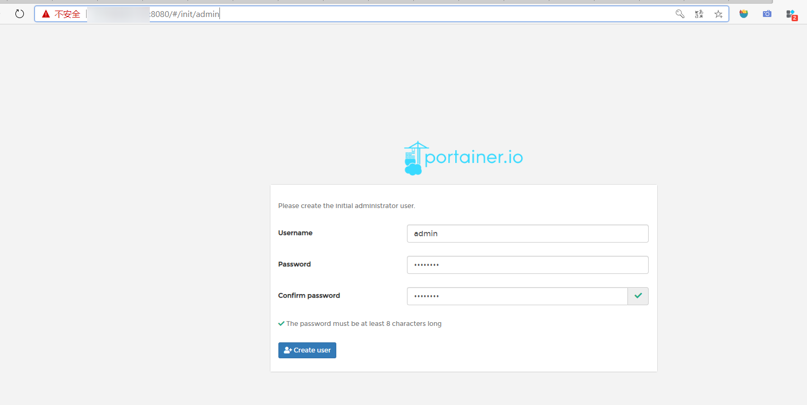
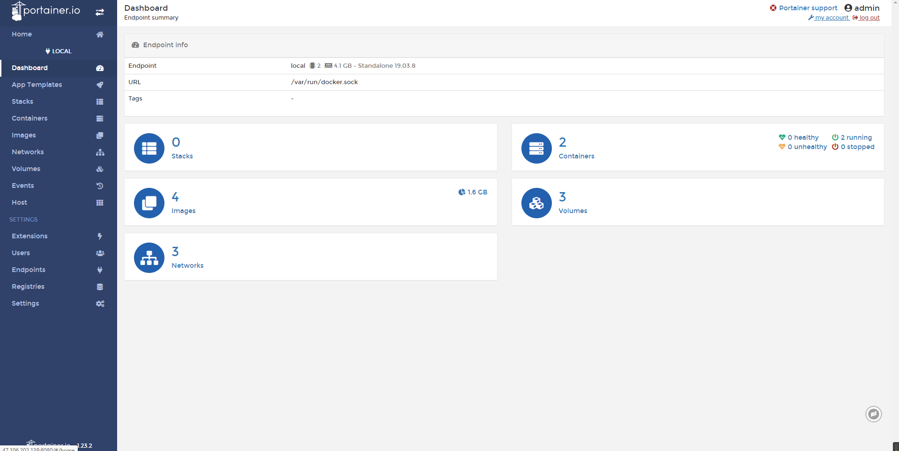

## Portainer 可视化面板安装

- portainer(先用这个)

```
docker run -d -p 8080:9000 \--restart=always -v /var/run/docker.sock:/var/run/docker.sock --privileged=true portainer/portainer
```

- Rancher(CI/CD再用)
  **什么是portainer？**

Docker图形化界面管理工具！提供一个后台面板供我们操作！

```sh
# 安装命令
[root@iz2zeak7sgj6i7hrb2g862z ~]# docker run -d -p 8080:9000 \
> --restart=always -v /var/run/docker.sock:/var/run/docker.sock --privileged=true portainer/portainer
Unable to find image 'portainer/portainer:latest' locally
latest: Pulling from portainer/portainer
d1e017099d17: Pull complete 
a7dca5b5a9e8: Pull complete 
Digest: sha256:4ae7f14330b56ffc8728e63d355bc4bc7381417fa45ba0597e5dd32682901080
Status: Downloaded newer image for portainer/portainer:latest
81753869c4fd438cec0e31659cbed0d112ad22bbcfcb9605483b126ee8ff306d
```


测试访问： 外网：8080 ：http://123.56.247.59:8080/



进入之后的面板

