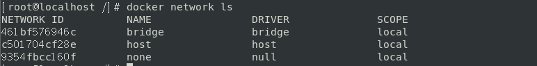

## Docker 网络基础

### docker 网络通讯

在安装docker 之后的，docker会在当前宿主机加入一块自己的虚拟化网卡，如下：

```shell
[root@slave1 ~]# ip a s docker0
3: docker0: <BROADCAST,MULTICAST,UP,LOWER_UP> mtu 1500 qdisc noqueue state UP group default 
    link/ether 02:42:50:e0:0e:fd brd ff:ff:ff:ff:ff:ff
    inet 172.17.0.1/16 brd 172.17.255.255 scope global docker0
       valid_lft forever preferred_lft forever
    inet6 fe80::42:50ff:fee0:efd/64 scope link 
       valid_lft forever preferred_lft forever
```

可以把docker0 理解为一个交换机，或者是一个网桥。


不同的网络空间会隔离，通过network namespace 来隔离docker 容器之间的网络，并且会出现两端，一端会出现在容器内部 一端会绑定在 宿主机上 做一个连通作用，network namespace 会把网络隔离开。


1、容器与 容器 之间的通讯

不同容器之间通过docker0网桥进行通讯


2、容器访问外部网络

通过 iptables 的路由转发规则，将访问外部网络的流量转发到 NAT上


3、外部网络访问容器

通过 iptables 的路由转发规则，将外网访问容器内部的流量转发到docker0上


Docker使用的是Linux的桥接技术，宿主机是一个Docker容器的网桥 docker0 


**注意：**Docker中所有网络接口都是虚拟的，虚拟的转发效率高！（内网传递文件） 

只要容器一删除，对应的一对网桥就没有！ 


### docker 自定义网络模式

#### 进程网络修改


#### 容器网络修改

- -- dns： 用户指定启动的容器的DNS
- -- net 用于执行容器的网络通讯方式，有以下四个值
  - bridge: Dockert 默认方式，网桥模式
  - none：容器没有网络栈
  - container：使用其他容器网络栈，Docker 容器会加入其他容器的network
  - host：表示容器使用Host网络，没有自己独立的网络栈，容器可以完全访问Host网络 不安全

-p /P 选项的使用格式： 

- -p   <ContainerPort> 将指定的容器端口隐射到主机所有地址的一个动态端口
- -p  <HostPort> : <ContainerPort> ： 隐射至指定的主机端口
- -p  <IP>：：<ContainerPort> : 映射至指定的主机的IP 的动态端口
- -p <Ip>：<HostPort>：<ContainerPort> : 隐射至指定的主机IP的主机端口
- -P （大写） 暴露所有需要的端口


### docker相关的网络命令：

#### docker network 

- ls ：查看当前的网络信息
- inspect： 显示一个或多个网络的详细信息 
- connect： 将容器连接到网络 
  - `--alias` 为容器添加网络范围的别名  
  - `--ip` 指定IP地址 `--ip6` 指定IPv6地址  ` 
  - `--link` 添加链接到另一个容器  
  - `--link-local-ip` 添加容器的链接本地地址
- disconnect：将某一个容器退出当前网络
  - -f 强制断开网络
- purge： 删除所有未使用的网络 
- create ：  创建一个网络 
  - `--attachable` `false` 启用手动容器安装  
  - `--aux-address` `map[]` 网络驱动程序使用的辅助IPv4或IPv6地址  
  - `--driver, -d` `bridge` 驱动程序管理网络  
  - `--gateway` 用于主子网的IPv4或IPv6网关  
  - `--internal` `false` 限制对网络的外部访问  
  - `--ip-range` 从子范围分配容器`ip`  
  - `--ipam-driver` `default` IP地址管理驱动程序  
  - `--ipam-opt` `map[]` 设置IPAM驱动程序的具体选项  
  - `--ipv6` `false` 启用IPv6网络  
  - `--label` 在网络上设置元数据  
  - `--opt, -o` `map[]` 设置驱动程序特定选项 
  -  `--subnet` 表示网段的CIDR格式的子网
- rm  删除一个或多个网络

示例：

**连接容器网络**

启动容器时，使用`--network`标志将其连接到网络。 此示例将`busybox`容器添加到`mynet`网络：

```shell
$ docker run -itd --network=mynet busybox
Shell
```

如果要在容器运行后将容器添加到网络，请使用`docker network connect`子命令。

**指定高级选项**

创建网络时，引擎默认为网络创建一个不重叠的子网。 该子网不是现有网络的细分。 它纯粹用于IP寻址目的。可以覆盖此默认值，并使用`--subnet`选项直接指定子网络值。 在桥接网络上，只能创建单个子网：

```shell
$ docker network create --driver=bridge --subnet=192.168.0.0/16 br0
Shell
```

另外，还可以指定`--gateway --ip-range`和`--aux-address`选项。

```shell
$ docker network create \
  --driver=bridge \
  --subnet=172.28.0.0/16 \
  --ip-range=172.28.5.0/24 \
  --gateway=172.28.5.254 \
  br0
```


#### docker port

查看当前容器暴露的端口信息


### --link  容器网络通讯

> 思考一个场景：我们编写了一个微服务，database url = ip ，项目不重启，数据库ip换掉了，我 们希望可以处理这个问题，可以通过名字来访问容器？ 

```shell
# tomcat02 想通过直接ping 容器名（即"tomcat01"）来ping通，而不是ip，发现失败了！ 

[root@localhost /]# docker exec -it tomcat02 ping tomcat01 

ping: tomcat01: Name or service not known 

# 如何解决这个问题呢？ 
# 通过--link 就可以解决这个网络联通问题了！！！ 发现新建的tomcat03可以ping通tomcat02 
[root@localhost /]# docker run -d -P --name tomcat03 --link tomcat02 tomcat 

87a0e5f5e6da34a7f043ff6210b57f92f40b24d0d4558462e7746b2e19902721 

[root@localhost /]# docker exec -it tomcat03 ping tomcat02 

PING tomcat02 (172.17.0.3) 56(84) bytes of data. 
64 bytes from tomcat02 (172.17.0.3): icmp_seq=1 ttl=64 time=0.132 ms 
64 bytes from tomcat02 (172.17.0.3): icmp_seq=2 ttl=64 time=0.116 ms 
64 bytes from tomcat02 (172.17.0.3): icmp_seq=3 ttl=64 time=0.116 ms64 bytes from tomcat02 (172.17.0.3): icmp_seq=4 ttl=64 time=0.116 ms 

# 反向能ping通吗？ 发现tomcat02不能oing通tomcat03 
[root@localhost /]# docker exec -it tomcat02 ping tomcat03 
ping: tomcat03: Name or service not known 
```


探究：inspect ！！！ 


其实这个tomcat03就是在本地配置了到tomcat02的映射： 

```shell
# 查看hosts 配置，在这里发现原理！ 

[root@localhost /]# docker exec -it tomcat03 cat /etc/hosts 

127.0.0.1 localhost 
::1 localhost ip6-localhost ip6-loopback 
fe00::0 ip6-localnet 
ff00::0 ip6-mcastprefix 
ff02::1 ip6-allnodes 
ff02::2 ip6-allrouters 
172.17.0.3 tomcat02 95303c12f6d9 # 就像windows中的 host 文件一样，做了地址绑定 
172.17.0.4 87a0e5f5e6da 
```

本质探究：--link 就是我们在hosts 配置中增加了一个 172.17.0.3 tomcat02 95303c12f6d9 （三条信 息都是tomcat02 的） 

我们现在玩Docker已经不建议使用 --link 了！！！


### 自定义网络

根据上面我们介绍的命令 来查看 自定义docker 网络

> 查看所有的docker网络




#### 网络模式

- bridge ：桥接 （docker默认，自己创建也使用bridge模式！）
- none ：不配置网络
- host ：和宿主机共享网络
- container ：容器网络连通，容器直接互联！（用的少！局限很大！）

#### 测试

```shell
# 我们之前直接启动的命令 (默认是使用--net bridge，可省)，这个bridge就是我们的docker0
docker run -d -P --name tomcat01 tomcat 
docker run -d -P --name tomcat01 --net bridge tomcat

# 上面两句等价
# docker0（即bridge）默认不支持域名访问 ！ --link可以打通连接，即支持域名访问！
# 我们可以自定义一个网络！
# --driver bridge  网络模式定义为 ：桥接
# --subnet 192.168.0.0/16 定义子网 ，范围为：192.168.0.2 ~ 192.168.255.255
# --gateway 192.168.0.1 子网网关设为： 192.168.0.1
[root@localhost /]# docker network create --driver bridge --subnet
192.168.0.0/16 --gateway 192.168.0.1 mynet
7ee3adf259c8c3d86fce6fd2c2c9f85df94e6e57c2dce5449e69a5b024efc28c

[root@localhost /]# docker network ls
NETWORK ID     NAME        DRIVER       SCOPE
461bf576946c    bridge       bridge       local
c501704cf28e    host        host        local
7ee3adf259c8    mynet        bridge       local #自定义的网络
9354fbcc160f    none        null        local
```


**自己的网络就创建好了：**


**启动容器：使用--net 指定我们的自己创建的 mynet网络**

```shell
[root@localhost /]# docker run -d -P --name tomcat-net-01 --net mynet tomcat
b168a37d31fcdc2ff172fd969e4de6de731adf53a2960eeae3dd9c24e14fac67
[root@localhost /]# docker run -d -P --name tomcat-net-02 --net mynet tomcat
c07d634e17152ca27e318c6fcf6c02e937e6d5e7a1631676a39166049a44c03c
[root@localhost /]# docker network inspect mynet
[
 {
    "Name": "mynet",
    "Id":
"7ee3adf259c8c3d86fce6fd2c2c9f85df94e6e57c2dce5449e69a5b024efc28c",
    "Created": "2020-06-14T01:03:53.767960765+08:00",
    "Scope": "local",
    "Driver": "bridge",
    "EnableIPv6": false,
    "IPAM": {
      "Driver": "default",
      "Options": {},
      "Config": [
       {
          "Subnet": "192.168.0.0/16",
          "Gateway": "192.168.0.1"
       }
     ]
   },
    "Internal": false,
    "Attachable": false,
    "Ingress": false,
    "ConfigFrom": {
      "Network": ""
   },
    "ConfigOnly": false,
    "Containers": {
      "b168a37d31fcdc2ff172fd969e4de6de731adf53a2960eeae3dd9c24e14fac67":
{
        "Name": "tomcat-net-01",
        "EndpointID":
"f0af1c33fc5d47031650d07d5bc769e0333da0989f73f4503140151d0e13f789",
        "MacAddress": "02:42:c0:a8:00:02",
        "IPv4Address": "192.168.0.2/16",
        "IPv6Address": ""
     },
      "c07d634e17152ca27e318c6fcf6c02e937e6d5e7a1631676a39166049a44c03c":
{
        "Name": "tomcat-net-02",
        "EndpointID":
"ba114b9bd5f3b75983097aa82f71678653619733efc1835db857b3862e744fbc",
        "MacAddress": "02:42:c0:a8:00:03",
        "IPv4Address": "192.168.0.3/16",
        "IPv6Address": ""
     }
   },
    "Options": {},
    "Labels": {}
 }
]

# 再次测试 ping 连接
[root@localhost /]# docker exec -it tomcat-net-01 ping 192.168.0.3
PING 192.168.0.3 (192.168.0.3) 56(84) bytes of data.
64 bytes from 192.168.0.3: icmp_seq=1 ttl=64 time=0.199 ms
64 bytes from 192.168.0.3: icmp_seq=2 ttl=64 time=0.121 ms
--- 192.168.0.3 ping statistics ---
2 packets transmitted, 2 received, 0% packet loss, time 2ms
rtt min/avg/max/mdev = 0.121/0.160/0.199/0.039 ms

# 现在不使用 --link,也可以ping 名字了！！！！！！
[root@localhost /]# docker exec -it tomcat-net-01 ping tomcat-net-02
PING tomcat-net-02 (192.168.0.3) 56(84) bytes of data.
64 bytes from tomcat-net-02.mynet (192.168.0.3): icmp_seq=1 ttl=64 time=0.145 ms
64 bytes from tomcat-net-02.mynet (192.168.0.3): icmp_seq=2 ttl=64 time=0.117 ms
--- tomcat-net-02 ping statistics ---
2 packets transmitted, 2 received, 0% packet loss, time 3ms
rtt min/avg/max/mdev = 0.117/0.131/0.145/0.014 ms
```

我们在使用自定义的网络时，docker都已经帮我们维护好了对应关系，推荐我们平时这样使用网络！！！

**好处：**

- redis——不同的集群使用不同的网络，保证了集群的安全和健康
- mysql——不同的集群使用不同的网络，保证了集群的安全和健康


#### 网络连通


```shell
# 测试打通 tomcat01 — mynet
[root@localhost /]# docker network connect mynet tomcat01

# 连通之后就是将 tomcat01 放到了 mynet 网络下！ （见下图）
# 这就产生了 一个容器有两个ip地址 ! 参考阿里云的公有ip和私有ip
[root@localhost /]# docker network inspect mynet
```


```shell
# tomcat01 连通ok
[root@localhost /]# docker exec -it tomcat01 ping tomcat-net-01
PING tomcat-net-01 (192.168.0.2) 56(84) bytes of data.
64 bytes from tomcat-net-01.mynet (192.168.0.2): icmp_seq=1 ttl=64 time=0.124 ms
64 bytes from tomcat-net-01.mynet (192.168.0.2): icmp_seq=2 ttl=64 time=0.162 ms
64 bytes from tomcat-net-01.mynet (192.168.0.2): icmp_seq=3 ttl=64 time=0.107 ms
--- tomcat-net-01 ping statistics ---
3 packets transmitted, 3 received, 0% packet loss, time 3ms
rtt min/avg/max/mdev = 0.107/0.131/0.162/0.023 ms

# tomcat02 是依旧打不通的
[root@localhost /]# docker exec -it tomcat02 ping tomcat-net-01
ping: tomcat-net-01: Name or service not known
```


### 容器独立IP（跨主机通讯）


通过 pipework 进行通讯


