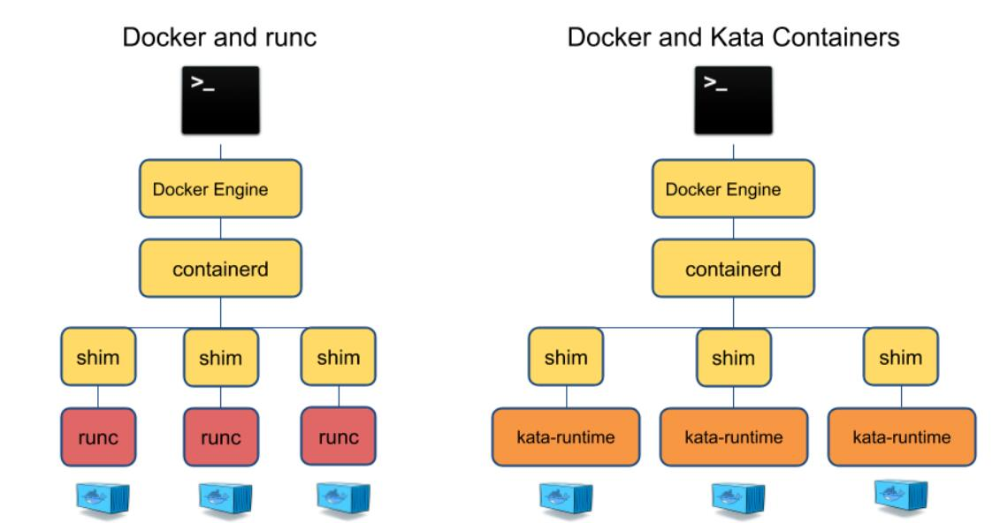
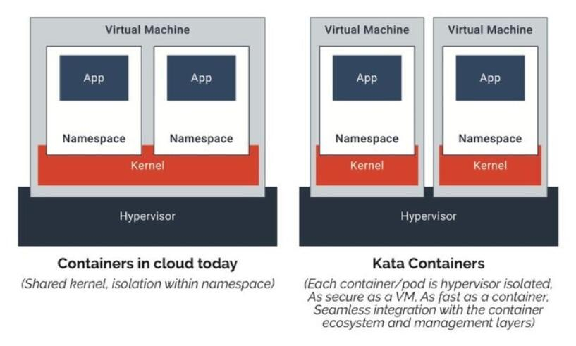

由 流过昼夜 提交于 2020-11-23 08:26:51

**⒈KataContainers？**

　　Kata Containers是新的虚拟机实现，可以实现和现在容器生态无缝连接，与时下最流行的容器编排工具k8s完美结合，提供容器的快速启动，和虚拟机的安全隔离，与Docker技术相比，容器之间不共用内核，使得隔离性更好。

　　Kata Containers 项目的主要目标是将虚拟化的安全隔离优势和容器的快速启动特点结合起来。

**⒉即生Docker，何来Kata Containers？**
　　Linux 容器轻巧，快速且易于集成到许多不同的应用程序工作流程中。但是，在运行容器时存在一些潜在的安全问题，特别是在单个操作系统中的多租户容器：最终，容器共享一个内核、 I / O 的一条路径、网络和内存等。

　　使用Docker轻量级的容器时，最大的问题就是会碰到安全性的问题，其中几个不同的容器可以互相的进行攻击，如果把这个内核给攻掉了，其他所有容器都会崩溃。如果使用KVM等虚拟化技术，会完美解决安全性的问题，但是会影响速度。

Kata旨在通过虚拟机管理程序来缓解这种安全问题——创建一个外观和感觉像容器的虚拟机。
Kata Containers项目通过整合Intel Clear Containers和Hyper runV技术，能够支持不同平台的硬件，并且兼容Open Container Initiative(OCI)和Kubernetes container runtime interface(CRI)接口规范。Kata Containers项目现在由OpenStack基金会管理，代码托管在Github(https://github.com/kata-containers)上。

**⒊使用Kata Containers替换Docker？**

　　从docker架构上看，kata-container和原来的runc是平级的。大家知道docker只是管理容器生命周期的框架，真正启动容器最早用的是LXC，然后是runc，现在也可以换成kata了。所以说kata-container可以当做docker的一个插件，启动kata-container可以通过docker命令。Kata最大的亮点是解决了传统容器共享内核的安全和隔离问题，办法是让每个容器运行在一个轻量级的虚拟机中，使用单独的内核。 





**⒋现在开始？**

⒈、安装Kata Containers容器包（以Centos为例）

```
1、 source /etc/os-release

2、sudo yum -y install yum-utils

3、ARCH=$(arch)

4、BRANCH="${BRANCH:-master}"

5、sudo -E yum-config-manager --add-repo "http://download.opensuse.org/repositories/home:/katacontainers:/releases:/${ARCH}:/${BRANCH}/CentOS_${VERSION_ID}/home:katacontainers:releases:${ARCH}:${BRANCH}.repo"

6、sudo -E yum -y install kata-runtime kata-proxy kata-shim

```

2、安装Docker

```
1、sudo yum-config-manager --add-repo https://download.docker.com/linux/centos/docker-ce.repo

2、sudo yum -y install docker-ce
```

3、使用以下方法之一配置Docker默认使用Kata Containers:

- systemd（这是默认设置，如果选择[自动安装](https://github.com/kata-containers/documentation/tree/master/install#automatic-installation)选项，[则会自动](https://github.com/kata-containers/documentation/tree/master/install#automatic-installation)应用 ）

```
1、sudo mkdir -p /etc/systemd/system/docker.service.d/
```

```
2、 cat <<EOF | sudo tee /etc/systemd/system/docker.service.d/kata-containers.conf
[Service]
ExecStart=
ExecStart=/usr/bin/dockerd -D --add-runtime kata-runtime=/usr/bin/kata-runtime --default-runtime=kata-runtime
EOF
```

- 使用Docker daemon.json

```
1、创建docker配置文件夹
sudo mkdir -p /etc/docker

2、将以下定义添加到`/etc/docker/daemon.json`：
{
  "default-runtime": "kata-runtime",
  "runtimes": {
    "kata-runtime": {
      "path": "/usr/bin/kata-runtime"
    }
  }
}
```

- 使用以下命令重新启动Docker systemd服务：

```
1、sudo systemctl daemon-reload

2、sudo systemctl restart docker
```

- 测试　　　　　　

```
1、1.运行Kata Containers
sudo docker run busybox uname -a
```

此时命令显示了在容器内运行的内核版本的详细信息，这应与主机的内核版本不同。