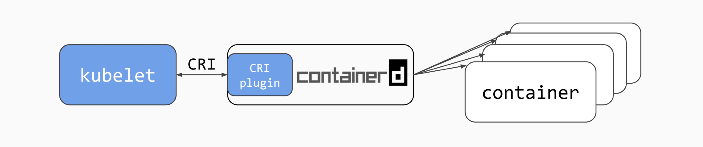
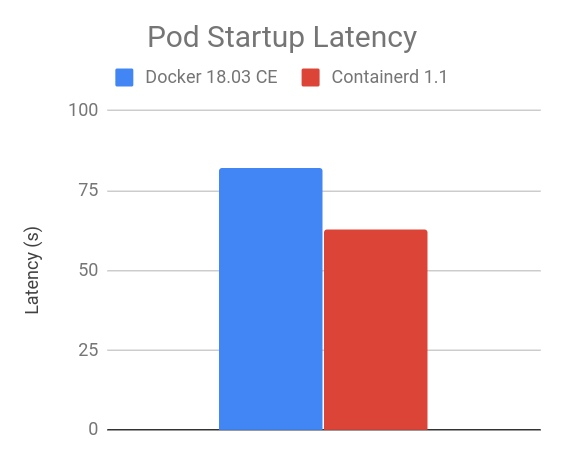
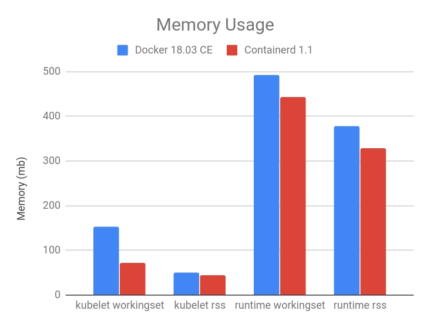
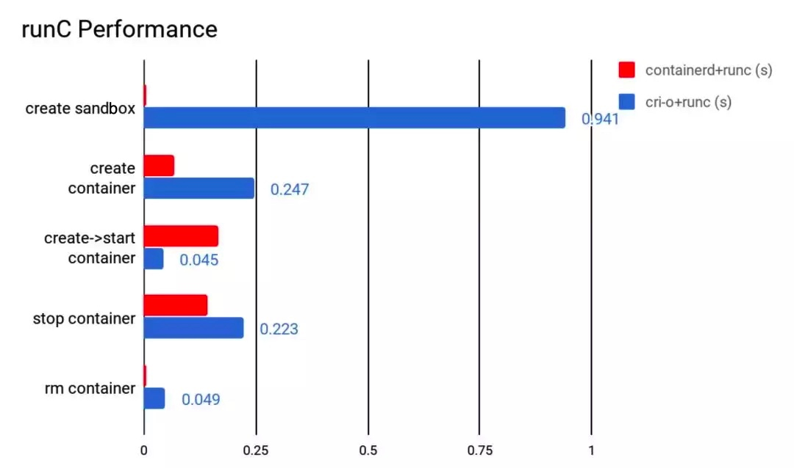
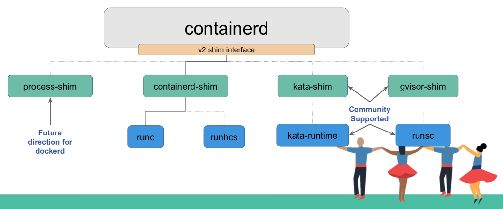
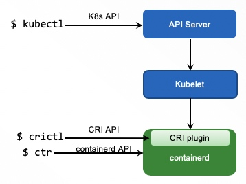
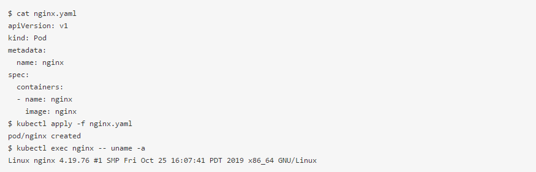
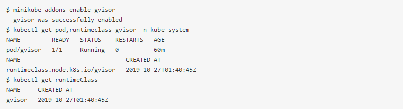
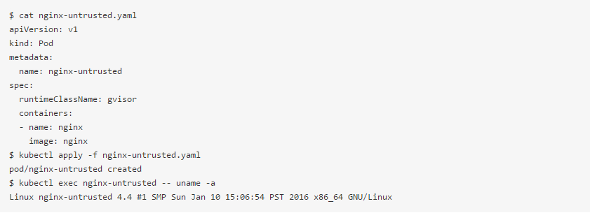

containerd 是一个开源的行业标准容器运行时，关注于简单、稳定和可移植，同时支持 Linux 和 Windows。

- 2016 年 12 月 14 日，Docker 公司宣布将 Docker Engine 的核心组件 containerd 捐赠到一个新的开源社区独立发展和运营。阿里云、AWS、 Google、IBM 和 Microsoft 作为初始成员，共同建设 containerd 社区；
- 2017 年 3 月，Docker 将 containerd 捐献给 CNCF（云原生计算基金会）。containerd 得到了快速的发展和广泛的支持；
- Docker 引擎已经将 containerd 作为容器生命周期管理的基础，Kubernetes 也在 2018 年 5 月，正式支持 containerd 作为容器运行时管理器；
- 2019 年 2 月，CNCF 宣布 containerd 毕业，成为生产可用的项目。

containerd 从 1.1 版本开始就已经内置了 Container Runtime Interface (CRI) 支持，进一步简化了对 Kubernetes 的支持。其架构图如下：

在 Kubernetes 场景下，containerd 与完整 Docker Engine 相比，具有更少的资源占用和更快的启动速度。

红帽主导的 cri-o 是与 containerd 竞争的容器运行时管理项目。containerd 与 cri-o 项目相比，在性能上具备优势，在社区支持上也更加广泛。

更重要的是 containerd 提供了灵活的扩展机制，支持各种符合 OCI（Open Container Initiative）的容器运行时实现，比如 runc 容器（也是熟知的 Docker 容器）、KataContainer、gVisor 和 Firecraker 等安全沙箱容器。

在 Kubernetes 环境中，可以用不同的 API 和命令行工具来管理容器 / Pod、镜像等概念。为了便于大家理解，我们可以用下图说明如何利用不同层次的 API 和 CLI 管理容器生命周期管理。

- Kubectl：是集群层面的命令行工具，支持 Kubernetes 的基本概念
- crictl：是针对节点上 CRI 的命令行工具
- ctr：是针对 containerd 的命令行工具

# 体验

Minikube 是体验 containerd 作为 Kubernetes 容器运行时的最简单方式，我们下面将其作为 Kubernetes 容器运行时，并支持 runc 和 gvisor 两种不同的实现。

早期由于网络访问原因，很多朋友无法直接使用官方 Minikube 进行实验。在最新的 Minikube 1.5 版本中，已经提供了完善的配置化方式，可以帮助大家利用阿里云的镜像地址来获取所需 Docker 镜像和配置，同时支持 Docker/Containerd 等不同容器运行时。我们创建一个 Minikube 虚拟机环境，注意需要指明 --container-runtime=containerd 参数设置 containerd 作为容器运行时。同时 registry-mirror 也要替换成自己的阿里云镜像加速地址。

# 部署测试应用

我们通过 Pod 部署一个 nginx 应用：

然后，我们开启 minikube 对 gvisor 支持：

当 gvisor pod 进入 Running 状态的时候，可以部署 gvisor 测试应用。

我们可以看到 K8s 集群中已经注册了一个 gvisor 的“runtimeClassName”。之后，开发者可以通过在 Pod 声明中的 “runtimeClassName” 来选择不同类型的容器运行时实现。比如，如下我们创建一个运行在 gvisor 沙箱容器中的 nginx 应用。

我们可以清楚地发现：由于基于 runc 的容器与宿主机共享操作系统内核，runc 容器中查看到的 OS 内核版本与 Minikube 宿主机 OS 内核版本相同；而 gvisor 的 runsc 容器采用了独立内核，它和 Minikube 宿主机 OS 内核版本不同。

正是因为每个沙箱容器拥有独立的内核，减小了安全攻击面，具备更好的安全隔离特性。适合隔离不可信的应用，或者多租户场景。注意：gvisor 在 minikube 中，通过 ptrace 对内核调用进行拦截，其性能损耗较大，此外 gvisor 的兼容性还有待增强。