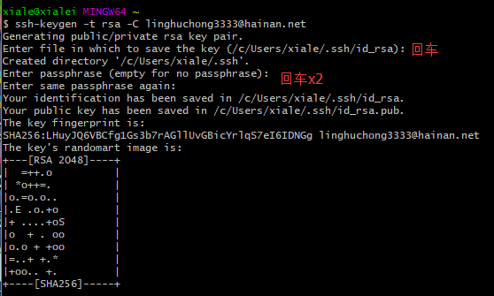
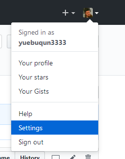
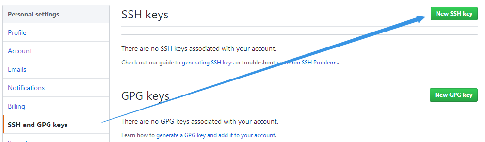
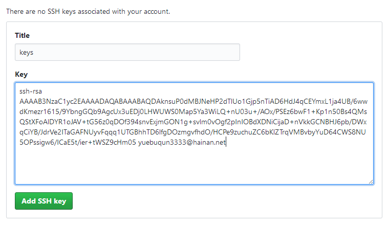

1. 先使用ssh-keygen 生成免密私匙

```
ssh-keygen.exe   -t  rsa -C  @email.com
```





2. 进入.ssh文件包，打印id_rsa.pub的内容，复制全部内容


步骤4. 登录Github后，右上角点击setting




步骤5. 在左侧菜单中选择SSH and GPG keys,在右边点击New SSH key




步骤6 : Title随便写，Key 把之前id_rsa.pub的内容复制进去，点击 Add SSH key，设置ssh key 完成。

