### 设置用户名和密码

git config --global user.name "dcjoney"

git config --global user.email "@qq.com"


查看用户名和密码

git config --global user.name

git config --global user.email


### git 初始化仓库

```
git init 初始化仓库

git add .（*） 添加文件

git commit -m "注释"

git status 查看当前的文件状态

git clone url.git 克隆 地址
```


### git 查看日志

```
git log  查看git的信息(查看全部版本的历史记录)
git log 文件名 进行查看历史记录

git log --pretty=oneline 查看具体的历史版本号（查看的更舒服一点）(查看全部版本的历史记录)
git log --pretty=oneline 文件名 简易信息查看
```


### git 版本回退

```
git reset --hard 版本号（版本号在git log中查看） 直接回退到某个版本号

git reset --hard HEAD^ 回滚上一个版本

git reset --hard HEAD~n 回退n次操作

git reflog 查看 版本的所有信息（查看仓库的所有操作）
```

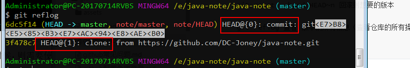

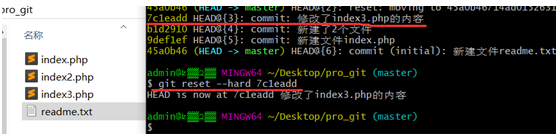


```
a. 要想回到过去，必须先得到commit id，然后通过git reset –hard 进行回退；
b. 要想回到未来，需要使用git reflog进行历史操作查看，得到最新的commit id； 
c. 在写回退指令的时候commit id可以不用写全，git自动识别，但是也不能写太少，至少需要写前4位字符；
```


### git修改分支信息

```
 git remote -h

usage: git remote [-v | --verbose]
   or: git remote add [-t <branch>] [-m <master>] [-f] [--tags | --no-tags] [--mirror=<fetch|push>] <name> <url>
   or: git remote rename <old> <new>
   or: git remote remove <name>
   or: git remote set-head <name> (-a | --auto | -d | --delete | <branch>)
   or: git remote [-v | --verbose] show [-n] <name>
   or: git remote prune [-n | --dry-run] <name>
   or: git remote [-v | --verbose] update [-p | --prune] [(<group> | <remote>)...]
   or: git remote set-branches [--add] <name> <branch>...
   or: git remote get-url [--push] [--all] <name>
   or: git remote set-url [--push] <name> <newurl> [<oldurl>]
   or: git remote set-url --add <name> <newurl>
   or: git remote set-url --delete <name> <url>

    -v, --verbose         be verbose; must be placed before a subcommand


git remote -v 查看远程信息

git remote add url 添加某个远程分支
```


### git分支管理

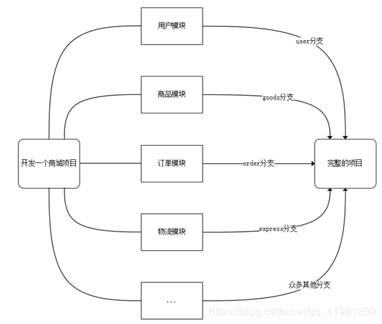

在版本回退的章节里，每次提交后都会有记录，Git把它们串成时间线，形成类似于时间轴的东西，这个时间轴就是一个分支，我们称之为master分支。
在开发的时候往往是团队协作，多人进行开发，因此光有一个分支是无法满足多人同时开发的需求的，并且在分支上工作并不影响其他分支的正常使用，会更加安全，Git鼓励开发者使用分支去完成一些开发任务。

```
查看分支：git branch
创建分支：git branch 分支名
切换分支：git checkout 分支名 
删除分支：git branch -d 分支名
合并分支：git merge 被合并的分支名
```


查看分支：

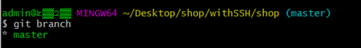


**注意：当前分支前面有个标记 “*”**


创建分支：

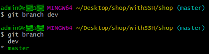


切换分支：

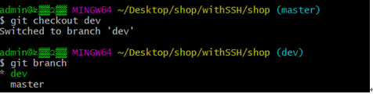


合并分支：

1、现在先在dev分支下的readme文件中新增一行并提交本地

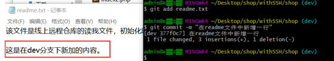


2、切换到master分支下观察readme文件

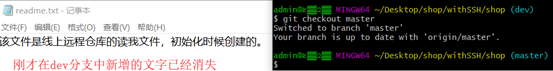


3、将dev分支的内容与master分支合并：

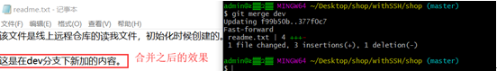


4、删除分支：

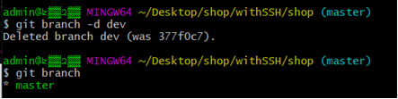

注意：**在删除分支的时候，一定要先退出要删除的分支，然后才能删除。**


5、合并所有分支之后，需要将master分支提交线上远程仓库中：

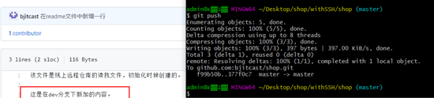


### git 冲突管理


### git 其他命令

```
6.还原文件
• git checkout -- 文件名


7.删除某个文件
• 先删除文件
• 再git add 再提交


git branch -b dev : 先创建分支 再切换分支

git clone url.git 克隆 地址
```

