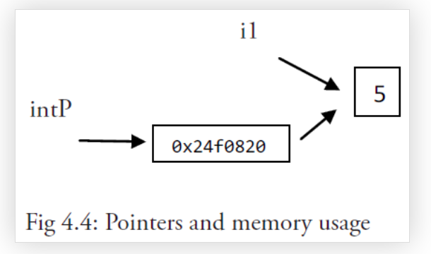
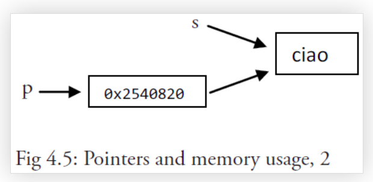

## 指针

每个内存块（或字）有一个地址，通常用十六进制数表示，如：`0x6b0820` 或 `0xf84001d7f0`。

Go 语言的取地址符是 `&`，放到一个变量前使用就会返回相应变量的内存地址

示例：

```go
var i1 = 5
fmt.Printf("An integer: %d, it's location in memory: %p\n", i1, &i1)

var intP *int

intP = &i1 //是合法的

格式化指针的格式化标识符为 %p
```

一个指针变量可以指向任何一个值的内存地址 它指向那个值的内存地址，在 32 位机器上占用 4 个字节，在 64 位机器上占用 8 个字节，并且与它所指向的值的大小无关。当然，可以声明指针指向任何类型的值来表明它的原始性或结构性；你可以在指针类型前面加上 * 号（前缀）来获取指针所指向的内容，这里的 * 号是一个类型更改器。使用一个指针引用一个值被称为间接引用。

当一个指针被定义后没有分配到任何变量时，它的值为 nil。

一个指针变量通常缩写为 ptr。


注意事项：

在书写表达式类似 var p *type 时，切记在 * 号和指针名称间留有一个空格，因为 var p*type 是语法正确的，但是在更复杂的表达式中，它容易被误认为是一个乘法表达式！

符号 * 可以放在一个指针前，如 *intP，那么它将得到这个指针指向地址上所存储的值；这被称为反引用（或者内容或者间接引用）操作符；另一种说法是指针转移。

对于任何一个变量 var， 如下表达式都是正确的：var == *(&var)。

现在，我们应当能理解 pointer.go 的全部内容及其输出：

```go
package main
import "fmt"
func main() {
    var i1 = 5
    fmt.Printf("An integer: %d, its location in memory: %p\n", i1, &i1)
    var intP *int
    intP = &i1
    fmt.Printf("The value at memory location %p is %d\n", intP, *intP)
}

输出结果：
An integer: 5, its location in memory: 0x24f0820
The value at memory location 0x24f0820 is 5

```


上述程序这行的内存结果如下：




### 使用指针修改值

```go
package main
import "fmt"
func main() {
    s := "good bye"
    var p *string = &s
    *p = "ciao"
    fmt.Printf("Here is the pointer p: %p\n", p) // prints address
    fmt.Printf("Here is the string *p: %s\n", *p) // prints string
    fmt.Printf("Here is the string s: %s\n", s) // prints same string
}

输出结果：
Here is the pointer p: 0x2540820
Here is the string *p: ciao
Here is the string s: ciao

通过对 *p 赋另一个值来更改 “对象”，这样 s 也会随之更改。
```

 内存示意图如下： 




### 注意事项

指针无法指向一个常量 或者一个常量

```go
const i = 5
ptr := &i //error: cannot take the address of i
ptr2 := &10 //error: cannot take the address of 10
```

 对一个空指针的反向引用是不合法的，并且会使程序崩溃： 

```go
package main
func main() {
    var p *int = nil
    *p = 0
}
// in Windows: stops only with: <exit code="-1073741819" msg="process crashed"/>
// runtime error: invalid memory address or nil pointer dereference
```

