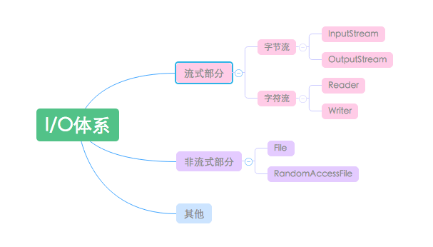
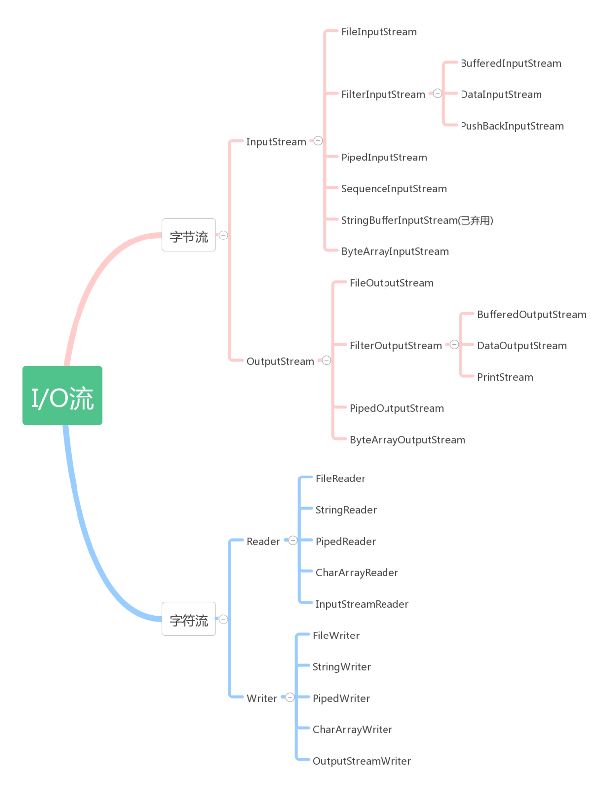

# Java IO

## IO

Java IO是Java附带的API，它的目标是读写数据(输入和输出)。大多数应用程序需要处理一些输入并基于这些输入生成一些输出。 

 IO 主要分为两大类，分别为 网络IO 与 文件IO两大类， Java IO包主要关注文件、网络流、内部内存缓冲区等的输入和输出。 

java 对应 网络IO 相关类分别为（Socket 与 ServerSocket），java.net


## NIO

Java还包含另一个IO API，称为Java NIO。

它包含的类与Java IO和Java联网api的功能基本相同，但Java NIO可以在非阻塞模式下工作。

在某些情况下，非阻塞IO会比阻塞IO带来更大的性能提升。

而文件IO 则使用了装饰者模式分为了 Stream 与 Writer/Reader ,分别对应于字符流与字节流


## IO 概览

Java中的流分为两种：

1) 字节流：数据流中最小的数据单元是字节

2) 字符流：数据流中最小的数据单元是字符， Java中的字符是Unicode编码，一个字符占用两个字节。

下面这张图描绘了一个程序从数据源读取数据，然后将数据输出到其他媒介的原理：

[](http://ifeve.com/wp-content/uploads/2014/10/无标题1.png)

一个程序需要InputStream或者Reader从数据源读取数据，需要OutputStream或者Writer将数据写入到目标媒介中。以下的图说明了这一点：

[](http://ifeve.com/wp-content/uploads/2014/10/无标题2.png)

InputStream和Reader与数据源相关联，OutputStream和writer与目标媒介相关联。


### Java IO类概述表

已经讨论了数据源、目标媒介、输入、输出和各类不同用途的Java IO类，接下来是一张通过输入、输出、基于字节或者字符、以及其他比如缓冲、解析之类的特定用途划分的大部分Java IO类的表格。

[](http://ifeve.com/wp-content/uploads/2014/10/QQ截图20141020174145.png)


### 接口分类

Java.io包中最重要的就是5个类和一个接口。

5个类指的是File、OutputStream、InputStream、Writer、Reader；一个接口指的是Serializable。


### 层次

Java I/O主要包括如下3层次：

- 流式部分——最主要的部分。如：OutputStream、InputStream、Writer、Reader等
- 非流式部分——如：File类、RandomAccessFile类和FileDescriptor等类
- 其他——文件读取部分的与安全相关的类，如：SerializablePermission类，以及与本地操作系统相关的文件系统的类，如：FileSystem类和Win32FileSystem类和WinNTFileSystem类。 


### 主要类

- File（文件特征与管理）：用于文件或者目录的描述信息，例如生成新目录，修改文件名，删除文件，判断文件所在路径等。
- InputStream（字节流，二进制格式操作）：抽象类，基于字节的输入操作，是所有输入流的父类。定义了所有输入流都具有的共同特征。
- OutputStream（字节流，二进制格式操作）：抽象类。基于字节的输出操作。是所有输出流的父类。定义了所有输出流都具有的共同特征。
- Reader（字符流，文本格式操作）：抽象类，基于字符的输入操作。
- Writer（字符流，文本格式操作）：抽象类，基于字符的输出操作。
- RandomAccessFile（随机文件操作）：它的功能丰富，可以从文件的任意位置进行存取（输入输出）操作。

  


### IO流

java.io包里有4个基本类：InputStream、OutputStream及Reader、Writer类，它们分别处理字节流和字符流。

  


### 按照 来源分类

- File（文件）： FileInputStream, FileOutputStream, FileReader, FileWriter

- byte[]：ByteArrayInputStream, ByteArrayOutputStream

- Char[]: CharArrayReader, CharArrayWriter

- String: StringBufferInputStream, StringReader, StringWriter

- 网络数据流：InputStream, OutputStream, Reader, Writer


### InputStream

InputStream 为字节输入流，它本身为一个抽象类，必须依靠其子类实现各种功能，此抽象类是表示字节输入流的所有类的超类。

继承自InputStream 的流都是向程序中输入数据的，且数据单位为字节（8bit）；

InputStream是输入字节数据用的类，所以InputStream类提供了3种重载的read方法.Inputstream类中的常用方法：

```java
//读取一个byte的数据，返回值是高位补0的int类型值。若返回值=-1说明没有读取到任何字节读取工作结束。 
public abstract int read();
//读取b.length个字节的数据放到b数组中。返回值是读取的字节数。该方法实际上是调用下一个方法实现的 
public int read(byte b[]);
//从输入流中最多读取len个字节的数据，存放到偏移量为off的b数组中。 
public int read(byte b[], int off, int len);
//返回输入流中可以读取的字节数。注意：若输入阻塞，当前线程将被挂起，如果InputStream对象调用这个方法的话，它只会返回0，这个方法必须由继承InputStream类的子类对象调用才有用，
public int available();
//忽略输入流中的n个字节，返回值是实际忽略的字节数, 跳过一些字节来读取 
public long skip(long n);
//使用完后，必须对我们打开的流进行关闭。 来看看几种不同的InputStream：
public int close();
```


FileInputStream把一个文件作为InputStream，实现对文件的读取操作

ByteArrayInputStream：把内存中的一个缓冲区作为InputStream使用

StringBufferInputStream：把一个String对象作为InputStream

PipedInputStream：实现了pipe的概念，主要在线程中使用 

SequenceInputStream：把多个InputStream合并为一个InputStream


### OutputStream

OutputStream提供了3个write方法来做数据的输出，这个是和InputStream是相对应的。

```java
//将参数b中的字节写到输出流。
public void write(byte b[]);
//将参数b的从偏移量off开始的len个字节写到输出流。
public void write(byte b[], int off, int len);
//先将int转换为byte类型，把低字节写入到输出流中。
public abstract void write(int b); 
//将数据缓冲区中数据全部输出，并清空缓冲区。
public void flush(); 
//关闭输出流并释放与流相关的系统资源。 几种不同的OutputStream：
public void close();
```

- ByteArrayOutputStream：把信息存入内存中的一个缓冲区中
- FileOutputStream：把信息存入文件中 
- PipedOutputStream：实现了pipe的概念，主要在线程中使用 
- SequenceOutputStream：把多个OutStream合并为一个OutStream Reader和InputStream类似；Writer和OutputStream类似。

**有两个需要注意的：**

InputStreamReader： 从输入流读取字节，在将它们转换成字符。

BufferReader: 接受Reader对象作为参数，并对其添加字符缓冲器，使用readline()方法可以读取一行。


### JavaIO 并发IO

有时候你可能需要并发地处理输入和输出。换句话说，你可能有超过一个线程处理输入和产生输出。比如，你有一个程序需要处理磁盘上的大量文件，这个任务可以通过并发操作提高性能。又比如，你有一个web服务器或者聊天服务器，接收许多连接和请求，这些任务都可以通过并发获得性能的提升。

如果你需要并发处理IO，这里有几个问题可能需要注意一下：

1、**在同一时刻不能有多个线程同时从InputStream或者Reader中读取数据，也不能同时往OutputStream或者Writer里写数据。你没有办法保证每个线程读取多少数据，以及多个线程写数据时的顺序**。

2、如果线程之间能够保证操作的顺序，它们可以使用同一个stream、reader、writer。比如，你有一个线程判断当前的输入流来自哪种类型的请求，然后将流数据传递给其他合适的线程做后续处理。当有序存取流、reader、writer时，这种做法是可行的。请注意，在线程之间传递流数据的代码应当是同步的。

**注意：在Java NIO中，你可以让一个线程读写多个“channel”。比如，你有很多网络连接处于开启状态，但是每个连接中都只有少量数据，类似于聊天服务器，可以让一个线程监视多个频道(连接)。Java NIO是另一个话题了，会后续教程中介绍。**


### JavaIO 字节和字节数组

java 提供了关于字节的 输入输出流，这是面向java内部源的。请参考按照来源分类：

ByteArrayInputStream
ByteArrayOutputStream

#### 示例：

**从** **InputStream** **或** **Reader****中读取数组**

用ByteArrayInputStream或者CharArrayReader封装字节或者字符数组从数组中读取数据。通过这种方式字节和字符就可以以数组的形式读出了。

样例如下：

```java
byte[] bytes = new byte[1024];

//把数据写入字节数组...
InputStream input = new ByteArrayInputStream(bytes);

//读取第一个字节
int data = input.read();

while(data != -1) {
	//操作数据
	//读下一个字节
	data = input.read();
}
```


以同样的方式也可以用于读取字符数组，只要把字符数组封装在CharArrayReader上就行了。

**通过** **OutputStream** **或者** **Writer****写数组**

同样，也可以把数据写到ByteArrayOutputStream或者CharArrayWriter中。你只需要创建ByteArrayOutputStream或者CharArrayWriter，把数据写入，就像写其它的流一样。当所有的数据都写进去了以后，只要调用toByteArray()或者toCharArray，所有写入的数据就会以数组的形式返回。

样例如下：

```java
OutputStream output = new ByteArrayOutputStream();
output.write("This text is converted to bytes".toBytes("UTF-8"));
byte[] bytes = output.toByteArray();
```

写字符数组也和此例子类似。只要把字符数组封装在CharArrayWriter上就可以了。


### JavaIO Readers And Writers

Java IO的Reader和Writer除了基于字符之外，其他方面都与InputStream和OutputStream非常类似。他们被用于读写文本。InputStream和OutputStream是基于字节的，还记得吗？


#### Reader

Reader类是Java IO中所有Reader的基类。子类包括BufferedReader，PushbackReader，InputStreamReader，StringReader和其他Reader。

这是一个简单的Java IO Reader的例子：

```java
Reader reader = new FileReader("c:\\data\\myfile.txt");

int data = reader.read();

while(data != -1){

    char dataChar = (char) data;

    data = reader.read();

}
```

请注意，InputStream的read()方法返回一个字节，意味着这个返回值的范围在0到255之间(当达到流末尾时，返回-1)，Reader的read()方法返回一个字符，意味着这个返回值的范围在0到65535之间(当达到流末尾时，同样返回-1)。这并不意味着Reade只会从数据源中一次读取2个字节，Reader会根据文本的编码，一次读取一个或者多个字节。

你通常会使用Reader的子类，而不会直接使用Reader。Reader的子类包括InputStreamReader，CharArrayReader，FileReader等等。可以查看[Java IO概述](http://ifeve.com/java-io-3/)浏览完整的Reader表格。


#### 整合Reader与InputStream

一个Reader可以和一个InputStream相结合。如果你有一个InputStream输入流，并且想从其中读取字符，可以把这个InputStream包装到InputStreamReader中。把InputStream传递到InputStreamReader的构造函数中：

```java
Reader reader = new InputStreamReader(inputStream);
```

在构造函数中可以指定解码方式。更多内容请参阅[InputStreamReader](http://tutorials.jenkov.com/java-io/inputstreamreader.html)。


#### Writer

Writer类是Java IO中所有Writer的基类。子类包括BufferedWriter和PrintWriter等等。这是一个Java IO Writer的例子：

```java
Writer writer = new FileWriter("c:\\data\\file-output.txt"); 

writer.write("Hello World Writer"); 

writer.close();
```

同样，你最好使用Writer的子类，不需要直接使用Writer，因为子类的实现更加明确，更能表现你的意图。常用子类包括OutputStreamWriter，CharArrayWriter，FileWriter等。Writer的write(int c)方法，会将传入参数的低16位写入到Writer中，忽略高16位的数据。


#### 整合Writer和OutputStream

与Reader和InputStream类似，一个Writer可以和一个OutputStream相结合。把OutputStream包装到OutputStreamWriter中，所有写入到OutputStreamWriter的字符都将会传递给OutputStream。这是一个OutputStreamWriter的例子：

```java
Writer writer = new OutputStreamWriter(outputStream);
```


#### 整合Reader和Writer

和字节流一样，Reader和Writer可以相互结合实现更多更有趣的IO，工作原理和把Reader与InputStream或者Writer与OutputStream相结合类似。举个栗子，可以通过将Reader包装到BufferedReader、Writer包装到BufferedWriter中实现缓冲。以下是例子：

```java
Reader reader = new BufferedReader(new FileReader(...));
Writer writer = new BufferedWriter(new FileWriter(...));
```


### JavaIO 异常处理


### Java IO: 序列化与ObjectInputStream、ObjectOutputStream


###  Java IO: InputStreamReader和OutputStreamWriter  

