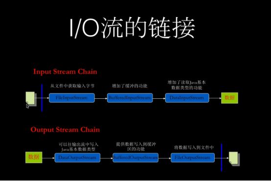
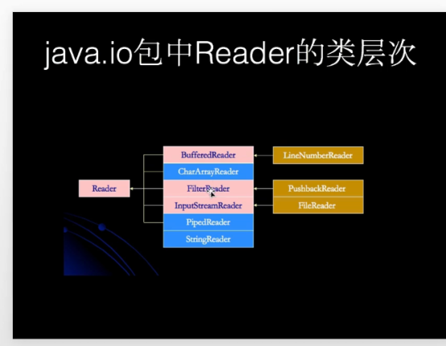
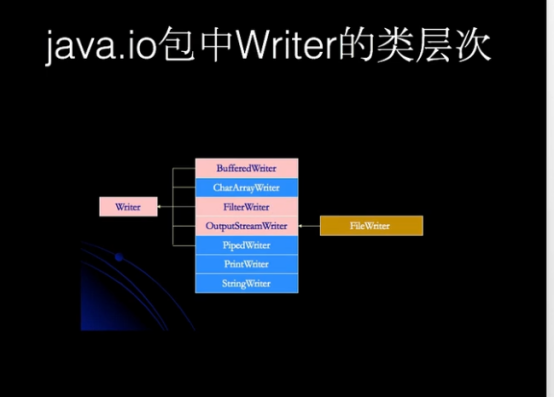
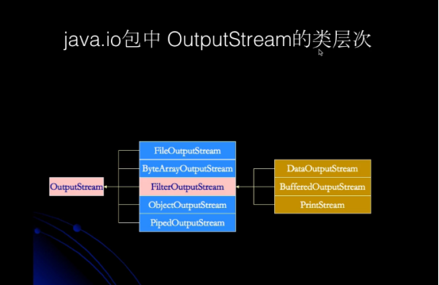

####java有几种类型的流 ?

```
java默认分为两种流，一种是字节流，一种是字符流

字符流又分为 Reader和 Writer

字节流分为 InputStream 和  OutputStream

FileInputStream 是 从某个文件中用于读取数据；

FileOutputStream 适用于写入文件数据

RandomAccessFile
```












####字节流和字符流哪个好？怎么选择？

缓大多数情况下使用字节流会更好，因为字节流是字符流的包装，而大多数时候 IO 操作都是直接操作磁盘文件，所以这些流在传输时都是以字节的方式进行的（图片等都是按字节存储的）
如果对于操作需要通过 IO 在内存中频繁处理字符串的情况使用字符流会好些，因为字符流具备缓冲区，提高了性能


####什么是缓冲区？有什么作用？

缓冲区就是一段特殊的内存区域，很多情况下当程序需要频繁地操作一个资源（如文件或数据库）则性能会很低，所以为了提升性能就可以将一部分数据暂时读写到缓存区，以后直接从此区域中读写数据即可，这样就显著提升了性。
对于 Java 字符流的操作都是在缓冲区操作的，所以如果我们想在字符流操作中主动将缓冲区刷新到文件则可以使用 flush() 方法操作。


####字符流和字节流有什么区别

字符流和字节流的使用非常相似，但是实际上字节流的操作不会经过缓冲区（内存）而是直接操作文本本身的，而字符流的操作会先经过缓冲区（内存）然后通过缓冲区再操作文件 


####什么是节点流,什么是处理流,它们各有什么用处,处理流的创建有什么特征？

1. 节点流 直接与数据源相连，用于输入或者输出
2. 处理流：在节点流的基础上对之进行加工，进行一些功能的扩展
3. 处理流的构造器必须要 传入节点流的子类


####什么是Java序列化，如何实现Java序列化？

序列化就是一种用来处理对象流的机制，将对象的内容进行流化。可以对流化后的对象进行读写操作，可以将流化后的对象传输于网络之间。序列化是为了解决在对象流读写操作时所引发的问题
序列化的实现：将需要被序列化的类实现Serialize接口，没有需要实现的方法，此接口只是为了标注对象可被序列化的，然后使用一个输出流（如：FileOutputStream）来构造一个ObjectOutputStream(对象流)对象，再使用ObjectOutputStream对象的write(Object obj)方法就可以将参数obj的对象写出