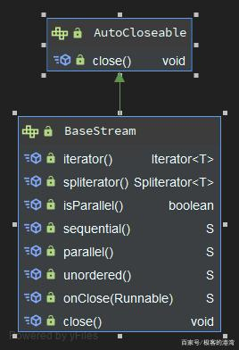
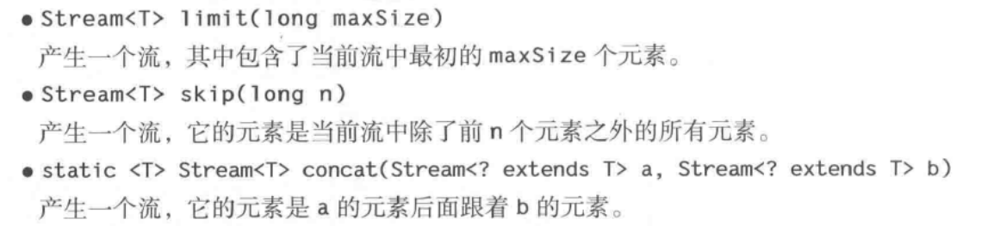
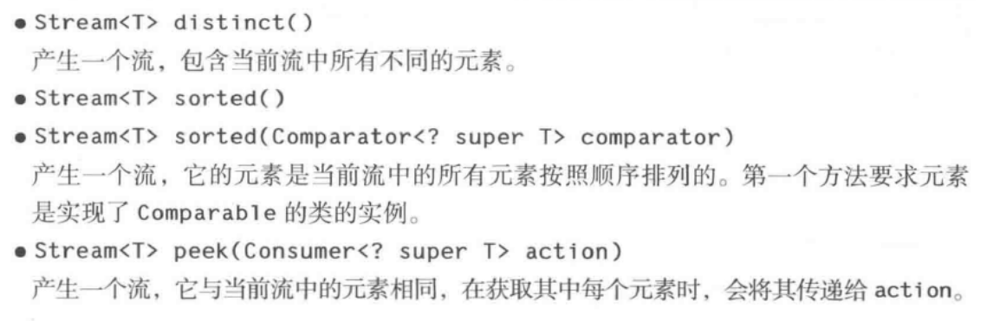
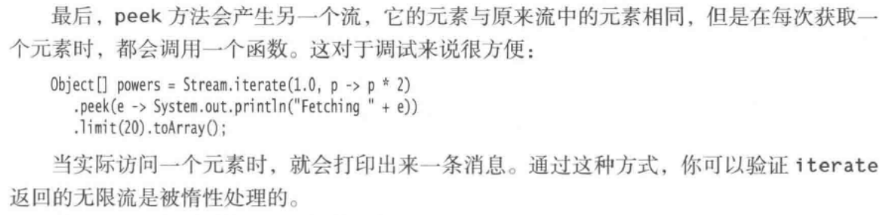
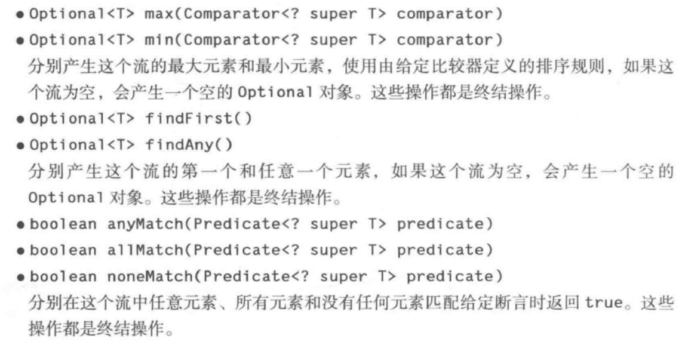
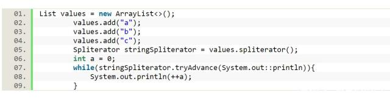
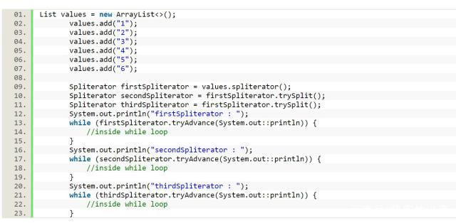
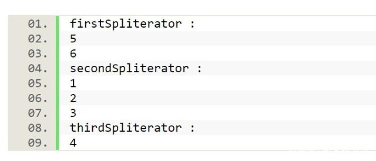
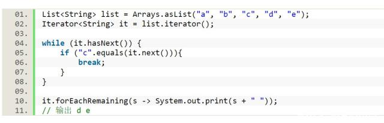
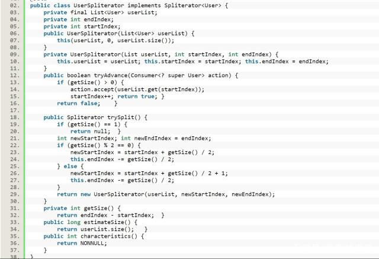

## Siream 流处理

Stream 使用到的工具类

- Arrays : 数据工具类
- Collectors：数据收集工具类
- Stream：代表数据流
- StreamSupport：数据流工具类
- Spliterators：切割数据流（切成多个，）
- Collections：集合工具类
- Collector: Collectors是一个工具类，是JDK预实现Collector的工具类，它内部提供了多种Collector 


### 基本类型的Stream 处理

IntStream、DoubleStream、LongStream


### Stream的流程如下：

1、源数据

2、零个或者多个中间操作

3、终止操作

```flow
flow
st=>start: Start
op=>operation: Your Operation
cond=>condition: Yes or No?
e=>end
st->op->cond
cond(yes)->e
cond(no)->op
```


### BaseStream

- iterator : 返回一个可迭代的迭代器
- spliterator：返回一个流分割器
- isParallel()：是否支持并行
- sequential()：
- parallel()：返回一个并行流
- unordered()：表示改流是无序的
- onClose(Runable)：在流结束的时候执行方法
- close()：关闭该流

  


### Stream 类方法

- Stream.of ("1","2") 

  返回一个流数据

- Stream.empty()

  返回不包含任何元素的流

**获取一个无限序列流**

- Stream.generate() 
  产生一个无限流，它的值是通过反复调用函数s 而构建的

- Stream.iterate()

  产生一个无线流，它的元素包含种子、在种子上调用f 产生的值、在前一个元素上调用f产生的值，等等

**产生一个Stream 流**

- Arrays. Stream.stream(T[] array,int startInclusive,int endExclusive)

  产生一个流，它的元素是由数组中指定范围内的元素构成的。

- Pattern.splitAsStream(CharSequence input)

  产生一个流，它的元素是输入中由该模式界定的部分

- Files.lines(Path path)

- Files.lines(Path path, Charset charset)

  产生一个流，他的元素是指定文件中的行，该文件的字符集为UTF-8，或者为指定的字符集


### Stream 实例方法（常用操作）

- Stream<T> filter 

  产生一个流，其中包含当前流中满足P的所有元素

- long count()

  产生当前流中元素的数量，是一个终止操作

- default Stream<E> stream()

- default Stream<E> parallelStream()

  产生当前集合所有元素的顺序流和并行流

- Stream<T> filter(Predicate<? super T> predicate）

  产生一个流，它包含当前流屮所有满足断言条件的元素。 

- <R> Stream<R> mapCFunction<? superT，？extends R > mapper **)** 

  产生一个流，它包货将 mapper 应用 F与前流中所有元素所产生的结果。 

- <R> Stream<R> flatMap(Function<? super T, ? extends Stream<? extends R>> mapper)

产生一个流，它是通过将 mapper 应用于当前流中所有元素所产生的结果连接到 一起 而获得的。（注意，这里的每个结果都是一个流。）

**返回新的Stream 流**








**Stream 终止操作**




- forEach 遍历迭代元素

  在并行流上，forEach 方法会以任意顺序遍历各个元素。如果想要按照流中的顺序来处理它们，可以调用forEachOrderd方法，当然，这个方法会丧失并行处理的部分甚至全部优势


### Stream.Builder

允许我们使用Builder 类来自由的添加元素，最后构建成为一个Stream 流


## 常用工具类

Stream 常用的工具类分为如下几个类： Collectors，Arryas、Collector、StreamSupport、Spliterators、Spliterator


### StreamSupport


### Collector

 Collector是专门用来作为Stream的collect方法的参数的。 

```java
public interface Stream<T> extends BaseStream<T, Stream<T>> {
    <R, A> R collect(Collector<? super T, A, R> collector);
}
```


 Collector主要包含五个参数，它的行为也是由这五个参数来定义的，如下所示： 

```java
public interface Collector<T, A, R> {
    // supplier参数用于生成结果容器，容器类型为A
    Supplier<A> supplier();
    // accumulator用于消费元素，也就是归纳元素，这里的T就是元素，它会将流中的元素一个一个与结果容器A发生操作
    BiConsumer<A, T> accumulator();
    // combiner用于两个两个合并并行执行的线程的执行结果，将其合并为一个最终结果A
    BinaryOperator<A> combiner();
    // finisher用于将之前整合完的结果R转换成为A
    Function<A, R> finisher();
    // characteristics表示当前Collector的特征值，这是个不可变Set
    Set<Characteristics> characteristics();
}
```

 Collector拥有两个of方法用于生成Collector实例，其中一个拥有上面所有五个参数，另一个四个参数，不包括finisher。 

```java
public interface Collector<T, A, R> {
    // 四参方法，用于生成一个Collector，T代表流中的一个一个元素，R代表最终的结果
    public static<T, R> Collector<T, R, R> of(Supplier<R> supplier,
                                              BiConsumer<R, T> accumulator,
                                              BinaryOperator<R> combiner,
                                              Characteristics... characteristics) {/*...*/}
    // 五参方法，用于生成一个Collector，T代表流中的一个一个元素，A代表中间结果，R代表最终结果，finisher用于将A转换为R                                          
    public static<T, A, R> Collector<T, A, R> of(Supplier<A> supplier,
                                                 BiConsumer<A, T> accumulator,
                                                 BinaryOperator<A> combiner,
                                                 Function<A, R> finisher,
                                                 Characteristics... characteristics) {/*...*/}                                              
}
```

Characteristics 代表是一个特征值的枚举，表示该数据需要如何收集

- CONCURRENT（多线程并行）

- UNORDERED（无序）

- IDENTITY_FINISH（无需转换结果）。（是有序的，无法和Concurrent 一起使用）

  其中四参of方法中没有finisher参数，所以必有IDENTITY_FINISH特征值。


### Collectors 常用方法

Collectors是一个工具类，是JDK预实现Collector的工具类，它内部提供了多种Collector 


- toCollection

  将流中的元素全部放置到一个集合中返回，这里使用Collection，泛指多种集合。	

```java
public class CollectorsTest {
    public static void toCollectionTest(List<String> list) {
        List<String> ll = list.stream().collect(Collectors.toCollection(LinkedList::new));
    }
    public static void main(String[] args) {
        List<String> list = Arrays.asList("123","456","789","1101","212121121","asdaa","3e3e3e","2321eew");
        toCollectionTest(list);		
    }
}
```


- toList

  将流中的元素放置到一个列表集合中去。这个列表默认为ArrayList。

```java
public class CollectorsTest {
    public static void toListTest(List<String> list) {
        List<String> ll = list.stream().collect(Collectors.toList());
    }
    public static void main(String[] args) {
        List<String> list = Arrays.asList("123","456","789","1101","212121121","asdaa","3e3e3e","2321eew");
        toListTest(list);
    }
}
```


- toSet

将流中的元素放置到一个无序集set中去。默认为HashSet。

```java
public class CollectorsTest {
    public static void toSetTest(List<String> list) {
        Set<String> ss = list.stream().collect(Collectors.toSet());
    }
    public static void main(String[] args) {
        List<String> list = Arrays.asList("123","456","789","1101","212121121","asdaa","3e3e3e","2321eew");
        toSetTest(list);
    }
}
```


- joining

  joining的目的是将流中的元素全部以字符序列的方式连接到一起，可以指定连接符，甚至是结果的前后缀。

```java
public class CollectorsTest {
    public static void joiningTest(List<String> list){
        // 无参方法
        String s = list.stream().collect(Collectors.joining());
        System.out.println(s);
        // 指定连接符
        String ss = list.stream().collect(Collectors.joining("-"));
        System.out.println(ss);
        // 指定连接符和前后缀
        String sss = list.stream().collect(Collectors.joining("-","S","E"));
        System.out.println(sss);
    }
    public static void main(String[] args) {
        List<String> list = Arrays.asList("123","456","789","1101","212121121","asdaa","3e3e3e","2321eew");
        joiningTest(list);
    }
}
```


执行结果：

```text
1234567891101212121121asdaa3e3e3e2321eew
123-456-789-1101-212121121-asdaa-3e3e3e-2321eew
S123-456-789-1101-212121121-asdaa-3e3e3e-2321eewE
```

> StringJoiner：这是一个字符串连接器，可以定义连接符和前后缀，正好适用于实现第三种joining方法。


- mapping

  这个映射是首先对流中的每个元素进行映射，即类型转换，然后再将新元素以给定的Collector进行归纳。

```java
public class CollectorsTest {
    public static void mapingTest(List<String> list){
        List<Integer> ll = list.stream().limit(5).collect(Collectors.mapping(Integer::valueOf,Collectors.toList()));
    }
    public static void main(String[] args) {
        List<String> list = Arrays.asList("123","456","789","1101","212121121","asdaa","3e3e3e","2321eew");
        mapingTest(list);
    }
}
```

实例中截取字符串列表的前5个元素，将其分别转换为Integer类型，然后放到一个List中返回。


- collectingAndThen

  该方法是在归纳动作结束之后，对归纳的结果进行再处理。

```java
public class CollectorsTest {
    public static void collectingAndThenTest(List<String> list){
        int length = list.stream().collect(Collectors.collectingAndThen(Collectors.toList(),e -> e.size()));
        System.out.println(length);
    }
    public static void main(String[] args) {
        List<String> list = Arrays.asList("123","456","789","1101","212121121","asdaa","3e3e3e","2321eew");
        collectingAndThenTest(list);
    }
}
```


执行结果为：

```text
8
```


- counting

  该方法用于计数。

```java
public class CollectorsTest {
    public static void countingTest(List<String> list){
        long size = list.stream().collect(Collectors.counting());
        System.out.println(size);
    }
    public static void main(String[] args) {
        List<String> list = Arrays.asList("123","456","789","1101","212121121","asdaa","3e3e3e","2321eew");
        countingTest(list);
    }
}
```


结果：

```text
8
```


- minBy/maxBy

生成一个用于获取最小/最大值的Optional结果的Collector。

```java
public class CollectorsTest {
    public static void maxByAndMinByTest(List<String> list){
        System.out.println(list.stream().collect(Collectors.maxBy((a,b) -> a.length()-b.length())));
        System.out.println(list.stream().collect(Collectors.minBy((a,b) -> a.length()-b.length())));
    }
    public static void main(String[] args) {
        List<String> list = Arrays.asList("123","456","789","1101","212121121","asdaa","3e3e3e","2321eew");
        maxByAndMinByTest(list);
    }
}
```


执行结果为：

```text
Optional[212121121]
Optional[123]
```


- summingInt/summingLong/summingDouble

  生成一个用于求元素和的Collector，首先通过给定的mapper将元素转换类型，然后再求和。参数的作用就是将元素转换为指定的类型，最后结果与转换后类型一致。

```java
public class CollectorsTest {
    public static void summingTest(List<String> list){
        int i = list.stream().limit(3).collect(Collectors.summingInt(Integer::valueOf));
        long l = list.stream().limit(3).collect(Collectors.summingLong(Long::valueOf));
        double d = list.stream().limit(3).collect(Collectors.summingDouble(Double::valueOf));
        System.out.println(i +"\n" +l + "\n" + d);
    }
    public static void main(String[] args) {
        List<String> list = Arrays.asList("123","456","789","1101","212121121","asdaa","3e3e3e","2321eew");
        summingTest(list);
    }
}
```


执行结果为：

```text
1368
1368
1368.0
```


- averagingInt/averagingLong/averagingDouble

  生成一个用于求元素平均值的Collector，首选通过参数将元素转换为指定的类型。

  参数的作用就是将元素转换为指定的类型，求平均值涉及到除法操作，结果一律为Double类型。

```java
public class CollectorsTest {
    public static void averagingTest(List<String> list){
        double i = list.stream().limit(3).collect(Collectors.averagingInt(Integer::valueOf));
        double l = list.stream().limit(3).collect(Collectors.averagingLong(Long::valueOf));
        double d = list.stream().limit(3).collect(Collectors.averagingDouble(Double::valueOf));
        System.out.println(i +"\n" +l + "\n" + d);
    }
    public static void main(String[] args) {
        List<String> list = Arrays.asList("123","456","789","1101","212121121","asdaa","3e3e3e","2321eew");
        averagingTest(list);
    }
}
```


执行结果为：

```text
456.0
456.0
456.0
```


- reducing

  reducing方法有三个重载方法，其实是和Stream里的三个reduce方法对应的，二者是可以替换使用的，作用完全一致，也是对流中的元素做统计归纳作用。

```java
public final class Collectors {
    // 无初始值的情况，返回一个可以生成Optional结果的Collector
    public static <T> Collector<T, ?, Optional<T>> reducing(BinaryOperator<T> op) {/*...*/}
    // 有初始值的情况，返回一个可以直接产生结果的Collector
    public static <T> Collector<T, ?, T> reducing(T identity, BinaryOperator<T> op) {/*...*/}
    // 有初始值，还有针对元素的处理方案mapper，生成一个可以直接产生结果的Collector，元素在执行结果操作op之前需要先执行mapper进行元素转换操作
    public static <T, U> Collector<T, ?, U> reducing(U identity,
                                    Function<? super T, ? extends U> mapper,
                                    BinaryOperator<U> op) {/*...*/}
}
```


实例：

```java
public class CollectorsTest {
    public static void reducingTest(List<String> list){
        System.out.println(list.stream().limit(4).map(String::length).collect(Collectors.reducing(Integer::sum)));
        System.out.println(list.stream().limit(3).map(String::length).collect(Collectors.reducing(0, Integer::sum)));
        System.out.println(list.stream().limit(4).collect(Collectors.reducing(0,String::length,Integer::sum)));
    }
    public static void main(String[] args) {
        List<String> list = Arrays.asList("123","456","789","1101","212121121","asdaa","3e3e3e","2321eew");
        reducingTest(list);
    }
}
```


执行结果：

```text
Optional[13]
9
13
```

效果可参见[Java流式操作系列-Stream](Java流式操作系列-Stream.md#4.4-reduce)


- groupingBy

这个方法是用于生成一个拥有分组功能的Collector，它也有三个重载方法：

```java
public final class Collectors {
    // 只需一个分组参数classifier，内部自动将结果保存到一个map中，每个map的键为?类型（即classifier的结果类型），值为一个list，这个list中保存在属于这个组的元素。
    public static <T, K> Collector<T, ?, Map<K, List<T>>> groupingBy(
            Function<? super T, ? extends K> classifier) {/*...*/}
    // 在上面方法的基础上增加了对流中元素的处理方式的Collector，比如上面的默认的处理方法就是Collectors.toList()
    public static <T, K, A, D>Collector<T, ?, Map<K, D>> groupingBy(
            Function<? super T, ? extends K> classifier,Collector<? super T, A, D> downstream) {/*...*/}
    // 在第二个方法的基础上再添加了结果Map的生成方法。
    public static <T, K, D, A, M extends Map<K, D>>
        Collector<T, ?, M> groupingBy(Function<? super T, ? extends K> classifier,
                                      Supplier<M> mapFactory,
                                      Collector<? super T, A, D> downstream) {/*...*/}
}
```


实例：

```java
public class CollectorsTest {
    public static void groupingByTest(List<String> list){
        Map<Integer,List<String>> s = list.stream().collect(Collectors.groupingBy(String::length));
        Map<Integer,List<String>> ss = list.stream().collect(Collectors.groupingBy(String::length, Collectors.toList()));
        Map<Integer,Set<String>> sss = list.stream().collect(Collectors.groupingBy(String::length,HashMap::new,Collectors.toSet()));
        System.out.println(s.toString() + "\n" + ss.toString() + "\n" + sss.toString());
    }
    public static void main(String[] args) {
        List<String> list = Arrays.asList("123","456","789","1101","212121121","asdaa","3e3e3e","2321eew");
        groupingByTest(list);
    }
}
```


执行结果为：

```text
{3=[123, 456, 789], 4=[1101], 5=[asdaa], 6=[3e3e3e], 7=[2321eew], 9=[212121121]}
{3=[123, 456, 789], 4=[1101], 5=[asdaa], 6=[3e3e3e], 7=[2321eew], 9=[212121121]}
{3=[123, 456, 789], 4=[1101], 5=[asdaa], 6=[3e3e3e], 7=[2321eew], 9=[212121121]}
```

groupingBy方法还有并发版的groupingByConcurrent，功能基本一致，只是返回的Collector是并行的。


- partitioningBy

  该方法将流中的元素按照给定的校验规则的结果分为两个部分，放到一个map中返回，map的键是Boolean类型，值为元素的列表List。

  该方法有两个重载方法：

```java
public final class Collectors {
    // 只需一个校验参数predicate
    public static <T>
        Collector<T, ?, Map<Boolean, List<T>>> partitioningBy(Predicate<? super T> predicate) {/*...*/}
    // 在上面方法的基础上增加了对流中元素的处理方式的Collector，比如上面的默认的处理方法就是Collectors.toList()
    public static <T, D, A>
        Collector<T, ?, Map<Boolean, D>> partitioningBy(Predicate<? super T> predicate,
                                                        Collector<? super T, A, D> downstream) {/*...*/}
}
```


实例：

```java
public class CollectorsTest {
    public static void partitioningByTest(List<String> list){
        Map<Boolean,List<String>> map = list.stream().collect(Collectors.partitioningBy(e -> e.length()>5));
        Map<Boolean,Set<String>> map2 = list.stream().collect(Collectors.partitioningBy(e -> e.length()>6,Collectors.toSet()));
        System.out.println(map.toString() + "\n" + map2.toString());
    }
    public static void main(String[] args) {
        List<String> list = Arrays.asList("123","456","789","1101","212121121","asdaa","3e3e3e","2321eew");
        partitioningByTest(list);
    }
}
```


执行结果：

```text
{false=[123, 456, 789, 1101, asdaa], true=[212121121, 3e3e3e, 2321eew]}
{false=[123, 456, 1101, 789, 3e3e3e, asdaa], true=[212121121, 2321eew]}
```


- toMap

  toMap方法是根据给定的键生成器和值生成器生成的键和值保存到一个map中返回，键和值的生成都依赖于元素，可以指定出现重复键时的处理方案和保存结果的map。

```java
public final class Collectors {
    // 指定键和值的生成方式keyMapper和valueMapper
    public static <T, K, U>
        Collector<T, ?, Map<K,U>> toMap(Function<? super T, ? extends K> keyMapper,
                                        Function<? super T, ? extends U> valueMapper) {/*...*/}
    // 在上面方法的基础上增加了对键发生重复时处理方式的mergeFunction，比如上面的默认的处理方法就是抛出异常
    public static <T, K, U>
        Collector<T, ?, Map<K,U>> toMap(Function<? super T, ? extends K> keyMapper,
                                        Function<? super T, ? extends U> valueMapper,
                                        BinaryOperator<U> mergeFunction) {/*...*/}
    // 在第二个方法的基础上再添加了结果Map的生成方法。
    public static <T, K, U, M extends Map<K, U>>
        Collector<T, ?, M> toMap(Function<? super T, ? extends K> keyMapper,
                                    Function<? super T, ? extends U> valueMapper,
                                    BinaryOperator<U> mergeFunction,
                                    Supplier<M> mapSupplier) {/*...*/}
}
```


实例：

```java
public class CollectorsTest {
    public static void toMapTest(List<String> list){
        Map<String,String> map = list.stream().limit(3).collect(Collectors.toMap(e -> e.substring(0,1),e -> e));
        Map<String,String> map1 = list.stream().collect(Collectors.toMap(e -> e.substring(0,1),e->e,(a,b)-> b));
        Map<String,String> map2 = list.stream().collect(Collectors.toMap(e -> e.substring(0,1),e->e,(a,b)-> b,HashMap::new));
        System.out.println(map.toString() + "\n" + map1.toString() + "\n" + map2.toString());
    }
    public static void main(String[] args) {
        List<String> list = Arrays.asList("123","456","789","1101","212121121","asdaa","3e3e3e","2321eew");
        toMapTest(list);
    }
}
```


执行结果：

```text
{1=123, 4=456, 7=789}
{a=asdaa, 1=1101, 2=2321eew, 3=3e3e3e, 4=456, 7=789}
{a=asdaa, 1=1101, 2=2321eew, 3=3e3e3e, 4=456, 7=789}
```

第一种方式中，如果不添加limit限制，就会抛出异常。

还有并发的版本：toConcurrentMap,同样三种重载方法，与toMap基本一致，只是它最后使用的map是并发Map:ConcurrentHashMap。


- summarizingInt/summarizingLong/summarizingDouble

  这三个方法适用于汇总的，返回值分别是IntSummaryStatistics，LongSummaryStatistics，DoubleSummaryStatistics。

  在这些返回值中包含有流中元素的指定结果的数量、和、最大值、最小值、平均值。所有仅仅针对数值结果。

```java
public class CollectorsTest {
    public static void summarizingTest(List<String> list){
        IntSummaryStatistics intSummary = list.stream().collect(Collectors.summarizingInt(String::length));
        LongSummaryStatistics longSummary = list.stream().limit(4).collect(Collectors.summarizingLong(Long::valueOf));
        DoubleSummaryStatistics doubleSummary = list.stream().limit(3).collect(Collectors.summarizingDouble(Double::valueOf));
        System.out.println(intSummary.toString() + "\n" + longSummary.toString() + "\n" + doubleSummary.toString());
    }
    public static void main(String[] args) {
        List<String> list = Arrays.asList("123","456","789","1101","212121121","asdaa","3e3e3e","2321eew");
        summarizingTest(list);
    }
}
```


执行结果：

```text
IntSummaryStatistics{count=8, sum=40, min=3, average=5.000000, max=9}
LongSummaryStatistics{count=4, sum=2469, min=123, average=617.250000, max=1101}
DoubleSummaryStatistics{count=3, sum=1368.000000, min=123.000000, average=456.000000, max=789.000000}
```

最后我们可以从返回的汇总实例中获取到想要的汇总结果。


### Spliterator

 *概念*： Spliterator（splitable iterator可分割迭代器）接口是Java为了并行遍历数据源中的元素而设计的迭代器，这个可以类比最早Java提供的顺序遍历迭代器Iterator，但一个是顺序遍历，一个是并行遍历。 


BaseStream 中提供了spliterator方法用于返回一个分隔符， 一旦获得了Spliterator对象，就可以对其执行不同的操作。与流类似，集合类还引入了一种新的方法来初始化Java 8中的spliterator： 

```
default Spliterator spliterator()
```


**Spliterator 常用函数**:

- **Characteristics**

  函数定义为int characteristics()，此方法返回此分隔符及其元素的一组特征。它可以是以下8个值中的任何一个。以下所有值都是静态最终整数值：

  - ORDERED： 既定的顺序，Spliterator保证拆分和遍历时是按照这一顺序。 
  - DISTINCT： 表示元素都不是重复的，对于每一对元素{ x, y}，{ !x.equals(y)}。例如，这适用于基于{@link Set}的Spliterator 。
  - IMMUTABLE：此值表示是否无法修改元素的来源，即我们不能添加，替换或删除任何元素。
  - NONNULL： 表示数据源保证元素不会为空 
  - SIZED： 表示在遍历分隔之前 estimateSize() 返回的值代表一个有限的大小，在没有修改结构源的情况下，代表了一个完整遍历时所遇到的元素数量的精确计数。 
  - SUBSIZED：表示由返回的所有分隔符trySplit()将为 SIZED和SUBSIZED。
  - CONCURRENT：表示可以同时修改源，即，我们可以使用多个线程并发地添加，更新或删除元素，而无需同步。


- **hasCharacteristics ()**

  定义格式

  - boolean hasCharacteristics(int characteristics)
  - characteristics() 上面已经解释过的方法用于找出分离器的特性。

  - hasCharacteristics用于检查分隔符是否包含所有特征。
  - 它返回一个布尔值。'true'如果分隔符中存在所有特征，否则返回false。


-  **tryAdvance** 

   遍历源元素。 

  它返回一个布尔值，并以一个Consumer作为参数。如果存在任何元素，它将执行我们传递的Consumer作为参数，并返回'true'并移至下一个元素。如果遍历所有元素，则返回'false'。例如：

  

  运行结果，输出a 1 b 2 c 3. 在这里，我们创建了一个带有三个字符串值的ArrayList。这是一个集合变量。因此，我们已使用该spliterator()方法从中创建一个Spliterator。我们使用while循环来检查的当前返回值是否tryAdvance为true。如果为true，则在while条件内打印当前值。while循环的主体为空,我们可以将其用于其他任何操作.


- **trySplit 函数** 

   在可能并行的操作中使用。 

   如果我们调用trySplit一个分隔符，它将返回一个分隔符，其中包含调用方分隔符不会覆盖的元素。这就是说，我们用它将分离器分成多个部分。这样做的主要好处trySplit是我们可以并行处理分割的元素。trySplit如果源包含有限数量的元素，则重复调用将返回null 

  **实例：**

  

  **运行结果**

  

  正如预期，每个Spliterator中都有不同的字符。


-  **EstimateSize（）** 

   返回元素总数的估计值。返回值的类型为long。 

-  **forEachRemaining** 

  能够将Iterator中迭代剩余的元素传递给一个函数

    


**自定义java Spliterator**

  


说明：

自定义实现Spliterator。重写4个方法 tryAdvance, trySplit, estimateSize和characteristics。tryAdvance函数：如果当前长度大于0，则在由startIndex定义的当前方法上调用“ accept”函数trySplit：根据endIndex,startIndex 两个值拆分 userrList列表。estimateSize：被返回列表studentList的大小。characteristics：返回NONNULL，即所有元素均为nonnull。


第一条和第二条语句用于创建一个并行流并找出所有User对象的age。同样，第三和第四条语句用于创建一个顺序流和所有User对象的总age


**注意**

 **分隔符支持并行处理，但不提供并行处理**。我们可以使用fork / join与splitter来创建并行性。此外，分隔符也不依赖于fork / join，我们仅将其用于实现并行处理。Spliterator也可以Iterator一样进行顺序遍历 


###  Spliterators


**参考**

-  https://www.jianshu.com/p/7eaa0969b424 
-  https://baijiahao.baidu.com/s?id=1649268592254063537&wfr=spider&for=pc 