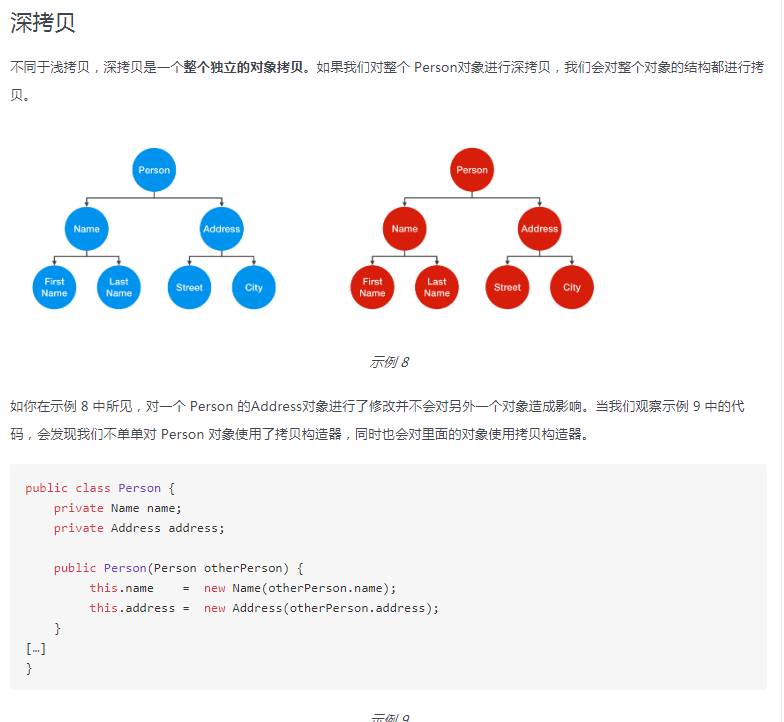

### java 基本类型有那些？

boolean，byte、short、int、long、char、float、double


### Integer i = 1 与 int = 1是相等的吗？

是相等的，因为在Integer内部维护了一个IntegerCache类，来缓存 -128-127之间的所有int类型数值，当int类型的变量 大于 127 或者小于128的时候就会new一个新的Integer出来


### String， Stringbuffer， StringBuilder 的区别？

```
String 字符串常量(final修饰，不可被继承)，String是常量，当创建之后即不能更改。(可以通过StringBuffer和StringBuilder创建String对象(常用的两个字符串操作类)。)

StringBuffer 字符串变量（线程安全）,其也是final类别的，不允许被继承，其中的绝大多数方法都进行了同步处理，包括常用的Append方法也做了同步处理(synchronized修饰)。其自jdk1.0起就已经出现。其toString方法会进行对象缓存，以减少元素复制开销。

public synchronized String toString() {
    if (toStringCache == null) {
        toStringCache = Arrays.copyOfRange(value, 0, count);
    }
    return new String(toStringCache, true);
}

StringBuilder 字符串变量（非线程安全）其自jdk1.5起开始出现。与StringBuffer一样都继承和实现了同样的接口和类，方法除了没使用synch修饰以外基本一致，不同之处在于最后toString的时候，会直接返回一个新对象。

public String toString() {
    // Create a copy, don’t share the array
    return new String(value, 0, count);
}

```


### 讲讲类的实例化顺序，比如父类静态数据，构造函数，字段，子类静态数据，构造函数，字段，当 new 的时候， 他们的执行顺序?

父类静态代变量、 父类静态代码块、 子类静态变量、 子类静态代码块、 父类非静态变量（父类实例成员变量）、 父类构造函数、 子类非静态变量（子类实例成员变量）、 子类构造函数 ,

这里还会考察到（ClassLoader加载 以及 Class.forName的区别）


###抽象类 和接口的区别是什么？

1、抽象类和接口都不能直接实例化，如果要实例化，抽象类变量必须指向实现所有抽象方法的子类对象，接口变量必须指向实现所有接口方法的类对象。

 2、抽象类要被子类继承，接口要被类实现。 

3、接口只能做方法申明，抽象类中可以做方法申明，也可以做方法实现 

4、接口里定义的变量只能是公共的静态的常量，抽象类中的变量是普通变量。

 5、抽象类里的抽象方法必须全部被子类所实现，如果子类不能全部实现父类抽象方法，那么该子类只能是抽象类。同样，一个实现接口的时候，如不能全部实现接口方法，那么该类也只能为抽象类。

 6、抽象方法只能申明，不能实现。abstract void abc();不能写成abstract void abc(){}。

 7、抽象类里可以没有抽象方法 

8、如果一个类里有抽象方法，那么这个类只能是抽象类 

9、抽象方法要被实现，所以不能是静态的，也不能是私有的。 

10、接口可继承接口，并可多继承接口，但类只能单根继承 


###请结合 OO 设计理念，谈谈访问修饰符 public、private、protected、default 在应用设计中的作用

public： Java语言中访问限制最宽的修饰符，一般称之为“公共的”。被其修饰的类、属性以及方法不 　　　　　仅可以跨类访问，而且允许跨包（package）访问。 

private: Java语言中对访问权限限制的最窄的修饰符，一般称之为“私有的”。被其修饰的类、属性以 　　　　　及方法只能被该类的对象访问，其子类不能访问，更不能允许跨包访问。 

protect: 介于public 和 private 之间的一种访问修饰符，一般称之为“保护形”。被其修饰的类、 　　　　　属性以及方法只能被类本身的方法及子类访问，即使子类在不同的包中也可以访问。 

default：即不加任何访问修饰符，通常称为“默认访问模式“。该模式下，只允许在同一个包中进行访 　　　　　问。 


###深拷贝和浅拷贝区别？

首先Object.clone() 本身就是浅拷贝


深拷贝



###如过在父类中为子类自动完成所有的hashcode和equals实现？这么做有何优劣。


###数组和链表数据结构描述，各自的时间复杂度 


###说一说你对java.lang.Object对象中hashCode和equals方法的理解。在什么场景下需要重新实现这两个方法。


###a.hashcode() 有什么用，与a.equals(b)有什么关系

```
java中==和eqauls()的区别,equals()和hashcode的区别
==是运算符，用于比较两个变量是否相等，而equals是Object类的方法，用于比较两个对象是否相等。默认Object类的equals方法是比较两个对象的地址，此时和==的结果一样。换句话说：基本类型比较用==，比较的是他们的值。默认下，对象用==比较时，比较的是内存地址，如果需要比较对象内容，需要重写equal方法。


equals()和hashcode()的联系
hashCode()是Object类的一个方法，返回一个哈希值。如果两个对象根据equal()方法比较相等，那么调用这两个对象中任意一个对象的hashCode()方法必须产生相同的哈希值。
如果两个对象根据eqaul()方法比较不相等，那么产生的哈希值不一定相等(碰撞的情况下还是会相等的。)


a.hashCode()有什么用?与a.equals(b)有什么关系
hashCode() 方法是相应对象整型的 hash 值。它常用于基于 hash 的集合类，如 Hashtable、HashMap、LinkedHashMap等等。它与 equals() 方法关系特别紧密。根据 Java 规范，使用 equal() 方法来判断两个相等的对象，必须具有相同的 hashcode。

将对象放入到集合中时，首先判断要放入对象的hashcode是否已经在集合中存在，不存在则直接放入集合。如果hashcode相等，然后通过equal()方法判断要放入对象与集合中的任意对象是否相等：如果equal()判断不相等，直接将该元素放入集合中，否则不放入。


有没有可能两个不相等的对象有相同的hashcode
有可能，两个不相等的对象可能会有相同的 hashcode 值，这就是为什么在 hashmap 中会有冲突。如果两个对象相等，必须有相同的hashcode 值，反之不成立。


可以在hashcode中使用随机数字吗?
不行，因为同一对象的 hashcode 值必须是相同的


a==b与a.equals(b)有什么区别
如果a 和b 都是对象，则 a==b 是比较两个对象的引用，只有当 a 和 b 指向的是堆中的同一个对象才会返回 true，而 a.equals(b) 是进行逻辑比较，所以通常需要重写该方法来提供逻辑一致性的比较。例如，String 类重写 equals() 方法，所以可以用于两个不同对象，但是包含的字母相同的比较。
```


###Comparable 和 Comparator的区别是什么？

Comparable 用于内部排序，Comparator 用于外部排序

```
Comparable是在集合内部定义的方法实现的排序，位于java.lang下。

Comparable 接口仅仅只包括一个函数，它的定义如下：

package java.lang;
import java.util.*;
 
 
public interface Comparable<T> {
    
    public int compareTo(T o);
}

若x.compareTo(y) <0，则x<y;若x.compareTo(y) =0，则x=y;若x.compareTo(y) >0，则x=y;


Comparable是一个对象，本身就已经支持自比较所需要实现的接口。

自定义类要在加入list容器中后能够排序，也可以实现Comparable接口。

在用Collections类的sort方法排序时若不指定Comparator，那就以自然顺序排序。所谓自然顺序就是实现Comparable接口设定的排序方式。

若一个类实现了comparable接口，则意味着该类支持排序。如String、Integer自己就实现了Comparable接口，可完成比较大小操作。

一个已经实现comparable的类的对象或数据，可以通过Collections.sort(list) 或者Arrays.sort(arr)实现排序。通过Collections.sort(list,Collections.reverseOrder());对list进行倒序排列。

Comparator介绍
Comparator是在集合外部实现的排序，位于java.util下。
Comparator接口包含了两个函数。
package java.util;
public interface Comparator<T> {
 
    int compare(T o1, T o2);
    boolean equals(Object obj);
}

我们若需要控制某个类的次序,而该类本身不支持排序(即没有实现Comparable接口);那么，我们可以新建一个该类的比较器来进行排序。这个比较器只需要实现comparator即可。
如果引用的为第三方jar包，这时候，没办法改变类本身，可是使用这种方式。
Comparator是一个专用的比较器，当这个对象不支持自比较或者自比较函数不能满足要求时，可写一个比较器来完成两个对象之间大小的比较。
Comparator体现了一种策略模式(strategy design pattern)，就是不改变对象自身，而用一个策略对象(strategy object)来改变它的行为。

comparable相当于内部比较器。comparator相当于外部比较器。

comparable实例
package test;
 
import java.util.ArrayList;
import java.util.Collections;
import java.util.List;
 
public class test {
	public static void main(String[] args) {
		List<UserInfo> list = new ArrayList<UserInfo>();
		list.add(new UserInfo(1,21,"name1"));
		list.add(new UserInfo(2,27,"name1"));
		list.add(new UserInfo(3,15,"name1"));
		list.add(new UserInfo(5,24,"name1"));
		list.add(new UserInfo(4,24,"name1"));
		//对该类排序
		Collections.sort(list);
		for(int i=0;i<list.size();i++){
			System.out.println(list.get(i));
		}
	}
}
 
class UserInfo implements Comparable<UserInfo>{
	private int userid;
	private int age;
	private String name;
	public UserInfo(int userid, int age, String name) {
		this.userid = userid;
		this.age = age;
		this.name = name;
	}
	public int getUserid() {
		return userid;
	}
	public void setUserid(int userid) {
		this.userid = userid;
	}
	public int getAge() {
		return age;
	}
	public void setAge(int age) {
		this.age = age;
	}
	public String getName() {
		return name;
	}
	public void setName(String name) {
		this.name = name;
	}
	@Override
	public String toString(){
		return this.userid+","+this.age+","+this.name;
	}
	@Override
	public int compareTo(UserInfo o) {
		//如果年龄相同，则比较userid，也可以直接  return this.age-o.age;
		if(this.age-o.age==0){
			return this.userid-o.userid;
		}else{
			return this.age-o.age;
		}
	}
 
}

comparator实例
package test;
 
import java.util.ArrayList;
import java.util.Collections;
import java.util.Comparator;
import java.util.List;
 
public class test1 {
	public static void main(String[] args) {
		List<UserInfo> list = new ArrayList<UserInfo>();
		list.add(new UserInfo(1,21,"name1"));
		list.add(new UserInfo(2,27,"name2"));
		list.add(new UserInfo(3,15,"name3"));
		list.add(new UserInfo(5,24,"name4"));
		list.add(new UserInfo(4,24,"name5"));
		//new一个比较器
		MyComparator comparator = new MyComparator();
		//对list排序
		Collections.sort(list,comparator);
		for(int i=0;i<list.size();i++){
			System.out.println(list.get(i));
		}
	}
}
class MyComparator implements Comparator<UserInfo>{
	@Override
	public int compare(UserInfo o1,UserInfo o2) {
		
		if(o1.getAge()-o2.getAge()==0){
			return o1.getUserid()-o2.getUserid();
		}else{
			return o1.getAge()-o2.getAge();
		}
	}
}
class UserInfo{
	private int userid;
	private int age;
	private String name;
	public UserInfo(int userid, int age, String name) {
		this.userid = userid;
		this.age = age;
		this.name = name;
	}
	public int getUserid() {
		return userid;
	}
	public void setUserid(int userid) {
		this.userid = userid;
	}
	public int getAge() {
		return age;
	}
	public void setAge(int age) {
		this.age = age;
	}
	public String getName() {
		return name;
	}
	public void setName(String name) {
		this.name = name;
	}
	@Override
	public String toString(){
		return this.userid+","+this.age+","+this.name;
	}
```


什么是序列化，怎么序列化，为什么序列化，反序列化会遇到什么问题，如何解决 