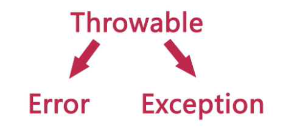
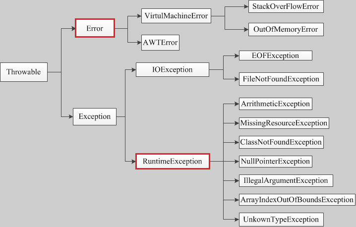

## java 异常体系


### Java异常的分类和类结构图

1.Java中的所有不正常类都继承于Throwable类。Throwable主要包括两个大类，一个是Error类，另一个是Exception类；

  

错误：Error类以及他的子类的实例，代表了JVM本身的错误。包括**虚拟机错误**和**线程死锁**，一旦Error出现了，程序就彻底的挂了，被称为程序终结者；例如，JVM 内存溢出。一般地，程序不会从错误中恢复。

异常：Exception以及他的子类，代表程序运行时发生的各种不期望发生的事件。可以被Java异常处理机制使用，是异常处理的核心。Exception主要包括两大类，**非检查异常**（RuntimeException）和**检查异常**（其他的一些异常）

  

**非检查异常（unckecked exception）**：Error 和 RuntimeException 以及他们的子类。javac在编译时，不会提示和发现这样的异常，不要求在程序处理这些异常。所以如果愿意，我们可以编写代码处理（使用try…catch…finally）这样的异常，也可以不处理。对于这些异常，我们应该修正代码，而不是去通过异常处理器处理 。这样的异常发生的原因多半是代码写的有问题。如除0错误ArithmeticException，错误的强制类型转换错误ClassCastException，数组索引越界ArrayIndexOutOfBoundsException，使用了空对象NullPointerException等等。

**检查异常（checked exception）**：除了Error 和 RuntimeException的其它异常。javac强制要求程序员为这样的异常做预备处理工作（使用try…catch…finally或者throws）。在方法中要么用try-catch语句捕获它并处理，要么用throws子句声明抛出它，否则编译不会通过。这样的异常一般是由程序的运行环境导致的。因为程序可能被运行在各种未知的环境下，而程序员无法干预用户如何使用他编写的程序，于是程序员就应该为这样的异常时刻准备着。如SQLException , IOException,ClassNotFoundException 等。


### Exception 与 Error的区别

Error 是程序无法处理的系统错误，编译器不做检查

Exception，是程序可以处理的


### 常见的Error 以及Exception


### StackTraceElement  获取线程堆栈

StackTraceElement 主要表示的是线程的栈信息，当线程入栈和出栈的时候都会在StackTraceElement 中进行记录

```java

    public static void test3(){

        Throwable throwable = new Throwable();

        StackTraceElement[] stackTrace = throwable.getStackTrace();


        for (StackTraceElement stackTraceElement : stackTrace) {
            System.out.println(stackTraceElement);
            System.out.println(stackTraceElement.getClassName());
            System.out.println(stackTraceElement.getFileName());
            System.out.println(stackTraceElement.getMethodName());
        }
    }
```


