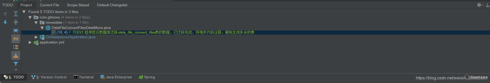
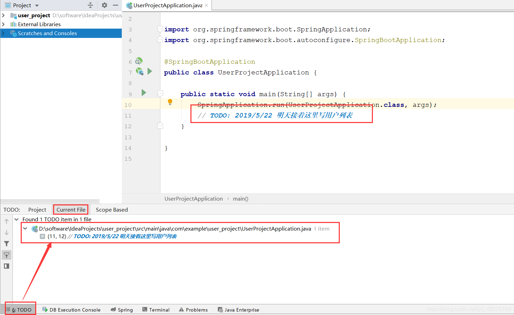

## java注释文档

### Todo

任务标记是以注释的方式定义】
一、作用：
1、代码量非常大的项目，在某一行中需要在后续阶段实现一个功能，如果不标注下次再找的时候就非常困难了，可以大大的提高开发效率！
2、在团队合作中，还可以告诉别人某处敏感代码的状态。

二、以下为常见的两种注释标记：
1、// TODO: 表示在此处将要实现的功能，提醒你在后续阶段将会在此处添加代码
2、// FIXME: 表示此处的代码逻辑有出入，或者根本不能运行，提醒你在后续阶段将会修改此处代码
3、// 在Eclipse中除了上面两种还有一个标记XXX: 表示此处的代码虽然实现了功能，但是性能太低，提醒你需要在后续阶段优化

例如：

 

 

三、如何快速找到项目中的标记处：

  

 其实就是类似于标记的作用，可以很快的定位到这个位置，方便查找，如图： 

  