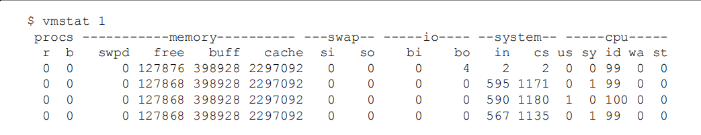

## 并发编程挑战

### 上下文切换

多线程在处理大数据量 或者是 处理大量io请求时，可以缩短程序时间，提高程序性能，但是过多的线程就会导致系统的额外开销，而导致性能下降，比较线程过多时，会造成频繁的上下文切换。

所谓的线程上下文切换指的是，当java线程遇到 lock 或者 wait 或者 sleep 时，会自动放弃当前cpu的使用权，但是cpu要记住当前线程执行的代码行数，执行的代码变量，线程栈帧 信息等等，当 线程 unlock 或者 结束睡眠的时候就会尝试从新获取cpu的使用权，那么cpu就要从已经缓存中找到当前线程相关的信息

我们在linux系统下 可以使用vmstat可以测量上下文切换的次数。 

下面是利用vmstat测量上下文切换次数的示例



CS（Content Switch）表示上下文切换的次数，从上面的测试结果中我们可以看到，上下文 每1秒切换1000多次。

减少上下文切换的方法有无锁并发编程、CAS算法、使用最少线程和使用协程。 

·无锁并发编程。多线程竞争锁时，会引起上下文切换，所以多线程处理数据时，可以用一 

些办法来避免使用锁，如将数据的ID按照Hash算法取模分段，不同的线程处理不同段的数据。


#### 减少上下文切换

本节将通过减少线上大量WAITING的线程，来减少上下文切换次数。 

第一步：用jstack命令dump线程信息，看看pid为3117的进程里的线程都在做什么。 

sudo -u admin /opt/ifeve/java/bin/jstack 31177 > /home/tengfei.fangtf/dump17 

第二步：统计所有线程分别处于什么状态，发现300多个线程处于WAITING（onobject- 

monitor）状态。 

```shell
[tengfei.fangtf@ifeve ~]$ grep java.lang.Thread.State dump17 | awk '{print $2$3$4$5}' | sort | uniq -c 
	39 RUNNABLE 
	21 TIMED_WAITING(onobjectmonitor) 
	6 TIMED_WAITING(parking) 
	51 TIMED_WAITING(sleeping) 	
	305 WAITING(onobjectmonitor) 
	3 WAITING(parking) 
```


第三步：打开dump文件查看处于WAITING（onobjectmonitor）的线程在做什么。发现这些线 

程基本全是JBOSS的工作线程，在await。说明JBOSS线程池里线程接收到的任务太少，大量线 

程都闲着。 

```java
"http-0.0.0.0-7001-97" daemon prio=10 tid=0x000000004f6a8000 nid=0x555e in Object.wait() [0x0000000052423000] 

java.lang.Thread.State: WAITING (on object monitor) 

	at java.lang.Object.wait(Native Method) 

		\- waiting on <0x00000007969b2280> (a org.apache.tomcat.util.net.AprEndpoint$Worker) 

	at java.lang.Object.wait(Object.java:485) 

	at org.apache.tomcat.util.net.AprEndpoint$Worker.await(AprEndpoint.java:1464) 

		\- locked <0x00000007969b2280> (a org.apache.tomcat.util.net.AprEndpoint$Worker) 

	at org.apache.tomcat.util.net.AprEndpoint$Worker.run(AprEndpoint.java:1489) 

	at java.lang.Thread.run(Thread.java:662) 
```


第四步：减少JBOSS的工作线程数，找到JBOSS的线程池配置信息，将maxThreads降到 100。

```xml
<maxThreads="250" maxHttpHeaderSize="8192" 
emptySessionPath="false" minSpareThreads="40" maxSpareThreads="75" 
maxPostSize="512000" protocol="HTTP/1.1" 
enableLookups="false" redirectPort="8443" acceptCount="200" bufferSize="16384" 
connectionTimeout="15000" disableUploadTimeout="false" useBodyEncodingForURI= "true"> 
```


第五步：重启JBOSS，再dump线程信息，然后统计WAITING（onobjectmonitor）的线程，发现 减少了175个。WAITING的线程少了，系统上下文切换的次数就会少，因为每一次从 WAITTING到RUNNABLE都会进行一次上下文的切换。读者也可以使用vmstat命令测试一下。 

```sh
[tengfei.fangtf@ifeve ~]$ grep java.lang.Thread.State dump17 | awk '{print $2$3$4$5}' | sort | uniq -c 

44 RUNNABLE 
22 TIMED_WAITING(onobjectmonitor) 
9 TIMED_WAITING(parking) 
36 TIMED_WAITING(sleeping) 
130 WAITING(onobjectmonitor) 
1 WAITING(parking)
```