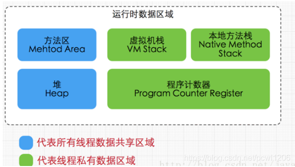
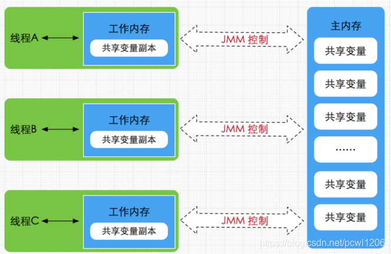
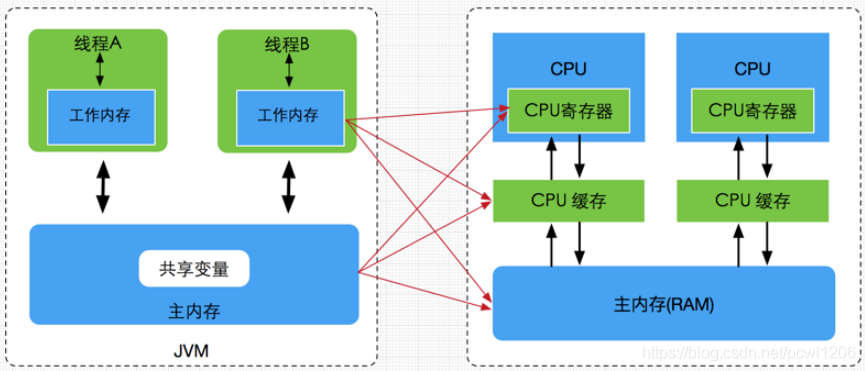
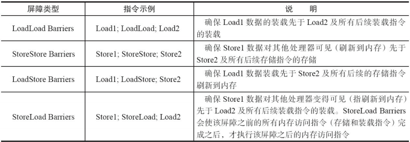
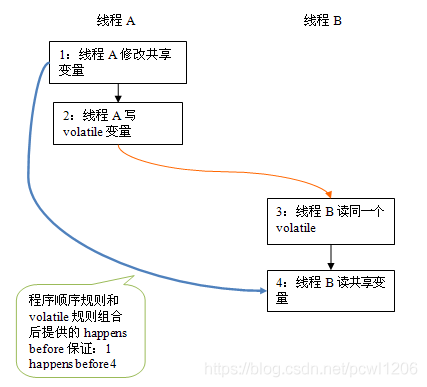
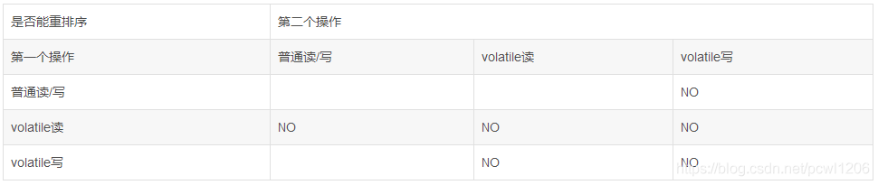
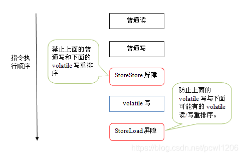
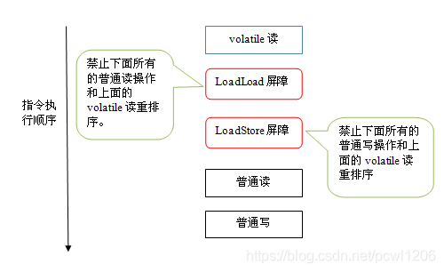
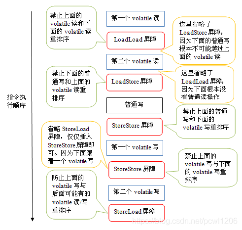
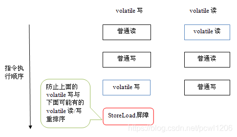

## JMM

### JMM 内存

 Java内存模型(即Java Memory Model，简称JMM)本身是一种抽象的概念，并不真实存在，它描述的是一组规则或规范，通过这组规范定义了程序中各个变量（包括实例字段，静态字段和构成数组对象的元素）的访问方式。 

我们这里先来看一下 JVM 的组成，以及线程共享以及线程私有的区域：

  

 由于**JVM运行程序的实体是线程**，而**每个线程创建时，JVM都会为其创建一个工作内存**(有些地方称为栈空间)，**用于存储线程私有的数据**，而**Java内存模型中规定所有变量都存储在主内存中，主内存是共享内存区域，所有线程都可以访问。但线程对变量的操作(读、取、赋值等)必须在工作内存中进行，首先要将变量从主内存拷贝的自己的工作内存空间，然后对变量进行操作，操作完成后再将变量写回主内存，不能直接操作主内存中的变量，工作内存中存储着主内存中的变量副本拷贝。**前面说过，工作内存是每个线程的私有数据区域，因此不同的线程间无法访问对方的工作内存，线程间的通信(传值)必须通过主内存来完成，其简要访问过程如下图所示： 

  

从上图来看   线程A与线程B之间如要通信的话，必须要经历下面2个步骤 

> 1、首先，线程A 把内存中A 更新过的共享变量刷入到主内存种去
>
> 2、线程B 到主内存种去读取线程A之前已经更新过的共享变量

Java内存模型的主要目标是**定义程序中各个变量的访问规则，即在虚拟机中将变量存储到内存和从内存中取出变量这样的底层细节**。**此处变量不同于Java的变量。它包括了实例字段、静态字段和构成数组对象的元素，但是不包含局部变量与方法参数，因为后者是线程私有的，不会被共享，自然就不存在竞争问题**。

Java内存模型规定了**所有的变量都存储在主内存（Main Memory）中**，**每个线程有自己的工作线程（Working Memory），保存主内存副本拷贝和自己私有变量，不同线程不能访问工作内存中的变量。线程间变量值的传递需要通过主内存来完成。**

需要注意的是，**JMM与Java内存区域的划分是不同的概念层次**，更恰当说**JMM描述的是一组规则，通过这组规则控制程序中各个变量在共享数据区域和私有数据区域的访问方式。**JMM是围绕原子性，有序性、可见性展开的(稍后会分析)。JMM与Java内存区域唯一相似点，都存在共享数据区域和私有数据区域。在JMM中主内存属于共享数据区域，从某个程度上讲应该包括了堆和方法区，而工作内存数据线程私有数据区域，从某个程度上讲则应该包括程序计数器、虚拟机栈以及本地方法栈。或许在某些地方，我们可能会看见主内存被描述为堆内存，工作内存被称为线程栈，实际上他们表达的都是同一个含义。关于JMM中的主内存和工作内存说明如下：

- 主内存

  **主要存储的是Java实例对象，所有线程创建的实例对象都存放在主内存中**，也包括了共享的类信息、常量、静态变量。由于是共享数据区域，多条线程对同一个变量进行访问可能会发现线程安全问题。

- 工作内存

  主要存储当前方法的所有**本地变量信息**(工作内存中存储着主内存中的变量副本拷贝)，每个线程只能访问自己的工作内存，即线程中的本地变量对其它线程是不可见的，就算是两个线程执行的是同一段代码，它们也会各自在自己的工作内存中创建属于当前线程的本地变量，当然也包括了字节码行号指示器、相关Native方法的信息。注意由于**工作内存是每个线程的私有数据，线程间无法相互访问工作内存，因此存储在工作内存的数据不存在线程安全问题**。


弄清楚主内存和工作内存后，接着了解一下主内存与工作内存的数据存储类型以及操作方式：

根据虚拟机规范，**对于一个实例对象中的成员方法而言，如果方法中包含本地变量是基本数据类型（boolean,byte,short,char,int,long,float,double），将直接存储在工作内存的帧栈结构中，但倘若本地变量是引用类型，那么该变量的引用会存储在功能内存的帧栈中，而对象实例将存储在主内存(共享数据区域，堆)中。但对于实例对象的成员变量，不管它是基本数据类型或者包装类型(Integer、Double等)还是引用类型，都会被存储到堆区。至于static变量以及类本身相关信息将会存储在主内存中**。需要注意的是，在主内存中的实例对象可以被多线程共享，倘若两个线程同时调用了同一个对象的同一个方法，那么两条线程会将要操作的数据拷贝一份到自己的工作内存中，执行完成操作后才刷新到主内存，简单示意图如下所示：


### JMM 内存与 硬件内存架构

通过对前面的硬件内存架构、Java内存模型以及Java多线程的实现原理的了解。我们应该已经意识到，**多线程的执行最终都会映射到硬件处理器上进行执行**，但Java内存模型和硬件内存架构并不完全一致。对于硬件内存来说只有寄存器、缓存内存、主内存的概念，并没有工作内存(线程私有数据区域)和主内存(堆内存)之分。也就是说**Java内存模型对内存的划分对硬件内存并没有任何影响，因为JMM只是一种抽象的概念，是一组规则，并不实际存在**。**不管是工作内存的数据还是主内存的数据，对于计算机硬件来说都会存储在计算机主内存中，当然也有可能存储到CPU缓存或者寄存器中。**因此总体上来说，Java内存模型和计算机硬件内存架构是一个相互交叉的关系，是一种抽象概念划分与真实物理硬件的交叉。(注意：对于Java内存区域划分也是同样的道理)




### 伪共享


### JMM内存定义

- 共享变量存储于主内存之中，每个线程都可以访问
- 每个线程都有私有的工作内存，或者称为本地内存
- 工作线程会存储该线程对共享变量的副本到工作内存
- 线程不能直接操作主内存，只有先操作了工作内存之后等系统合适的时候才能刷入主内存
- JMM通过控制主内存与每个线程的本地内存之间的交互，来为程序提供内存可见性保证

JMM规范要求，线程对变量的读写，需要从主存拷贝变量副本到工作内存中，以提高执行性能，再在合适的时机同步回主存，以使其他线程可见。如下图：


### 重排序

在执行程序时，为了提高性能，编译器和处理器常常会对指令做重排序。重排序分3种类型。

1）编译器优化的重排序。编译器在不改变单线程程序语义的前提下，可以重新安排语句的执行顺序。

2）指令级并行的重排序。现代处理器采用了指令级并行技术（Instruction-LevelParallelism，ILP）来将多条指令重叠执行。如果不存在数据依赖性，处理器可以改变语句对应机器指令的执行顺序。

3）内存系统的重排序。由于处理器使用缓存和读/写缓冲区，这使得加载和存储操作看上去可能是在乱序执行。

从Java源代码到最终实际执行的指令序列，会分别经历下面3种重排序，如下图：


为了保证程序的执行顺序以及内存可见性，java编译器会在生成指令序列的适当位置插入内存屏障来阻止特定类型的处理器重排序，JMM把内存屏障指令分为四类，如图：




### as-if-serials

上面也提到了，程序为了提高性能，编译器或者处理器经常会对程序做指令重排

然后提出了 as-if-serials 语义，用于保证在单线程种，不管如何重排序，程序的执行结果不能改变，编译器、runtime和处理器都必须遵守as-if-serial语义


### happends-before

JMM 为了保证多线程的执行顺序以及原子性可见性，提出了happens-before规则

happends-before原则如下：

- 程序顺序原则，即在一个线程内必须保证语义串行性，也就是说按照代码顺序执行。

- 锁规则 解锁(unlock)操作必然发生在后续的同一个锁的加锁(lock)之前，也就是说，如果对于一个锁解锁后，再加锁，那么加锁的动作必须在解锁动作之后(同一个锁)。

- volatile规则 volatile变量的写，先发生于读，这保证了volatile变量的可见性，简单的理解就是，volatile变量在每次被线程访问时，都强迫从主内存中读该变量的值，而当该变量发生变化时，又会强迫将最新的值刷新到主内存，任何时刻，不同的线程总是能够看到该变量的最新值。

- 线程启动规则 线程的start()方法先于它的每一个动作，即如果线程A在执行线程B的start方法之前修改了共享变量的值，那么当线程B执行start方法时，线程A对共享变量的修改对线程B可见

- 传递性 A先于B ，B先于C 那么A必然先于C

- 线程终止规则 线程的所有操作先于线程的终结，Thread.join()方法的作用是等待当前执行的线程终止。假设在线程B终止之前，修改了共享变量，线程A从线程B的join方法成功返回后，线程B对共享变量的修改将对线程A可见。

- 线程中断规则 对线程 interrupt()方法的调用先行发生于被中断线程的代码检测到中断事件的发生，可以通过Thread.interrupted()方法检测线程是否中断。

- 对象终结规则 对象的构造函数执行，结束先于finalize()方法
  

### volatile 关键字

volatile 关键字主要由两个作用

- 保证变量的内存可见性
- 禁止指令重排序


#### 内存可见

 当写一个volatile变量时，JMM会把该线程对应的工作内存中的共享变量值刷新到主内存中，当读取一个volatile变量时，JMM会把该线程对应的工作内存置为无效，那么该线程将只能从主内存中重新读取共享变量。**volatile变量正是通过这种写-读方式实现对其他线程可见** （其实是根据内存屏障来实现的）

- volatile变量写：当写一个volatile变量时，JMM会把所有线程本地内存的对应变量副本刷新回主存；
  	volatile写和解锁内存语义相同；

- volatile变量读：当读一个volatile变量时，JMM会设置该线程的volatile变量副本（本地内存中）无效，线程只能从主存中读取该变量；

通过上述机制，volatile保证共享变量一旦被修改，新值对所有线程可见；


#### 禁止指令重排序

 volatile关键字另一个作用就是禁止指令重排优化，从而避免多线程环境下程序出现乱序执行的现象，关于指令重排优化上篇文章中已经详细分析过，这里主要简单说明一下volatile是如何实现禁止指令重排优化的。先了解一个概念，**内存屏障(Memory Barrier）**。  


#### volatile 写-读建立的happends-before

从JSR-133开始，volatile 变量的写-读可以实现线程之间的通信。

从内存语义的角度来说，volatile与监视器锁有相同的效果：**volatile写和监视器的释放有相同的内存语义；volatile读与监视器的获取有相同的内存语义。**

请看下面使用volatile变量的示例代码：

```java
class VolatileExample {
    int a = 0;
    volatile boolean flag = false;
    public void writer() {
        a = 1;                     // 1
        flag = true;               // 2
    }
    public void reader() {
        if (flag) {                // 3
            int i =  a;            // 4
            ……
        }
    }
}
```

假设线程A执行writer()方法之后，线程B执行reader()方法。根据happens before规则，这个过程建立的happens before 关系可以分为三类：

1. 根据程序次序规则，1 happens before 2; 3 happens before 4。
2. 根据volatile规则，2 happens before 3。
3. 根据happens before 的传递性规则，1 happens before 4。

上述happens before 关系的图形化表现形式如下：



在上图中，每一个箭头链接的两个节点，代表了一个happens before 关系。黑色箭头表示程序顺序规则；橙色箭头表示volatile规则；蓝色箭头表示组合这些规则后提供的happens before保证。

这里A线程写一个volatile变量后，B线程读同一个volatile变量。A线程在写volatile变量之前所有可见的共享变量在B线程读同一个volatile变量后，将立即变得对B线程可见。


#### volatile 内存语义

下面，让我们来看看JMM如何实现 volatile 写/读的内存语义。

前文我们提到过重排序分为编译器重排序和处理器重排序。为了实现 volatile 内存语义，JMM会分别限制这两种类型的重排序类型。下面是JMM针对编译器制定的 volatile 重排序规则表：



举例来说，第三行最后一个单元格的意思是：**在程序顺序中，当第一个操作为普通变量的读或写时，如果第二个操作为volatile写，则编译器不能重排序这两个操作**。

从上表我们可以看出：

- 当第二个操作是 volatile 写时，不管第一个操作是什么，都不能重排序。这个规则确保 volatile 写之前的操作不会被编译器重排序到 volatile 写之后。
- 当第一个操作是 volatile 读时，不管第二个操作是什么，都不能重排序。这个规则确保 volatile 读之后的操作不会被编译器重排序到 volatile 读之前。
- 当第一个操作是 volatile 写，第二个操作是 volatile 读时，不能重排序。

为了实现volatile的内存语义，编译器在生成字节码时，会在指令序列中插入**内存屏障**来禁止特定类型的处理器重排序。对于编译器来说，发现一个最优布置来最小化插入屏障的总数几乎不可能，为此，JMM采取保守策略。下面是**基于保守策略的JMM内存屏障插入策略**：

- 在每个 volatile 写操作的前面插入一个 StoreStore 屏障。
- 在每个 volatile 写操作的后面插入一个 StoreLoad 屏障。
- 在每个 volatile 读操作的后面插入一个 LoadLoad 屏障。
- 在每个 volatile 读操作的后面插入一个 LoadStore 屏障。

上述内存屏障插入策略非常保守，但它可以保证在任意处理器平台，任意的程序中都能得到正确的 volatile 内存语义。

下面是保守策略下，volatile 写插入内存屏障后生成的指令序列示意图：



上图中的 StoreStore 屏障可以保证在 volatile 写之前，其前面的所有普通写操作已经对任意处理器可见了。这是因为StoreStore 屏障将保障上面所有的普通写在 volatile 写之前刷新到主内存。

这里比较有意思的是 volatile 写后面的 StoreLoad 屏障。这个屏障的作用是避免 volatile 写与后面可能有的 volatile 读/写操作重排序。因为编译器常常无法准确判断在一个 volatile 写的后面，是否需要插入一个 StoreLoad 屏障（比如，一个volatile 写之后方法立即 return）。为了保证能正确实现 volatile 的内存语义，JMM在这里采取了保守策略：**在每个 volatile 写的后面或在每个 volatile 读的前面插入一个 StoreLoad 屏障**。从整体执行效率的角度考虑，JMM选择了在每个 volatile 写的后面插入一个 StoreLoad 屏障。因为 **volatile 写-读内存语义的常见使用模式是：一个写线程写 volatile 变量，多个读线程读同一个 volatile 变量。**当读线程的数量大大超过写线程时，选择在 volatile 写之后插入 StoreLoad 屏障将带来可观的执行效率的提升。从这里我们可以看到**JMM在实现上的一个特点：\**首先确保正确性，然后再去追求执行效率。\****

下面是在保守策略下，volatile 读插入内存屏障后生成的指令序列示意图：



上图中的 LoadLoad 屏障用来禁止处理器把上面的 volatile 读与下面的普通读重排序。LoadStore 屏障用来禁止处理器把上面的 volatile 读与下面的普通写重排序。

上述 volatile 写和 volatile 读的内存屏障插入策略非常保守。在实际执行时，只要不改变 volatile 写-读的内存语义，编译器可以根据具体情况省略不必要的屏障。下面我们通过具体的示例代码来说明：

```java
class VolatileBarrierExample {
    int a;
    volatile int v1 = 1;
    volatile int v2 = 2;
 
    void readAndWrite() {
        int i = v1;           // 第一个volatile读
        int j = v2;           // 第二个volatile读
        a = i + j;            // 普通写
        v1 = i + 1;           // 第一个volatile写
        v2 = j * 2;           // 第二个 volatile写
    }
 
    …                         // 其他方法
}
```

针对 readAndWrite() 方法，编译器在生成字节码时可以做如下的优化：



注意，最后的 StoreLoad 屏障不能省略。因为第二个 volatile 写之后，方法立即 return。此时编译器可能无法准确断定后面是否会有 volatile 读或写，为了安全起见，编译器常常会在这里插入一个 StoreLoad 屏障。

上面的优化是针对任意处理器平台，由于不同的处理器有不同“松紧度”的处理器内存模型，内存屏障的插入还可以根据具体的处理器内存模型继续优化。以x86处理器为例，上图中除最后的 StoreLoad 屏障外，其它的屏障都会被省略。

前面保守策略下的 volatile 读和写，在 x86处理器平台可以优化成：



前文提到过，x86处理器仅会对写-读操作做重排序。X86不会对读-读，读-写和写-写操作做重排序，因此在x86处理器中会省略掉这三种操作类型对应的内存屏障。在x86中，JMM仅需在 volatile 写后面插入一个 StoreLoad 屏障，即可正确实现volatile写-读的内存语义。这意味着在x86处理器中，volatile 写的开销比 volatile 读的开销会大很多（因为执行StoreLoad屏障开销会比较大）。


#### double check 

```java
public class DoubleCheckLock {
	private static DoubleCheckLock instance;
	private DoubleCheckLock(){}
	public static DoubleCheckLock getInstance(){
		
		// 第一次检查
		if(instance == null){
			// 同步
			synchronized (DoubleCheckLock.class) {
				if(instance == null){
					// 多线程环境下可能会出现问题的地方
					instance = new DoubleCheckLock();
				}
			}
		}
		return instance;
	}
}
```

上述代码一个经典的**单例的双重检测**的代码。这段代码在单线程环境下并没有什么问题，但如果在多线程环境下就可能出现线程安全问题。原因在于某一个线程执行到第一次检测，读取到的 instance 不为null时，instance的引用对象可能没有完成初始化。因为 instance = new DoubleCheckLock() 可以分为以下3步完成(伪代码)：

```
memory = allocate(); //1.分配对象内存空间
instance(memory);    //2.初始化对象
instance = memory;   //3.设置instance指向刚分配的内存地址，此时instance！=null
```

由于步骤1和步骤2间可能会重排序，如下：

```
memory = allocate(); //1.分配对象内存空间
instance = memory;   //3.设置instance指向刚分配的内存地址，此时instance！=null，但是对象还没有初始化完成！
instance(memory);    //2.初始化对象
```

**由于步骤2和步骤3不存在数据依赖关系，而且无论重排前还是重排后程序的执行结果在单线程中并没有改变，因此这种重排优化是允许的**。但是指令重排只会保证串行语义的执行的一致性(单线程)，但并不会关心多线程间的语义一致性。所以当一条线程访问 instance 不为null时，由于 instance 实例未必已初始化完成，也就造成了线程安全问题。那么该如何解决呢？很简单，我们使用 volatile 禁止 instance 变量被执行指令重排优化即可。

```java
//禁止指令重排优化private volatile static DoubleCheckLock instance;
```


 由于 volatile 仅仅保证对单个 volatile 变量的读/写具有原子性，而监视器锁的互斥执行的特性可以确保对整个临界区代码的执行具有原子性。在功能上，监视器锁比 volatile 更强大；在可伸缩性和执行性能上，volatile 更有优势。如果想在程序中用 volatile 代替监视器锁，请一定谨慎。 


### volitile 与 synchronized 的区别

1、volatile关键字只能用于修饰实例变量或者类变量，不能用于修饰方法一级局部变量

​	synchorized关键字只能修饰方法或者语句块

​	volitile修饰的变量可以为null，synchorized关键字同步语句块的monitor对象不能为null

2、volitile 变量（操作）不能保证原子性

​	synchorized是一种排他机制，即monitor enter 和 monitor exits指令

3、volitile可以保证其可见性，synchorized也可以

4、volitile禁止jvm和处理器进行指令重排序，synchorized关键字则是保证方法或者代码块内部是顺序执行的

5、volatile不会使线程陷入阻塞，synchorized关键字会使线程进入阻塞状态


### 单例模式

懒汉模式（Synchorized并不能保证内存级别的指令冲排序）


枚举类型


Holder模式


