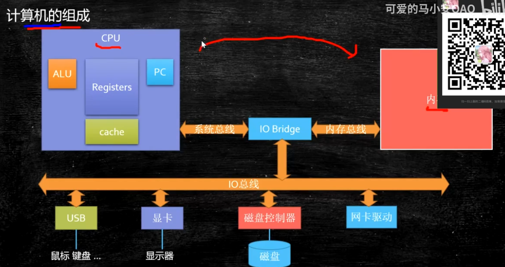
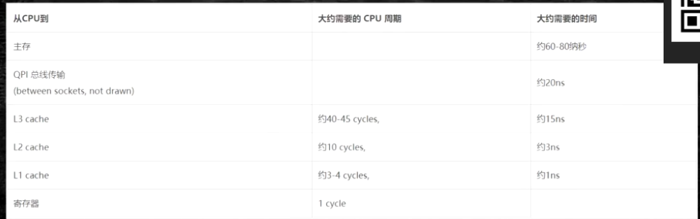
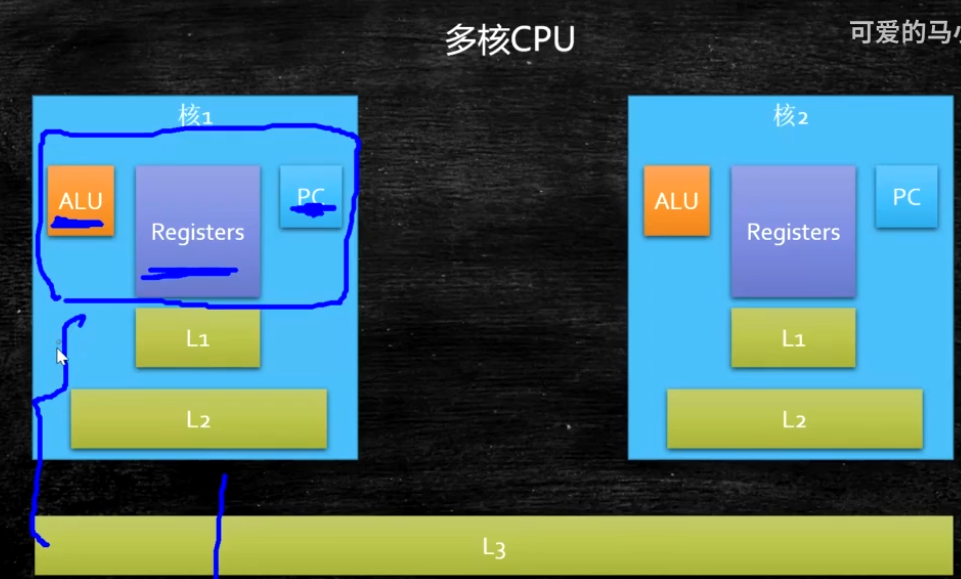
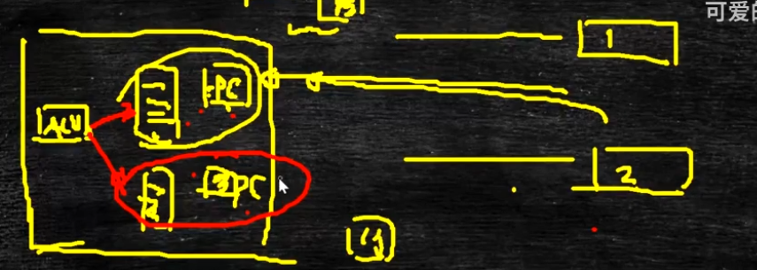
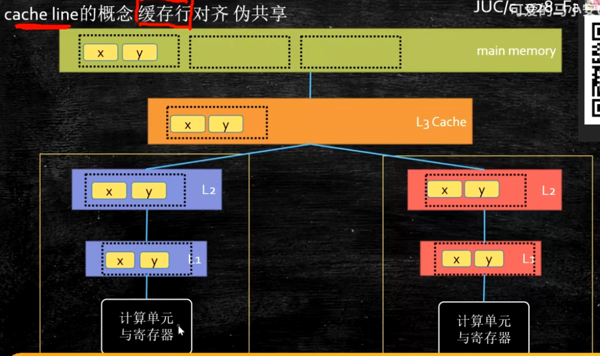
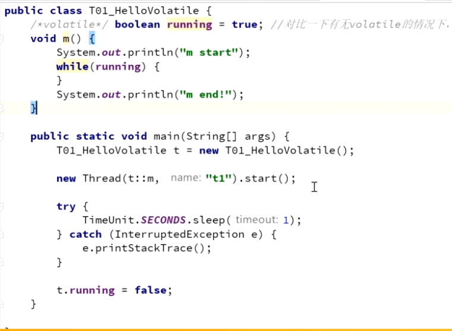
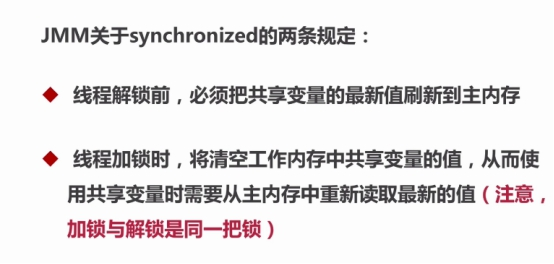
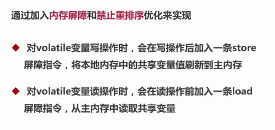
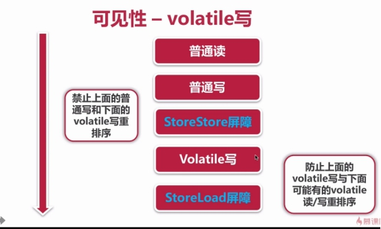
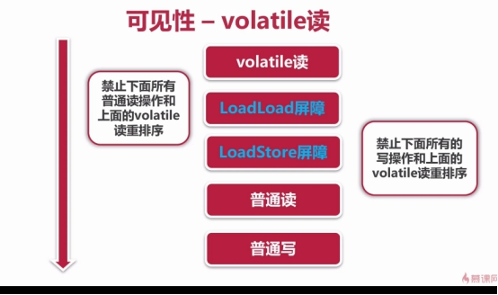

## 内存屏障

### 缓存行对齐

计算机的组成如下：




CPU cache


从CPU 到 寄存器到CPU Cache 的时间




多核 CPU Cache



PC 计数器 : 一个线程执行到了什么位置

ALU ：线程执行单元， 线程做的计算通过 ALU 来做

Registers ：寄存器

上线文切换的概念：首先要将当前线程的 PC 计数器的信息和 寄存器的数据保存起来，将另一个线程的数据加载进来

超线程：所谓超线程（一核两线程）就是 每一核 都有两个寄存器核 PC计数器，当出现上下文切换的时候只需要改变ALU 的指向即可，大大减少了 线程上下文切换的开销




Cache Line ：




由于 CPU 到主内存需要经过好多缓存，比如 寄存器 L1 L2 L3 

如果需要找某个变量的值，比如找 x 的值，先从 L1 找 ，如果 L1没有则到L2找，如果 L2 没有则到 L3找，人如果还是没有则到 主内存找，由于CPU每次寻找数据的开销很大，所以从主内存读取数据时按照数据块进行读取，按照8个字节进行读取

一个缓存行为 64个字节


## JMM 内存


## Volatile

代码示例：



执行结果：

在修改running = false 的时候，Thread 线程并不能看到该变量的改变

m start （一直阻塞在这里）


#### JMM内存定义

```
共享变量存储于主内存之中，每个线程都可以访问
每个线程都有私有的工作内存，或者称为本地内存
工作线程之存储该线程对共享变量的副本
线程不能直接操作主内存，只有先操作了工作内存之后才能写入主内存

JMM规范要求，线程对变量的读写，需要从主存拷贝变量副本到工作内存中，以提高执行性能，再在合适的时机同步回主存，以使其他线程可见。
```


```
jmm保证了：
	原子性、可见性、有序性

++i 并不是原子性操作：
	get i，
	i+1
	set i =x

volitile只能保证读取和赋值的原子操作，并不能保证原子性语义


可见性：


有序性

```


#### volitile关键字的作用

```
1. 多线程之间的可见性
2. 阻止指令冲排序
```


```
read（读取）：从主内存读取数据
load（载入）：将主内存读取到的数据写入工作内存
use（使用）：从工作内存读取数据来计算
assign（赋值）：将计算好的值重新赋值到工作内存中
strore（存储）：将工作内存数据写入主内存
write（写入）：将store过去的变量值赋值给主内存中的变量
lock（锁定）：将主内存变量枷锁，表示为线程独占状态
unlock（解锁）：将主内存变量解锁，解锁后其他线程可以锁定该变量
```


 

 

 

 

 

 

 

 

 

 

```
针对处理器重排序：编译器在生成字节码指令时，通过在指令序列中插入内存屏障指令来禁止特定类型的处理器重排序，以实现volatile内存语义：volatile底层通过内存屏障指令实现

##在每个volatile变量写操作之前插入StoreStore屏障，之后插入StoreLoad屏障；
	之前插入StoreStore屏障：禁止volatile写之前的写操作与其重排序，保证之前的所有写操作都写回主存，对volatile写可见；
	之后插入StoreLoad屏障：禁止volatile写之后的读写操作与其重排序，实现volatile写结果对后续操作可见；

##在每个volatile变量读操作之后，接连插入LoadLoad屏障，LoadStore屏障；
	插入LoadLoad屏障：禁止volatile变量读之后的读操作与其重排序；
	插入LoadStore屏障：禁止volatile变量读之后的写操作与其重排序；
	通过插入两次内存屏障，实现volatile读结果对后续操作可见；
	
JMM通过上述内存屏障插入策略，保证在任意平台上volatile的内存语义一致；

volatile关键字语义
volatile用来修饰共享变量（成员变量，static变量）表明：
		
##volatile变量写：当写一个volatile变量时，JMM会把所有线程本地内存的对应变量副本刷新回主存；
	volatile写和解锁内存语义相同；

##volatile变量读：当读一个volatile变量时，JMM会设置该线程的volatile变量副本（本地内存中）无效，线程只能从主存中读取该变量；
	保证了volatile变量读，总能看见对该volatile变量最后的修改；
	volatile变量读和加锁内存语义相同；
通过上述机制，volatile保证共享变量一旦被修改，新值对所有线程可见；
```

 


```
volitile和 synchorized的区别

1、	volatile关键字只能用于修饰实例变量或者类变量，不能用于修饰方法一级局部变量
	synchorized关键字只能修饰方法或者语句块
	volitile修饰的变量可以为null，synchorized关键字同步语句块的monitor对象不能为null

2、	volitile不能保证原子性
	synchorized是一种排他机制，即monitor enter 和 monitor exits指令

3、volitile可以保证其可见性，synchorized也可以

4. volitile禁止jvm和处理器进行指令重排序，synchorized关键字则是保证方法或者代码块内部是顺序执行的

5、volatile不会使线程陷入阻塞，synchorized关键字会使线程进入阻塞状态
```


#### 单例模式

懒汉模式（Synchorized并不能保证内存级别的指令冲排序）


饿汉模式


枚举类型


Holder模式


