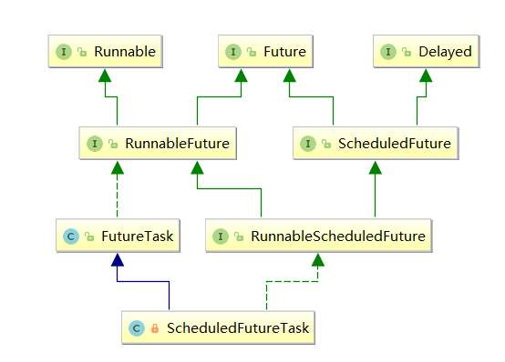

## Future 详解

## 一、Future 模式

 **Future模式** 是Java多线程设计模式中的一种常见模式，它的主要作用就是异步地执行任务，并在需要的时候获取结果。我们知道，一般调用一个函数，需要等待函数执行完成，调用线程才会继续往下执行，如果是一些计算密集型任务，需要等待的时间可能就会比较长。 

在Java中，一种解决办法是由调用线程新建一个线程执行该任务，比如下面这样：

```
public void calculate(){
    Thread t = new Thread(new Runnable() {
        @Override
        public void run() {
            model.calculate();
        }
    });
    t.start();
}
```

但是，这样有一个问题，我拿不到计算结果，也不知道任务到底什么时候计算结束。我们来看下**Future模式**是如何来解决的。

***Future模式\***，可以让调用方立即返回，然后它自己会在后面慢慢处理，此时调用者拿到的仅仅是一个**凭证**，调用者可以先去处理其它任务，在真正需要用到调用结果的场合，再使用凭证去获取调用结果。这个凭证就是这里的**Future**。

我们看下时序图来理解下两者的区别:

*传统的数据获取方式：*


*Future模式下的数据获取：*


> 如果读者对经济学有些了解，或是了解金融衍生品的话，对***Future\***这个单词应该不会陌生，***Future\***在经济学中出现的频率相当之高，比如关于现金流的折算，其中的终值，英文就是***Future value\***。常见的金融衍生品，期货、远期的英文分别是***Futures\***、***Financial future\***。

我们之前说了，Future模式可以理解为一种凭证，拿着该凭证在将来的某个时间点可以取到我想要的东西，这其实就和期货、远期有点类似了，期货、远期也是双方制定协议或合同，然后在约定的某个时间点，拿着合同进行资金或实物的交割。可见，Future模式的命名是很有深意且很恰当的。


## 二、JUC中的 Future 模式

在Java多线程基础之Future模式中，我们曾经给出过Future模式的通用类关系图。本章中，我不想教科书般得再贴一遍该图，而是希望能循序渐进地带领读者去真正理解Future模式中的各个组件，去思考为什么Future模式的类关系图是那样，为什么一定就是那么几个组件？

### 真实的任务类

首先来思考下，我们需要执行的是一个任务，那么在Java中，一般需要实现`Runnable`接口，比如像下面这样：

```java
public class Task implements Runnable {
    @Override
    public void run() {
        // do something
    }
}
```

但是，如果我需要任务的返回结果呢，从Runnable的接口定义来看，并不能满足我们的要求，Runnable一般仅仅用于定义一个可以被线程执行的任务，它的run方法没有返回值：

```java
public interface Runnable {
    public abstract void run();
}
```

于是，JDK提供了另一个接口——`Callable`，表示一个具有返回结果的任务：

```java
public interface Callable<V> {
    V call() throws Exception;
}
```

所以，最终我们自定义的任务类一般都是实现了Callable接口。以下定义了一个具有复杂计算过程的任务，最终返回一个Double值：

```java
public class ComplexTask implements Callable<Double> {
    @Override
    public Double call() {
        // complex calculating...
        return ThreadLocalRandom.current().nextDouble();
    }
}
```

------

### 凭证

第一节讲到，Future模式可以让调用方获取任务的一个凭证，以便将来拿着凭证去获取任务结果，凭证需要具有以下特点：

1. 在将来某个时间点，可以通过凭证获取任务的结果；
2. 可以支持取消。

从以上两点来看，我们首先想到的方式就是对Callable任务进行包装，包装成一个凭证，然后返回给调用方。
J.U.C提供了Future接口和它的实现类——`FutureTask`来满足我们的需求，我们可以像下面这样对之前定义的ComplexTask包装：

```java
ComplexTask task = new ComplexTask();
Future<Double> future = new FutureTask<Double>(task);
```

上面的FutureTask就是真实的“凭证”，Future则是该凭证的接口（从面向对象的角度来讲，调用方应面向接口操作）。

*Future接口的定义：*

```java
public interface Future<V> {
 
    boolean cancel(boolean mayInterruptIfRunning);
 
    boolean isCancelled();
 
    boolean isDone();
 
    V get() throws InterruptedException, ExecutionException;
 
    V get(long timeout, TimeUnit unit)
        throws InterruptedException, ExecutionException, TimeoutException;
}
```

Future接口很简单，提供了`isCancelled`和`isDone`两个方法监控任务的执行状态，一个`cancel`方法用于取消任务的执行。两个`get`方法用于获取任务的执行结果，如果任务未执行完成，除非设置超时，否则调用线程将会阻塞。

此外，为了能够被线程或线程池执行任务，凭证还需要实现Runnable接口，所以J.U.C还提供了一个`RunnableFuture`接口，其实就是组合了Runnable和Future接口：

```java
public interface RunnableFuture<V> extends Runnable, Future<V> {
    void run();
}
```

上面提到的**FutureTask**，其实就是实现了**RunnableFuture**接口的“凭证”：

```java
public class FutureTask<V> implements RunnableFuture<V> {
 
    public FutureTask(Callable<V> callable) {
        if (callable == null)
            throw new NullPointerException();
        this.callable = callable;
        // ...       
    }
 
    public FutureTask(Runnable runnable, V result) {
        this.callable = Executors.callable(runnable, result);
        // ...
    }
}
```

从构造函数可以看到，FutureTask既可以包装Callable任务，也可以包装Runnable任务，但最终都是将Runnable转换成Callable任务，其实是一个适配过程。


------

### 调用方

最终，调用方可以以下面这种方式使用Future模式，异步地获取任务的执行结果。

public class Client {

```java
public static void main(String[] args) throws ExecutionException, InterruptedException {
    ComplexTask task = new ComplexTask();
    Future<Double> future = new FutureTask<Double>(task);
    
    // time passed...
    
    Double result = future.get();
}
```

}

通过上面的分析，可以看到，整个Future模式其实就三个核心组件：

- **真实任务/数据类**（通常任务执行比较慢，或数据构造需要较长时间），即示例中的ComplexTask
- **Future接口**（调用方使用该凭证获取真实任务/数据的结果），即Future接口
- **Future实现类**（用于对真实任务/数据进行包装），即FutureTask实现类

## 三、FutureTask原理

在J.U.C提供的Future模式中，最重要的就是`FutureTask`类，FutureTask是在JDK1.5时，随着J.U.C一起引入的，它代表着一个异步任务，这个任务一般提交给Executor执行，当然也可以由调用方直接调用run方法运行。


既然是任务，就有状态，FutureTask一共给任务定义了**7种**状态：

- ***NEW：\***表示任务的初始化状态；
- ***COMPLETING：\***表示任务已执行完成（正常完成或异常完成），但任务结果或异常原因还未设置完成，属于中间状态；
- ***NORMAL：\***表示任务已经执行完成（正常完成），且任务结果已设置完成，属于最终状态；
- ***EXCEPTIONAL：\***表示任务已经执行完成（异常完成），且任务异常已设置完成，属于最终状态；
- ***CANCELLED：\***表示任务还没开始执行就被取消（非中断方式），属于最终状态；
- ***INTERRUPTING：\***表示任务还没开始执行就被取消（中断方式），正式被中断前的过渡状态，属于中间状态；
- ***INTERRUPTED：\***表示任务还没开始执行就被取消（中断方式），且已被中断，属于最终状态。

各个状态之间的状态转换图如下：


上图需要注意的是两点：

1. FutureTask虽然支持任务的取消（cancel方法），但是只有当任务是初始化（**NEW**状态）时才有效，否则cancel方法直接返回false；
2. 当执行任务时（run方法），无论成功或异常，都会先过渡到**COMPLETING**状态，直到任务结果设置完成后，才会进入响应的终态。

> JDK1.7之前，FutureTask通过内部类实现了AQS框架来实现功能。 JDK1.7及以后，则改变为直接通过`Unsafe`类CAS操作`state`状态字段来进行同步。

------

### 构造

FutureTask在构造时可以接受Runnable或Callable任务，如果是Runnable，则最终包装成Callable：

```java
public FutureTask(Callable<V> callable) {
    if (callable == null)
        throw new NullPointerException();
    this.callable = callable;
    this.state = NEW;
}

public FutureTask(Runnable runnable, V result) {
    this.callable = Executors.callable(runnable, result);
    this.state = NEW;
}
```

上述的`Executors.callable()`方法我们在[executors框架概述](https://segmentfault.com/a/1190000016586578)提到过，其实就是对Runnable对象做了适配，返回Callable适配对象——RunnableAdapter：

```java
public static <T> Callable<T> callable(Runnable task, T result) {
    if (task == null)
        throw new NullPointerException();
    return new RunnableAdapter<T>(task, result);
}
static final class RunnableAdapter<T> implements Callable<T> {
    final Runnable task;
    final T result;
    RunnableAdapter(Runnable task, T result) {
        this.task = task;
        this.result = result;
    }
    public T call() {
        task.run();
        return result;
    }
}
```

FutureTask的字段定义非常简单，State标识任务的当前状态，状态之间的转换通过Unsafe来操作，所有操作都基于**自旋+CAS**完成：

```java
private volatile int state;
private static final int NEW = 0;
private static final int COMPLETING = 1;
private static final int NORMAL = 2;
private static final int EXCEPTIONAL = 3;
private static final int CANCELLED = 4;
private static final int INTERRUPTING = 5;
private static final int INTERRUPTED = 6;
 
private Callable<V> callable;       // 真正的任务
private volatile Thread runner;     // 保存正在执行任务的线程
 
/**
 * 记录结果或异常
 */
private Object outcome;
 
/**
 * 无锁栈（Treiber stack）
 * 保存等待线程
 */
private volatile WaitNode waiters;
```

注意`waiters`这个字段，waiters指向一个“无锁栈”，该栈保存着所有等待线程，我们知道当调用FutureTask的get方法时，如果任务没有完成，则调用线程会被阻塞，其实就是将线程包装成`WaitNode`结点保存到waiters指向的栈中：

```java
static final class WaitNode {
    volatile Thread thread;
    volatile WaitNode next;
 
    WaitNode() {
        thread = Thread.currentThread();
    }
}
```


------

### 任务的运行

FutureTask的运行就是调用了**run**方法：

```java
public void run() {
    // 仅当任务为NEW状态时, 才能执行任务
    if (state != NEW ||
            !UNSAFE.compareAndSwapObject(this, runnerOffset, null, Thread.currentThread()))
        return;
    try {
        Callable<V> c = callable;
        if (c != null && state == NEW) {
            V result;
            boolean ran;
            try {
                result = c.call();
                ran = true;
            } catch (Throwable ex) {
                result = null;
                ran = false;
                setException(ex);
            }
            if (ran)
                set(result);
        }
    } finally {
        runner = null;
        int s = state;
        if (s >= INTERRUPTING)
            handlePossibleCancellationInterrupt(s);
    }
}
```

上述方法，首先判断当前任务的state是否等于NEW,如果不为NEW则说明任务或者已经执行过，或者已经被取消，直接返回。

正常执行完成后，会调用`set`方法设置任务执行结果：

```java
protected void set(V v) {
    if (UNSAFE.compareAndSwapInt(this, stateOffset, NEW, COMPLETING)) {
        outcome = v;
        UNSAFE.putOrderedInt(this, stateOffset, NORMAL); // final state
        finishCompletion();
    }
}
```

如果任务执行过程中抛出异常，则调用`setException`设置异常信息：

```java
protected void setException(Throwable t) {
    if (UNSAFE.compareAndSwapInt(this, stateOffset, NEW, COMPLETING)) {
        outcome = t;
        UNSAFE.putOrderedInt(this, stateOffset, EXCEPTIONAL); // final state
        finishCompletion();
    }
}
```

------

### 任务的取消

**cancel**方法用于取消任务，参数`mayInterruptIfRunning`如果为true，表示中断正在执行任务的线程，否则仅仅是将任务状态置为**CANCELLED** ：

```java
public boolean cancel(boolean mayInterruptIfRunning) {
    // 仅NEW状态下可以取消任务
    if (!(state == NEW &&
            UNSAFE.compareAndSwapInt(this, stateOffset, NEW,
                    mayInterruptIfRunning ? INTERRUPTING : CANCELLED)))
        return false;
    
    try {   
        if (mayInterruptIfRunning) {    // 中断任务
            try {
                Thread t = runner;
                if (t != null)
                    t.interrupt();
            } finally { // final state
                UNSAFE.putOrderedInt(this, stateOffset, INTERRUPTED);
            }
        }
    } finally {
        finishCompletion();
    }
    return true;
}
```

任务取消后，最终调用`finishCompletion`方法，释放所有在栈上等待的线程：

```java
/**
 * 唤醒栈上的所有等待线程.
 */
private void finishCompletion() {
    // assert state > COMPLETING;
    for (WaitNode q; (q = waiters) != null; ) {
        if (UNSAFE.compareAndSwapObject(this, waitersOffset, q, null)) {
            for (; ; ) {
                Thread t = q.thread;
                if (t != null) {
                    q.thread = null;
                    LockSupport.unpark(t);
                }
                WaitNode next = q.next;
                if (next == null)
                    break;
                q.next = null; // unlink to help gc
                q = next;
            }
            break;
        }
    }
 
    done();                 // 钩子方法
    callable = null;        // to reduce footprint
}
```

------

### 结果获取

FutureTask可以通过get方法获取任务结果，如果需要限时等待，可以调用`get(long timeout, TimeUnit unit)`。

```java
public V get() throws InterruptedException, ExecutionException {
    int s = state;
    if (s <= COMPLETING)
        s = awaitDone(false, 0L);
    return report(s);   // 映射任务执行结果
}
```

可以看到，如果当前任务的状态是**NEW**或**COMPLETING**，会调用`awaitDone`阻塞线程。否则会认为任务已经完成，直接通过`report`方法映射结果：

```java
/**
 * 将同步状态映射为执行结果.
 */
private V report(int s) throws ExecutionException {
    Object x = outcome;
    if (s == NORMAL)
        return (V) x;
    if (s >= CANCELLED)
        throw new CancellationException();
    throw new ExecutionException((Throwable) x);
}
```

report会根据任务的状态进行映射，如果任务是Normal状态，说明正常执行完成，则返回任务结果；如果任务被取消（CANCELLED或INTERRUPTED），则抛出CancellationException；其它情况则抛出ExecutionException。


## 四、ScheduledFutureTask

在[ScheduledThreadPoolExecutor](https://segmentfault.com/a/1190000016672638)一节中，我们曾经介绍过另一种FutureTask——`ScheduledFutureTask`，ScheduledFutureTask是**ScheduledThreadPoolExecutor**这个线程池的默认调度任务类。
ScheduledFutureTask在普通FutureTask的基础上增加了周期执行/延迟执行的功能。通过下面的类图可以看到，它其实是通过继承FutureTask和Delayed接口来实现周期/延迟功能的。



```java
ScheduledFutureTask(Callable<V> callable, long ns) {
    super(callable);
    this.time = ns;
    this.period = 0;
    this.sequenceNumber = sequencer.getAndIncrement();
}
```

ScheduledFutureTask的源码非常简单，基本都是委托FutureTask来实现的，关键是看下运行任务的方法：

```java
public void run() {
    boolean periodic = isPeriodic();                    // 是否是周期任务
    if (!canRunInCurrentRunState(periodic))      // 能否运行任务
        cancel(false);
    else if (!periodic)                                           // 非周期任务：调用FutureTask的run方法运行
        ScheduledFutureTask.super.run();
    else if (ScheduledFutureTask.super.runAndReset()) {    // 周期任务：调用FutureTask的runAndReset方法运行
        setNextRunTime();
        reExecutePeriodic(outerTask);
    }
}
```

FutureTask的`runAndReset`方法与run方法的区别就是当任务正常执行完成后，不会设置任务的最终状态（即保持NEW状态），以便任务重复执行：

```java
protected boolean runAndReset() {
    // 仅NEW状态的任务可以执行
    if (state != NEW ||
            !UNSAFE.compareAndSwapObject(this, runnerOffset,
                    null, Thread.currentThread()))
        return false;
    
    boolean ran = false;
    int s = state;
    try {
        Callable<V> c = callable;
        if (c != null && s == NEW) {
            try {
                c.call(); // don't set result
                ran = true;
            } catch (Throwable ex) {
                setException(ex);
            }
        }
    } finally {
        runner = null;
        s = state;
        if (s >= INTERRUPTING)
            handlePossibleCancellationInterrupt(s);
    }
    return ran && s == NEW;
}
```

## 五、总结

本章我们从源头开始，讲解了Future模式的来龙去脉，并以J.U.C中的Future模式为例，分析了Future模式的组件以及核心实现类——`FutureTask`，最后回顾了ScheduledFutureTask中定义的内部异步任务类——`ScheduledFutureTask`。

理解Future模式的关键就是理解它的两个核心组件，可以类比生活中的凭证来理解这一概念，不必拘泥于Java多线程设计模式中Future模式的类关系图。

- 真实任务类
- 凭证

