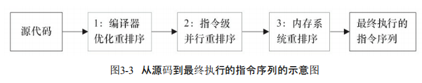

## Java Memory Model

在 了解java内存之前，我们先看看java内存模型的抽象结构

### JMM 抽象结构

Java线程之间的通信由Java内存模型（本文简称为JMM）控制，JMM决定一个线程对共享 变量的写入何时对另一个线程可见，从抽象角度来看，JMM定义了线程与主存之间的抽象关系：线程之间的共享变量存储在主内存中，每个线程都有自己的私有本地内存，本地内存中存储了该线程以读/写共享变量的副本。本地内存是JMM的 一个抽象概念，并不真实存在，java内存的抽象示意图：

从图3-1来看，如果线程A与线程B之间要通信的话，必须要经历下面2个步骤。 

1）线程A把本地内存A中更新过的共享变量刷新到主内存中去。 

2）线程B到主内存中去读取线程A之前已更新过的共享变量。

下图：3-2 来说明这两个步骤：

如上图。本地内存A 和本地内存B 都存有变量X 的副本，假设初始时，这3个内存中的X 值都为0，线程A 在执行时，把更新后的x值临时存放在自己的本地内存中，当线程A 要和线程B 通信时，线程A 会把自己本地内存中修改后的X值刷新到主存，此时主内存的X 值变为了1，然后线程B 读取道了线程A 更新后的X 值，此时，线程B 的本地内存中X 的值也变为了1

**从整体来看，这两个步骤实质上是线程A在向线程B发送消息，而且这个通信过程必须要 经过主内存。JMM通过控制主内存与每个线程的本地内存之间的交互，来为Java程序员提供 内存可见性保证**

### 指令重排序

在执行程序时，为了提高性能，编译器和处理器常常灰度指令做重排序，重排序分为三个种类。分别为：

1、编译器优化重排序

- 编译器在不改变单线程程序语义的前提下，可以重新安排语句 的执行顺序。 

2、指令集并行的重排序

- 现代处理器采用了指令级并行技术（Instruction-Level Parallelism，ILP）来将多条指令重叠执行。如果不存在数据依赖性，处理器可以改变语句对应 机器指令的执行顺序。

3、内存系统的重排序

- 由于处理器使用缓存和读/写缓冲区，这使得加载和存储操作看上 去可能是在乱序执行。 

从Java源代码到最终实际执行的指令序列，会分别经历下面3种重排序，如图3-3所示：

对与上述的指令重排序，在多线程的场景下，可能会导致内存可见性问题，对于处理器重排序，JMM的处理器重排序规则会要 求Java编译器在生成指令序列时，插入特定类型的内存屏障（Memory Barriers，Intel称之为 Memory Fence）指令，通过内存屏障指令来禁止特定类型的处理器重排序。

为了保证内存可见性，Java编译器在生成指令序列的适当位置会插入内存屏障指令来禁 止特定类型的处理器重排序。JMM把内存屏障指令分为4类，如表3-3所示：

StoreLoad Barriers是一个“全能型”的屏障，它同时具有其他3个屏障的效果。现代的多处 理器大多支持该屏障（其他类型的屏障不一定被所有处理器支持）。执行该屏障开销会很昂 贵，因为当前处理器通常要把写缓冲区中的数据全部刷新到内存中（Buffer Fully Flush）。

### happens-before

在JSR-133 中使用happens-before的概念来阐述操作之间的内存可见性，在JMM中，如果一个操作执行结果要对另一个操作可见，那么这两个操作时间必须要存在happens-before原则，这里提到的两个操作既可以在一个线程之内，也可以在不通线程，**两个操作之间据有hanpens-before 原则，并不意味前一个操作一定要在后一个操作之前执行，仅仅是要求前一个操作对后一个操作可见**

happens-before规则如下：

- 程序顺序规则：一个线程中的每个操作，happens-before于该线程中的任意后续操作。 

- 监视器锁规则：对一个锁的解锁，happens-before于随后对这个锁的加锁。 

- volatile变量规则：对一个volatile域的写，happens-before于任意后续对这个volatile域的 读。 

- 传递性：如果A happens-before B，且B happens-before C，那么A happens-before C。

hanpens-before 层次结构如下：

如图3-5所示，一个happens-before规则对应于一个或多个编译器和处理器重排序规则。对 于Java程序员来说，happens-before规则简单易懂，它避免Java程序员为了理解JMM提供的内存 可见性保证而去学习复杂的重排序规则以及这些规则的具体实现方法。