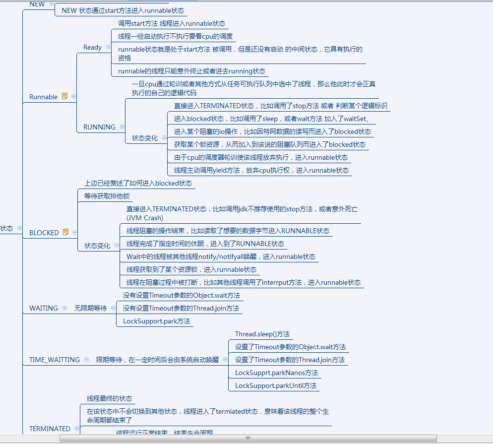
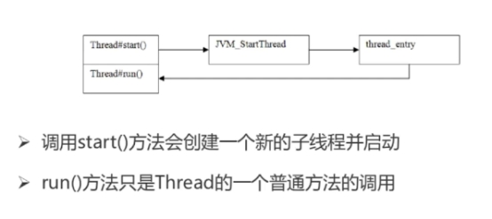

#### 多线程的几种实现方式？

```
继承Thread类

看jdk源码可以发现，Thread类其实是实现了Runnable接口的一个实例，继承Thread类后需要重写run方法并通过start方法启动线程。

继承Thread类耦合性太强了，因为java只能单继承，所以不利于扩展。

2、实现Runnable接口
通过实现Runnable接口并重写run方法，并把Runnable实例传给Thread对象，Thread的start方法调用run方法再通过调用Runnable实例的run方法启动线程。

所以如果一个类继承了另外一个父类，此时要实现多线程就不能通过继承Thread的类实现。


3、实现Callable接口
通过实现Callable接口并重写call方法，并把Callable实例传给FutureTask对象，再把FutureTask对象传给Thread对象。它与Thread、Runnable最大的不同是Callable能返回一个异步处理的结果Future对象并能抛出异常，而其他两种不能。
```


#### Thread线程的几种状态？



 


#### Thread.join方法？

```java
public final synchronized void join(long millis) throws InterruptedException {
    ...
    if (millis == 0) {
        while (isAlive()) {
            wait(0);
        }
    } else {
        ...
    }
    ...
}

其实可以理解在 如过当前Thread对象一直存活，则 该线程会一直 阻塞直到线程结束，跟Thread的生命周期有关
```


#### Thread.sleep() 和 Thread.yield()有什么区别?

```
yield:
	提醒调度器愿意放弃当前cpu的调度执行权

与sleep的区别
	sleep会导致当前线程暂停指定的时间，没有cpu时间片的消耗
	yield只是对cpu调度器的一个提示，如过cpu调度器没有忽略这个提醒，他会导致上下文切换
	sleep会导致线程短暂block，会在给定的时间内释放cpu资源
	yield会使running状态的thread进入runnable状态，如过cpu没有忽略这个提示的话
	sleep几乎百分之百完成了给定时间的休眠，而yield的提示并不能一定担保
	一个线程sleep另一个线程调用interrupt会捕获到中断信号，而yield则不会
```


#### Thread.exit 方法

```
在thread 结束的时候默认会调用 thread类的exit方法 来将 当前thread对象从 所在的threadGroup中 移出掉（移除的时候所在group中 --nThreads ）
```


#### sleep 方法与 wait方法的区别是什么？

```
sleep:
	sleep方法可以在任何地方使用
	sleep方法只会让出cpu，不会导致锁行为的改变
	
wait:
	wait方法只能在synchorized方法或者synchorized块中使用
	wait方法不仅让出cpu，还会释放已经占有的同步锁资源
```


#### sleep(0) 与 sleep（i）的区别是什么？

```
这听上去好像没有什么意义，但其实调用Thread.sleep(0)的当前线程确实被“冻结”了一下，让其他线程有机会优先执行。也就是说当前线程会释放一些未用完的时间片给其他线程或进程使用，就相当于一个让位动作，这看上去就和下面要说的yield方法很像了。
```


#### start方法与run方法的区别？

Run方法会在Thread.c文件中使用JVM_startThread 类启动线程然后执行 run方法




#### Thread.interupte()

````
InterruptedException
只有在TiME_WAING或者WAING的时候的时候才会抛出InterruptedException
````


#### ThreadLocal 的用途是什么？ 原理是什么？ 有什么弊端？

```
ThreadLocal主要用于线程间的数据隔离，并且将本地变量绑定到该线程上


原理：
	ThreadLoclMap
	Entry（继承自WeakReference）
	
	set(T value)
		1, 根据当前的Thread对象返回 thread对象中的ThreadLocalMap
		2. 如过map不存在则创建一个新的map放入thread对象中，用当前的ThreadLocal实例作为key，将要存放的数据作为Value 对应到ThreadLocalMap中则是创建了一个Entry
		3.在map的set方法中遍历整个map的Entry，如过发现ThreadLocal相同，则使用新的数据替换即可
		4. 在遍历map的Entry过程中，如过发现有Entry的Key为null，则直接将其逐出并且使用新的数据占用被逐出的数据的位置，这个过程主要是为了防止内存泄漏
		
		5. 根据当前的ThreadLocal对象的hash值算出所在的entry数组中的entry对象
		
		
	get()
		根据ThreadLocal对象hash值取模算出数据存放的具体位置，如过存在数据则直接返回，
		如过没有则遍历Entry数组，如过找到相应的key则返回，如过没找到则返回null
		遍历过程中如果key 为null的则将该Entry对象进行删除
	

    每个线程都有独立的ThreadLoclMap 对象，而ThreadLoclMap中存储的是Entry数组
    当每次需要取数据时，都需要以当前的ThreadLocal对象为key 进行取值
    当执行Thread.exit方法时，会将当前thread对象拥有的ThreadLocalMap对象置为null帮助垃圾回收
    
弊端：
	内存泄漏
	
key 使用强引用：引用的ThreadLocal的对象被回收了，但是ThreadLocalMap还持有ThreadLocal的强引用，如果没有手动删除，ThreadLocal不会被回收，导致Entry内存泄漏。
key 使用弱引用：引用的ThreadLocal的对象被回收了，由于ThreadLocalMap持有ThreadLocal的弱引用，即使没有手动删除，ThreadLocal也会被回收。value在下一次ThreadLocalMap调用set,get，remove的时候会被清除。
比较两种情况，我们可以发现：由于ThreadLocalMap的生命周期跟Thread一样长，如果都没有手动删除对应key，都会导致内存泄漏，但是使用弱引用可以多一层保障：弱引用ThreadLocal不会内存泄漏，对应的value在下一次ThreadLocalMap调用set,get,remove的时候会被清除

所以在使用 ThreadLocal的时候要尽量使用remove方法将当前的key移除，移除完成之后在一下次 set，get，remove的时候就会将key为null的entry从map中移除掉
```


#### Hook异常

```
异常捕获
	UncaughtExceptionHandler
	private void dispatchUncaughtException(Throwable e)
		在某个线程内执行抛出异常时，jvm会自动调用该方法进行处理
		判断当前线程是否设置了exceptionHandler，如过没有设置则默认返回当前线程所在的线程组进行处理
```


Group处理：

