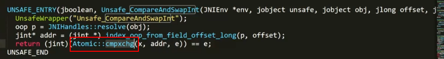
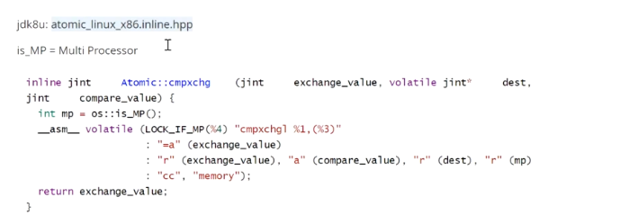

## CAS 原理

**CAS,compare and swap比较并替换。 CAS有三个参数：需要读写的内存位值（V）、进行比较的预期原值（A）和拟写入的新值(B)。当且仅当V的值等于A时，CAS才会通过原子方式用新值B来更新V的值，否则不会执行任何操作。**简单来说，CAS的含义是：“我认为V的值应该是A，如果是，那么将V的值更新为B，否则不修改并告诉V的值实际为多少”。CAS是一项乐观的技术，它希望能成功地执行更新操作，并且如果有另一个线程在最近一次检查后更新了该变量，那么CAS能检测到这个错误。当多个线程尝试使用CAS同时更新同一个变量时，只有其中一个线程能更新变量的值，而其他线程都将失败。但是，失败的线程并不会被挂起（这就是与获取锁的机制不同之处），而是被告知在这次竞争中失败，并可以多次尝试。这种灵活性就大大减少了与锁相关的活跃性风险。

原理图如下：


### 例子 1:  自旋更新

对应代码：

```java
public final int getAndAddInt(Object var1, long var2, int var4) {
        int var5;
        do {
            var5 = this.getIntVolatile(var1, var2);
        } while(!this.compareAndSwapInt(var1, var2, var5, var5 + var4));

        return var5;
    }
```

每次尝试去修改一个值，如果该值已经改变则读取最新值继续尝试改变，直到改变成功为止，先决条件: **自旋**

例如： i = 0 ，先拿到 i 值为0，然后尝试修改为1，这个时候其他线程已经将 i 修改为1了，当 compareAndSwap的时候失败了，因为 i 已经由0变为了1，所以需要自选，再一次获取 i 的值，接着拿到 i 的最新值 继续 compareAndSwap，如果还是不成功就继续循环，直到成功为止，这就是 CAS,由自旋来完成所有操作，中间并不需要枷锁


### 例子2： Atomic CAS实现

以AtomicInteger为例，内部的CAS实现如下：

```
public class AtomicInteger extends Number implements java.io.Serializable {
    private static final long serialVersionUID = 6214790243416807050L;

    // setup to use Unsafe.compareAndSwapInt for updates
    private static final Unsafe unsafe = Unsafe.getUnsafe();
    //value的偏移地址
    private static final long valueOffset;

    static {
        try {
            valueOffset = unsafe.objectFieldOffset
                    (AtomicInteger.class.getDeclaredField("value"));
        } catch (Exception ex) {
            throw new Error(ex);
        }
    }

    private volatile int value;

    public AtomicInteger(int initialValue) {
        value = initialValue;
    }

    public final int getAndUpdate(IntUnaryOperator updateFunction) {
        int prev, next;
        do {
            prev = get();
            next = updateFunction.applyAsInt(prev);
        } while (!compareAndSet(prev, next));
        return prev;
    }
    public final boolean compareAndSet(int expect, int update) {
        return unsafe.compareAndSwapInt(this, valueOffset, expect, update);
    }
}
```

**说明**： 可以看到`AtomicInteger`内部都是使用了`Unsafe`类来进行CAS操作，`valueOffset`表示的是value值的偏移地址，因为Unsafe就是根据内存偏移地址获取数据的原值的, 偏移量可以简单理解为指针指向该变量的内存地址。 `value`使用volatile修饰，直接从共享内存中操作变量，保证多线程之间看到的value值是同一份。
 以方法`getAndUpdate()`为例，执行步骤如下：

1. 从内存中读取修改前的值`prev`，并执行给定函数式计算修改后的值`next`；
2. 调用`compareAndSet`修改`value`值（内部是调用了unsafe的`compareAndSwapInt`方法）。如果此时有其他线程也在修改这个`value`值，那么CAS操作就会失败，继续进入do循环重新获取新值，再次执行CAS直到修改成功。


## ABA问题

> ABA问题是一种异常现象：如果算法中的节点可以被循环利用，那么在使用“比较并替换”指令时就可能出现这种问题（主要在没有垃圾回收机制的环境中）。

如果有两个线程x和y，如果x初次从内存中读取变量值为A；线程y对它进行了一些操作使其变成B，然后再改回A，那么线程x进行CAS的时候就会误认为这个值没有被修改过。尽管CAS操作会成功执行，但是不代表它是没有问题的，如果有一个单向链表A B组成的栈，栈顶为A，线程T1准备执行CAS操作`head.compareAndSet(A,B)`，在执行之前线程T2介入，T2将A、B出栈，然后又把C、A放入栈，T2执行完毕；切回线程T1，T1发现栈顶元素依然为A，也会成功执行CAS将栈顶元素修改为B，但因为B.next为null，所以栈结构就会丢弃C元素。

针对这种情况，有一种简单的解决方案：不是更新某个引用的值，而是更新两个值，包括一个引用和一个和版本号，即这个值由A变为B，然后又变成A，版本号也将是不同的。Java中提供了`AtomicStampedReference`和`AtomicMarkableReference`来解决ABA问题。他们支持在两个变量上执行原子的条件更新。`AtomicStampedReference`将更新一个“对象-引用”二元组，通过在引用上加上“版本号”，从而避免ABA问题。 类似地，`AtomicMarkableReference`将更新一个“对象引用-布尔值”二元组，在某些算法中将通过这种二元组使节点保存在链表中同时又将其标记为“已删除的节点”。**不过目前来说，这两个类比较鸡肋，大部分情况下的ABA问题不会影响程序并发的正确性，如果需要解决ABA问题，改用传统的互斥同步可能会比原子类更高效。**


### Unsafe 的 compareAndSwap 底层实现

C ++ 对应源码：Atomic:cmpxchg



跟踪C ++ 源码如下：



解释如下： 

- _\_asm__ 代表执行的是汇编指令
- LOCK_IF_MP : 表示如果是多核cpu 则需要加锁
- cmpxchg：compare and exchange 比较并且替换，是汇编级别的比较交换指令实现 

总结来说就是：lock cmpxchg ，如果是多核则加锁，然后比较并且替换（cmpxchg 并不能保证原子性，如果加上lock 指令后，表示在某个一个cpu对该数做修改的时候，不允许其他cpu对此进行修改）

