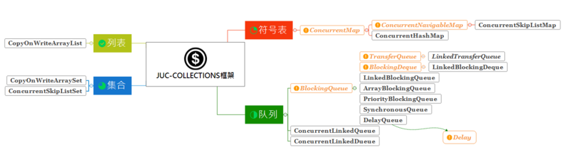

### Juc collction 体系

 juc-collections集合框架，是指`java.util.concurrent`包下的一些同步集合类，按类型划分可以分为：**符号表**、**队列**、**Set集合**、**列表**四大类，每个类都有自己适合的使用场景，整个juc-collections集合框架的结构如下图： 

  

Map ：

- ConcurrentMap
  - ConcurrentSkipListMap （基于跳表实现）
  - ConcurrentHashMap （基于红黑树实现）
- 写时复制
  - CopyOnWriteArraySet（基于写时复制技术）
  - CopyOnWriteArrayList （写时复制技术）
- Queue
  - BlockingQueue
    -  ArrayBlockingQueue （有界队列）
    - LinkedBlockingQueue（无界队列）
    - LinkedBlockingDeque （双端无界队列）
    -  TransferQueue 
      -  LinkedTransferQueue 
    -  PriorityBlockingQueue （堆PriortyQueue）
    - DelayQueue（延迟发出元素）
    - SynchronousQueue （只能保存一个的阻塞队列）

### Collection 体系介绍

### Map体系介绍

### Queue体系介绍

**ArrayBlockingQueue**：**数组实现的线程安全的有界的阻塞队列**，使用Lock机制实现并发访问，队列元素使用 FIFO（先进先出）方式。

 **LinkedBlockingQueue**：**单向链表实现的（指定大小）阻塞队列**，使用Lock机制实现并发访问，队列元素使用 FIFO（先进先出）方式。

 **LinkedBlockingDeque**：**双向链表实现的（指定大小）双向并发阻塞队列**，使用Lock机制实现并发访问，该阻塞队列同时支持FIFO和FILO两种操作方式。

 **ConcurrentLinkedQueue**：**单向链表实现的无界并发队列**，通过CAS实现并发访问，队列元素使用 FIFO（先进先出）方式。

 **ConcurrentLinkedDeque**：**双向链表实现的无界并发队列**，通过CAS实现并发访问，该队列同时支持FIFO和FILO两种操作方式。

 **DelayQueue**：**延时无界阻塞队列**，使用Lock机制实现并发访问。队列里只允许放可以“延期”的元素，队列中的head是最先“到期”的元素。如果队里中没有元素到“到期”，那么就算队列中有元素也不能获取到。

 **PriorityBlockingQueue**：**无界优先级阻塞队列**，使用Lock机制实现并发访问。priorityQueue的线程安全版，不允许存放null值，依赖于comparable的排序，不允许存放不可比较的对象类型。

 **SynchronousQueue**：**没有容量的同步队列**，通过CAS实现并发访问，支持FIFO和FILO。

 **LinkedTransferQueue**：1.7新增，单向链表实现的无界阻塞队列，通过CAS实现并发访问，队列元素使用 FIFO（先进先出）方式。LinkedTransferQueue可以说是ConcurrentLinkedQueue、SynchronousQueue（公平模式）和LinkedBlockingQueue的超集, 它不仅仅综合了这几个类的功能，同时也提供了更高效的实现