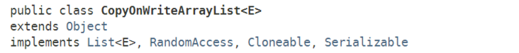
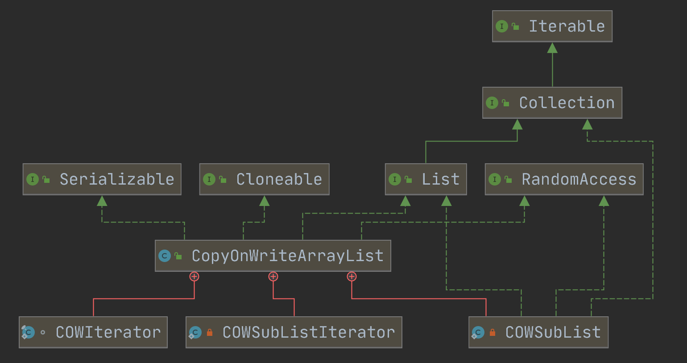
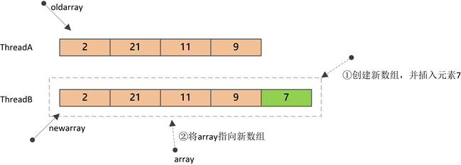
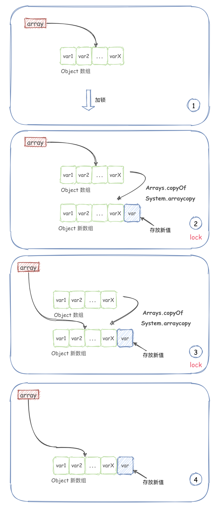
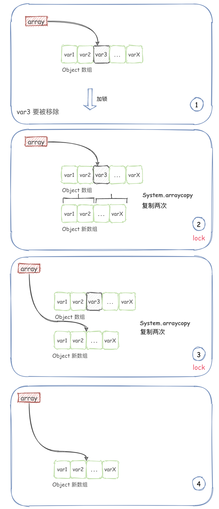

# CopyOnWriteArrayList

`ArrayList`是一种“列表”数据机构，其底层是通过**数组**来实现元素的**随机访问**。JDK1.5之前，如果想要在并发环境下使用“列表”，一般有以下3种方式：

1. 使用**Vector**类
2. 使用`Collections.synchronizedList`返回一个同步代理类；
3. 自己实现**ArrayList**的子类，并进行同步/加锁。


 JDK1.5时，随着J.U.C引入了一个新的集合工具类——`CopyOnWriteArrayList`： 

  

大多数业务场景都是一种 “读多写少”的情形，CopyOnWriteArrayList 就是为了这种场景而生的

CopyOnWriteArrayList，运用了一种**“写时复制”**的思想。通俗的理解就是当我们需要修改（增/删/改）列表中的元素时，不直接进行修改，而是先将列表Copy，然后在新的副本上进行修改，修改完成之后，再将引用从原列表指向新列表。

这样做的好处是**读/写是不会冲突**的，可以并发进行，读操作还是在原列表，写操作在新列表。仅仅当有多个线程同时进行写操作时，才会进行同步。


## CopyOnWriteArrayList 原理分析

### 结构图

  


### 内部结构

**CopyOnWriteArrayList**的字段很简单：

```
public class CopyOnWriteArrayList<E>
    implements List<E>, RandomAccess, Cloneable, java.io.Serializable {

    /**
     * 排它锁, 用于同步修改操作
     */
    final transient ReentrantLock lock = new ReentrantLock();

    /**
     * 内部数组
     */
    private transient volatile Object[] array;
}
```

其中，`lock`用于对修改操作进行同步，`array`就是内部实际保存数据的数组。


**构造器定义**

**CopyOnWriteArrayList**提供了三种不同的构造器，这三种构造器最终都是创建一个数组，并通过`setArray`方法赋给`array`字段：

```
/**
 * 空构造器.
 */
public CopyOnWriteArrayList() {
    setArray(new Object[0]);
}
 
仅仅是设置一个了大小为0的数组，并赋给字段array：
final void setArray(Object[] a) {
    array = a;
}
/**
 * 根据已有集合创建
 */
public CopyOnWriteArrayList(Collection<? extends E> c) {
    Object[] elements;
    if (c.getClass() == CopyOnWriteArrayList.class)
        elements = ((CopyOnWriteArrayList<?>) c).getArray();
    else {
        elements = c.toArray();
        // c.toArray might (incorrectly) not return Object[] (see 6260652)
        if (elements.getClass() != Object[].class)
            elements = Arrays.copyOf(elements, elements.length, Object[].class);
    }
    setArray(elements);
}
/**
 * 根据已有数组创建.
 *
 * @param toCopyIn the array (a copy of this array is used as the
 *                 internal array)
 * @throws NullPointerException if the specified array is null
 */
public CopyOnWriteArrayList(E[] toCopyIn) {
    setArray(Arrays.copyOf(toCopyIn, toCopyIn.length, Object[].class));
}
```

### 核心方法

**查询——get方法**

```
public E get(int index) {
    return get(getArray(), index);
}

private E get(Object[] a, int index) {
    return (E) a[index];
}
```

可以看到，**get**方法并没有加锁，直接返回了内部数组对应索引位置的值：`array[index]`

------

**添加——add方法**

```
public boolean add(E e) {
    final ReentrantLock lock = this.lock;
    lock.lock();
    try {
        Object[] elements = getArray();     // 旧数组
        int len = elements.length;
        Object[] newElements = Arrays.copyOf(elements, len + 1);    // 复制并创建新数组
        newElements[len] = e;               // 将元素插入到新数组末尾
        setArray(newElements);              // 内部array引用指向新数组
        return true;
    } finally {
        lock.unlock();
    }
}
```

**add**方法首先会进行加锁，保证只有一个线程能进行修改；然后会创建一个新数组（大小为`n+1`），并将原数组的值复制到新数组，新元素插入到新数组的最后；最后，将字段`array`指向新数组。



上图中，ThreadB对Array的修改由于是在新数组上进行的，所以并不会对ThreadA的读操作产生影响。

add 方法逻辑很简单：

1. 通过加互斥锁（ReentrantLock）从而保证在写的时候只有一个线程可以写。
2. 新增元素时，先使用 `Arrays.copyOf(elements, len + 1)` 复制出一个长度 +1 的新数组。
3. 添加元素到新数组。
4. 然后再将原数组对象指向新数组。

操作过程图如下：

  


------

**删除——remove方法**

```
public E remove(int index) {
    final ReentrantLock lock = this.lock;
    lock.lock();
    try {
        Object[] elements = getArray();
        int len = elements.length;
        E oldValue = get(elements, index);  // 获取旧数组中的元素, 用于返回
        int numMoved = len - index - 1;     // 需要移动多少个元素
        if (numMoved == 0)                  // index位置刚好是最后一个元素
            setArray(Arrays.copyOf(elements, len - 1));
        else {
            Object[] newElements = new Object[len - 1];
            System.arraycopy(elements, 0, newElements, 0, index);
            System.arraycopy(elements, index + 1, newElements, index, numMoved);
            setArray(newElements);
        }
        return oldValue;
    } finally {
        lock.unlock();
    }
}
```

删除方法和插入一样，都需要先加锁（所有涉及修改元素的方法都需要先加锁，写-写不能并发），然后构建新数组，复制旧数组元素至新数组，最后将`array`指向新数组。

remove 方法相对多了一些判断：

1. 通过加互斥锁（ReentrantLock）从而保证在写的时候只有一个线程可以移除元素。
2. 如果移除的是最后一个元素，则直接复制前面的元素到新数组，并指向新数组即可。
3. 如果移除的是中间的元素，则需要进行两次复制，然后指向新数组。

如下图：

  


------

**其它统计方法**

```
public int size() {
    return getArray().length;
}

public boolean isEmpty() {
    return size() == 0;
}
```

------

**迭代**

**CopyOnWriteArrayList**对元素进行迭代时，仅仅返回一个当前内部数组的快照，也就是说，如果此时有其它线程正在修改元素，并不会在迭代中反映出来，因为修改都是在新数组中进行的。

```
public Iterator<E> iterator() {
    return new COWIterator<E>(getArray(), 0);
}
 
static final class COWIterator<E> implements ListIterator<E> {
    /**
     * Snapshot of the array
     */
    private final Object[] snapshot;
    /**
     * Index of element to be returned by subsequent call to next.
     */
    private int cursor;

    private COWIterator(Object[] elements, int initialCursor) {
        cursor = initialCursor;
        snapshot = elements;
    }

    public boolean hasNext() {
        return cursor < snapshot.length;
    }

    public E next() {
        if (!hasNext())
            throw new NoSuchElementException();
        return (E) snapshot[cursor++];
    }
    
    // ...
}
```

可以看到，上述**iterator**方法返回一个迭代器对象——`COWIterator`，COWIterator的迭代是在旧数组上进行的，当创建迭代器的那一刻就确定了，所以迭代过程中不会抛出并发修改异常——`ConcurrentModificationException`。

另外，迭代器对象也不支持修改方法，全部会抛出`UnsupportedOperationException`异常。


### 优点

因为CopyOnWriteArryList 采用的是写时复制的技术，所以在读多写少的场景下会有客观的性能，它采用的是读写分离的思想，既当有多个线程在进行写入操作时，并不影响读操作


### 缺点

 **1. 内存的使用**
由于CopyOnWriteArrayList使用了“写时复制”，所以在进行写操作的时候，内存里会同时存在两个array数组，如果数组内存占用的太大，那么可能会造成频繁GC,所以CopyOnWriteArrayList并不适合大数据量的场景。 

 **2. 数据一致性**
CopyOnWriteArrayList只能保证数据的最终一致性，不能保证数据的实时一致性——读操作读到的数据只是一份快照。所以如果希望写入的数据可以立刻被读到，那CopyOnWriteArrayList并不适合。 


###  **CopyOnWriteArrayList 和 ArrayList 有什么区别** 

 CopyOnWriteArrayList 在读多写少的场景下可以提高效率，而 ArrayList 只是普通数组集合，并不适用于并发场景，而如果对 ArrayList 加锁，则会影响一部分性能。

同样对 CopyOnWriteArrayList 而言，仅能保证最终一致性。因为刚写入的数据，是写到的复制的数组中，此时并不能立即查询到。如果要保证实时性可以尝试使用 Collections.synchronizedList 或者加锁等方式。

