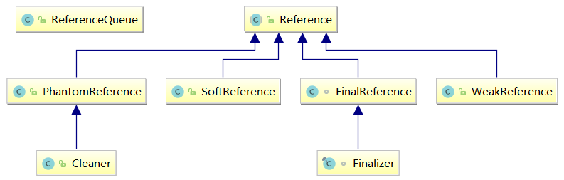
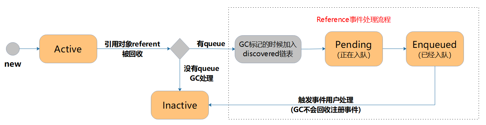
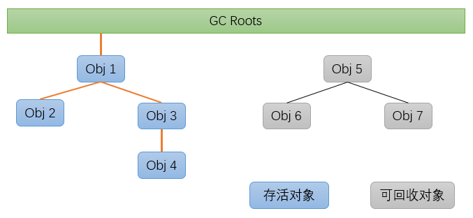
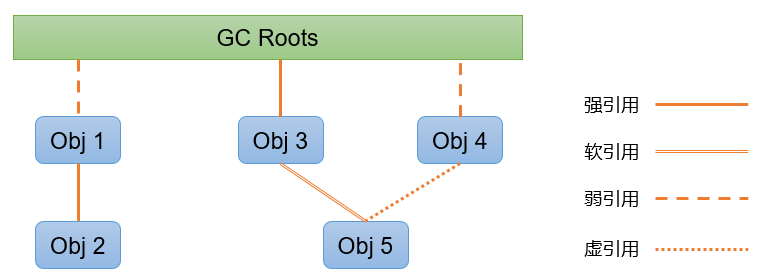
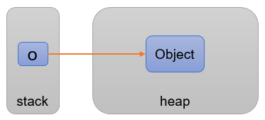
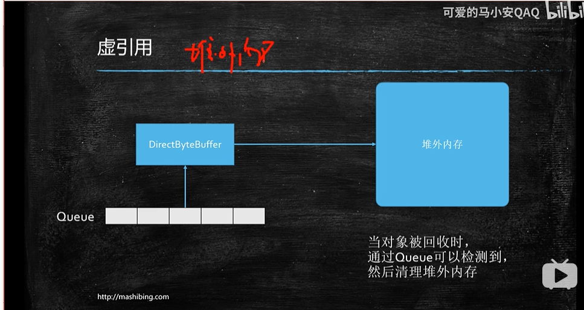

### java 四种引用类型

### 一、类定义与介绍

java 对于引用对象分了四种类型，分别是 强引用（StrongeReference)、软引用（SoftReference）、弱应用（WeakRefrence）、虚引用（PhatoRefrence），当jvm 回收垃圾时，也针对这四种引用分别采用了不用的回收时机与机制，下面先看一下java中关于引用的结构图：

  

```java
/**
 * Abstract base class for reference objects.  This class defines the
 * operations common to all reference objects.  Because reference objects are
 * implemented in close cooperation with the garbage collector, this class may
 * not be subclassed directly.
 *
 * @author Mark Reinhold
 * @since 1.2
 */
public abstract class Reference<T> {}
```

从注释和类图中可以清楚的看到：

- `Reference`类是直接配合`GC`操作的，所以不能直接子类化，但是可以继承`Reference`的子类；
- `Reference`类定义了子类的主要逻辑，所以在`SoftReference`、`WeakReference`和`PhantomReference`中几乎完全复用了`Reference`的逻辑；


### 二、Reference 框架结构

  

如图所示，Reference 的处理流程相当于**事件处理**

1. 如果 new Reference 的时候如果没有传入 ReferenceQueue，相当于使用 JVM 的默认处理流程，达到一定条件的时候由GC回收；
2. 如果 new Reference 的时候传入了 ReferenceQueue，相当于使用自定义的事件处理流程，此时的 **ReferenceQueue 相当于事件监听器**，**Reference 则相当于每个事件**，GC 标记的时候添加 discovered链表 相当于**事件发现过程**，pending和enqueued则相当于**注册事件的过程**，最后需要用户**自定义事件处理逻辑**；

在 Reference 的生命周期里面，一共有四个状态：

- Active：每个引用的创建之初都是活动状态，直到下次 GC 的时候引用的强弱关系发生变化，同时不同的引用根据不同的策略改变状态；
- Pending：正准备加入引用链表；
- Enqueued：已经加入引用链表，相当于已经注册成功等待处理；
- Inactive：所有的引用对象的终点，可回收状态；


### 三、可达性分析

上面我们提到当引用强弱关系发生变化的时候，他的状态会发生改变，那么这个强弱关系是如何判断的呢？
熟悉 JVM 的同学应该知道判断对象是否存活的算法大致有两种；

1. 引用计数法，即每当有一个对象引用他的时候就加1，引用失效时减1，当任何时候计数都为0时，就代表对象可以被回收了；
2. 可达性分析法，即从一组 **GC Roots** 对象出发，引用可达即代表存活，引用不可达就代表是可回收对象；如图所示：



- **单路径中，以最弱的引用为准**
- **多路径中，以最强的引用为准**

已上图为例：

- 对于 Obj 1：单路径可达，所以 GC Roots 到 Obj 1为弱引用；
- 对于 Obj 5：多路径可达，所以 GC Roots 到 Obj 5为软引用；


### Reference  源码解析

#### 成员变量和构造函数

```java
private T referent; /* Treated specially by GC */
volatile ReferenceQueue<? super T> queue;
volatile Reference next;
transient private Reference<T> discovered; /* used by VM */
private static Reference<Object> pending = null;

Reference(T referent) {
  this(referent, null);
}

Reference(T referent, ReferenceQueue<? super T> queue) {
  this.referent = referent;
  this.queue = (queue == null) ? ReferenceQueue.NULL : queue;
}
```

- referent：引用指向的对象，即需要Reference包装的对象；
- queue：虽然`ReferenceQueue`的名字里面有队列，但是它的内部却没有包含任何队列和链表的结构；他的内部封装了单向链表的添加，删除和遍历等操作，实际作用相当于事件监听器；
- next：引用单向链表；
- discovered：discovered单向链表，由 JVM 维护；在 GC 标记的时候，当引用强弱关系达到一定条件时，由 JVM 添加；需要注意的是这个字段是 transient 修饰的，但是 Reference 类声明的时候却没有实现 Serializable 接口，这是因为 Reference 子类的子类可能实现 Serializable 接口，另外一般情况下也不建议实现 Serializable 接口；
- pending：表示正在排队等待入队的引用；


#### 初始化函数

```java
static {
  ThreadGroup tg = Thread.currentThread().getThreadGroup();
  for (ThreadGroup tgn = tg;
    tgn != null;
    tg = tgn, tgn = tg.getParent());
  Thread handler = new ReferenceHandler(tg, "Reference Handler");
  /* If there were a special system-only priority greater than
   * MAX_PRIORITY, it would be used here
   */
  handler.setPriority(Thread.MAX_PRIORITY);
  handler.setDaemon(true);
  handler.start();

  // provide access in SharedSecrets
  SharedSecrets.setJavaLangRefAccess(new JavaLangRefAccess() {
    @Override
    public boolean tryHandlePendingReference() {
      return tryHandlePending(false);
    }
  });
}
```

在初始化Reference.class 对象时，新建了一个名称为`ReferenceHandler` 的线程，主要是用来判断jvm是否向discorver 的链表中加入了引用节点


#### ReferenceHandler 

线程源码如下：

```java
private static class ReferenceHandler extends Thread {

        private static void ensureClassInitialized(Class<?> clazz) {
            try {
                Class.forName(clazz.getName(), true, clazz.getClassLoader());
            } catch (ClassNotFoundException e) {
                throw (Error) new NoClassDefFoundError(e.getMessage()).initCause(e);
            }
        }

        static {
            // pre-load and initialize InterruptedException and Cleaner classes
            // so that we don't get into trouble later in the run loop if there's
            // memory shortage while loading/initializing them lazily.
            ensureClassInitialized(InterruptedException.class);
            ensureClassInitialized(Cleaner.class);
        }

        ReferenceHandler(ThreadGroup g, String name) {
            super(g, name);
        }

        public void run() {
            while (true) {
                tryHandlePending(true);
            }
        }
    }
```

可以看到这个线程只做了一件很简单的事情：

- 首先确保`InterruptedException`和`Cleaner`已经加载，关于`Cleaner`就是一个虚引用的实际应用，后面还会详细讲到；
- 然后死循环执行`tryHandlePending`；

我们看到 在线程的run方法中一直在循环的调用 `tryHandlePending ` 方法，而这个方法带有一个boolean 类型的方法参数，当参数为true的时候 表示如果当前没有可处理的引用对象时，则会阻塞，如果为false，则不会阻塞，直接返回，下面来看一下tryHandlePending 的 方法源码：


#### tryHandlePending 

```java
/**
 * Try handle pending {@link Reference} if there is one.<p>
 * Return {@code true} as a hint that there might be another
 * {@link Reference} pending or {@code false} when there are no more pending
 * {@link Reference}s at the moment and the program can do some other
 * useful work instead of looping.
 *
 * @param waitForNotify if {@code true} and there was no pending
 *                      {@link Reference}, wait until notified from VM
 *                      or interrupted; if {@code false}, return immediately
 *                      when there is no pending {@link Reference}.
 * @return {@code true} if there was a {@link Reference} pending and it
 *         was processed, or we waited for notification and either got it
 *         or thread was interrupted before being notified;
 *         {@code false} otherwise.
 */
static boolean tryHandlePending(boolean waitForNotify) {
  Reference<Object> r;
  Cleaner c;
  try {
    synchronized (lock) {
      if (pending != null) {
        r = pending;
        // 'instanceof' might throw OutOfMemoryError sometimes
        // so do this before un-linking 'r' from the 'pending' chain...
        c = r instanceof Cleaner ? (Cleaner) r : null;
        // unlink 'r' from 'pending' chain
        pending = r.discovered;
        r.discovered = null;
      } else {
        // The waiting on the lock may cause an OutOfMemoryError
        // because it may try to allocate exception objects.
        if (waitForNotify) {
          lock.wait();
        }
        // retry if waited
        return waitForNotify;
      }
    }
  } catch (OutOfMemoryError x) {
    // Give other threads CPU time so they hopefully drop some live references
    // and GC reclaims some space.
    // Also prevent CPU intensive spinning in case 'r instanceof Cleaner' above
    // persistently throws OOME for some time...
    Thread.yield();
    // retry
    return true;
  } catch (InterruptedException x) {
    // retry
    return true;
  }

  // Fast path for cleaners
  if (c != null) {
    c.clean();
    return true;
  }

  ReferenceQueue<? super Object> q = r.queue;
  if (q != ReferenceQueue.NULL) q.enqueue(r);
  return true;
}
```

 这个方法主要完成了`discovered -> pending -> enqueued`的整个入队注册流程；值得注意的是虽然`Cleaner`是虚引用，但是它并不会入队，而是直接执行`clean`操作，也就意味着在使用`Cleaner`的时候不需要在起一个线程监听`ReferenceQueue`了； 

其中，ReferenceQueue的 enqueue 方法代表当前引用对象从  Pending  状态 走向了 Enqueu状态


### ReferenceQueue 类

#### 概览

```java
static ReferenceQueue<Object> NULL = new Null<>();

// 用于标记是否已经入队，防止重复入队
static ReferenceQueue<Object> ENQUEUED = new Null<>();
private volatile Reference<? extends T> head = null;
private long queueLength = 0;

// reference入队操作
boolean enqueue(Reference<? extends T> r) { /* Called only by Reference class */

// poll 移除reference链表头元素
public Reference<? extends T> poll() { }

// 移除reference链表下一个元素
public Reference<? extends T> remove(long timeout) { }
public Reference<? extends T> remove() throws InterruptedException { }
void forEach(Consumer<? super Reference<? extends T>> action) { }
```


#### 核心方法

```java
boolean enqueue(Reference<? extends T> r) { /* Called only by Reference class */
        synchronized (lock) {
            // Check that since getting the lock this reference hasn't already been
            // enqueued (and even then removed)
            ReferenceQueue<?> queue = r.queue;
            if ((queue == NULL) || (queue == ENQUEUED)) {
                return false;
            }
            assert queue == this;
            r.queue = ENQUEUED;
            r.next = (head == null) ? r : head;
            head = r;
            queueLength++;
            if (r instanceof FinalReference) {
                sun.misc.VM.addFinalRefCount(1);
            }
            lock.notifyAll();
            return true;
        }
    }

    @SuppressWarnings("unchecked")
    private Reference<? extends T> reallyPoll() {       /* Must hold lock */
        Reference<? extends T> r = head;
        if (r != null) {
            head = (r.next == r) ?
                null :
                r.next; // Unchecked due to the next field having a raw type in Reference
            r.queue = NULL;
            r.next = r;
            queueLength--;
            if (r instanceof FinalReference) {
                sun.misc.VM.addFinalRefCount(-1);
            }
            return r;
        }
        return null;
    }
```

上面分别存在enqueue 方法与 reallyPoll方法，enqueue 方法代表当前Reference对象从Pending状态变为了Enqueue 对象，代表当前对象已经入队，而 reallyPoll方法代表当前对象从当前队列中已经被移除，说明该对象已经可以被回收了，分别对应了ReferenceQueue的 NULL 与 ENQUEUE 两种状态，详见 {link Reference 框架结构} 中的区别


#eference## Re'fe'ren'ce总结

- Reference 主要用于更加灵活的控制对象的生死，其实现类似于事件处理，可以是 JVM 默认处理，也可以是用户自定义的处理逻辑；
- 在 Java 语言中 Reference 类定义了子类（SoftReference，WeakReference，PhantomReference）的主要逻辑，但是判断引用回收的条件主要在 JVM 中定义（主要发生在 GC 标记阶段），如果你有兴趣可以到 OpenJDK 里面继续深入研究；
- 如果在使用 Reference 的时候传入了 ReferenceQueue，即使用自定义的逻辑处理，那么**最后一定要把 ReferenceQueue 中注册的 Reference 移除**，因为此时 GC 不会回收 ReferenceQueue 中的链表；
- Reference Handler 线程只有一个，但是 Reference 链表却有很多条（所以在注册的时候需要加锁），另外每个 Class 对象都能同时生成多个引用对象，并注册 ReferenceQueue ；


### 强引用（StrongeReference）

**强引用**：我们通常使用的引用，形如`Object o = new Object();`




### 软引用

- **软引用**：可以用来表示一些有用但非必须的对象；JVM 会根据使用率和剩余堆空间大小来公共决定什么时候回收 SoftReference；JVM 保证在抛出 OOM 之前会再次扫描回收这些软引用，如果回收后内存仍不足才会抛出 OOM；所以在源码的注释中也写了 SoftReference 适合实现内存敏感的缓存；

  ```java
  public class SoftReference<T> extends Reference<T> {
    /**
     * Timestamp clock, updated by the garbage collector
     */
    static private long clock;
  
    /**
     * Timestamp updated by each invocation of the get method.  The VM may use
     * this field when selecting soft references to be cleared, but it is not
     * required to do so.
     */
    private long timestamp;
  
    public SoftReference(T referent) {
      super(referent);
      this.timestamp = clock;
    }
  
    public SoftReference(T referent, ReferenceQueue<? super T> q) {
      super(referent, q);
      this.timestamp = clock;
    }
  
    public T get() {
      T o = super.get();
      if (o != null && this.timestamp != clock)
        this.timestamp = clock;
      return o;
    }
  
  }
  ```

  看上面的代码，SoftReference 与 Reference 相比多了两个时间戳 `clock，timestamp`，并且会在每次 `get`的时候更新时间戳；

  - clock：这个时间戳是`static`修饰的，是所有 SoftReference 共有，由 JVM 维护；
  - timestamp：主要用于记录当前对象的存活时间；

  JVM 会根据softRefrence中的对象存活时间来判断是否需要回收软引用中维护的对象

  

  **回收策略**

  上面提到 SoftReference 的回收是由使用率和剩余堆空间大小来公共决定的，那么它是怎么实现的呢？

  [openjdk/hotspot/src/share/vm/memory/referencePolicy.cpp](https://github.com/infobip/infobip-open-jdk-8/blob/master/hotspot/src/share/vm/memory/referencePolicy.cpp)

  ```cpp
  // Capture state (of-the-VM) information needed to evaluate the policy
  void LRUCurrentHeapPolicy::setup() {
    _max_interval = (Universe::get_heap_free_at_last_gc() / M) * SoftRefLRUPolicyMSPerMB;
    assert(_max_interval >= 0,"Sanity check");
  }
  
  // The oop passed in is the SoftReference object, and not
  // the object the SoftReference points to.
  bool LRUCurrentHeapPolicy::should_clear_reference(oop p, jlong timestamp_clock) {
    jlong interval = timestamp_clock - java_lang_ref_SoftReference::timestamp(p);
    assert(interval >= 0, "Sanity check");
  
    // The interval will be zero if the ref was accessed since the last scavenge/gc.
    if(interval <= _max_interval) {
      return false;
    }
  
    return true;
  }
  ```

  根据上面的代码可以大致知道:

  1. 首先计算出了最大堆内存和上次 GC 时剩余的内存；
  2. 再用（剩余内存 / 最大内存 ）* SoftRefLRUPolicyMSPerMB 得出到下次 GC 期间软引用的最大 idle 时间；
  3. 最后用 clock 和 timestamp 两个时间戳差值得到 SoftReference 的 idle 时间（每次 get 的时候 `this.timestamp = clock;`，所以get 之后 idle 时间归零），如果大于最大 idle 时间则清除；

  我们可以简单测试一下，启动参数：`-XX:SoftRefLRUPolicyMSPerMB=2 -Xmx10M -XX:+PrintCommandLineFlags -verbose:gc`；

  - `-XX:SoftRefLRUPolicyMSPerMB=2`：可以参照上面的计算过程调节 SoftReference 的回收频率；
  - `-Xmx10M`：为最大堆内存，同样可以自行调节，`-verbose:gc`：打开 GC 日志，`-XX:+PrintCommandLineFlags`：打印 JVM 启动参数；

  ```java
  private static void test03() throws InterruptedException {
    ReferenceQueue queue = new ReferenceQueue();
    Object o = new Object() {
      @Override
      public String toString() {
        return "zhangsan";
      }
    };
    
    Reference softRef = new SoftReference(o, queue);
    new Monitor(queue).start();
    
    o = null;
    System.gc();
    log.info("o=null, referent:{}", softRef.get());
    
    byte[] bytes = new byte[3 * 1024 * 1024];
    System.gc();
    log.info("After GC, referent:{}", softRef.get());
    Thread.sleep(2000);
    System.gc();
    log.info("After GC, referent:{}", softRef.get());
  }
  
  private static class Monitor extends Thread {
    ReferenceQueue queue;
  
    public Monitor(ReferenceQueue queue) {
      this.queue = queue;
    }
    
    @Override
    public void run() {
      while (true) {
        try {
          log.info("remove reference:{}", queue.remove().toString());
        } catch (InterruptedException e) {
          e.printStackTrace();
        }
      }
    }
  }
  ```

  // 打印：

  ```verilog
  [main] o=null, referent:zhangsan
  [main] After GC, referent:zhangsan
  [main] After GC, referent:null
  [Thread-0] remove reference:java.lang.ref.SoftReference@bcffe9a
  ```

  根据不同的参数设置会出现不同的情况，大家可以自行调节参数，验证上面的计算规则；另外如果`-XX:SoftRefLRUPolicyMSPerMB=0`，那么 SoftReference 就应该和 WeakReference 差不多了，至于是否完全一致，就留到以后查看 JVM 的时候再确定了；


### 弱引用

**弱引用**：被弱引用关联的对象只能生存到下一次 GC，当 GC 的时候无论内存是否足够，使用是否频繁都会被清除；同样源码注释里面也写了 WeakReference 适合实现 canonicalizing mappings，比如 WeakHashMap；

```java
public class WeakReference<T> extends Reference<T> {
  public WeakReference(T referent) {
    super(referent);
  }

  public WeakReference(T referent, ReferenceQueue<? super T> q) {
    super(referent, q);
  }
}
```

简单测试，启动参数：`-Xmx300M -XX:+PrintCommandLineFlags -verbose:gc`；

```java
private static void test04() {
  ReferenceQueue queue = new ReferenceQueue();
  Object o = new Object() {
    @Override
    public String toString() {
      return "zhangsan";
    }
  };
  
  Reference ref = new WeakReference(o, queue);
  new Monitor(queue).start();
  
  o = null;
  log.info("Before GC, referent:{}", ref.get());
  System.gc();
  log.info("After GC, referent:{}", ref.get());
}
```

// 打印：

```verilog
[main]     Before GC, referent:zhangsan
[main]     After GC, referent:null
[Thread-0] remove reference:java.lang.ref.WeakReference@67ac4ff0
```

可以看到在内存足够的时候，referent 被清除，WeakReference 在下次 GC 的时候随机被清除，并且 ReferenceQueue 也收到了事件通知；


### 虚引用

**虚引用**：最弱的一种引用关系，虚引用对一个对象的生命周期完全没有影响，设置虚引用的唯一目的就是得到 referent 被回收的事件通知；

```java
public class PhantomReference<T> extends Reference<T> {
    public T get() {
        return null;
    }

    public PhantomReference(T referent, ReferenceQueue<? super T> q) {
        super(referent, q);
    }
}
```

从源码也能看到 get 的时候，永远返回 null；

同样简单测试一下，

```java
private static void test06() {
  ReferenceQueue queue = new ReferenceQueue();
  Object o = new Object() {
    @Override
    public String toString() {
      return "zhangsan";
    }
  };
  
  Reference ref = new PhantomReference(o, queue);
  new Monitor(queue).start();
  
  o = null;
  log.info("Before GC, referent:{}", ref.get());
  System.gc();
  log.info("After GC, referent:{}", ref.get());
}
```

// 打印：

```verilog
[main]     Before GC, referent:null
[main]     After GC, referent:null
[Thread-0] remove reference:java.lang.ref.PhantomReference@661a5fff
```

可以看到 `PhantomReference.get()` 始终为 null，并且当 referent 被回收的时候，并且 ReferenceQueue 也收到了事件通知；

此外 PhantomReference 和其他引用还有一个很大的不同，在 ReferenceQueue 中 JVM 并不会帮我们把 referent 字段置为空；

```java
private static void test07() {
  ReferenceQueue queue = new ReferenceQueue();
  Object o = new Object() {
    @Override
    public String toString() {
      return "zhangsan";
    }
  };
  
  Reference ref = new PhantomReference(o, queue);
  new Monitor2(queue).start();
  
  o = null;
  log.info("Before GC, referent:{}", ref.get());
  System.gc();
  log.info("After GC, referent:{}", ref.get());
}

private static class Monitor2 extends Thread {
  ReferenceQueue queue;
  
  public Monitor2(ReferenceQueue queue) {
    this.queue = queue;
  }
  
  @Override
  public void run() {
    try {
      while (true) {
        Reference ref = queue.poll();
        log.info("remove reference:{}", ref);
        if (ref != null) {
        Field field = Reference.class.getDeclaredField("referent");
        field.setAccessible(true);
        
        log.info("ReferenceQueue get Referent:{}", field.get(ref));
        ref.clear();
        break;
        }
      }
    } catch (Exception e) {
      e.printStackTrace();
    }
  }
}
```

// 打印：

```verilog
[main]     Before GC, referent:null
[main]     After GC, referent:null
[Thread-0] remove reference:null
[Thread-0] remove reference:java.lang.ref.PhantomReference@7b4cba2
[Thread-0] ReferenceQueue get Referent:zhangsan
```

这里可以看到从 ReferenceQueue 中取出来的 Reference 仍然可以取到引用对象，即 referent；但是在其他引用中打印为 null，这里可以将上面例子中的 Monitor 改为 Monitor2 测试；

**Cleaner**：
在`Reference.tryHandlePending()`里面提到的，主要用于替代`Object.finalize()`;

```java
public class Cleaner extends PhantomReference<Object> {
  private static final ReferenceQueue<Object> dummyQueue = new ReferenceQueue<>();
  static private Cleaner first = null;

  private Cleaner
    next = null,
    prev = null;
    
  private final Runnable thunk;
  
  private Cleaner(Object referent, Runnable thunk) {
    super(referent, dummyQueue);
    this.thunk = thunk;
  }
  
  public static Cleaner create(Object ob, Runnable thunk) {
    if (thunk == null)
      return null;
    return add(new Cleaner(ob, thunk));
  }

  private static synchronized Cleaner add(Cleaner cl) {
    if (first != null) {
      cl.next = first;
      first.prev = cl;
    }
    first = cl;
    return cl;
  }

  private static synchronized boolean remove(Cleaner cl) { }

  public void clean() {
    if (!remove(this))
      return;
    try {
      thunk.run();
    } catch (final Throwable x) {
      AccessController.doPrivileged(new PrivilegedAction<Void>() {
          public Void run() {
            if (System.err != null)
              new Error("Cleaner terminated abnormally", x)
                .printStackTrace();
            System.exit(1);
            return null;
          }});
    }
  }
}
```

从代码可以看到，

- Cleaner 只能通过工厂方法创建，并且所有的 Cleaner 都共同属于同一个 Reference 链表；
- 代码中的`next、prev`不同于 Reference 中的 next，他们组成了一个双向链表；
- Cleaner 中没有入队操作，在创建之初就已经加入链表了，具体代码可以查看`Reference.tryHandlePending()`；
- ReferenceQueue（`dummyQueue` 域）的作用不再是提供入队和事件监听功能，而仅仅是保证 GC 不会自动将 Cleaner 给回收了；
- Cleaner 的主要逻辑就是传入一个 clean 线程，在 referent 引用对象清除的时候，执行 `clean` 操作；


RefrenceQueue -> PhatoRefrence

- 管理堆外内存

  

  当指向堆外内存的对象要被回收的时候，清除堆外内存


### FinalReference

 FinalReference由JVM来实例化，VM会对那些实现了Object中finalize()方法的类实例化一个对应的FinalReference。
**注意：**实现的finalize方法体必须非空。 

```java
    public FinalReference(T referent, ReferenceQueue<? super T> q) {
        super(referent, q);
    }
```


### Finalizer

 Finalizer是FinalReference的子类，该类被final修饰，不可再被继承，JVM实际操作的是Finalizer。当一个类满足实例化FinalReference的条件时，JVM会调用Finalizer.register()进行注册。(PS：后续讲的Finalizer其实也是在说FinalReference。) 

### 

