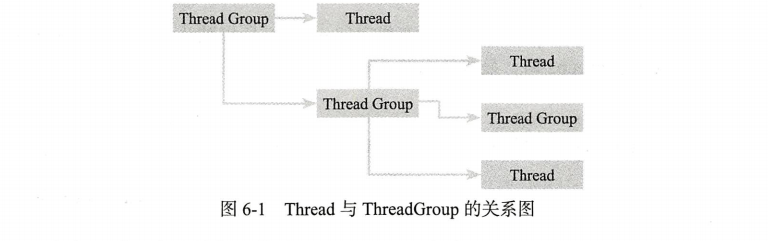
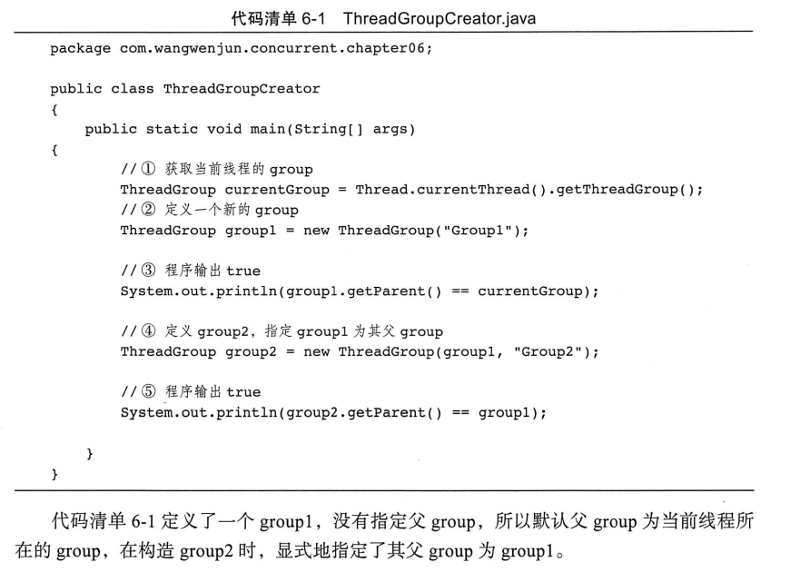
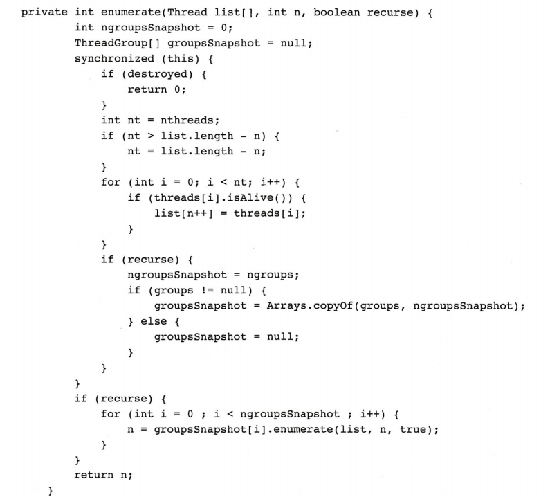
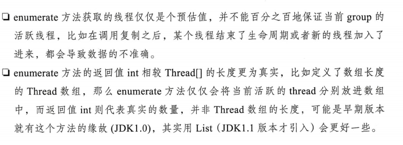
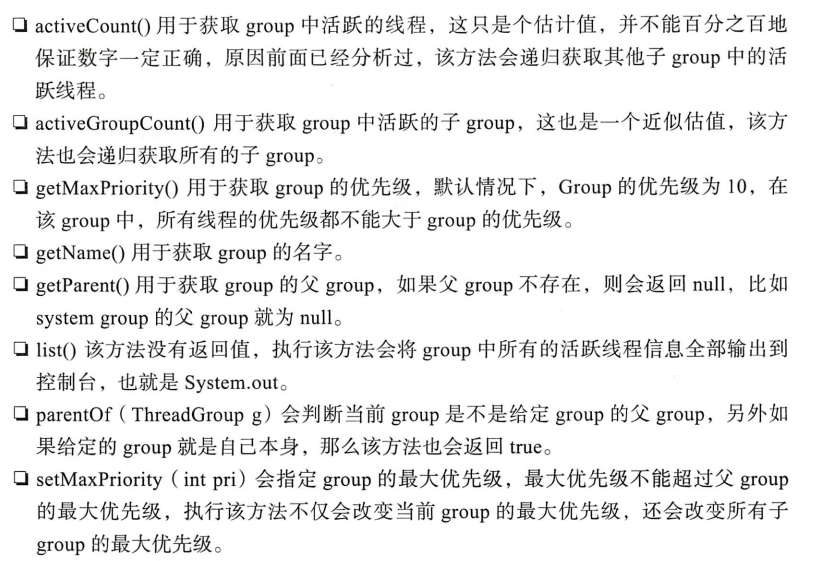
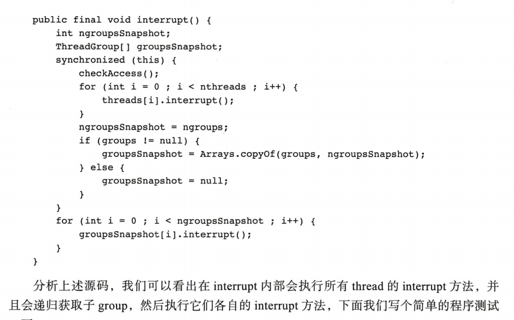
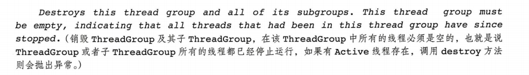
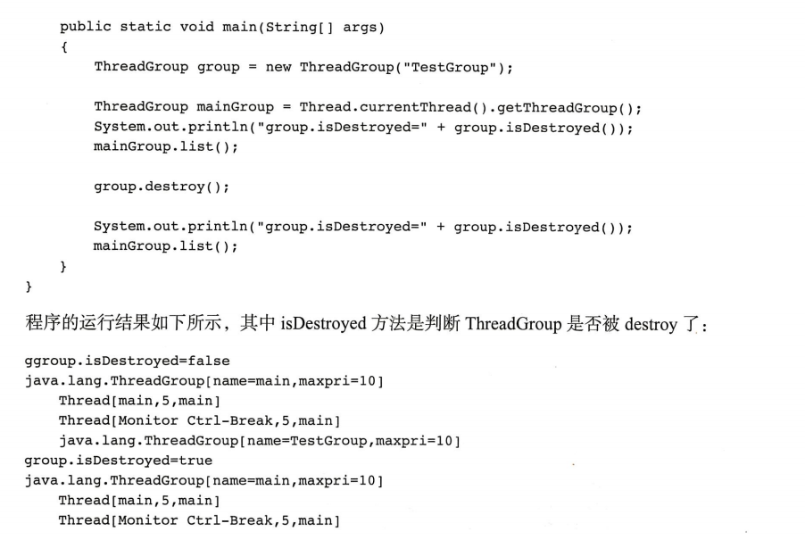

## ThreadGroup 详解

在 java程序中 ，被A 线程启动的 其他线则都会被加入A 线程所在的 group中，既称为 线程组，例如Main线程启动的线程则都在main线程所在的group中

如同线程存在父子关系一样，ThreadGroup也存在父子关系，下图就说明了父子Thread、父子ThreadGrooup、以及Thread与Group之间的层次关系




### 创建ThreadGroup

```java
//通过名称创建ThreadGroup
public ThreadGroup(String name)
//通过父group 与名称创建ThreadGroup
public ThreadGroup(ThreadGroup parent,String name)
```




### 复制Thread数组和ThreadGroup数组

#### 复制Thread数组

```java
//调用重载方法 enumerate(list,true)
public int enumerate(Thread[] list)
public int enumerate(Thread[] list, boolean recurse)
```

上述两个方法会将ThreadGroup中的active线程全部复制到Thread数组中，其中recurse参数如果为true，则该方法会将所有子group中的active线程都递归到Thread数组中






#### 复制ThreadGroup数组

```java
//调用重载方法 enumerate(list,true)
public int enumerate(ThreadGroup[] list)
public int enumerate(ThreadGroup[] list, boolean rescurse)
```

和复制Thread数组类似，主要用于复制当前ThreadGroup中的子group，同样recurse 会决定是否以递归的发过誓复制


### ThreadGroup 操作

常用方法如下：




### ThreadGroup 的 interrupt

interrupt 一个thread group 会导致该group中所有的active线程都被interrupt，也就是说该group中每一个线程的interrupt 标识都被设置了，源码如下：




### ThreadGroup 的 destory

destroy 用于销毁ThreadGroup，该方法只是针对一个没有任何active线程的group进行一次destroy标记，掉哦那个该方法的直接结果是在父group中将自己移除




示例如下：




### 守护ThreadGroup

线程可以设置为守护线程，ThreadGroup也可以设置为守护线程组，若将一个ThreadGroup 设置为daemon，也并不会影响线程的daemon属性，如果一个ThreadGroup的daemin被设置为true，那么在group中没有任何active线程的时候将自动destroy

