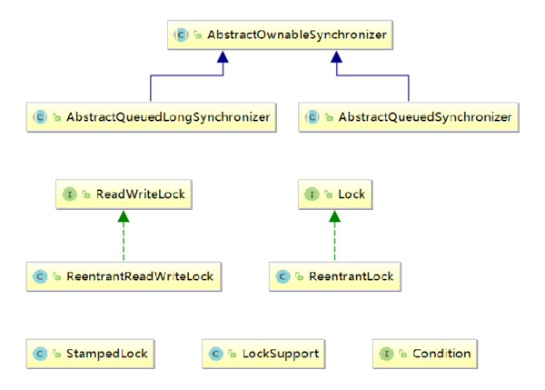
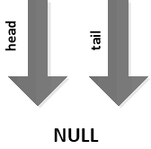
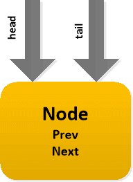
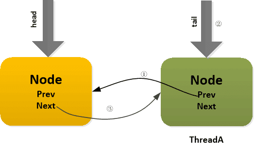

## AQS 综述

### AQS 简介

 AbstractQueuedSynchronizer抽象类（以下简称AQS）是整个`java.util.concurrent`包的核心。在JDK1.5时，[Doug Lea](http://gee.cs.oswego.edu/dl/papers/aqs.pdf) 大师引入了J.U.C包，该包中的大多数同步器都是基于AQS来构建的。AQS框架提供了一套通用的机制来管理同步状态（synchronization state）、阻塞/唤醒线程、管理等待队列。 

我们所熟知的ReentrantLock、CountDownLatch、CyclicBarrier等同步器，其实都是通过内部类实现了AQS框架暴露的API，以此实现各类同步器功能。这些同步器的主要区别其实就是对同步状态（synchronization state）的定义不同。

AQS框架，分离了构建同步器时的一系列关注点，它的所有操作都围绕着资源——同步状态（synchronization state）来展开，并替用户解决了如下问题：

1. 资源是可以被同时访问？还是在同一时间只能被一个线程访问？（共享/独占功能）
2. 访问资源的线程如何进行并发管理？（等待队列）
3. 如果线程等不及资源了，如何从等待队列退出？（超时/中断）

这其实是一种典型的模板方法设计模式：父类（AQS框架）定义好骨架和内部操作细节，具体规则由子类去实现。
AQS框架将剩下的一个问题留给用户：
***什么是资源？如何定义资源是否可以被访问？\***

我们来看下几个常见的同步器对这一问题的定义：

| 同步器                 | 资源的定义                                                   |
| ---------------------- | ------------------------------------------------------------ |
| ReentrantLock          | 资源表示独占锁。State为0表示锁可用；为1表示被占用；为N表示重入的次数 |
| CountDownLatch         | 资源表示倒数计数器。State为0表示计数器归零，所有线程都可以访问资源；为N表示计数器未归零，所有线程都需要阻塞。 |
| Semaphore              | 资源表示信号量或者令牌。State≤0表示没有令牌可用，所有线程都需要阻塞；大于0表示由令牌可用，线程每获取一个令牌，State减1，线程没释放一个令牌，State加1。 |
| ReentrantReadWriteLock | 资源表示共享的读锁和独占的写锁。state逻辑上被分成两个16位的unsigned short，分别记录读锁被多少线程使用和写锁被重入的次数。 |

综上所述，AQS框架提供了以下功能：

#### 1.1提供一套模板框架

由于并发的存在，需要考虑的情况非常多，因此能否以一种相对简单的方法来完成这两个目标就非常重要，因为对于用户（AQS框架的使用者来说），很多时候并不关心内部复杂的细节。而AQS其实就是利用模板方法模式来实现这一点，AQS中大多数方法都是final或是private的，也就是说Doug Lea并不希望用户直接使用这些方法，而是只覆写部分模板规定的方法。
AQS通过暴露以下API来让让用户自己解决上面提到的“**如何定义资源是否可以被访问**”的问题：

| 钩子方法          | 描述               |
| ----------------- | ------------------ |
| tryAcquire        | 排它获取（资源数） |
| tryRelease        | 排它释放（资源数） |
| tryAcquireShared  | 共享获取（资源数） |
| tryReleaseShared  | 共享获取（资源数） |
| isHeldExclusively | 是否排它状态       |

> 以上钩子方法不用着急知道是做什么的，在后边堆独占模式与共享模式进行解析的时候，会一一介绍的


#### 1.2 支持中断超时

还记得Lock接口中的那些锁中断、限时等待、锁尝试的方法吗？这些方法的实现其实AQS都内置提供了。
使用了AQS框架的同步器，都支持下面的操作：

- 阻塞和非阻塞（例如tryLock）同步；
- 可选的超时设置，让调用者可以放弃等待；
- 可中断的阻塞操作。


#### 1.3 独占模式与共享模式

AQS 内部实现了独占与共享两种模式，我们将在后面用RetreeLock 与 CountdownLatch 堆这两种模式进行解析


#### 1.4 支持Condition 条件等待

 Condition 接口，可以看做是Obejct类的wait()、notify()、notifyAll()方法的替代品，与Lock配合使用。
AQS框架内部通过一个内部类`ConditionObject`，实现了Condition接口，以此来为子类提供条件等待的功能。 


### AQS 实现子类

  


## AQS方法说明

在本章第一部分讲到，AQS利用了模板方法模式，其中大多数方法都是final或是private的，我们把这类方法称为***Skeleton Method\***，也就是说这些方法是AQS框架自身定义好的骨架，子类是不能覆写的。
下面会按类别简述一些比较重要的方法，具体实现细节及原理会在本系列后续部分详细阐述。

### 2.1 CAS操作

CAS，即CompareAndSet，在Java中CAS操作的实现都委托给一个名为UnSafe类，关于`Unsafe`类，以后会专门详细介绍该类，目前只要知道，通过该类可以实现对字段的原子操作。

| 方法名                  | 修饰符               | 描述                    |
| ----------------------- | -------------------- | ----------------------- |
| compareAndSetState      | protected final      | CAS修改同步状态值       |
| compareAndSetHead       | private final        | CAS修改等待队列的头指针 |
| compareAndSetTail       | private final        | CAS修改等待队列的尾指针 |
| compareAndSetWaitStatus | private static final | CAS修改结点的等待状态   |
| compareAndSetNext       | private static final | CAS修改结点的next指针   |

### 2.2 等待队列的核心操作

| 方法名              | 修饰符  | 描述                 |
| ------------------- | ------- | -------------------- |
| enq                 | private | 入队操作             |
| addWaiter           | private | 入队操作             |
| setHead             | private | 设置头结点           |
| unparkSuccessor     | private | 唤醒后继结点         |
| doReleaseShared     | private | 释放共享结点         |
| setHeadAndPropagate | private | 设置头结点并传播唤醒 |

### 2.3 资源的获取操作

| 方法名                       | 修饰符         | 描述                              |
| ---------------------------- | -------------- | --------------------------------- |
| cancelAcquire                | private        | 取消获取资源                      |
| shouldParkAfterFailedAcquire | private static | 判断是否阻塞当前调用线程          |
| acquireQueued                | final          | 尝试获取资源,获取失败尝试阻塞线程 |
| doAcquireInterruptibly       | private        | 独占地获取资源（响应中断）        |
| doAcquireNanos               | private        | 独占地获取资源（限时等待）        |
| doAcquireShared              | private        | 共享地获取资源                    |
| doAcquireSharedInterruptibly | private        | 共享地获取资源（响应中断）        |
| doAcquireSharedNanos         | private        | 共享地获取资源（限时等待）        |

| 方法名                     | 修饰符       | 描述                       |
| -------------------------- | ------------ | -------------------------- |
| acquire                    | public final | 独占地获取资源             |
| acquireInterruptibly       | public final | 独占地获取资源（响应中断） |
| acquireInterruptibly       | public final | 独占地获取资源（限时等待） |
| acquireShared              | public final | 共享地获取资源             |
| acquireSharedInterruptibly | public final | 共享地获取资源（响应中断） |
| tryAcquireSharedNanos      | public final | 共享地获取资源（限时等待） |

### 2.4 资源的释放操作

| 方法名        | 修饰符       | 描述         |
| ------------- | ------------ | ------------ |
| release       | public final | 释放独占资源 |
| releaseShared | public final | 释放共享资源 |


## AQS 原理综述

 AQS框架分离了构建同步器时的一系列关注点，它的所有操作都围绕着资源——同步状态（synchronization state）来展开因此，围绕着资源，衍生出三个基本问题： 

1. 同步状态（synchronization state）的管理
2. 阻塞/唤醒线程的操作
3. 线程等待队列的管理

在介绍AQS 核心属性、方法之前，我们先回顾下 LockSupport的使用方法

### LockSupport 

LockSupport 类是依赖于Unsafe类实现的，它会与每个使用的它的线程都关联一个许可证，默认情况下调用LockSupport类的方法的线程是不持有许可证的。

常用的方法介绍

- void park()
- void unpark(Thread thread)
- parkNanos(long nanos)
- park(Object blocker)
- parkNanos(Object blocker,long nanos)
- void parkUntil(Object blocker,long nanos)


有了上面LockSupport的介绍，我们接下来对AQS 的内部核心 属性与 核心方法、内部类做一些介绍，不需要看懂它是做什么的，只要有个印象就好了。


### AQS的三核心

- state 表示当前锁是否有线程获取
- CHL队列 将需要等待的线程加入该队列
- CAS 乐观锁

AQS依赖于 State，CLH队列和 CAS实现，可以实现公平，非公平，具体如何实现由子类进行扩展，内部实现了独占锁以及共享锁，还依赖于LockSupport的原子性语义来实现


### AQS实现的模式类型 

- EXCLUDE (独占)
- SHARED（共享）
- Condition （条件）


### State  同步状态

***同步状态的定义\***
同步状态，其实就是资源。AQS使用单个int（32位）来保存同步状态，并暴露出getState、setState以及compareAndSetState操作来读取和更新这个状态。

```java
/**
 * 同步状态.
 */
private volatile int state;

protected final int getState() {
    return state;
}

protected final void setState(int newState) {
    state = newState;
}
/**
 * 以原子的方式更新同步状态.
 * 利用Unsafe类实现
 */
protected final boolean compareAndSetState(int expect, int update) {
    return unsafe.compareAndSwapInt(this, stateOffset, expect, update);
}
```


###  线程的阻塞/唤醒

在JDK1.5之前，除了内置的监视器机制外，没有其它方法可以安全且便捷得阻塞和唤醒当前线程。
JDK1.5以后，java.util.concurrent.locks包提供了[LockSupport](https://segmentfault.com/a/1190000015562456)类来作为线程阻塞和唤醒的工具。


###  等待队列

等待队列，是AQS框架的核心，整个框架的关键其实就是如何在并发状态下管理被阻塞的线程。
等待队列是严格的FIFO队列，是Craig，Landin和Hagersten锁（CLH锁）的一种变种，采用双向链表实现，因此也叫CLH队列。

**1. 结点定义**
CLH队列中的结点是对线程的包装，结点一共有两种类型：独占（EXCLUSIVE）和共享（SHARED）。
每种类型的结点都有一些状态，其中独占结点使用其中的CANCELLED(1)、SIGNAL(-1)、CONDITION(-2)，共享结点使用其中的CANCELLED(1)、SIGNAL(-1)、PROPAGATE(-3)。

| 结点状态  | 值   | 描述                                                         |
| --------- | ---- | ------------------------------------------------------------ |
| CANCELLED | 1    | 取消。表示后驱结点被中断或超时，需要移出队列                 |
| SIGNAL    | -1   | 发信号。表示后驱结点被阻塞了（当前结点在入队后、阻塞前，应确保将其prev结点类型改为SIGNAL，以便prev结点取消或释放时将当前结点唤醒。） |
| CONDITION | -2   | Condition专用。表示当前结点在Condition队列中，因为等待某个条件而被阻塞了 |
| PROPAGATE | -3   | 传播。适用于共享模式（比如连续的读操作结点可以依次进入临界区，设为PROPAGATE有助于实现这种迭代操作。） |
| INITIAL   | 0    | 默认。新结点会处于这种状态                                   |

> AQS使用CLH队列实现线程的结构管理，而CLH结构正是用前一结点某一属性表示当前结点的状态，之所以这种做是因为在双向链表的结构下，这样更容易实现取消和超时功能。
>
> next指针：用于维护队列顺序，当临界区的资源被释放时，头结点通过next指针找到队首结点。
> prev指针：用于在结点（线程）被取消时，让当前结点的前驱直接指向当前结点的后驱完成出队动作。

```java
static final class Node {
    
    // 共享模式结点
    static final Node SHARED = new Node();
    
    // 独占模式结点
    static final Node EXCLUSIVE = null;

    static final int CANCELLED =  1;

    static final int SIGNAL    = -1;

    static final int CONDITION = -2;

    static final int PROPAGATE = -3;

    /**
    * INITAL：      0 - 默认，新结点会处于这种状态。
    * CANCELLED：   1 - 取消，表示后续结点被中断或超时，需要移出队列；
    * SIGNAL：      -1- 发信号，表示后续结点被阻塞了；（当前结点在入队后、阻塞前，应确保将其prev结点类型改为SIGNAL，以便prev结点取消或释放时将当前结点唤醒。）
    * CONDITION：   -2- Condition专用，表示当前结点在Condition队列中，因为等待某个条件而被阻塞了；
    * PROPAGATE：   -3- 传播，适用于共享模式。（比如连续的读操作结点可以依次进入临界区，设为PROPAGATE有助于实现这种迭代操作。）
    * 
    * waitStatus表示的是后续结点状态，这是因为AQS中使用CLH队列实现线程的结构管理，而CLH结构正是用前一结点某一属性表示当前结点的状态，这样更容易实现取消和超时功能。
    */
    volatile int waitStatus;

    // 前驱指针
    volatile Node prev;

    // 后驱指针
    volatile Node next;

    // 结点所包装的线程
    volatile Thread thread;

    // Condition队列使用，存储condition队列中的后继节点
    Node nextWaiter;

    Node() {
    }

    Node(Thread thread, Node mode) { 
        this.nextWaiter = mode;
        this.thread = thread;
    }
}
```

**2. 队列定义**
对于CLH队列，当线程请求资源时，如果请求不到，会将线程包装成结点，将其挂载在队列尾部。
CLH队列的示意图如下：

①初始状态，队列head和tail都指向空



②首个线程入队，先创建一个空的头结点，然后以自旋的方式不断尝试插入一个包含当前线程的新结点




```java
/**
 * 以自旋的方式不断尝试插入结点至队列尾部
 *
 * @return 当前结点的前驱结点
 */
private Node enq(final Node node) {
    for (; ; ) {
        Node t = tail;
        if (t == null) { // 如果队列为空，则创建一个空的head结点
            if (compareAndSetHead(new Node()))
                tail = head;
        } else {
            node.prev = t;
            if (compareAndSetTail(t, node)) {
                t.next = node;
                return t;
            }
        }
    }
}
```


### AQS核心属性

```java
锁相关的属性有两个：
	private volatile int state; //锁的状态
	
	// 当前持有锁的线程，注意这个属性是从AbstractOwnableSynchronizer继承而来
	private transient Thread exclusiveOwnerThread; 

sync queue：
	private transient volatile Node head; // 队头，为dummy node
	private transient volatile Node tail; // 队尾，新入队的节点
	
队列中的Node中需要关注的属性有三组：
    
    // 节点所代表的线程
    volatile Thread thread;

    // 双向链表，每个节点需要保存自己的前驱节点和后继节点的引用
    volatile Node prev;
    volatile Node next;

    // 线程所处的等待锁的状态，初始化时，该值为0
    volatile int waitStatus;
    static final int CANCELLED =  1;
    static final int SIGNAL    = -1;
```


网址：<https://segmentfault.com/a/1190000015739343> 