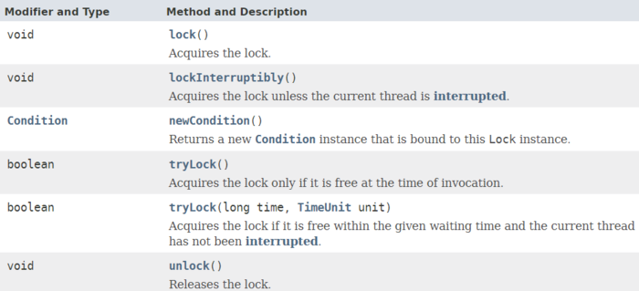
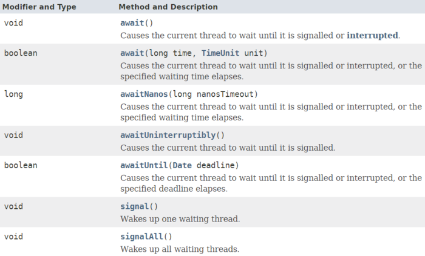
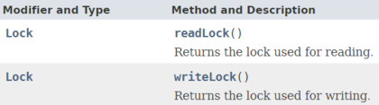
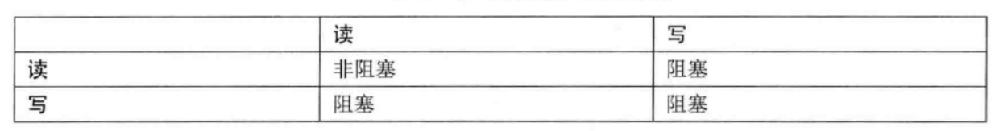

## 一、Lock接口简介

Lock接口可以视为synchronized的增强版，提供了更灵活的功能。该接口提供了限时锁等待、锁中断、锁尝试等功能。

### 1.1 接口定义

该接口的方法声明如下：


需要注意`lock()`和`lockInterruptibly()`这两个方法的区别：

> `lock()方法`类似于使用synchronized关键字加锁，如果锁不可用，出于线程调度目的，将禁用当前线程，并且在获得锁之前，该线程将一直处于休眠状态。
> `lockInterruptibly()`方法顾名思义，就是如果锁不可用，那么当前正在等待的线程是可以被中断的，这比synchronized关键字更加灵活。

### 1.2 使用示例

可以看到，Lock作为一种同步器，一般会用一个finally语句块确保锁最终会释放。

```
Lock lock = ...;
if (lock.tryLock()) {
    try {
        // manipulate protected state
    } finally {
        lock.unlock();
    }
} else {
    // perform alternative actions
}
```

## 二、Condition接口简介

Condition可以看做是Obejct类的`wait()`、`notify()`、`notifyAll()`方法的替代品，与Lock配合使用。
当线程执行condition对象的`await`方法时，当前线程会立即释放锁，并进入对象的等待区，等待其它线程唤醒或中断。

> JUC在实现Conditon对象时，其实是通过实现AQS框架，来实现了一个Condition等待队列，这个在后面讲AQS框架时会详细介绍，目前只要了解Condition如何使用即可。

### 2.1 接口定义



### 2.2 使用示例

Oracle官方文档中给出了一个缓冲队列的示例：

*假定有一个缓冲队列，支持 put 和 take 方法。如果试图在空队列中执行 take 操作，则线程将一直阻塞，直到队列中有可用元素；如果试图在满队列上执行 put 操作，则线程也将一直阻塞，直到队列不满。*

```
class BoundedBuffer {
    final Lock lock = new ReentrantLock();
    final Condition notFull = lock.newCondition();
    final Condition notEmpty = lock.newCondition();
 
    final Object[] items = new Object[100];
    int putptr, takeptr, count;
 
    public void put(Object x) throws InterruptedException {
        lock.lock();
        try {
            while (count == items.length)    //防止虚假唤醒，Condition的await调用一般会放在一个循环判断中
                notFull.await();
            items[putptr] = x;
            if (++putptr == items.length)
                putptr = 0;
            ++count;
            notEmpty.signal();
        } finally {
            lock.unlock();
        }
    }
 
    public Object take() throws InterruptedException {
        lock.lock();
        try {
            while (count == 0)
                notEmpty.await();
            Object x = items[takeptr];
            if (++takeptr == items.length)
                takeptr = 0;
            --count;
            notFull.signal();
            return x;
        } finally {
            lock.unlock();
        }
    }
}
```

> 等待 Condition 时，为了防止发生“虚假唤醒”， Condition 一般都是在一个循环中被等待，并测试正被等待的状态声明，如上述代码注释部分。
> 虽然上面这个示例程序即使不用while，改用if判断也不会出现问题，但是最佳实践还是做while循环判断——[Guarded Suspension模式](https://segmentfault.com/a/1190000015558585)，以防遗漏情况。

## 三、ReadWriteLock接口简介

ReadWriteLock接口是一个单独的接口（未继承Lock接口），该接口提供了获取读锁和写锁的方法。

> 所谓读写锁，是一对相关的锁——读锁和写锁，读锁用于只读操作，写锁用于写入操作。读锁可以由多个线程同时保持，而写锁是独占的，只能由一个线程获取。

### 3.1 接口定义



### 3.2 使用注意

读写锁的阻塞情况如下图：


举个例子，假设我有一份共享数据——订单金额，大多数情况下，线程只会进行高频的数据访问（读取订单金额），数据修改（修改订单金额）的频率较低。
那么一般情况下，如果采用互斥锁，读/写和读/读都是互斥的，性能显然不如采用读写锁。

另外，由于读写锁本身的实现就远比独占锁复杂，因此，读写锁比较适用于以下情形：

1. 高频次的读操作，相对较低频次的写操作；
2. 读操作所用时间不会太短。（否则读写锁本身的复杂实现所带来的开销会成为主要消耗成本）